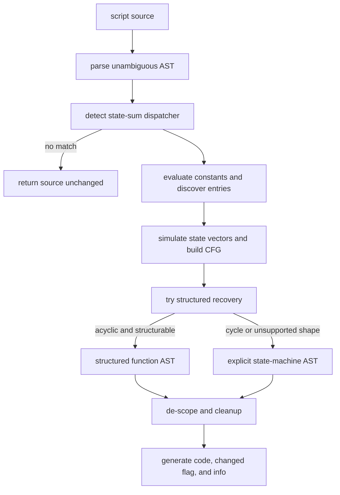

# Control Flow Flattening plugin

Evidence label: `source-inspection only` for the algorithm contract below. The
[experiment registry](../experiment-registry.md) identifies the supplied exact example and its
separate generated-input profile.

This plugin owns the pinned `ControlFlowFlattening` sample as a separate source-inspection unit.
Its one cohesive transform recognizes a state-vector/sum dispatcher, concretely evaluates the
supported expressions, simulates reachable states, emits structured or explicit-state functions,
and removes the sample's dispatcher scaffolding. The companion string decoder is an internal
constant-folding helper of that transform, not a second plugin or a generalized string decoder.

## Composition

The plugin contains one distinct transform page:

1. [state-dispatch recovery](../transforms/control-flow-flattening-state-dispatch-recovery.md)

The transform's structured-emission attempt and explicit-state fallback are alternative output
forms inside one source operation. The page owns their branch boundary and the bounded cleanup
that follows either representation.

## Input and output

Input is JavaScript source parsed as an unambiguous Babel program. The accepted sample shape has a
top-level function declaration containing a `while` test of the form `sum(state) !== terminal`, a
nested `switch` with a call-expression discriminant, a companion two-parameter character decoder,
and a top-level call whose first argument is a concrete state array. The retained sample uses the
same sum call for the switch, but the recognizer's check is looser: it requires a call expression
there rather than proving that identity. Detection is structural but also uses source-specific
function-name and generated-code observations.

On a recognized input, the transform returns `{ code, changed: true, info }`. The code contains
recovered functions for concrete state-vector entries, structured control flow when the recovered
graph is acyclic and structurable, or an explicit state/switch machine when structuring declines.
State-scope properties are promoted to plain variables where their names are static and safe;
dead stores, trivial forwarders, unused parameters, and other narrowly recognized residue may then
be removed. When no dispatcher is detected, the source string is returned unchanged. The output
is generated source, not a runtime result.

## Dependency diagram

The plugin-level flow and its alternative emission branch are:

The parser, detection, simulation, emission alternatives, cleanup, and result object are wired by
the pinned [controlFlowFlattening.js wrapper](https://github.com/MichaelXF/claude-vs-js-confuser/blob/e90be6ca716e28f4bba91fe39615a665656bd802/ControlFlowFlattening/controlFlowFlattening.js)
and [`cff.js`](https://github.com/MichaelXF/claude-vs-js-confuser/blob/e90be6ca716e28f4bba91fe39615a665656bd802/ControlFlowFlattening/cff.js).

## Safety boundary

The source operation parses and rewrites ASTs, evaluates only its explicit literal/array/member/
decoder/sum subset, and emits JavaScript. It does not execute the input program, recovered
functions, or generated source. Parse errors, non-concrete values, simulation guards, and emission
errors are source-specific failure boundaries; this page does not convert them into a production
fallback or a semantic-equivalence claim. The supplied exact example remains a bounded fixture.

## Source

The complete algorithm is pinned at corpus revision
`e90be6ca716e28f4bba91fe39615a665656bd802`:

| Pinned source | Ownership and anchors |
| --- | --- |
| [`ControlFlowFlattening/cff.js`](https://github.com/MichaelXF/claude-vs-js-confuser/blob/e90be6ca716e28f4bba91fe39615a665656bd802/ControlFlowFlattening/cff.js) | Detection at lines 32–92; companion decoder, member keys, evaluator, and literal folder at 98–280; orchestration, call rewriting, closure capture, and state assignment at 285–377; simulation and nested-state worklist at 379–602; relay optimization, dominators, structured recovery, and explicit-state emission at 604–840; scope promotion, cleanup, fixpoint passes, and final generation at 841–1363. |
| [`ControlFlowFlattening/controlFlowFlattening.js`](https://github.com/MichaelXF/claude-vs-js-confuser/blob/e90be6ca716e28f4bba91fe39615a665656bd802/ControlFlowFlattening/controlFlowFlattening.js) | File wrapper, module exports, CLI argument handling, and `{ code, changed, info }` result use at lines 22–66. |
| [`ControlFlowFlattening/README.md`](https://github.com/MichaelXF/claude-vs-js-confuser/blob/e90be6ca716e28f4bba91fe39615a665656bd802/ControlFlowFlattening/README.md) | Sample prompt, intended input/output role, and provenance context; it is not an independent runtime result. |

The related encoder order and emitted pass are pinned separately in
[`src/order.ts`](https://github.com/MichaelXF/JS-Confuser/blob/31c5a47a79f97e4b4c2d4b2a8552c11a8b548fb0/src/order.ts#L24-L35)
and [`src/transforms/controlFlowFlattening.ts`](https://github.com/MichaelXF/JS-Confuser/blob/31c5a47a79f97e4b4c2d4b2a8552c11a8b548fb0/src/transforms/controlFlowFlattening.ts#L90-L115).

## Fixtures

The following pinned files are provenance/intended-check artifacts only; they are not execution
evidence.

| Pinned fixture | Claim it pins | Evidence boundary |
| --- | --- | --- |
| [`ControlFlowFlattening/input.js`](https://github.com/MichaelXF/claude-vs-js-confuser/blob/e90be6ca716e28f4bba91fe39615a665656bd802/ControlFlowFlattening/input.js) | Supplied flattened state-dispatch input | Exact-example provenance only. |
| [`ControlFlowFlattening/original.js`](https://github.com/MichaelXF/claude-vs-js-confuser/blob/e90be6ca716e28f4bba91fe39615a665656bd802/ControlFlowFlattening/original.js) | Readable control/provenance artifact | No equivalence result is claimed. |
| [`ControlFlowFlattening/output.js`](https://github.com/MichaelXF/claude-vs-js-confuser/blob/e90be6ca716e28f4bba91fe39615a665656bd802/ControlFlowFlattening/output.js) | Retained generated-output shape | Generated-output provenance only. |
| [`ControlFlowFlattening/regular.js`](https://github.com/MichaelXF/claude-vs-js-confuser/blob/e90be6ca716e28f4bba91fe39615a665656bd802/ControlFlowFlattening/regular.js) and [`regular_out.js`](https://github.com/MichaelXF/claude-vs-js-confuser/blob/e90be6ca716e28f4bba91fe39615a665656bd802/ControlFlowFlattening/regular_out.js) | Ordinary-control negative pair | Negative/provenance evidence only. |
| [`ControlFlowFlattening/test.js`](https://github.com/MichaelXF/claude-vs-js-confuser/blob/e90be6ca716e28f4bba91fe39615a665656bd802/ControlFlowFlattening/test.js) and retained debug files | Intended detection, simulation, and comparison checks | Test/debug intent only; no validation result is claimed. |
