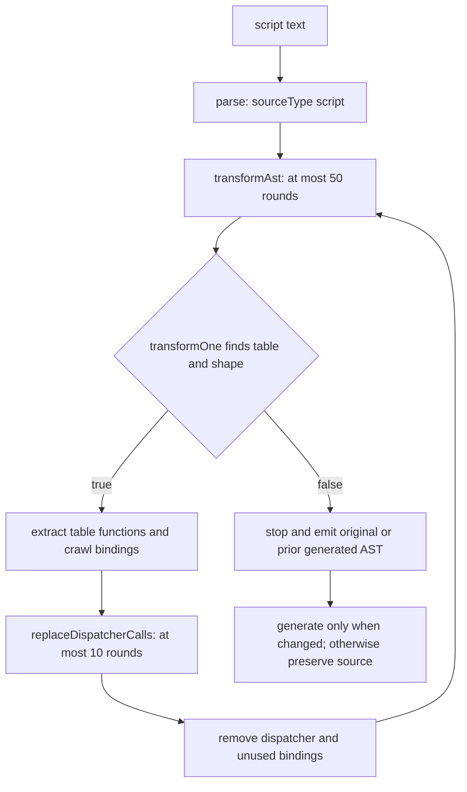

# Dispatcher plugin

Evidence label: `source-inspection only`.

This plugin owns the pinned `Dispatcher` sample as a separate source-inspection unit. Its one
solution-level transform extracts function expressions from a dispatcher table, rewrites static
dispatcher uses to direct calls or function references, and removes the dispatcher machinery when
the source shape is accepted. The retained examples and tests document input/output claims; they do not establish behavioral
equivalence, transfer coverage, or production support.

## Composition

The plugin contains one distinct transform page:

1. [dispatcher call recovery](../transforms/dispatcher-call-recovery.md)

The transform is applied by a bounded outer loop. Each successful round handles one recognized
dispatcher function and its table; the next round may handle a nested dispatcher exposed by cloned
function bodies. The inner replacement loop is separately bounded while it searches for all
recognized uses in the current AST.

## Input and output

Input is script text parsed into a Babel AST with `sourceType: "script"` and the
`optionalCatchBinding` parser plugin. The accepted sample shape is a function declaration that
contains a non-empty object table whose properties have resolvable identifier/string/numeric keys
and function-expression values, plus enough marker and wrapper information for the call-recovery
transform to obtain an argument carrier and a wrapped return property.

On a successful round, the output AST contains generated function declarations named from table
keys (`__dispatcher_<sanitized-key>`), direct calls/references at recognized use sites, and cleanup
of unreferenced dispatcher bindings. If no round changes the AST, the file API returns the original
source bytes; after any successful round, it emits regenerated code with comments removed and a
trailing newline. The output remains the sample program's AST, not a runtime execution result.

## Dependency diagram

The following source-backed diagram shows the plugin-level composition and its two bounded loops:

`parse`, the two round bounds, cleanup, and conditional generation are implemented in the pinned
[dispatcher.js driver and transform wiring](https://github.com/MichaelXF/claude-vs-js-confuser/blob/e90be6ca716e28f4bba91fe39615a665656bd802/Dispatcher/dispatcher.js#L535-L637).
The exact shape, extraction, and replacement edges are owned by the linked transform page.

## Safety boundary

This is a static AST rewrite with source-specific recognition. It does not execute the game, any
recovered function, `new Function`, `vm`, timers, terminal code, or event handlers. Parse, file I/O,
and generator failures propagate; a missing CLI argument exits after printing usage. Recognition is
not a proof of general Dispatcher coverage: dynamic keys, unsupported table forms, ambiguous
bindings, name collisions, or an over-bound nested sample can leave residual code or produce a
partial rewrite. A successful source transformation has no behavioral, transfer, reproduction, or
production qualification in this package.

## Source

The pinned source boundary is the `Dispatcher` experiment at corpus revision
`e90be6ca716e28f4bba91fe39615a665656bd802`. The driver and complete transformation are in
[Dispatcher/dispatcher.js](https://github.com/MichaelXF/claude-vs-js-confuser/blob/e90be6ca716e28f4bba91fe39615a665656bd802/Dispatcher/dispatcher.js); provenance and intended CLI/test contract are in
[Dispatcher/README.md](https://github.com/MichaelXF/claude-vs-js-confuser/blob/e90be6ca716e28f4bba91fe39615a665656bd802/Dispatcher/README.md).

## Fixtures

The transform page owns the fixture-to-claim mapping. The following files remain bounded
provenance/intended-check inputs only: `input.js`, `input2.js`, `original.js`, `output.js`,
`output.cli.js`, `output2.js`, `regular.js`, `regular.output.js`, and `test.js` under the pinned
`Dispatcher` directory. Their presence does not establish execution, semantic equivalence,
transfer, or production support.
