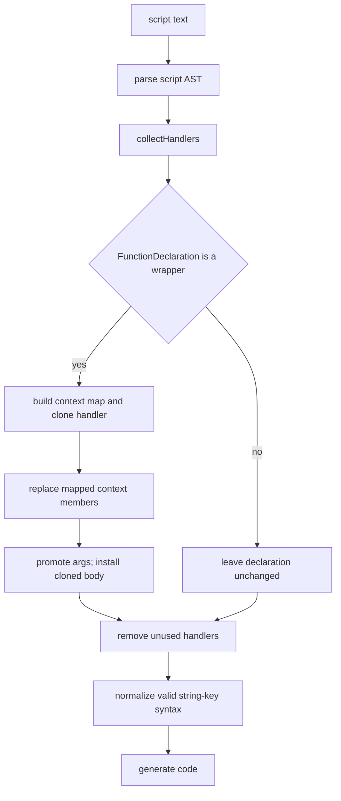

# Flatten plugin

Evidence label: `source-inspection only`.

This plugin owns the pinned `Flatten` sample as a separate source-inspection unit. Its one
solution-level transform recognizes a strict wrapper/handler contract, substitutes context
accessors and forwarded methods into a cloned handler body, promotes the handler's unpacked
arguments to the wrapper, removes unused handlers, and normalizes safe string-key syntax. The
retained examples and tests document input/output claims; they do not establish behavioral
equivalence, transfer coverage, or production support.

## Composition

The plugin contains one distinct transform page:

1. [flatten context inlining](../transforms/flatten-context-inlining.md)

The page treats wrapper recognition, handler recognition, context-map construction, body inlining,
handler cleanup, and final syntax normalization as one algorithm because they form one information
flow: the wrapper's object literal supplies the replacement map for the handler body, and the
handler's argument pattern supplies the wrapper's new parameter list. The sample does not prove a
separate solution-level transform boundary for syntax normalization.

## Input and output

Input is script text parsed into a Babel AST with `sourceType: "script"` and the
`optionalCatchBinding` parser plugin. The target is a handler function with a leading
`[context, [args...]] = arguments` unpack and a wrapper function with one rest parameter, one
object-literal declaration, and a return call that passes that object and the same rest array to
the handler.

The output retains each wrapper function name and replaces its two-statement wrapper body with the
cloned handler body. Context getter reads become their return expressions, setter targets become
the underlying assignment/update targets, and forwarded context methods become direct callees.
The wrapper parameters are the handler's argument-pattern elements where supported, otherwise a
rest parameter plus an unpack declaration is retained. Unreferenced recognized handler function
declarations are removed. The whole AST is always regenerated, including when no wrapper matches;
this is formatting normalization, not a byte-preserving decline.

## Dependency diagram

The following source-backed diagram shows the plugin-level composition and the principal decline
edges:

`collectHandlers`, wrapper traversal, cleanup, normalization, and unconditional generation are
implemented in the pinned
[flatten.js driver](https://github.com/MichaelXF/claude-vs-js-confuser/blob/e90be6ca716e28f4bba91fe39615a665656bd802/Flatten/flatten.js#L337-L423).
The exact contract and replacement edges are owned by the linked transform page.

## Safety boundary

This is a static AST rewrite with a deliberately narrow sample contract. It does not execute the
game, handlers, generated functions, timers, terminal code, or test harness. Invalid syntax and
file/generator failures propagate; a missing CLI input exits after printing usage. A wrapper or
handler that fails recognition is left untouched by the inlining traversal, but the final AST is
still regenerated. Unmapped context members remain in the cloned body, and the matcher uses
function names rather than binding identity for handler lookup and wrapper calls, so shadowing and
aliasing can defeat or misdirect the rewrite. No source-inspection result here establishes
behavioral equivalence, transfer, reproduction, or production support.

## Source

The pinned source boundary is the `Flatten` experiment at corpus revision
`e90be6ca716e28f4bba91fe39615a665656bd802`. The driver and complete transformation are in
[Flatten/flatten.js](https://github.com/MichaelXF/claude-vs-js-confuser/blob/e90be6ca716e28f4bba91fe39615a665656bd802/Flatten/flatten.js); the source-backed shape note and intended CLI/test contract are in
[Flatten/NOTES.md](https://github.com/MichaelXF/claude-vs-js-confuser/blob/e90be6ca71615a665656bd802/Flatten/NOTES.md) and
[Flatten/README.md](https://github.com/MichaelXF/claude-vs-js-confuser/blob/e90be6ca716e28f4bba91fe39615a665656bd802/Flatten/README.md).

## Fixtures

The transform page owns the fixture-to-claim mapping. The following files remain bounded
provenance/intended-check inputs only: `input.js`, `output.js`, `regular.js`, and `test.js` under
the pinned `Flatten` directory. Their presence does not establish execution, semantic equivalence,
transfer, or production support.
