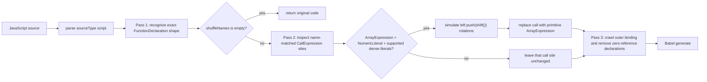

# Shuffle-Claude plugin

**Evidence status: source-inspection only.** This plugin root owns the pinned
`Shuffle-Claude` sample and its source-backed algorithm page. It makes no execution,
transfer, decoder-coverage, or production-adoption claim.

The plugin is a single-transform composition. Its input is JavaScript that can be parsed by
the sample's Babel parser in `sourceType: "script"` mode. Its successful output is generated
JavaScript in which recognized static calls are replaced with primitive-valued array
literals and an unreferenced recognized shuffle declaration is removed. A source with no
recognized shuffle declaration is returned byte-for-byte by the sample's driver; a source
with an unhandled call site is not promised to be rewritten.

The safety boundary is source-defined: recognition is structural and name-based, call-site
rewriting requires an `ArrayExpression`, a `NumericLiteral` count, no array holes, and
elements accepted by `extractLiteral`. The implementation does not resolve call bindings or
run the input program. Parse errors and unsupported syntax are not caught by the transform
entry point. These are documentary boundaries, not behavioral qualification.

## Composition

1. [Static primitive rotation](../transforms/shuffle-claude-static-primitive-rotation.md)

The transform owns recognition, literal extraction, rotation state, replacement, cleanup,
and generation. The CLI adapter is only an input/output wrapper around the transform.

The recognition, local call-site gate, replacement, cleanup, and generation edges are owned
by `deobfuscate` at the pinned source spans cited by the transform page.

## Boundary

This root is deliberately separate from the GPT-5.5 sample root. The two samples recognize a
related push/shift idiom, but their source differs at the solution level: this sample
materializes supported primitive values and repeatedly simulates the count, while the other
sample rotates cloned AST subtrees with binding-aware call association and normalized integer
counts. No variation label is asserted.

## Source

The algorithm source is the pinned [`Shuffle-Claude.js`](https://github.com/MichaelXF/claude-vs-js-confuser/blob/e90be6ca716e28f4bba91fe39615a665656bd802/Shuffle-Claude/Shuffle-Claude.js), whose driver pipeline spans recognition, static evaluation, replacement, cleanup, and generation at lines 34–215. The CLI wrapper is at lines 221–236. The exact phase ownership and anchors are detailed in [the transform page](../transforms/shuffle-claude-static-primitive-rotation.md).

## Fixtures

The sample README, input, and test files are retained as provenance or intended-check
evidence only; none establishes transfer or behavioral equivalence.
