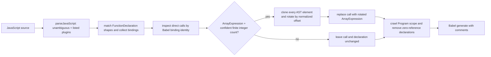

# Shuffle-GPT-5.5 plugin

**Evidence status: source-inspection only.** This plugin root owns the pinned
`Shuffle-GPT-5.5` sample and its distinct source-backed algorithm page. It makes no execution,
transfer, decoder-coverage, or production-adoption claim.

The plugin is a single-transform composition. Its input is JavaScript accepted by the
sample's `sourceType: "unambiguous"` Babel parser and listed syntax plugins. Its successful
output is generated JavaScript in which calls bound to a recognized shuffle declaration are
replaced by arrays whose cloned AST elements have been rotated; recognized declarations with
no remaining references are removed.

The safety boundary is source-defined: the function matcher accepts the exact push/shift
body but allows several loop-initializer/update spellings and extra parameters; call-site
matching requires a direct identifier whose Babel binding is one of the recognized
declarations, an `ArrayExpression`, and a statically confident finite integer count. Array
elements are cloned as arbitrary AST subtrees after a hole check, with no purity or
side-effect-order guard. The transform does not execute the input program. Parse errors and
other failures are not caught by the transform entry point.

## Composition

1. [Binding-aware AST subtree rotation](../transforms/shuffle-gpt-5-5-ast-subtree-rotation.md)

The transform owns parsing, matcher normalization, binding collection, static count
evaluation, subtree rotation, cleanup, and generation. The guarded CLI adapter is only an
input/output wrapper around the exported transform.

The parser, matcher, binding map, call-site gate, rotation, cleanup, and generation edges are
owned by `deobfuscateShuffle` at the pinned source spans cited by the transform page.

## Boundary

This root is deliberately separate from the Claude sample root. Exact source comparison
shows a different solution-level state and rewrite: GPT-5.5 rotates cloned element ASTs and
uses modulo-normalized statically evaluated integer counts, whereas Claude extracts primitive
values and simulates the loop with name-only matching. The two pages therefore do not use a
variation label.

## Source

The algorithm source is the pinned [`Shuffle-GPT-5.5.js`](https://github.com/MichaelXF/claude-vs-js-confuser/blob/e90be6ca716e28f4bba91fe39615a665656bd802/Shuffle-GPT-5.5/Shuffle-GPT-5.5.js), whose parser helpers and driver span lines 7–255; the CLI and exports span lines 257–284. The exact phase ownership and anchors are detailed in [the transform page](../transforms/shuffle-gpt-5-5-ast-subtree-rotation.md).

## Fixtures

The sample README, input/output files, and runner are retained as provenance or intended-check
evidence only; none establishes transfer or behavioral equivalence.
