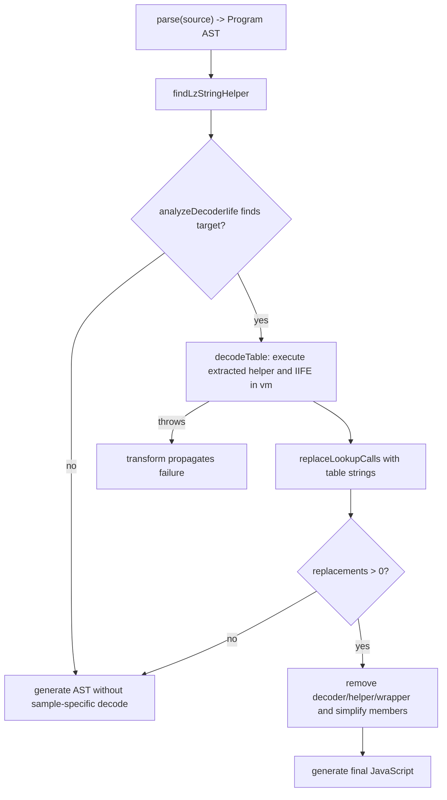

# StringCompression-GPT-5.5 plugin

Evidence label: `source-inspection only`.

This plugin root owns only the pinned `StringCompression-GPT-5.5` sample. It documents the
sample-specific AST recovery solution in
[string-compression-gpt-5-5-lz-table-recovery](../transforms/string-compression-gpt-5-5-lz-table-recovery.md).
The pinned output and pass-through files are provenance and intended-check evidence only; they do
not establish transfer, decoder coverage, production support, or runtime correctness here.

The input is a parseable JavaScript program containing a top-level LZ-string-like helper and a
decoder IIFE that exposes an indexed lookup function. The output is generated JavaScript in which
recognized numeric lookup calls are replaced by recovered string literals and the consumed helper,
decoder IIFE, lookup declaration, and matching wrapper are removed when the implementation reaches
its cleanup path. The transform page owns the exact target predicate, state, rewrites, and gaps.

The composition is one transform, in this order:

Safety boundary: the source solution executes extracted sample code. `decodeTable` creates a Node
`vm` context and gives the initial `runInContext` call a 1000 ms timeout, then calls the recovered
lookup function for up to 10,000 indexes. The sandbox omits `require` and `process` but exposes
selected constructors and a no-op console. Cleanup is not all-or-nothing for unresolved lookup calls.

## Source

The plugin driver and its sole transform are in the pinned corpus file
[`StringCompression-GPT-5.5.js`](https://github.com/MichaelXF/claude-vs-js-confuser/blob/e90be6ca716e28f4bba91fe39615a665656bd802/StringCompression-GPT-5.5/StringCompression-GPT-5.5.js#L297-L347).
The sample's LZ helper and decoder-IIFE shape are retained in
[`StringCompression.js`](https://github.com/MichaelXF/claude-vs-js-confuser/blob/e90be6ca716e28f4bba91fe39615a665656bd802/StringCompression-GPT-5.5/StringCompression.js#L1-L56)
and [lines 307-320](https://github.com/MichaelXF/claude-vs-js-confuser/blob/e90be6ca716e28f4bba91fe39615a665656bd802/StringCompression-GPT-5.5/StringCompression.js#L307-L320).

## Fixtures

The pinned `StringCompression-GPT-5.5` output and pass-through files, runner, and
`StringCompression.js` sample are provenance/intended-check inputs only. They do not establish
runtime equivalence, transfer, reproduction, or production support.
