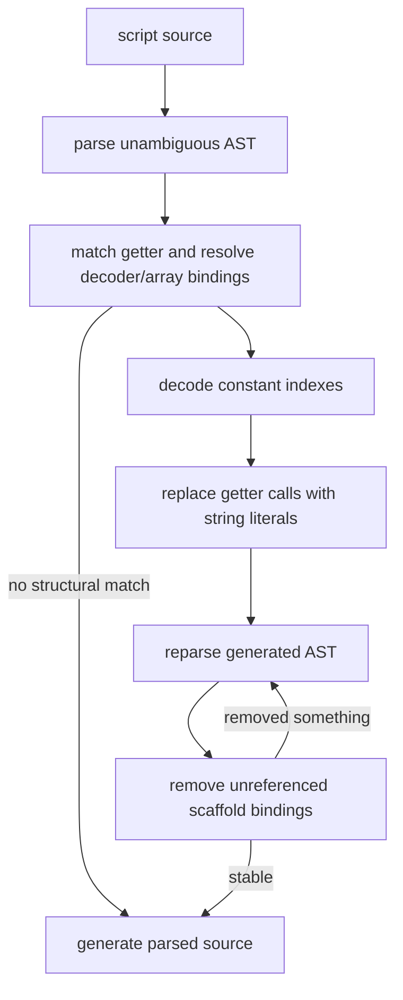

# String Concealing plugin

Evidence label: `source-inspection only` for the algorithm contract below. The
[experiment registry](../experiment-registry.md) identifies the supplied exact example and
separate encoder profiles.

This plugin owns the pinned `StringConcealing` sample as a separate source-inspection unit. Its
single transform resolves a getter/decode-function/string-array binding relationship, decodes
constant indexes with the embedded basE91 routine, replaces getter calls with string literals,
and removes now-dead obfuscator scaffolding. It is distinct from the VM-2 outer observed-string
transform even though both reason about concealed strings.

## Composition

The plugin contains one distinct transform page:

1. [static getter recovery](../transforms/string-concealing-static-getter-recovery.md)

The page owns structural recognition, constant-index replacement, dead-scaffold cleanup, and the
source-generation boundary as one dependent operation: cleanup is meaningful only after the getter
calls have been replaced.

## Input and output

Input is JavaScript source parsed as an unambiguous Babel program. The accepted sample shape has a
shared array of encoded string literals, a decoder function containing a literal `table` string,
and one-parameter getter functions whose sole return is `decode(array[index])`. The transform
requires Babel bindings to connect the getter, decoder, and array; it does not rely only on their
obfuscator-generated names.

Output is generated source in which calls such as `getter(5)` or `getter(-5)` are replaced when
their indexes are constant and the corresponding array element is a string. A reparse-and-cleanup
fixpoint removes unreferenced scaffold-named declarations (`__*` and `utf8ArrayToStr`) after the
replacement. Even a no-match input is parsed and passed through Babel generation, so this sample's
file API does not promise byte-identical pass-through formatting.

## Dependency diagram

The source-backed dependency flow is:

The parser, replacement traversal, reparse loop, cleanup predicate, and generation are in the
pinned [`stringConcealing.js`](https://github.com/MichaelXF/claude-vs-js-confuser/blob/e90be6ca716e28f4bba91fe39615a665656bd802/StringConcealing/stringConcealing.js).

## Safety boundary

The transform statically decodes encoded strings with its own basE91 implementation and performs
AST rewrites. It does not run the candidate program, invoke the decoder function as program code,
or execute a generated output. Node's `Buffer` is used to turn decoded bytes into UTF-8 text, so
the source's host/runtime dependency remains part of the implementation boundary. Parse, file I/O,
and generation errors propagate. Exact-example and generated qualification results remain bounded
registry/tool evidence rather than a generalized string-decoder or production-support claim.

## Source

The complete algorithm is pinned at corpus revision
`e90be6ca716e28f4bba91fe39615a665656bd802`:

| Pinned source | Ownership and anchors |
| --- | --- |
| [`StringConcealing/stringConcealing.js`](https://github.com/MichaelXF/claude-vs-js-confuser/blob/e90be6ca716e28f4bba91fe39615a665656bd802/StringConcealing/stringConcealing.js) | basE91 decoding at lines 49–77; constant indexes and table/array extraction at 80–116; binding-aware getter analysis at 118–171; scaffold naming and parsing at 173–187; cleanup sweep at 189–207; call replacement, reparse fixpoint, and final generation at 209–252; file/module/CLI boundaries at 254–283. |
| [`StringConcealing/README.md`](https://github.com/MichaelXF/claude-vs-js-confuser/blob/e90be6ca716e28f4bba91fe39615a665656bd802/StringConcealing/README.md) | Sample prompt, intended input/output role, and provenance context; not an independent runtime result. |

The related producer implementation and order are pinned in
[`src/transforms/string/stringConcealing.ts`](https://github.com/MichaelXF/JS-Confuser/blob/31c5a47a79f97e4b4c2d4b2a8552c11a8b548fb0/src/transforms/string/stringConcealing.ts#L285-L320)
and [`src/order.ts`](https://github.com/MichaelXF/JS-Confuser/blob/31c5a47a79f97e4b4c2d4b2a8552c11a8b548fb0/src/order.ts#L16-L36).

## Fixtures

The following pinned files are provenance/intended-check artifacts only; they are not execution
evidence.

| Pinned fixture | Claim it pins | Evidence boundary |
| --- | --- | --- |
| [`StringConcealing/input.js`](https://github.com/MichaelXF/claude-vs-js-confuser/blob/e90be6ca716e28f4bba91fe39615a665656bd802/StringConcealing/input.js) | Supplied concealed-string input | Exact-example provenance only. |
| [`StringConcealing/output.js`](https://github.com/MichaelXF/claude-vs-js-confuser/blob/e90be6ca716e28f4bba91fe39615a665656bd802/StringConcealing/output.js) | Retained generated-output shape | Generated-output provenance only. |
| [`StringConcealing/regular.js`](https://github.com/MichaelXF/claude-vs-js-confuser/blob/e90be6ca716e28f4bba91fe39615a665656bd802/StringConcealing/regular.js) and [`regular.out.js`](https://github.com/MichaelXF/claude-vs-js-confuser/blob/e90be6ca716e28f4bba91fe39615a665656bd802/StringConcealing/regular.out.js) | Ordinary-input control pair | Negative/provenance evidence only. |
| [`StringConcealing/sample.obf.js`](https://github.com/MichaelXF/claude-vs-js-confuser/blob/e90be6ca716e28f4bba91fe39615a665656bd802/StringConcealing/sample.obf.js) and [`sample.deobf.js`](https://github.com/MichaelXF/claude-vs-js-confuser/blob/e90be6ca716e28f4bba91fe39615a665656bd802/StringConcealing/sample.deobf.js) | Small retained obfuscated/deobfuscated pair | Provenance only; no reproduction claim. |
| [`StringConcealing/test.js`](https://github.com/MichaelXF/claude-vs-js-confuser/blob/e90be6ca716e28f4bba91fe39615a665656bd802/StringConcealing/test.js) | Intended AST, output, and behavior checks | Test intent only; no validation result is claimed. |
