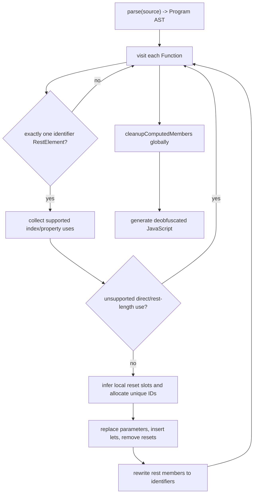

# VariableMasking plugin

Evidence label: `source-inspection only`.

This plugin root owns only the pinned `VariableMasking` sample. Its distinct transform is documented
in [variable-masking-rest-parameter-recovery](../transforms/variable-masking-rest-parameter-recovery.md).
The README, debug pattern, input/original/output, regular control, and test files are provenance and
intended-check evidence only. They do not establish transfer, production support, or runtime
correctness for this source-inspection page.

The input is a parseable JavaScript AST containing functions that use one rest parameter as a
compact carrier for positional arguments and scratch state. The output replaces supported
`rest[index]` accesses with positional parameters, supported `rest["property"]` accesses with local
bindings, removes standalone fake reset/length writes, and normalizes safe computed string members
and object keys. The transform declines a function before mutation when its recognized safety scan
finds direct rest references or non-standalone rest-length uses; the page records additional
source-level blind spots that are not covered by that gate.

The composition is one transform applied while traversing functions, followed by one global cleanup
pass:

Safety boundary: this implementation is static AST transformation and does not evaluate recovered
code. Its recognized set is narrow, but unrecognized member forms can remain in the function while
other recognized members are rewritten; this means the source-level gate is not a proof of complete
function recovery.

## Source

The pinned implementation is
[`variableMasking.js`](https://github.com/MichaelXF/claude-vs-js-confuser/blob/e90be6ca716e28f4bba91fe39615a665656bd802/VariableMasking/variableMasking.js#L160-L304).
The sample input and generated output are retained in the pinned corpus at
[`input.js`](https://github.com/MichaelXF/claude-vs-js-confuser/blob/e90be6ca716e28f4bba91fe39615a665656bd802/VariableMasking/input.js)
and [`output.js`](https://github.com/MichaelXF/claude-vs-js-confuser/blob/e90be6ca716e28f4bba91fe39615a665656bd802/VariableMasking/output.js).

## Fixtures

The pinned `VariableMasking` input/original/output, regular control, debug pattern, README, and
test are provenance/intended-check inputs only. They do not establish runtime equivalence,
transfer, reproduction, or production support.
