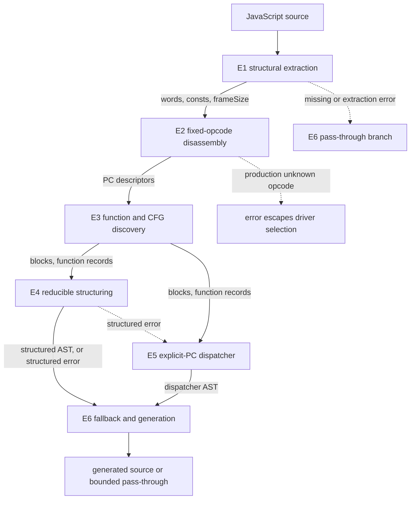

# VM-1 plugin

## Scope and evidence

Evidence label: source-inspection only. This page is a source-backed reconstruction contract for
the frozen VM-1 corpus at commit
[`e90be6ca716e28f4bba91fe39615a665656bd802`](https://github.com/MichaelXF/claude-vs-js-confuser/tree/e90be6ca716e28f4bba91fe39615a665656bd802).
It is not a maintained decoder implementation, production support claim, behavioral-equivalence
result, transfer qualification, or generalized VM devirtualizer.

The implementation parses JavaScript with Babel, extracts a sample-shaped register bytecode
container, interprets a fixed numeric opcode grammar, recovers static functions and blocks, and
emits either source-oriented structured JavaScript or an explicit-PC dispatcher. The input VM and
neither the embedded VM nor generated candidates are executed by this implementation.

## Target

The observed VM-1 input embeds a register machine in JavaScript: a long base64 word stream, a
constant array, a numeric frame-size argument, and a constructor-shaped site such as
`new H(Y, 21, [constants], W)`. The bounded reversal target is generated JavaScript that removes
the embedded interpreter representation while retaining the decoded operations that these six
stages know how to represent.

The target is narrower than “VM devirtualization.” E1 recognizes independent AST clues rather than
proving they belong together; E2 uses a fixed opcode and operand table rather than inferring
handlers; E3 recovers only statically enumerated control targets; E4 accepts reducible,
well-nested structures; and E5 preserves explicit machine state for its dispatcher outcome.
Unknown production opcodes and self-modifying `CODE_COPY` are not silently promoted to general
support.

## Composition and information dependency

The pages are ordered by the representation each boundary produces. E4 and the dispatcher branch
of E5 are alternative consumers of E3; E4 is not a prerequisite for E5's dispatcher.

The extraction/non-VM edge and the order of E2/E3/E4/E5/E6 are wired by
[`deobfuscateSource`](https://github.com/MichaelXF/claude-vs-js-confuser/blob/e90be6ca716e28f4bba91fe39615a665656bd802/VM-1/vm.js#L434-L468).
The direct E4-to-E5 edge is the caller's structured-error catch. The E2 error edge is visible in
[`decodeInstr`](https://github.com/MichaelXF/claude-vs-js-confuser/blob/e90be6ca716e28f4bba91fe39615a665656bd802/VM-1/vm.js#L178-L264)
and the fact that disassembly is outside that catch.

| Order | Boundary | Input -> output | Contract |
| ---: | --- | --- | --- |
| 1 | E1 | source AST -> `{ words, consts, frameSize }` | Independent payload/constructor recognition and bounded constant evaluation. |
| 2 | E2 | words/constants -> PC-keyed descriptors | Fixed numeric opcode grammar, keyed literals, operand sizes, captures, and known special operations. |
| 3 | E3 | descriptors -> function records and blocks | Static function starts, reachability, leaders, and contiguous block lists. |
| 4 | E4 | blocks/descriptors -> structured Babel AST | Reducible control recovery and conservative per-block register folding. |
| 5 | E5 | blocks/descriptors -> explicit-PC Babel AST | Alternative `R`/`A`/`H`/`pc` dispatcher, plus structured-side wrapper ownership. |
| 6 | E6 | source and candidate states -> generated source | Pass-through, forced dispatch, structured attempt, broad structured-error fallback, and generation. |

See [structural bytecode extraction](../transforms/vm-1-structural-bytecode-extraction.md),
[fixed-opcode disassembly](../transforms/vm-1-fixed-opcode-disassembly.md),
[static function and CFG discovery](../transforms/vm-1-static-function-cfg.md),
[reducible register structuring](../transforms/vm-1-reducible-register-structuring.md),
[dual emission](../transforms/vm-1-dual-emission.md), and
[fallback and validation](../transforms/vm-1-fallback-validation.md) for the complete contracts.

## Plugin-level representations

| Representation | Producer | Meaning and invariant |
| --- | --- | --- |
| Parsed AST | E1 | Babel `script` AST; qualifying literals and constructor expressions remain visible. |
| Extracted VM record | E1 | `words` packs complete four-byte groups little-endian; `consts` preserves static pool order; frame size is a selected numeric argument. |
| Instruction map | E2 | Object keyed by bytecode start PC; each descriptor carries consumed `size` and decoded operands. |
| Function records | E3 | Top-level start 0 plus unique `DEFINE_FUNCTION.fT` starts, metadata, captures, and sorted statically reachable body PCs. |
| Basic blocks | E3 | Leader-keyed ordered instruction arrays; blocks stop at known terminators or another leader. |
| Structured candidate | E4 | Named register locals, Babel expressions/statements, reducible branches/loops, try/catch, closures, and optional `__forInKeys`. |
| Dispatcher candidate | E5 | Function-local `R`, `A`, optional `H`, `pc`, switch cases, explicit control assignments, and optional `__forInKeys`. |
| Final result | E6 | Reformatted source for non-VM input, generated selected candidate, or original source when fallback parsing/generation fails. |

`CODE_COPY` is a known E2 descriptor. E4 refuses to lift it; E5 emits the literal marker
`__CODE_COPY_UNSUPPORTED__`. That marker is an explicit unsupported operation, not recovered
self-modifying bytecode. In contrast, an unknown numeric opcode throws during E2 production
disassembly before E6 can select E5.

## Execution and safety boundary

The documented production path parses and traverses ASTs, evaluates only the listed constant
literal subset, decodes bytes, creates Babel AST nodes, and generates source. It does not invoke
the embedded VM or run the generated source. The generated `__forInKeys` helper, handler stack,
register scaffolding, global/member operations, and candidate code therefore have no safety or
behavioral qualification here.

`test.js` and `verify.js` are provenance for intended checks. If executed, they use Node VM
contexts and deterministic scenario shims. Their presence does not establish runtime equivalence,
host safety, or broad coverage.

## Boundary and generality limits

- E1 does not associate the payload literal, constructor, constant pool, and frame argument by
  data flow; decoys and alternate layouts are outside the contract.
- E2 does not infer randomized opcode maps, validate all operand bounds, or recover unknown values.
- E3 does not resolve indirect `JUMP_DYN` targets and only partially carries `TRY_FINALLY`
  continuation metadata; decoded `Z` is not used in its successor/leader rules.
- E4 is a local reducer for recognized reducible CFGs. It is not a whole-function SSA, alias,
  handler, MBA, flattened-state, or arbitrary graph structurer.
- E5's dispatcher keeps VM-like control and cannot give `CODE_COPY` source semantics.
- E6 is selection and generation, not semantic validation. A dispatcher selection is not proof that
  the candidate is equivalent, safe, syntactically accepted by every host, or production-ready.

## Source

| Source area | Pinned source | Ownership in this package |
| --- | --- | --- |
| VM-1 directory | [frozen VM-1 tree](https://github.com/MichaelXF/claude-vs-js-confuser/tree/e90be6ca716e28f4bba91fe39615a665656bd802/VM-1) | Source-inspection corpus boundary. |
| Driver and shared wiring | [`vm.js`](https://github.com/MichaelXF/claude-vs-js-confuser/blob/e90be6ca716e28f4bba91fe39615a665656bd802/VM-1/vm.js#L431-L502) | E6 owns selection; E5 owns common emitter dependency injection. |
| Extraction/disassembly/CFG | [`vm.js#L35-L400`](https://github.com/MichaelXF/claude-vs-js-confuser/blob/e90be6ca716e28f4bba91fe39615a665656bd802/VM-1/vm.js#L35-L400) | E1, E2, and E3 own their respective boundaries. |
| Structured emitter | [`emit-structured.js`](https://github.com/MichaelXF/claude-vs-js-confuser/blob/e90be6ca716e28f4bba91fe39615a665656bd802/VM-1/emit-structured.js#L28-L702) | E4 owns the reducer; E5 owns its mode-level wrapper. |
| Dispatcher emitter | [`emit-dispatcher.js`](https://github.com/MichaelXF/claude-vs-js-confuser/blob/e90be6ca716e28f4bba91fe39615a665656bd802/VM-1/emit-dispatcher.js#L1-L271) | E5 owns explicit-PC lowering. |
| Existing reverse inventory | [source map](../source-map.md) | Reverse lookup and evidence inventory; this page does not duplicate its rows. |

## Fixtures

These are pinned corpus artifacts and provenance, not committed maintained fixtures.

| Corpus artifact | Claim it supports | Status |
| --- | --- | --- |
| `VM-1/input.js` | Observed long payload, pool, constructor shape, and instruction-bearing input | Source/fixture evidence only. |
| `VM-1/original.js` | Supplied source-side comparison artifact | Provenance only; no equivalence claim. |
| `VM-1/output.js` | Existing structured-emission shape | Generated-output provenance only. |
| `VM-1/output.dispatch.js` | Existing explicit-PC shape | Generated-output provenance only. |
| `VM-1/regular.js`, `regular.out.js` | Non-VM pass-through example | Negative/provenance evidence only. |
| `VM-1/README.md`, `NOTES.md` | Sample pipeline and verification context | Documentation provenance only. |
| `VM-1/test.js`, `verify.js` | Intended smoke and scenario-based comparison harnesses | Test intent only; no validation result is claimed. |
