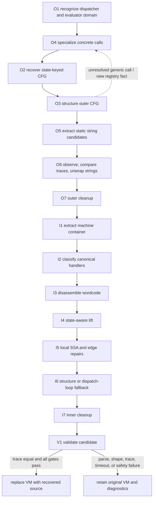

# VM-2: layered outer dispatcher and inner register VM

Evidence label: source-inspection only for the algorithm contracts below. The validation page
retains `empirical` only for the bounded exact-example/pass-through cell already recorded in the
pinned corpus harness. This package is a reconstruction contract, not a claim that every VM-2
variant transfers to another encoder.

## Scope and accepted model

VM-2 has two semantic layers. The outer layer is ordinary JavaScript containing a state-array
dispatcher, outlined functions, generic rest-argument trampolines, and concealed strings. The
inner layer is a register machine held by a constructor-like container: a wordcode array, a
constant pool, an entry point, handler functions, and frame/global metadata. The decoder must peel
the outer layer before interpreting the inner machine, and must retain the original artifact when
any material boundary is not proven.

The corpus README describes the sample roles: a state pool and sum helper drive the outer switch;
outlined functions and trampolines carry state/arguments; a string table and decoder feed names;
the inner machine supplies handlers and register wordcode. The README is a sample description, not
a coverage matrix. The frozen implementation is [VM-2/vm.js at e90be6c](https://github.com/MichaelXF/claude-vs-js-confuser/blob/e90be6ca716e28f4bba91fe39615a665656bd802/VM-2/vm.js)
and [VM-2/devirt.js at e90be6c](https://github.com/MichaelXF/claude-vs-js-confuser/blob/e90be6ca716e28f4bba91fe39615a665656bd802/VM-2/devirt.js).

## Information-dependency order

The page order is a data order, not merely a preferred reading order:

1. [Outer recognition and evaluation](../transforms/outer-recognition-evaluation.md) identifies
   bindings, dispatcher shape, and the safe evaluator domain.
2. [Outer trampoline specialization](../transforms/outer-trampoline-specialization.md),
   [outer state-CFG recovery](../transforms/outer-state-cfg-recovery.md), and
   [outer CFG structuring](../transforms/outer-cfg-structuring.md) form a bounded fixed-point
   region. Trampoline probes can invoke concrete state recovery and structuring; state recovery
   owns state transitions, and structuring owns graph-to-AST emission.
3. [Outer static-string recovery](../transforms/outer-static-string-recovery.md) creates static
   decoder candidates. [Outer observed-string recovery](../transforms/outer-observed-string-recovery.md)
   selects and verifies candidates in the inert trace sandbox.
4. [Outer cleanup](../transforms/outer-cleanup.md) normalizes only safe residual AST forms.
5. [VM-container extraction](../transforms/vm-container-extraction.md) produces the inner machine
   representation consumed by the handler and wordcode pages.
6. [Handler classification](../transforms/handler-classification.md) owns canonical handler
   templates, then [wordcode disassembly](../transforms/wordcode-disassembly.md) owns widths,
   operands, and reachable function discovery.
7. [State-aware lifting](../transforms/state-aware-lifting.md) converts instructions into blocks
   with path-sensitive register facts; [local SSA](../transforms/local-ssa.md) gives those blocks
   unambiguous local names.
8. [Inner control structuring](../transforms/inner-control-structuring.md) emits structured
   functions or a dispatch-loop fallback; [inner cleanup](../transforms/inner-cleanup.md) performs
   bounded semantics-preserving normalization.
9. [Validation and fallback](../transforms/validation-fallback.md) is the only page that can
   authorize replacing the original machine, and it always has an all-or-nothing fallback.

The dotted edge is intentional: `specialise` may call `unflattenDispatcher` and `structure` while
probing a concrete trampoline. The outer region has a pass limit of eight and a specialization
depth limit of twelve; it is not an unbounded recursive interpreter.

## Representation contracts

| Boundary | Produced representation | Consumed by | Non-negotiable invariant |
|---|---|---|---|
| O1 | Dispatcher record and constrained evaluator result | O4/O2/O5/O6 | Sum binding, exit test, switch discriminant, and state path are bound to the same shape. |
| O4 | Specialized `fnN` or retained generic call; trampoline registry | O2/O3 and later AST rewrite | A specialized function has a concrete state/tuple key; failed resolution leaves the generic path. |
| O2 | State-keyed CFG, copied environments, terms | O3 | State transitions come only from supported numeric writes to the current state path. |
| O3 | Structured outer AST | O4/O5/O6/O7 | Returns, throws, loop edges, and exits are preserved; unmergeable graphs remain conservative. |
| O5/O6 | Verified string replacements | O7 | Static extraction alone is insufficient; replacement waits for conflict-free, trace-equal selection. |
| I1 | `{code, pool, entry, handlers, globals}` | I2/I3 | Wordcode is u32 little-endian data and machine parts are structurally present. |
| I2/I3 | Opcode table and per-function instructions | I4 | Width/cursor and target boundaries are explicit; unknown handlers/opcodes remain unknown. |
| I4/I5 | Lifted blocks with joined facts and SSA repairs | I6 | Path facts join conservatively and edge repairs preserve live values. |
| I6/I7 | Candidate inner functions | V1 | Structured output or dispatch fallback is complete enough to validate as one candidate. |
| V1 | Acceptance or unchanged original | caller | No partial replacement is committed after a failed gate. |

## Evidence and safety boundary

The VM-2 corpus links are pinned to commit `e90be6ca716e28f4bba91fe39615a665656bd802`; the
producer links used for comparison are pinned to `20c5b96bf57337c568579352758d7685358650de`.
Producer source establishes a separate canonical register/wordcode contract and optional
transforms; it does not prove that this VM-2 corpus was emitted by that producer. In particular,
the corpus-specific spread marker must not be generalized from the producer's baseline value.

O1's helper recovery has a `new Function` execution edge. O6 and V1 use a browser-like Node
`vm` sandbox with frozen time/random and no real filesystem/network/DOM, which bounds the trace
oracle but is not a security boundary. I1-I7 are described as symbolic transformations; no runtime result is claimed.

The exact-example/pass-through harness cell is documented on [validation and fallback](../transforms/validation-fallback.md)
only. NOTES and source inspection do not establish empirical coverage.
The [`VM2-exact` and `VM2-213` registry rows](../experiment-registry.md) keep the supplied exact
bytes and the hardened producer profile separate. Generated bytes alone do not establish transfer
coverage.

## Package gaps

The package documents one VM-2 era and has no independent transfer matrix. Optional
producer hardening (opcode shuffling/aliasing, specialized/macro handlers, self-modification,
anti-instrumentation, handler-table reshaping, and minification) is recorded only as a comparison
boundary where the pinned producer differs from the corpus recognizers. Those shapes are outside the source-backed VM-2 contract and are not silently inferred here.
