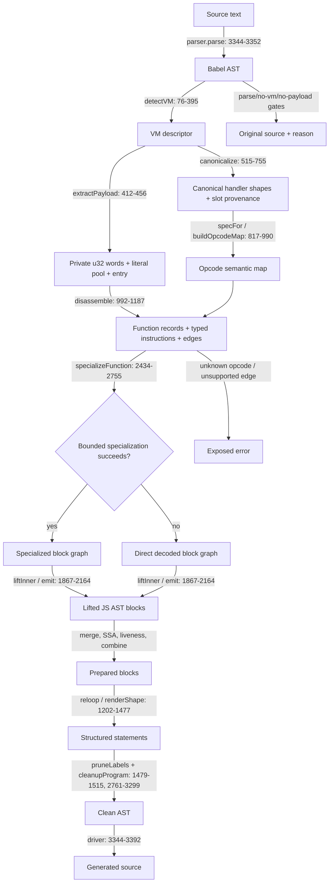

# VM-3 structural VM and payload CFG devirtualizer

Status: source-inspection only. This page is a reconstruction contract for the frozen corpus
implementation at commit `e90be6ca716e28f4bba91fe39615a665656bd802`; it is not an implementation,
behavioral qualification, transfer result, or production-coverage claim.

## Information dependency

The six pages describe one static AST-to-AST pipeline. Their order is forced by the representation
each page produces for the next page:

1. [Structural VM detection and payload extraction](../transforms/vm-3-structural-vm-detection.md)
   recognizes the runtime relationship graph and produces the word stream, pool, and entry
   template.
2. [Handler canonicalization and opcode interpretation](../transforms/vm-3-handler-canonicalization.md)
   turns numeric handler functions into canonical semantic specs with operand provenance.
3. [Payload disassembly and function-edge discovery](../transforms/vm-3-payload-disassembly.md)
   uses those specs to recover reachable variable-width instructions and nested functions.
4. [State-specialized lifting](../transforms/vm-3-state-specialized-lifting.md) specializes
   branch state when bounded propagation can do so, otherwise constructs the direct decoded graph,
   and emits semantic JavaScript AST blocks.
5. [Reloop, cleanup, and emission](../transforms/vm-3-reloop-cleanup-emission.md) structures
   those blocks, preserves non-fallthrough edges, and cleans the resulting AST.
6. [Fallback and validation boundary](../transforms/vm-3-fallback-validation.md) owns the
   caller-facing unchanged results, top-level call choice, optional cleanup, and exposed errors.

No page may infer a representation from a later page. In particular, page 2 does not borrow an
opcode table, page 3 does not guess indirect targets, page 4 does not claim to lower exceptions,
and page 5 does not repair unsupported page-4 instructions.

The diagram's source spans are the implementation ownership boundaries.

## Representations and ownership

| Page | Input | Owned output | Material decline or fallback |
| --- | --- | --- | --- |
| Detection/extraction | Parsed AST | Descriptor; `{words, pool, entry}` | `null` for an unrecognized/incomplete shape or missing static payload. |
| Handler interpretation | Descriptor handler map | Numeric opcode -> `{kind, fixed, roles, slots}` | Unknown canonical form is retained as `unknown`; no guessed opcode meaning. |
| Disassembly | Payload + opcode map | Reachable function/instruction maps with sizes and successors | Unknown opcode throws; indirect jumps have no static successors. |
| Specialization/lifting | Instruction maps + pool decoder | Specialized/direct blocks and JavaScript AST statements | Bounded specialization may return no graph; direct graph can still expose unsupported control. |
| Reloop/cleanup/emission | Lifted blocks and helper requests | Structured/cleaned AST and helper-use state | Conservative rendering retains labels/dispatch or VM-like expressions when unsafe to remove. |
| Fallback/validation | Source text and prior outputs | Unchanged result, generated result, or caller-visible error | Parse/no-VM/no-payload pass through; recognized unsupported constructs are not guessed. |

The [structural page](../transforms/vm-3-structural-vm-detection.md) owns the frame offsets and
runtime helper identities that [handler interpretation](../transforms/vm-3-handler-canonicalization.md)
normalizes. The [disassembler](../transforms/vm-3-payload-disassembly.md) owns variable-width
consumption and closure discovery. The [lifter](../transforms/vm-3-state-specialized-lifting.md)
owns semantic AST emission; the [renderer](../transforms/vm-3-reloop-cleanup-emission.md) owns
block preparation, control-flow structuring, and whole-AST cleanup. The [driver page](../transforms/vm-3-fallback-validation.md)
owns only the caller-facing gates and output choice.

## Runtime and safety boundary

The source models the VM's stack, frame slots, constant decoder, closure cells, randomized handler
table, and generated helper calls statically. It never invokes the input runtime while recognizing
or lifting it. An emitted helper (`_enumKeys`, `_defineGetter`, or `_defineSetter`) is source text
selected by the lifted AST, not evidence of helper execution or behavior.

The frozen source can decode `pushCatch`, `pushFinally`, and `JUMP_REG` records, but the current
lifter exposes them as unsupported. The only graph fallback is specialization failure to the
direct decoded graph; it is not a fallback for unknown opcodes, indirect control, exception
lowering, malformed dynamic tails, or excessive closure nesting.

## Evidence boundary

All six pages are labeled `source-inspection only`. The pinned `VM-3/vm.js` source is the algorithm
authority. `README.md`, `NOTES.md`, `test.js`, ordinary input, generated output, and the debug
tree are provenance/evidence references only. This page is source-inspection only and makes no
behavioral-equivalence, transfer, or production-coverage claim.

## Source

The frozen implementation is [`VM-3/vm.js`](https://github.com/MichaelXF/claude-vs-js-confuser/blob/e90be6ca716e28f4bba91fe39615a665656bd802/VM-3/vm.js). The driver entry and page order are at
[`deobfuscateSource`](https://github.com/MichaelXF/claude-vs-js-confuser/blob/e90be6ca716e28f4bba91fe39615a665656bd802/VM-3/vm.js#L3344-L3392); each transform page cites its owned spans directly.

## Fixtures

The page-specific fixture tables map retained corpus files and diagnostics to the claims they
could pin; they are provenance, not reproduced checks.
