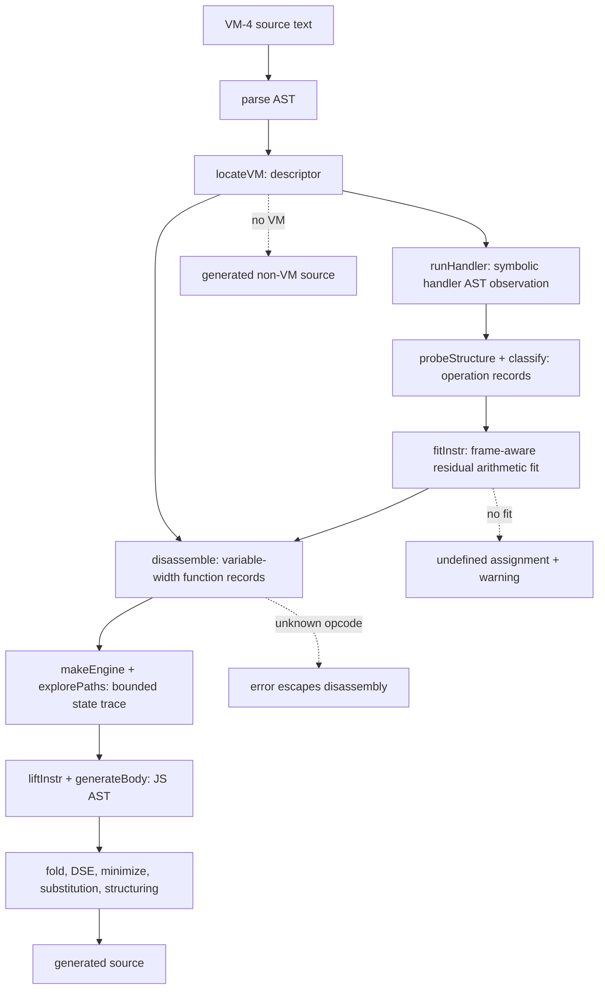

# VM-4 plugin

## Scope and evidence

Evidence label: `source-inspection only`. This is the sample-owned documentation root for
the frozen `VM-4` corpus at commit
[`e90be6ca716e28f4bba91fe39615a665656bd802`](https://github.com/MichaelXF/claude-vs-js-confuser/tree/e90be6ca716e28f4bba91fe39615a665656bd802).
It is not a decoder implementation, production-support claim, transfer qualification,
behavioral-equivalence result, or generalized VM devirtualizer.

This root owns VM-4's distinct recovery algorithm: a static AST interpreter observes handler
effects, structural classification turns those effects into operation records, and a bounded
frame-aware numeric fitter resolves residual MBA arithmetic per instruction. Register/frame
accounting, variable-width instruction walking, bounded path/CFG recovery, AST emission, and
cleanup are shared broad substrate; they are not claimed here as VM-4's discriminator.

## Composition and information dependency

The single detailed page is deliberately one page because the source shows one cohesive
sample-owned algorithm, not multiple independent solution-level transforms.

[Static handler-observation and frame-aware operation recovery](../transforms/vm-4-static-handler-recovery.md)
owns recognition's handler-observation boundary and its downstream consumption. Later path
analysis, lifting, and cleanup consume its records but do not replace the oracle.

The source-backed order is provided by
[`deobfuscateSource`](https://github.com/MichaelXF/claude-vs-js-confuser/blob/e90be6ca716e28f4bba91fe39615a665656bd802/VM-4/vm.js#L3501-L3559),
with handler observation/classification at
[`runHandler`](https://github.com/MichaelXF/claude-vs-js-confuser/blob/e90be6ca716e28f4bba91fe39615a665656bd802/VM-4/vm.js#L366-L918)
and residual fitting at
[`fitInstr`](https://github.com/MichaelXF/claude-vs-js-confuser/blob/e90be6ca716e28f4bba91fe39615a665656bd802/VM-4/vm.js#L1602-L1702).

## Shared substrate versus VM-4 ownership

| Area | Broad/shared substrate | VM-4-owned contract |
| --- | --- | --- |
| Recognition | Parse source AST and identify a VM-shaped container | `locateVM` structurally associates handler assignments, operand reader, decoder/pool, frame push, payload, and entry spec (`56-297`) |
| Machine model | Register/frame slots and closure/upvalue references | Static handler AST execution records symbolic reads, writes, effects, and operand shape (`366-918`, `983-1053`) |
| Operation recovery | Feed operation descriptors into disassembly | `classify` recognizes semantic kinds and leaves residual arithmetic to `fitInstr` (`1061-1404`, `1602-1702`) |
| Control | Walk variable-width instructions and build bounded graph/state | `explorePaths`/`resolveIndirect` use `(pc, abstract constant state)` traces after operation recovery (`1962-2080`) |
| Emission | Lift graph to JavaScript AST and clean it | VM-4's candidate remains bounded by its recognized classifications and fit decisions (`2087-3122`) |

VM-4 is not VM-1's fixed numeric opcode grammar and is not VM-3's handler canonicalization
contract. Those are related register-VM references only; this root describes the VM-4 source.

## Composition and safety boundary

The documented production path parses and interprets handler ASTs in a bounded symbolic mock,
decodes selected constants, recovers operation/trace records, and emits JavaScript AST/source. The
VM-4 implementation does not invoke the embedded payload runtime while recognizing or lifting it.
Existing `output.js`, `regular.js`, and `test.js` are provenance or intended-check artifacts
only; their presence does not qualify the candidate for runtime safety, equivalence, or transfer.

The root's error/decline boundary is source-defined: no VM takes the driver's non-VM path; an
unknown opcode throws during disassembly; a residual arithmetic fit can lower to `undefined` with
a warning; decrypt is warned about rather than emulated; and the graph/structuring stages retain
their bounded fallback behavior. No unsupported branch is silently promoted to recovered source.

## Source

| Source area | Pinned source | Ownership |
| --- | --- | --- |
| VM-4 corpus tree | [frozen VM-4 tree](https://github.com/MichaelXF/claude-vs-js-confuser/tree/e90be6ca716e28f4bba91fe39615a665656bd802/VM-4) | Sample boundary and provenance. |
| Recognition/extraction | [`VM-4/vm.js#L56-L330`](https://github.com/MichaelXF/claude-vs-js-confuser/blob/e90be6ca716e28f4bba91fe39615a665656bd802/VM-4/vm.js#L56-L330) | Shared descriptor plumbing; VM-4 layout facts. |
| Handler observation/classification | [`VM-4/vm.js#L366-L1404`](https://github.com/MichaelXF/claude-vs-js-confuser/blob/e90be6ca716e28f4bba91fe39615a665656bd802/VM-4/vm.js#L366-L1404) | VM-4-owned static oracle. |
| Fitting and path recovery | [`VM-4/vm.js#L1602-L2080`](https://github.com/MichaelXF/claude-vs-js-confuser/blob/e90be6ca716e28f4bba91fe39615a665656bd802/VM-4/vm.js#L1602-L2080) | VM-4-owned residual fit and its state consumer. |
| Lifting/driver | [`VM-4/vm.js#L2087-L3598`](https://github.com/MichaelXF/claude-vs-js-confuser/blob/e90be6ca716e28f4bba91fe39615a665656bd802/VM-4/vm.js#L2087-L3598) | Shared downstream substrate with VM-4 boundaries recorded on the detailed page. |

## Fixtures

The retained files support documentation and provenance claims:

| Artifact | Claim supported | Status |
| --- | --- | --- |
| `VM-4/input.js` | Embedded base64 word stream, constant pool, handlers, and browser-facing payload shape | Documentary source/fixture evidence only. |
| `VM-4/output.js` | Existing lifted output shape, including ordinary loop and decoded strings | Generated-output provenance only. |
| `VM-4/regular.js` | Ordinary non-VM input used to describe the no-VM branch | Negative/provenance evidence only. |
| `VM-4/README.md`, `NOTES.md` | Pipeline description, frame-role definitions, and sample context | Documentation evidence only. |
| `VM-4/test.js` | Intended parse, pass-through, shape, round-trip, and equivalence checks | Test intent only; no validation result is claimed. |
