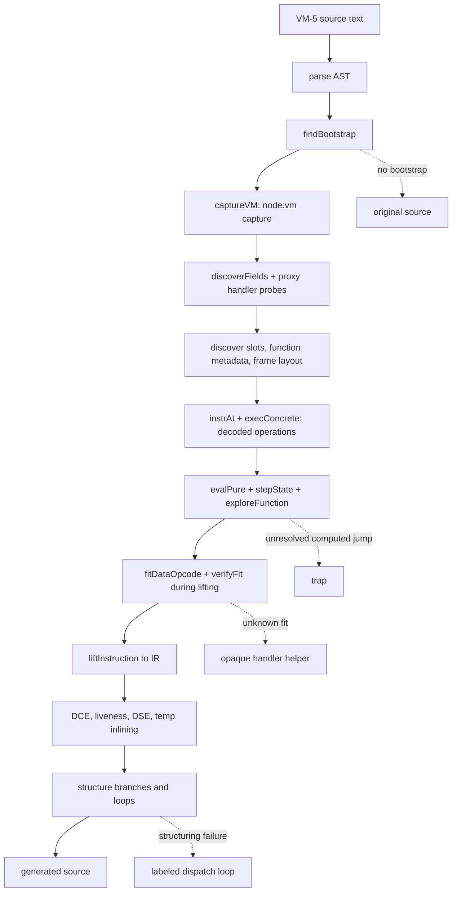

# VM-5 plugin

## Scope and evidence

Evidence label: `source-inspection only`. This is the sample-owned documentation root for
the frozen `VM-5` corpus at commit
[`e90be6ca716e28f4bba91fe39615a665656bd802`](https://github.com/MichaelXF/claude-vs-js-confuser/tree/e90be6ca716e28f4bba91fe39615a665656bd802).
It is not a decoder implementation, production-support claim, transfer qualification,
behavioral-equivalence result, or generalized VM devirtualizer.

This root owns VM-5's distinct recovery algorithm: structural bootstrap capture obtains a live VM
state, proxy-based handler probes recover roles and effects, real-interpreter probes discover
function/frame layout, and a ranked black-box numerical fitter produces frame-size-aware operation
candidates lazily during VM-5's lifting after symbolic control recovery. Register/frame
accounting, bounded CFG construction, AST emission, cleanup, and fallback rendering are
downstream implementation phases of the same page-owned pipeline; generic AST parsing/generation
is substrate.

## Composition and information dependency

The source shows one cohesive sample-owned algorithm, so this root has one detailed transform page.

[Live capture, probing, and frame-aware fit recovery](../transforms/vm-5-live-handler-fit-recovery.md)
owns the sample-specific oracle, fit/state handoff, VM-5 control recovery, and downstream emission.
The driver coordinates the phases; it does not leave the state or emission algorithms unowned.

The source-backed driver order is [`deobfuscate`](https://github.com/MichaelXF/claude-vs-js-confuser/blob/e90be6ca716e28f4bba91fe39615a665656bd802/VM-5/vm.js#L3231-L3258).
The capture boundary is [`captureVM`](https://github.com/MichaelXF/claude-vs-js-confuser/blob/e90be6ca716e28f4bba91fe39615a665656bd802/VM-5/vm.js#L90-L110),
and the sample-owned fitting boundary is [`fitDataOpcodeInner`](https://github.com/MichaelXF/claude-vs-js-confuser/blob/e90be6ca716e28f4bba91fe39615a665656bd802/VM-5/vm.js#L971-L1090).

## Shared substrate versus VM-5 ownership

| Area | Broad/shared substrate | VM-5-owned contract |
| --- | --- | --- |
| Recognition | Parse AST and identify a VM-shaped bootstrap | `findBootstrap` recognizes constructor/word-array/top-level-call structure ([`39-54`](https://github.com/MichaelXF/claude-vs-js-confuser/blob/e90be6ca716e28f4bba91fe39615a665656bd802/VM-5/vm.js#L39-L54)) |
| Runtime/handler observation | Obtain operand reads, register effects, and frame references | `captureVM` live capture plus `makeMock`/`probeRoles`/`classifyOne` proxy probes ([`90-419`](https://github.com/MichaelXF/claude-vs-js-confuser/blob/e90be6ca716e28f4bba91fe39615a665656bd802/VM-5/vm.js#L90-L419)) |
| Layout | Model register/frame slots and closures | Synthetic real-interpreter discovery of slot, closure metadata, rest flag, and frame-size/header ([`517-781`](https://github.com/MichaelXF/claude-vs-js-confuser/blob/e90be6ca716e28f4bba91fe39615a665656bd802/VM-5/vm.js#L517-L781)) |
| Operation recovery | Supply variable-width instruction records to analysis | Ranked numeric fitting and per-frame verification ([`958-1090`](https://github.com/MichaelXF/claude-vs-js-confuser/blob/e90be6ca716e28f4bba91fe39615a665656bd802/VM-5/vm.js#L958-L1090), [`2142-2206`](https://github.com/MichaelXF/claude-vs-js-confuser/blob/e90be6ca716e28f4bba91fe39615a665656bd802/VM-5/vm.js#L2142-L2206)) |
| Control | Build bounded state/CFG graph and structure it | VM-5 transform owns fresh symbolic booleans, control slices, widening, and explosion-register retry ([`1337-1911`](https://github.com/MichaelXF/claude-vs-js-confuser/blob/e90be6ca716e28f4bba91fe39615a665656bd802/VM-5/vm.js#L1337-L1911)) |
| Emission | Lift IR, optimize, and render JavaScript | VM-5 transform owns opaque helpers, traps, and dispatch-loop fallbacks as source-defined consequences ([`2644-2648`](https://github.com/MichaelXF/claude-vs-js-confuser/blob/e90be6ca716e28f4bba91fe39615a665656bd802/VM-5/vm.js#L2644-L2648), [`2689-2693`](https://github.com/MichaelXF/claude-vs-js-confuser/blob/e90be6ca716e28f4bba91fe39615a665656bd802/VM-5/vm.js#L2689-L2693), [`3063-3090`](https://github.com/MichaelXF/claude-vs-js-confuser/blob/e90be6ca716e28f4bba91fe39615a665656bd802/VM-5/vm.js#L3063-L3090), [`3139-3168`](https://github.com/MichaelXF/claude-vs-js-confuser/blob/e90be6ca716e28f4bba91fe39615a665656bd802/VM-5/vm.js#L3139-L3168)) |

VM-5 is not VM-4's static AST handler interpreter and is not VM-1's fixed opcode grammar or VM-3's
canonical handler map. Those samples are related references only; this root describes the VM-5 source.

## Composition and safety boundary

The VM-5 implementation includes an execution boundary: `captureVM` runs rewritten source in a
`node:vm` context, and later metadata/frame probes invoke generated or genuine VM operations. These
source-defined operations do not establish host safety or a runtime result. Existing `input.js`,
`output.js`, README, and NOTES are source, generated-output, and documentation provenance.

The source-defined output boundary is conservative but not a proof of equivalence: missing
bootstrap returns original source; underdetermined fitting can remain unknown and be preserved by
an opaque handler helper; unresolved computed jumps trap; and failed structuring can use a labeled
dispatch loop. These are explicit recovery boundaries, not claims of general VM support or runtime
safety.

## Source

| Source area | Pinned source | Ownership |
| --- | --- | --- |
| VM-5 corpus tree | [frozen VM-5 tree](https://github.com/MichaelXF/claude-vs-js-confuser/tree/e90be6ca716e28f4bba91fe39615a665656bd802/VM-5) | Sample boundary and provenance. |
| Bootstrap/capture/field discovery | [`VM-5/vm.js#L39-L136`](https://github.com/MichaelXF/claude-vs-js-confuser/blob/e90be6ca716e28f4bba91fe39615a665656bd802/VM-5/vm.js#L39-L136) | VM-5-owned live observation boundary. |
| Mock classification/layout | [`VM-5/vm.js#L146-L876`](https://github.com/MichaelXF/claude-vs-js-confuser/blob/e90be6ca716e28f4bba91fe39615a665656bd802/VM-5/vm.js#L146-L876) | VM-5-owned role and frame discovery. |
| Numeric fitting/verification | [`VM-5/vm.js#L878-L1090`](https://github.com/MichaelXF/claude-vs-js-confuser/blob/e90be6ca716e28f4bba91fe39615a665656bd802/VM-5/vm.js#L878-L1090); [`fittedOp`, `2142-2206`](https://github.com/MichaelXF/claude-vs-js-confuser/blob/e90be6ca716e28f4bba91fe39615a665656bd802/VM-5/vm.js#L2142-L2206) | VM-5-owned ranked, frame-aware fit contract. |
| Symbolic control/recovery | [`VM-5/vm.js#L1170-L1943`](https://github.com/MichaelXF/claude-vs-js-confuser/blob/e90be6ca716e28f4bba91fe39615a665656bd802/VM-5/vm.js#L1170-L1943) | VM-5 transform-owned control recovery: pure evaluation, symbolic state, widening, and retry. |
| Lifting/fallback/driver | [`VM-5/vm.js#L1946-L3289`](https://github.com/MichaelXF/claude-vs-js-confuser/blob/e90be6ca716e28f4bba91fe39615a665656bd802/VM-5/vm.js#L1946-L3289) | VM-5 transform-owned lifting/cleanup/fallbacks; `deobfuscate` is the coordinating driver and Babel is substrate. |

## Fixtures

The retained files support documentation and provenance claims:

| Artifact | Claim supported | Status |
| --- | --- | --- |
| `VM-5/input.js` | Embedded base64 word stream, numeric handler table, frame/runtime shape, and payload | Documentary source/fixture evidence only. |
| `VM-5/output.js` | Existing lifted output shape with explicit temporaries, loop, and browser effects | Generated-output provenance only. |
| `VM-5/README.md`, `NOTES.md` | Capture, fitting, symbolic-CFG, fallback, and sample context | Documentation provenance; no runtime result is claimed. |
