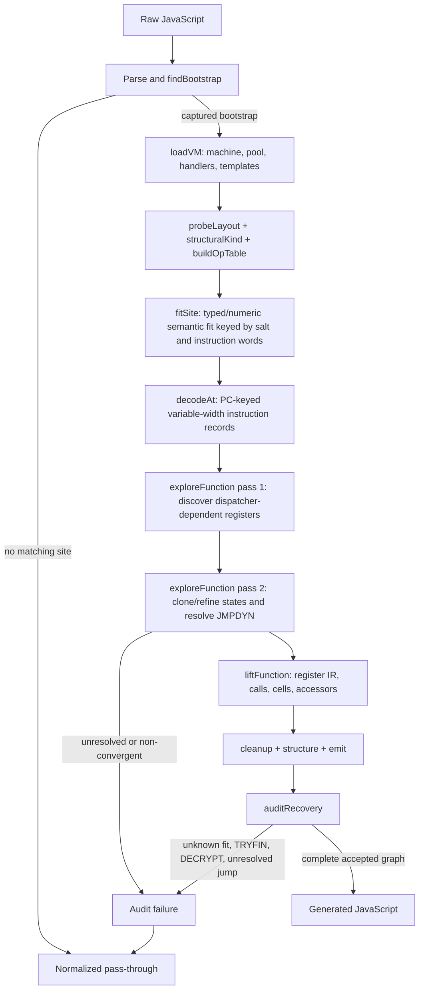

# VM-6 — site-salted handler fitting and hash-dispatch recovery

Evidence label: `source-inspection only`.

This sample-owned plugin root documents the pinned `VM-6` experiment at
[`e90be6ca716e28f4bba91fe39615a665656bd802`](https://github.com/MichaelXF/claude-vs-js-confuser/tree/e90be6ca716e28f4bba91fe39615a665656bd802/VM-6).
It is a source-backed reconstruction contract, not a maintained decoder implementation, runtime
or host-safety result, transfer qualification, empirical coverage claim, or production-support
claim. The corpus is read-only. README, NOTES, fixtures, existing output, and tests are retained
as provenance/intended checks only.

## Target and boundary

VM-6 recognizes a sample-shaped JavaScript register VM whose final top-level expression captures a
machine, prototype handler table, payload, constants, and root template. Its distinctive recovery
algorithm is **site-salted handler fitting followed by symbolic recovery of a hash-dispatched CFG**:
handler semantics are learned from synthetic frame observations and typed/numeric probes using the
function salt, instruction immediates, and operand aliasing, then consumed by disassembly,
constant propagation, control-state cloning, lifting, and source emission.

The model name and directory label are not discriminators. The accepted relationship is the
source-defined bootstrap/layout plus handler/payload relationship; a generic switch, array, or
numeric function must be left alone or follow the caller's normalized pass-through path.

## Composition and information dependency

VM-6 is kept as one transform page because site capture, semantic fitting, and state-specialized
CFG recovery form one coupled solution-level algorithm. The page is
[site-salted handler fitting and hash-dispatch recovery](../transforms/vm-6-site-salted-handler-fitting.md).

The capture/analysis order is wired by [`deobfuscate`](https://github.com/MichaelXF/claude-vs-js-confuser/blob/e90be6ca716e28f4bba91fe39615a665656bd802/VM-6/vm.js#L1900-L1906);
the source spans that own each node and edge are detailed on the transform page.

| Order | Boundary | Representation passed downstream |
| ---: | --- | --- |
| 1 | Site admission/capture | `{ ctx, vm, thisArg, args, tmpl, G, A, T, W, V, Z }` |
| 2 | Layout and handler table | Structural handler kinds or `DATA`, plus consumed/read/write operand positions |
| 3 | Site fit | `MOV`, `CONST`, `UNARY`, `BINCONST`, `BINARY`, `BINARY2`, `BINARY3`, `ERR`, or `UNKNOWN`, with essential operands |
| 4 | Decode | PC-keyed records with variable lengths, operands, destination/source registers, and `next` |
| 5 | CFG recovery | Constants, symbolic operations/calls, function values, control-state clone keys, and resolved/unresolved edges |
| 6 | Lift/cleanup/structure | Register IR and Babel AST statements/functions/blocks, with flattening bookkeeping marked for removal |
| 7 | Audit/emission | Generated source or caller-facing normalized pass-through |

## Relation to neighboring families

- **Behavioral-handler-oracle family:** VM-6 belongs to this broad family because it captures the
  concrete handler table, observes frame reads/writes, and invokes handlers in synthetic
  environments. It is not adequately described by a generic behavior-oracle summary: the fitted
  semantic record is keyed by the function's `C` salt and by instruction-specific immediate and
  alias information, and this record is the input to symbolic control recovery and lifting.
- **Static VM-1 family:** VM-6 shares register/frame, payload, CFG, and AST-emission vocabulary,
  but it does not use VM-1's fixed numeric opcode grammar or fixed static semantics. Its
  `buildOpTable`/`fitSite` path learns randomized handler meanings at the site.
- **Static VM-3 family:** VM-6 shares structural discovery, handler/table, disassembly, state,
  closure, and cleanup concerns, but it does not claim VM-3's canonical handler-shape pipeline.
  VM-6 fits operations through synthetic execution and resolves its hash dispatcher by symbolic
  forking and calls to no-cell VM functions.
- **VM-4/VM-5:** These are neighboring source-inspection samples with behavioral observation, but
  VM-6 is a sibling sample-owned reconstruction, not a source-reuse or transfer claim. Its
  salt/immediate/alias fit cache and hash-dispatch state cloning are owned here.

## Representations and safety

`loadVM` evaluates the source after replacing only the bootstrap callee with a capture function in
a Node `vm` context with a ten-second timeout. The embedded VM entry is captured rather than
called at that point, but top-level setup before the bootstrap is still evaluated. Later analysis
probes handlers and may call no-cell VM functions to evaluate dispatcher expressions. Those are
source-defined execution boundaries. Their presence does not establish sandbox hardening.

The audit is fail-closed at the conversion boundary. `auditRecovery` rejects unresolved dynamic
jumps, unknown/error semantic fits, `TRYFIN`, and `DECRYPT`. Unless `VM_DEBUG` is set, `run` reports
the failure and reparses/generates the original source. That fallback is normalized pass-through,
not a byte-preserving guarantee. No generated code, helper semantics, runtime equivalence, or host
safety is qualified here.

## Source

The implementation authority is the frozen [`VM-6/vm.js`](https://github.com/MichaelXF/claude-vs-js-confuser/blob/e90be6ca716e28f4bba91fe39615a665656bd802/VM-6/vm.js).
The transform page cites its owned spans for the reconstruction. `VM-6/README.md` and
`VM-6/NOTES.md` are provenance/intended-method evidence, not the sole algorithm record.

## Fixtures

The retained files below are documentary/provenance evidence only; they do not establish
execution or regenerated-output results.

| Corpus artifact | Claim it can support | Evidence status |
| --- | --- | --- |
| `VM-6/input.js` | Concrete VM-6 payload, handler table, bootstrap, constants, and function-template shape | Pinned source/fixture evidence only; no transfer or behavioral claim |
| `VM-6/output.js` | Existing generated source shape | Generated-output provenance only |
| `VM-6/regular.js` | Ordinary non-VM pass-through input shape | Negative/provenance evidence only |
| `VM-6/README.md` | Documented API, options, invocation, and checks | Documentation provenance only |
| `VM-6/NOTES.md` | Sample architecture and known limits | Documentation/provenance only; algorithm detail is owned by the transform page |
| `VM-6/test-features.js` | Intended synthetic instruction-set checks | Test intent only; no qualification result is claimed |
| `VM-6/test.js` | Intended end-to-end, pass-through, and behavior checks | Test intent only; no qualification result is claimed |
