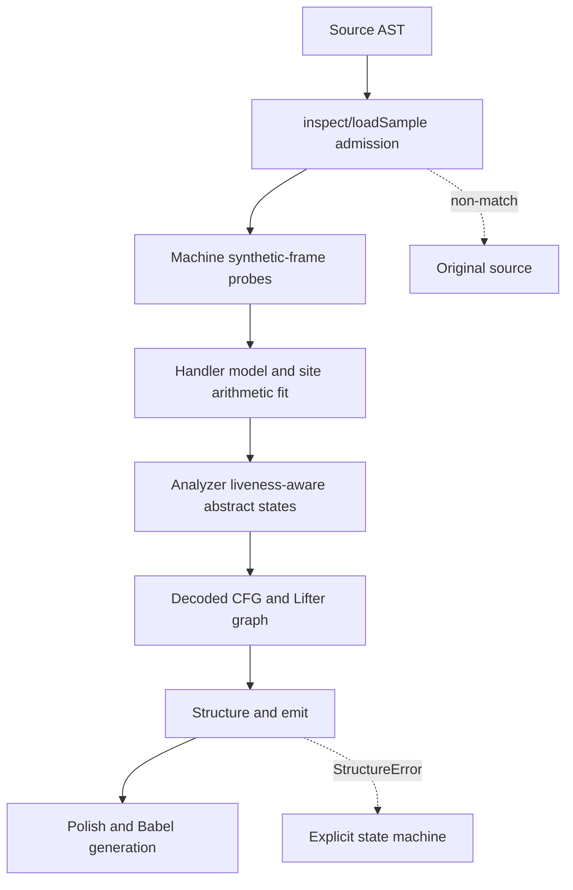

# VM-7 plugin

Status: source-inspection only. Source pin: `e90be6ca716e28f4bba91fe39615a665656bd802`.
This root documents the pinned `decoder/claude-vs-js-confuser/VM-7` sample; it does not claim
runtime, behavioral, transfer, or production validation.

## Scope

VM-7 is a register-oriented JavaScript VM sample whose recovery strategy is behavioral handler
modeling followed by liveness-aware abstract interpretation and source lifting. Its sample-owned
transform is documented at [vm-7-behavioral-abstract-state-lifting.md](../transforms/vm-7-behavioral-abstract-state-lifting.md).

## Composition

The root has one transform page because these stages form one solution-level algorithm. The
`Machine` probe model, `fit` operation recovery, `Analyzer` abstract state, and `Lifter`/emitter
boundary are all material parts of that algorithm; they are not separate pages merely because
they live in separate source files.

## Ownership

| Surface | Owner in this root | Evidence |
| --- | --- | --- |
| AST admission and entry capture | Root coordinator | `VM-7/lib/machine.js:23-93`, `VM-7/vm.js:50-73` |
| Synthetic frame and handler observation | VM-7 transform | `VM-7/lib/machine.js:97-226` |
| Handler roles, operand structure, result types, and arithmetic fitting | VM-7 transform | `VM-7/lib/machine.js:228-409`, `VM-7/lib/fit.js:92-191` |
| State propagation, liveness, function/CFG recovery | VM-7 transform | `VM-7/lib/analyze.js:223-649` |
| AST lifting, structuring, emission, and cosmetic cleanup | VM-7 transform | `VM-7/lib/lift.js:215-590`, `VM-7/lib/structure.js:69-257`, `VM-7/lib/emit.js:17-335`, `VM-7/lib/polish.js:156-167` |
| Non-match, unknown-operation warning, and structure fallback | Root/transform boundary | `VM-7/vm.js:50-73`, `VM-7/lib/lift.js:215-321`, `VM-7/lib/emit.js:180-292` |

Generic Babel parsing/generation and the Node VM facility are coordinator substrate. This root
does not assert that VM-7 shares implementation with VM-1, VM-3, VM-4, VM-6, or VM-8.

## Admission and source-defined boundary

`inspect` accepts the concrete top-level shape described by `VM-7/lib/machine.js:23-53`: at least
16 top-level computed numeric-member handler assignments and a reverse-found entry call with an
identifier callee and two leading constructor arguments. On non-match, `VM-7/vm.js:50-73`
returns the original source. On a match, `loadSample` rewrites only the final entry callee to a
capture function and runs the generated setup in a `node:vm` context (`machine.js:55-93`); the
transform's probe stage then invokes handler functions against synthetic frames. These source
execution boundaries are documented as implementation facts, not runtime evidence.

## Relationship to VM-8

Both roots use a register/frame vocabulary and behavioral evidence, but the evidence boundary is
not interchangeable. VM-7 learns a handler model and carries values through a liveness-keyed
abstract interpreter; VM-8 classifies payload sites and specializes dispatcher state with an
oracle. Keep the roots and transform pages distinct.

## Source

Pinned source directory: [`decoder/claude-vs-js-confuser/VM-7/`](https://github.com/MichaelXF/claude-vs-js-confuser/tree/e90be6ca716e28f4bba91fe39615a665656bd802/VM-7) at commit
`e90be6ca716e28f4bba91fe39615a665656bd802`. The transform is wired by
[`VM-7/vm.js:35-73`](https://github.com/MichaelXF/claude-vs-js-confuser/blob/e90be6ca716e28f4bba91fe39615a665656bd802/VM-7/vm.js#L35-L73).
The detailed source map is in [vm-7-behavioral-abstract-state-lifting.md](../transforms/vm-7-behavioral-abstract-state-lifting.md).

## Fixtures

None. `VM-7/test.js` provides intended-check provenance only; no fixture-backed or generated
result is claimed.
