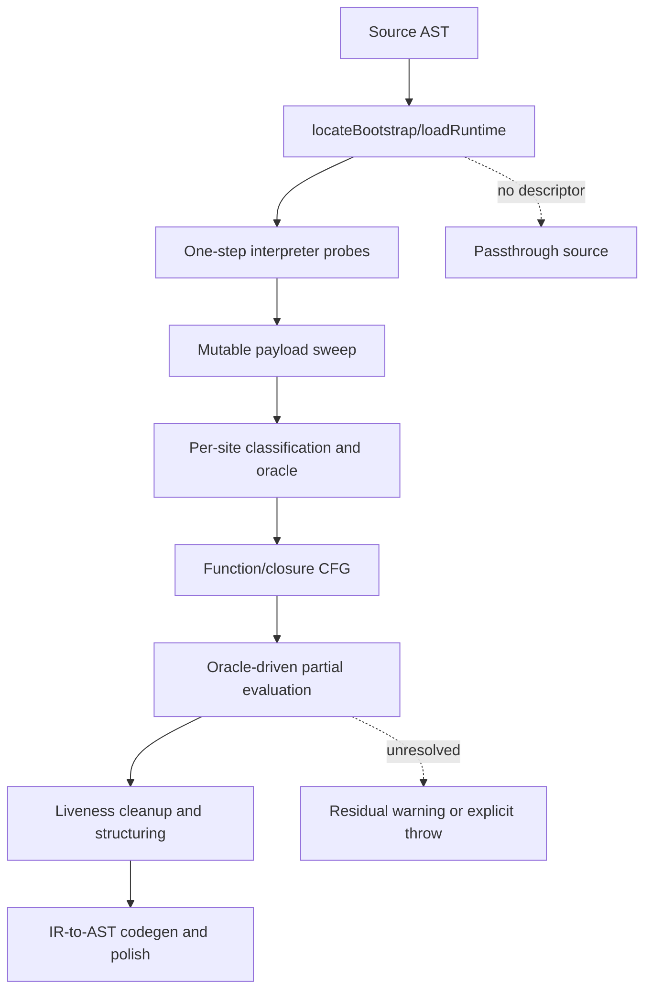

# VM-8 plugin

Status: source-inspection only. Source pin: `e90be6ca716e28f4bba91fe39615a665656bd802`.
This root documents the pinned `decoder/claude-vs-js-confuser/VM-8` sample; it does not claim
runtime, behavioral, transfer, or production validation.

## Scope

VM-8 is a register-oriented JavaScript VM sample whose recovery strategy is structural runtime
extraction, per-site behavioral classification, oracle fitting, and bounded partial evaluation of
dispatcher state. Its sample-owned transform is documented at [vm-8-oracle-classification-partial-evaluation.md](../transforms/vm-8-oracle-classification-partial-evaluation.md).

## Composition

The root has one transform page because site observation, classification/oracle fitting, CFG
recovery, partial evaluation, residual emission, and cleanup form one connected solution-level
recovery algorithm. Extraction and driver calls are coordinator boundaries; their outputs feed the
page-owned algorithmic phases directly. The source-file split is captured as implementation
ownership on that page, not treated as separate algorithms.

## Ownership

| Surface | Owner in this root | Evidence |
| --- | --- | --- |
| Bootstrap recognition and runtime descriptor | Root coordinator | [`VM-8/lib-extract.js:17-101`](https://github.com/MichaelXF/claude-vs-js-confuser/blob/e90be6ca716e28f4bba91fe39615a665656bd802/VM-8/lib-extract.js#L17-L101), [`VM-8/vm.js:33-78`](https://github.com/MichaelXF/claude-vs-js-confuser/blob/e90be6ca716e28f4bba91fe39615a665656bd802/VM-8/vm.js#L33-L78) |
| One-step interpreter/handler observation | VM-8 transform | [`VM-8/lib-probe.js:87-200`](https://github.com/MichaelXF/claude-vs-js-confuser/blob/e90be6ca716e28f4bba91fe39615a665656bd802/VM-8/lib-probe.js#L87-L200) |
| Mutable disassembly and per-site semantic classification | VM-8 transform | [`VM-8/lib-disasm.js:14-45`](https://github.com/MichaelXF/claude-vs-js-confuser/blob/e90be6ca716e28f4bba91fe39615a665656bd802/VM-8/lib-disasm.js#L14-L45), [`lib-disasm.js:94-310`](https://github.com/MichaelXF/claude-vs-js-confuser/blob/e90be6ca716e28f4bba91fe39615a665656bd802/VM-8/lib-disasm.js#L94-L310) |
| Typed/numeric fitting and stable-result oracle | VM-8 transform | [`VM-8/lib-classify.js:141-290`](https://github.com/MichaelXF/claude-vs-js-confuser/blob/e90be6ca716e28f4bba91fe39615a665656bd802/VM-8/lib-classify.js#L141-L290) |
| Function/closure CFG and dispatcher specialization | VM-8 transform | [`VM-8/lib-analyze.js:8-74`](https://github.com/MichaelXF/claude-vs-js-confuser/blob/e90be6ca716e28f4bba91fe39615a665656bd802/VM-8/lib-analyze.js#L8-L74), [`VM-8/lib-peval.js:34-260`](https://github.com/MichaelXF/claude-vs-js-confuser/blob/e90be6ca716e28f4bba91fe39615a665656bd802/VM-8/lib-peval.js#L34-L260) |
| Residual IR cleanup, structuring, and AST codegen | VM-8 transform | [`VM-8/lib-emit.js:54-248`](https://github.com/MichaelXF/claude-vs-js-confuser/blob/e90be6ca716e28f4bba91fe39615a665656bd802/VM-8/lib-emit.js#L54-L248), [`lib-emit.js:318-493`](https://github.com/MichaelXF/claude-vs-js-confuser/blob/e90be6ca716e28f4bba91fe39615a665656bd802/VM-8/lib-emit.js#L318-L493), [`VM-8/lib-codegen.js:72-270`](https://github.com/MichaelXF/claude-vs-js-confuser/blob/e90be6ca716e28f4bba91fe39615a665656bd802/VM-8/lib-codegen.js#L72-L270) |
| Optional polish and source-integrity gap | VM-8 transform; driver-gated | [`VM-8/vm.js:33-78`](https://github.com/MichaelXF/claude-vs-js-confuser/blob/e90be6ca716e28f4bba91fe39615a665656bd802/VM-8/vm.js#L33-L78), [`VM-8/lib-polish.js:102-450`](https://github.com/MichaelXF/claude-vs-js-confuser/blob/e90be6ca716e28f4bba91fe39615a665656bd802/VM-8/lib-polish.js#L102-L450) |

Generic Babel parsing/generation and the Node VM facility are coordinator substrate. This root
does not assert that VM-8 shares implementation with VM-1, VM-3, VM-4, VM-6, or VM-7.

## Admission and source-defined boundary

`locateBootstrap` accepts the specific top-level relationship in [`VM-8/lib-extract.js:17-52`](https://github.com/MichaelXF/claude-vs-js-confuser/blob/e90be6ca716e28f4bba91fe39615a665656bd802/VM-8/lib-extract.js#L17-L52):
the reverse-found call has constructor-shaped arguments, an object argument, an array argument,
and multiple identifiers. It optionally records a variable initialized from `VM.prototype`;
`loadRuntime` falls back to the direct prototype member when that alias is absent, then rewrites
that statement to
export the runtime descriptor and executes the generated setup in a `node:vm` sandbox
([`lib-extract.js:54-101`](https://github.com/MichaelXF/claude-vs-js-confuser/blob/e90be6ca716e28f4bba91fe39615a665656bd802/VM-8/lib-extract.js#L54-L101)). If loading yields no descriptor, [`VM-8/vm.js:33-78`](https://github.com/MichaelXF/claude-vs-js-confuser/blob/e90be6ca716e28f4bba91fe39615a665656bd802/VM-8/vm.js#L33-L78) returns the
original source with `passthrough: true`; recognized but unresolved operations proceed through
warning-bearing residual/error representations rather than this passthrough path.

The pinned `VM-8/lib-polish.js` contains one raw NUL byte at byte offset 9417, line 197, inside
`writtenIn`. The surrounding cleanup algorithm is documented, but the exact semantics of that
damaged marker remain an explicit known gap.

## Relationship to VM-7

Both roots observe handler behavior, but VM-8's opcode meaning is site-specific: `lib-disasm` and
`lib-classify` feed an oracle and per-site residue fitting into `lib-peval`'s environment-memoized
dispatcher specialization. VM-7's `Machine` builds a broader handler model and `Analyzer` uses
liveness-keyed abstract states. Keep the roots and transform pages distinct.

## Source

Pinned source directory: [`decoder/claude-vs-js-confuser/VM-8/`](https://github.com/MichaelXF/claude-vs-js-confuser/tree/e90be6ca716e28f4bba91fe39615a665656bd802/VM-8) at commit
`e90be6ca716e28f4bba91fe39615a665656bd802`. The transform is wired by
[`VM-8/vm.js:20-78`](https://github.com/MichaelXF/claude-vs-js-confuser/blob/e90be6ca716e28f4bba91fe39615a665656bd802/VM-8/vm.js#L20-L78).
The detailed source map is in [vm-8-oracle-classification-partial-evaluation.md](../transforms/vm-8-oracle-classification-partial-evaluation.md).

## Fixtures

None. `VM-8/test.js` provides intended-check provenance only; no fixture-backed or generated
result is claimed.
