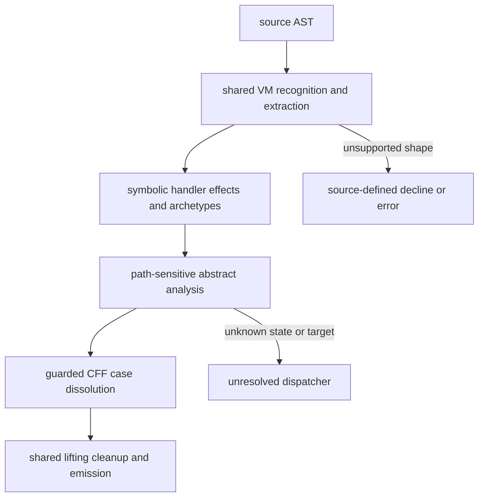

# VM-GLM-1 handler-effects variation

Status: source-inspection only. This is the plugin root for the VM-GLM-1 sample at frozen
corpus commit `e90be6ca716e28f4bba91fe39615a665656bd802`. It makes no execution, transfer,
behavioral-equivalence, or production-coverage claim.

## Scope and composition

VM-GLM-1 is one static register-VM devirtualization solution whose distinct contribution is the
combination of symbolic handler-effect interpretation with path-sensitive dissolution of a
branchless state dispatcher. It is documented as a variation of the VM-3 static handler/state-
lifting method, not as a separate VM substrate and not as a collection of source-file pages.

The plugin root owns this sample's entry point, source provenance, fixture map, safety boundary,
and information dependencies. The detailed algorithm is in [VM-GLM-1 symbolic handler effects and
path-sensitive CFF dissolution](../transforms/vm-glm-1-handler-effects-variation.md).

The method-level dependency chain is:

`static VM recognition and payload extraction -> symbolic handler effects and archetype matching ->
partial semantic opcode table -> path-sensitive abstract instruction/edge analysis -> CFF-dissolved
block graph -> ordinary state lifting, structuring, cleanup, and emission`.

The diagram shows the composition boundary only: the handler-effect and dispatcher-dissolution
nodes are the GLM variation, while the first and last nodes are related VM-3 method boundaries.

The first and last portions are shared boundaries with the VM-3 approach. The detail page documents
only the middle variation: its symbolic effect IR, effect-pattern matcher, branchless `__sel`
propagation, and guarded state-ladder rewiring. The related [VM-3 plugin entry](vm-3.md) and its
package-local transform pages are method references for those common boundaries. The
implementation is local to `VM-GLM-1/vm.js`; the composition statement does not imply source reuse
between samples.

## Distinct boundary

The handler phase preserves source-level meaning as ordered effects, including guarded writes,
helper calls, loop-shaped dynamic tails, and stream-versus-immediate operand provenance. The path
phase then carries concrete and boolean facts through a worklist, creates branchless selections,
emits conditioned dispatch edges, and dissolves only state cases proven by the strict hub/ladder
shape. Unknown handlers, unresolved targets, variable states, and unsafe dual evaluation remain
unsupported or conservative.

The root does not restate structural extraction, generic disassembly, ordinary lifting, relooping,
cleanup, or formatting. The detail page links those related boundaries and records the exact
VM-GLM source spans that own the variation.

## Runtime and evidence boundary

This documentation is source-inspection only. Symbolic evaluation and `concreteEval2` are
static abstractions over AST/instruction representations; they are not permission to run handlers,
payloads, or fixture programs. Fixture status and claim scope are recorded on the [detail page](../transforms/vm-glm-1-handler-effects-variation.md#fixtures).

## Source

The frozen implementation is [`VM-GLM-1/vm.js`](https://github.com/MichaelXF/claude-vs-js-confuser/blob/e90be6ca716e28f4bba91fe39615a665656bd802/VM-GLM-1/vm.js). The [detail page](../transforms/vm-glm-1-handler-effects-variation.md#source) maps the exact owned spans for interpretation, matching, abstract path analysis, and CFF dissolution. Related VM-3 pages are the method references for the shared structural, lifting, cleanup, and fallback boundaries.

## Fixtures

The detail page's [fixture table](../transforms/vm-glm-1-handler-effects-variation.md#fixtures) maps
the retained `VM-GLM-1` input, control, generated-output, test, and documentary files. They provide
provenance, not algorithm or behavioral claims.
