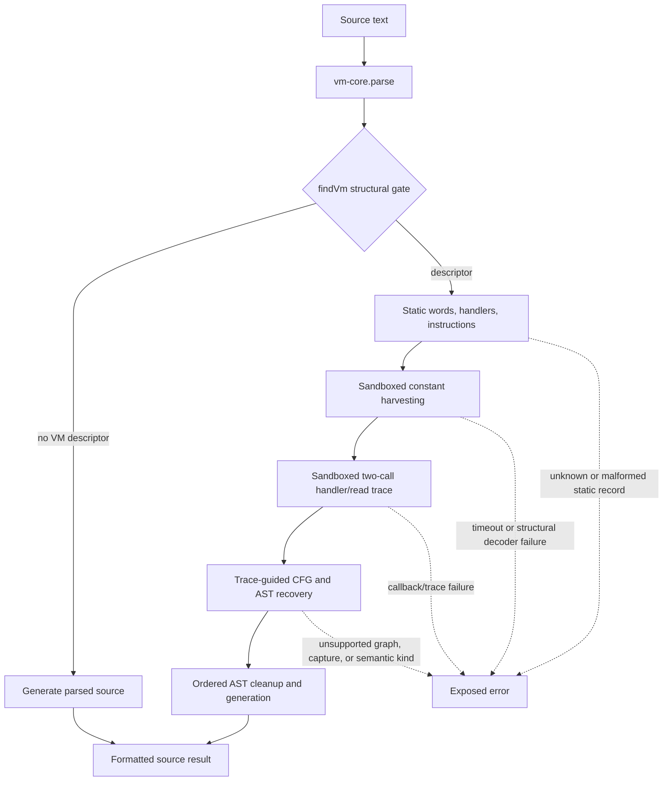

# VM-GPT-1 plugin

Status: source-inspection only. This page reconstructs the `VM-GPT-1` example from the frozen
corpus at commit
[`e90be6ca716e28f4bba91fe39615a665656bd802`](https://github.com/MichaelXF/claude-vs-js-confuser/tree/e90be6ca716e28f4bba91fe39615a665656bd802).
It is not a maintained decoder, a behavioral-equivalence result, a transfer qualification, a
production-support claim, or a hardened sandbox design.

The sample's GPT provenance is metadata only. The algorithm boundary here is derived from the
implementation: this example statically recognizes a register VM, executes selected source inside
a Node `vm` context to harvest keyed constants and observe handler transitions, then lifts the
observed application path into a Babel AST. The shared register-VM extraction, opcode-shape
interpretation, register lowering, and cleanup ideas are deliberately not restated as separate
VM-1/VM-3 algorithms. The distinct page is [trace-guided recovery](../transforms/vm-gpt-1-trace-guided-recovery.md).

## 1. Target

The plugin target is the `VM-GPT-1` source shape that contains all of the following structural
relationships:

- a machine constructor and an alias for its `.prototype`;
- a long string literal passed to a call, treated as the Base64 bytecode payload;
- at least twenty numeric computed assignments of functions to the prototype alias; and
- a bootstrap call whose first argument constructs the machine with an array constant pool and
  whose fifth argument constructs metadata from an object literal.

The accepted result is generated JavaScript whose root bootstrap and browser callback are ordinary
Babel AST statements and functions. The VM's bytecode array, numeric handler table, frame/register
runtime, and dispatcher are not emitted by the lift path. A non-VM input takes the root's parse and
generate branch, preserving meaning while allowing formatting changes. The target is this sample's
composition, not arbitrary VM devirtualization.

## 2. Algorithm

The information dependency is:

`vm-core.findVm` is the recognition boundary. Once it succeeds, the caller does not wrap
disassembly or lifting in a fallback; errors escape. Static disassembly and handler lowering are
prerequisites for the distinct trace-guided page, which owns the `K` through `O` path. The detailed
page explains the observed state and every dynamic edge; this root owns only the composition and
caller-facing branch.

| Order | Boundary | Input -> output | Ownership |
| ---: | --- | --- | --- |
| 1 | Structural gate | Parsed AST -> VM descriptor or `null` | Root composition; exact predicate is in `vm-core.findVm`. |
| 2 | Static substrate | Descriptor -> words, handler descriptions, and PC-keyed instructions | Prerequisite substrate; not a second GPT page. |
| 3 | Constant observation | Source/descriptor/instructions -> decoded constant values or `undefined` for unobserved strings | Detailed trace-guided page. |
| 4 | Dynamic observation | Sandboxed bootstrap and callback invocations -> handler/read event records | Detailed trace-guided page. |
| 5 | Recovery and emission | Event records plus static semantics -> lifted program AST and generated source | Detailed trace-guided page. |
| 6 | Non-VM result | Parsed non-VM AST -> generated source | Root caller-facing fallback branch. |

## 3. Implementation

The root implementation is intentionally thin:

| Source operation | Root-owned decision | Result |
| --- | --- | --- |
| [`vm.js` re-export](https://github.com/MichaelXF/claude-vs-js-confuser/blob/e90be6ca716e28f4bba91fe39615a665656bd802/VM-GPT-1/vm.js#L3-L7) | Expose `deobfuscate`, `transform`, and `_internals` from `vm-core.js` | Library callers receive the source transformer and its structural helpers. |
| [`vm.js` CLI](https://github.com/MichaelXF/claude-vs-js-confuser/blob/e90be6ca716e28f4bba91fe39615a665656bd802/VM-GPT-1/vm.js#L9-L17) | Require input and output paths, then call the file transformer | Missing paths set a nonzero exit code; otherwise the computed result is written by `deobfuscate`. |
| [`transform`](https://github.com/MichaelXF/claude-vs-js-confuser/blob/e90be6ca716e28f4bba91fe39615a665656bd802/VM-GPT-1/vm-core.js#L326-L332) | Parse, call `findVm`, generate a non-VM result, or delegate a recognized VM to `lift` | No descriptor produces formatted parsed source; a recognized descriptor enters the dynamic path. |
| [`deobfuscate`](https://github.com/MichaelXF/claude-vs-js-confuser/blob/e90be6ca716e28f4bba91fe39615a665656bd802/VM-GPT-1/vm-core.js#L334-L339) | Read UTF-8 source, compute the complete result, and write only after success | A thrown recovery error does not write a partial output. |

`findVm` and the static helpers are source prerequisites rather than distinct GPT recovery
boundaries. Their exact recognition and instruction records are used by the linked detailed page
but are not copied from another VM sample here:
[`findVm`](https://github.com/MichaelXF/claude-vs-js-confuser/blob/e90be6ca716e28f4bba91fe39615a665656bd802/VM-GPT-1/vm-core.js#L53-L121),
[`disassemble`](https://github.com/MichaelXF/claude-vs-js-confuser/blob/e90be6ca716e28f4bba91fe39615a665656bd802/VM-GPT-1/vm-core.js#L182-L200),
and [trace-guided recovery](../transforms/vm-gpt-1-trace-guided-recovery.md).

## 4. Upstream Effects

The root's recovery call depends on the representation edges established before it:

- `parse` supplies AST node identity and generated source to the structural gate. The bootstrap
  node's `start` offset is later used to isolate the bootstrap expression in both sandbox passes.
- `findVm` supplies the machine constructor, prototype alias, bootstrap expression, static pool,
  global expression, metadata, and numeric handler map. It does not prove that decoys are related
  by data flow.
- `disassemble` supplies the word stream, `{pc, next, opcode, operands}` instruction records,
  the reader-function name, and handler information. The trace wrapper uses these records to map
  observed numeric handlers back to instruction PCs.
- The detailed page's constant harvest must precede its `lower` calls because decoded pool values
  are captured in the `decodedConstants` table. Its trace must precede CFG construction because
  `functionMetadata.parentEntry`, observed successor samples, helper-entry membership, and
  application transitions are learned during the trace.
- There is no later decoder pass in this example. The root receives either the fully generated
  lifted source or an exception; the source does not define a semantic validation stage that would
  turn a wrong-but-running candidate into a safe result.

The caller-facing safety boundary is:

| Condition | Source behavior | Interpretation |
| --- | --- | --- |
| `findVm` returns `null` | Parse and generate the AST with a trailing newline | Safe non-VM pass-through in meaning, not byte identity. |
| Missing metadata, payload, or handler population | `findVm` returns `null` | The recognized VM path is not entered. |
| Unknown opcode, invalid operand count, or static decoder failure | Throw from the prerequisite/lifter path | No guessed instruction and no fallback candidate. |
| Node `vm` timeout, missing VM decoder, or missing browser callback | Throw | The recognized input is not silently reported as recovered. |
| Unsupported capture, branch, cycle, or semantic kind | Throw from the detailed page | No partial lifted program is selected. |
| Complete recovery | Generate source, then write it if a path was supplied | Source generation is not execution or equivalence evidence. |

Both observation phases execute sample-derived source in a Node `vm` context with explicit
`Buffer`, console, `window`, and document/animation proxies. Generated-source calls made through
`runInContext` have source-defined timeouts; the trace bootstrap, wrapped handlers, and individual
constant probes are direct host calls without a separate timeout option. This is an implementation
containment mechanism, not a hardened security boundary. The exported `transform` invokes the
lifter without deterministic options; the deterministic `Math`/`Date` replacements are available
only through the lifter's direct CLI options. No host-safety or deterministic-behavior claim is
made here.

## 5. Known Gaps

- The recognition gate uses long-string and handler-count heuristics and does not associate every
  payload, constructor, pool, and handler through a complete data-flow proof.
- Dynamic recovery is based on the callback trace collected by this sample-shaped implementation;
  it is not a static all-path CFG reconstruction and does not claim coverage of unobserved edges.
- The Node `vm` context has explicit shims and timeouts but is not documented as hardened isolation.
  Default exported transformation also observes ambient clock/random behavior unless the direct
  lifter CLI's deterministic option is used.
- The README, notes, input, output, regular control, and test files preserve sample and fixture
  provenance. This page asserts no behavior, byte-size, equivalence, transfer, or production result.

## Source

The frozen implementation is the [`VM-GPT-1 source tree`](https://github.com/MichaelXF/claude-vs-js-confuser/tree/e90be6ca716e28f4bba91fe39615a665656bd802/VM-GPT-1).
The root wrapper and caller-facing CLI are [`vm.js`](https://github.com/MichaelXF/claude-vs-js-confuser/blob/e90be6ca716e28f4bba91fe39615a665656bd802/VM-GPT-1/vm.js#L3-L17).
The parse/recognition and caller selection are [`vm-core.js#parse/findVm/transform/deobfuscate`](https://github.com/MichaelXF/claude-vs-js-confuser/blob/e90be6ca716e28f4bba91fe39615a665656bd802/VM-GPT-1/vm-core.js#L12-L121),
[`vm-core.js#transform`](https://github.com/MichaelXF/claude-vs-js-confuser/blob/e90be6ca716e28f4bba91fe39615a665656bd802/VM-GPT-1/vm-core.js#L326-L339),
and the distinct recovery boundary is [trace-guided recovery](../transforms/vm-gpt-1-trace-guided-recovery.md).

## Fixtures

These pinned sample files are documentary fixtures and provenance, not newly generated or executed
fixtures for this page.

| Fixture | Claim it could pin | Evidence boundary |
| --- | --- | --- |
| `VM-GPT-1/README.md` | Sample intent, package/tool metadata, and requested pass-through behavior | Documentation provenance only; not an algorithm authority. |
| `VM-GPT-1/NOTES.md` | Sample-specific VM layout, frame notes, trace rationale, and intended cleanup shape | Supporting documentation provenance. |
| `VM-GPT-1/input.js` | The long payload, constant pool, numeric handlers, bootstrap, and browser callback shape | Source/fixture evidence only. |
| `VM-GPT-1/output.js` | An existing lifted-AST output shape with a source-level loop and two-call state | Generated-output provenance only. |
| `VM-GPT-1/regular.js` | The non-VM input branch | Negative/provenance evidence only. |
| `VM-GPT-1/test.js` | Intended string, residue, pass-through, and behavior checks | Test-intent evidence only; no validation result is claimed. |
