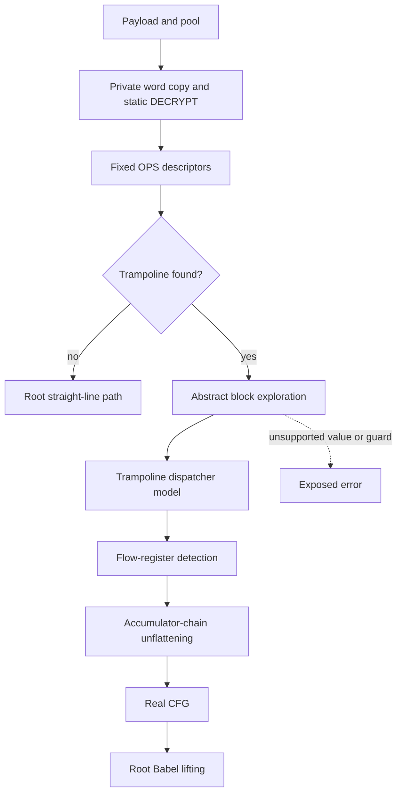

# VM-Kimi-1 plugin

Evidence label: source-inspection only. This page is a reconstruction contract for the frozen
`VM-Kimi-1` example at commit
[`e90be6ca716e28f4bba91fe39615a665656bd802`](https://github.com/MichaelXF/claude-vs-js-confuser/tree/e90be6ca716e28f4bba91fe39615a665656bd802).
It is not a maintained decoder implementation, runtime-equivalence result, transfer qualification,
or production-support claim.

The page documents this example specifically. It does not claim that its fixed opcode numbers,
decryption grammar, or dispatcher shape generalize to other register VMs.

## 1. Target

The bounded target is generated JavaScript with the embedded Kimi register VM and its flattening
scaffolding removed, for the operations and control shapes that the source can represent. The root
owns the end-to-end composition; the Kimi-specific control/data boundary is the linked
[static-decrypt and hashed-dispatch transform](../transforms/vm-kimi-1-static-decrypt-dispatch.md).

The root-level recognizer first requires a parsed script with both of these independent clues:

| Clue | Exact source shape | Safe interpretation |
| --- | --- | --- |
| bytecode candidate | An identifier call with one base64-character `StringLiteral` longer than 512 characters; the longest such literal wins | Candidate payload only; it is not associated with the boot call by data flow |
| boot candidate | A non-computed member call over a `NewExpression` with at least three arguments, whose third argument is an `ArrayExpression` with more than ten elements | Candidate constant pool and call site; a numeric `p` in a nested constructor object supplies boot metadata |

The Kimi-specific interpretation is stricter than either clue alone: its decoded words must use the
fixed numeric `OPS` table and a flattened function must reach a scanned trampoline region containing
the source's `CALL_NULL` dispatch call. The implementation records a result `GET_PROP` and stops
scanning at `JUMP_REG` when present, but does not require either one; a missing property load
defaults the selector to `0`. If the source is unparseable or neither extraction clue is present,
the driver returns the original source. If a recognized Kimi shape reaches an unsupported later
phase, the source exposes that error rather than claiming a successful fallback.

## 2. Algorithm

The composition order is representation-driven:

1. Parse the input as a Babel `script` AST and independently extract the long payload, literal pool,
   and boot metadata. The no-pattern and parse-error edges are pass-through edges.
2. Decode the payload into little-endian `Uint32` words, apply reachable `DECRYPT` ranges to a
   private word copy, and construct fixed numeric instruction descriptors.
3. For each function entry, detect the first direct jump to a trampoline. A detected trampoline
   supplies the two dispatcher arguments, result property, and dispatcher function entry.
4. Abstractly explore the function's blocks. Concrete arithmetic is folded; symbolic expressions
   are retained. At a trampoline return, statically model the pure arithmetic dispatcher to resolve
   one or two next targets.
5. Identify the header, state register, accumulator, state delta, and MBA select machinery from
   the explored block shapes. Walk the accumulator chain to build its partial-sum case map and
   resolve dispatcher stubs.
6. Re-link reachable payload blocks into a real control-flow graph, preserving conditional arms,
   loops, returns, and throws that the graph model represents. The resulting graph is the output of
   the Kimi-specific transform.
7. The root passes that graph to the local Babel lifter, which materializes registers and closures,
   then to bounded AST cleanup and source generation. A function with no detected trampoline uses
   the root's straight-line lifter.

The Kimi-specific data flow is:

The dispatcher is not run as JavaScript and its formula is not inferred from names. The source
models a bounded arithmetic subset and recognizes only the control relationship that reaches the
trampoline. This is the safety boundary that keeps the transform source-inspection-only and
prevents a guessed hash inverse from being treated as a decoded edge.

## 3. Implementation

The root owns coordination and the local emission substrate; the detailed page owns the Kimi
static-decrypt/dispatch boundary. The ownership is by decision, not by source-file count.

| Composition stage | Source owner | Input -> output | Material behavior |
| --- | --- | --- | --- |
| AST extraction | Root coordinator | parsed AST -> `{payload, pool, bootMeta}` | Independent structural gates; missing payload/pool passes the original source through |
| Static word and dispatch recovery | [Kimi transform page](../transforms/vm-kimi-1-static-decrypt-dispatch.md) | payload/pool/entry -> real CFG records | Fixed opcode grammar, private DECRYPT copy, trampoline/hash modeling, state-chain unflattening |
| Function composition and lifting | Root delegated helper | real CFG or straight-line entry -> Babel statements/functions | Register names, closure capture mapping, side-effecting operations, conditions, loops, returns, and throws |
| Cleanup and generation | Root coordinator/helper | Babel AST -> generated source | Bounded copy propagation, method-call restoration, declaration pruning, and comment-free generation |

Kimi uses the same broad conceptual substrate as the package's [VM-1 plugin](vm-1.md) and
[VM-3 plugin](vm-3.md): Babel AST parsing, a word/pool representation, instruction descriptors,
CFG recovery, closure-aware lifting, and source generation. Those are related package references,
not claims that their opcode tables or reversal algorithms are interchangeable. Kimi's fixed
numeric `OPS` table and hashed state/accumulator dispatcher remain owned by the linked transform
page.

The local emitter consumes the transform's `realNodes` graph. `liftFunction` removes only the
recognized trampoline/state/select machinery, materializes registers read across blocks and
captures used by nested functions, and emits structured `if` and `while` statements when the graph
has the corresponding edges. `liftStraightLine` is the separate no-trampoline branch. `cleanup`
then reaches a bounded fixpoint for eligible assignments, restores `F.call(O, ...)` to `O.F(...)`
when the receiver identity proves it safe, and prunes only initializer-free declarations that have
no reads.

The root coordinator's state is the parsed source/AST, the extracted `{payload, pool, bootMeta}`
record, the instruction map, the function metadata table, the entry-keyed decompilation memo, and
the generated top-level program. Its invariants are that pass-through returns the original source,
each nested entry is memoized before recursive lifting, and generation occurs only after the
selected top-level branch has produced a Babel body.

## 4. Upstream Effects

The transform page consumes the extracted record and then its own ordered intermediate records:

| Producer | Shape supplied | Consumer assumption |
| --- | --- | --- |
| `extractFromAst` | Long payload string, ordered literal pool, numeric boot entry metadata | The decoder can decode words without executing the embedded runtime |
| `decodeWords` and `applyStaticDecrypts` | Little-endian `Uint32` word copy with reachable decrypt ranges applied | `makeCtx.decodeAt` sees the fixed Kimi word grammar |
| `makeCtx` / `decodeAll` | PC-keyed descriptors with operation name, operands, and consumed size | Exploration and function scans can advance by descriptor size |
| `findTrampoline` | `trampIp`, two dispatcher argument registers, result property, dispatcher entry | `finishDispatch` can supply concrete dispatcher inputs and read the returned target |
| `explore` | Block results with concrete/symbolic register values and dispatch successors | Flow detection sees chain comparisons and state updates rather than raw words |
| `detectFlow` | Header, state, accumulator, delta, and select/mask register roles | `unflatten` can distinguish machinery from real payload blocks |
| `unflatten` | Case map plus `realNodes` and successor edges | `liftFunction` can emit source-level statements without traversing the VM trampoline |

The accepted source spellings are intentionally narrow:

| Construct | Accepted spelling in this source | Decline or limitation |
| --- | --- | --- |
| payload | Identifier call with one long base64 `StringLiteral` | Short, non-base64, or non-call literals are not candidates |
| boot | Non-computed member call over `new X(..., [pool], ...)` | The callee member name and payload/boot relationship are not validated |
| trampoline | First entry `JUMP`; target region contains `CALL_NULL`, `GET_PROP`, then `JUMP_REG` | An early `RETURN`, `THROW`, or `JUMP_REG` yields no trampoline |
| dispatcher call | `CALL_NULL` with two argument registers, followed by a property read | The dispatcher entry is found from a `MAKE_FUNC` destination match, not from a general call graph |
| flattened branch | `JUMP_IF_TRUE/FALSE` or the dispatch select represented by one comparator/symbolic value | Multiple independent conditions or opaque expressions cannot be resolved |
| state chain | Strict comparison between detected state and accumulator, with literal/constant updates | A chain absent from the selected header or a non-constant update cannot be unflattened safely |

## 5. Known Gaps

- The numeric opcode IDs and variable-tail layouts are hard-coded in `OPS`; there is no handler-AST
  canonicalization, randomized-map inference, or support claim for another build's opcode numbers.
- `extractFromAst` does not data-flow-associate the payload, constructor, pool, and boot metadata.
  Decoys or alternate layouts can satisfy the independent gates. `findTrampoline` is also
  permissive: it requires a `CALL_NULL` in the scanned target region but does not require a
  `GET_PROP` or `JUMP_REG`, and it defaults a missing property selector to `0`.
- `applyStaticDecrypts` follows only statically decoded direct/conditional paths, nested function
  entries, and exception targets reachable from the boot entry. Runtime-generated code, dynamic
  self-modification, and decrypt ranges hidden behind unsupported instructions are outside the
  boundary.
- `runDispatcher` models only the supported arithmetic/unary operations, literal/constant loads,
  simple objects/arrays, and `Math.imul`. Unknown calls or operations, an undecodable instruction,
  a missing return, or 500 dispatcher steps expose an error.
- `explore` requires a concrete first dispatcher argument and a concrete or one-condition second
  argument. It joins disagreement to `XMERGE` and stops after its 20,000-work-item guard; it is not
  a general abstract interpreter.
- `detectFlow` and `unflatten` use source-shaped heuristics: highest indegree for the header,
  strict comparisons for state/accumulator roles, constant state deltas, one chain direction, and
  recognizable trampoline stubs. Missing or ambiguous roles can throw or leave no real successor.
- The source's Babel lifter and cleanup preserve host-facing operations in the emitted AST; neither
  runtime safety nor semantic equivalence is established by this page.
- `README.md`, `NOTES.md`, `output.js`, `regular.js`, and `test.js` provide sample, generated-output,
  negative-control, and test-intent provenance. No reproduction, transfer, or coverage claim is made.

## Source

The frozen implementation is [`VM-Kimi-1/vm.js`](https://github.com/MichaelXF/claude-vs-js-confuser/blob/e90be6ca716e28f4bba91fe39615a665656bd802/VM-Kimi-1/vm.js).
The root owns the driver and emission edge; this page owns the following Kimi-specific spans.

| Source span | Ownership | Contract covered |
| --- | --- | --- |
| [`extractFromAst`](https://github.com/MichaelXF/claude-vs-js-confuser/blob/e90be6ca716e28f4bba91fe39615a665656bd802/VM-Kimi-1/vm.js#L68-L122) | Root coordinator | Target recognition, independent payload/pool gates, boot metadata, and pass-through edge in items 1 and 3 |
| [`decodeWords`, `OPS`, `varCount`, `makeCtx`](https://github.com/MichaelXF/claude-vs-js-confuser/blob/e90be6ca716e28f4bba91fe39615a665656bd802/VM-Kimi-1/vm.js#L128-L205) | Owned algorithm | Word representation, fixed opcode/tail grammar, keyed constants, and descriptor schema in items 2 and 3 |
| [`applyStaticDecrypts`, `decodeAll`](https://github.com/MichaelXF/claude-vs-js-confuser/blob/e90be6ca716e28f4bba91fe39615a665656bd802/VM-Kimi-1/vm.js#L208-L266) | Owned algorithm | Private reachable DECRYPT walk and PC descriptor production in items 2 and 3 |
| [`applyOp`, value joins, and expression evaluation](https://github.com/MichaelXF/claude-vs-js-confuser/blob/e90be6ca716e28f4bba91fe39615a665656bd802/VM-Kimi-1/vm.js#L272-L337) | Owned helper | Concrete/symbolic arithmetic and merge invariants in items 2 and 3 |
| [`runDispatcher`](https://github.com/MichaelXF/claude-vs-js-confuser/blob/e90be6ca716e28f4bba91fe39615a665656bd802/VM-Kimi-1/vm.js#L339-L381) | Owned algorithm | Bounded dispatcher arithmetic model and failure boundary in items 2, 3, and 5 |
| [`explore`](https://github.com/MichaelXF/claude-vs-js-confuser/blob/e90be6ca716e28f4bba91fe39615a665656bd802/VM-Kimi-1/vm.js#L387-L502) | Owned algorithm | Block evaluation, dispatch successor resolution, joins, and work bound in items 2-5 |
| [`findTrampoline`, `detectFlow`](https://github.com/MichaelXF/claude-vs-js-confuser/blob/e90be6ca716e28f4bba91fe39615a665656bd802/VM-Kimi-1/vm.js#L508-L634) | Owned algorithm | Trampoline discriminator and state/accumulator/select role detection in items 1-4 |
| [`stateUpdate`, `unflatten`](https://github.com/MichaelXF/claude-vs-js-confuser/blob/e90be6ca716e28f4bba91fe39615a665656bd802/VM-Kimi-1/vm.js#L640-L825) | Owned algorithm | Partial-sum cases, special/header state, stub removal, and real CFG output in items 2-4 |
| [`deobfuscate`](https://github.com/MichaelXF/claude-vs-js-confuser/blob/e90be6ca716e28f4bba91fe39615a665656bd802/VM-Kimi-1/vm.js#L1423-L1507) | Root coordinator | Ordered composition and function selection; cited here only for the upstream edge in item 4 |

The reverse source map maps the Kimi driver/composition spans to this plugin root and the spans
listed above to this transform page. Other Kimi files remain provenance, not algorithm ownership.

## Fixtures

The following retained corpus artifacts map to claims they could support; none upgrades those
claims to behavioral validation. No maintained fixture in this package pins these mechanisms.

| Corpus artifact | Claim it could pin | Evidence boundary |
| --- | --- | --- |
| `VM-Kimi-1/input.js` | Long payload, constant pool, fixed opcode assignments, and boot-call layout | Source/fixture evidence only; not decoded by executing code |
| `VM-Kimi-1/output.js` | Existing lifted source shape and decoded-string presentation | Generated-output provenance only. |
| `VM-Kimi-1/regular.js` | Non-VM input for the pass-through branch | Negative/provenance evidence only. |
| `VM-Kimi-1/README.md` | Sample identity, option metadata, and pass-through behavior | Documentation provenance |
| `VM-Kimi-1/NOTES.md` | Sample architecture, opcode families, dispatcher, and closure context | Supporting documentation provenance |
| `VM-Kimi-1/test.js` | Intended decoded-string, parse, pass-through, and behavior checks | Test intent only; no validation result is claimed. |

The fixed decrypt formula, abstract-dispatch bounds, and accumulator-chain reconstruction have no
committed maintained fixture in this package, so those claims remain source-backed and unpinned by
an executed test.
