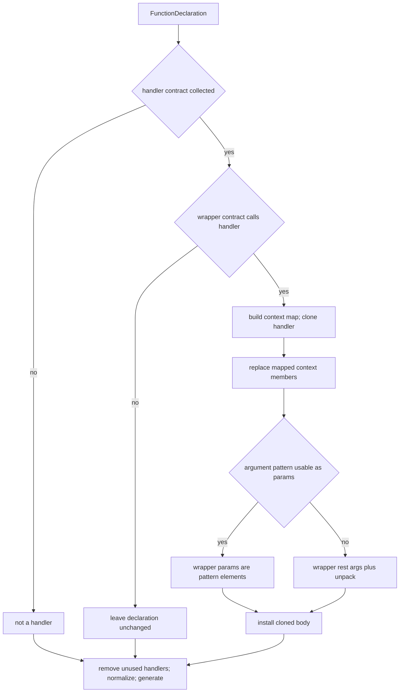

# Flatten context inlining

Evidence label: `source-inspection only`.

This page documents the one solution-level transform implemented by the pinned
`Flatten/flatten.js`: recognize a generated context wrapper and its handler, inline the handler
body into the wrapper, substitute context accessors and forwarded methods, promote the handler's
argument unpacking, remove unused handler declarations, and normalize valid string-key syntax. The
page describes source-backed behavior only. The retained sample, output, notes, and tests do not
establish runtime equivalence, transfer, reproduction, or production decoder coverage.

## 1. Target

The input is a Babel script AST. A handler candidate is a named function declaration with no formal
parameters, a non-empty body, and a first statement that is one variable declaration of the exact
form `[contextIdentifier, argsArrayPattern] = arguments`. The destructuring is read from the
`VariableDeclarator` AST; the handler matcher does not validate the rest of the body
([`getHandlerInfo`](https://github.com/MichaelXF/claude-vs-js-confuser/blob/e90be6ca716e28f4bba91fe39615a665656bd802/Flatten/flatten.js#L114-L140)).

For a collected handler, a wrapper candidate is a function declaration with exactly one rest
parameter, exactly two body statements, a single-declarator object-expression declaration, and a
return statement calling a named collected handler with the context object and the wrapper's rest
array. The wrapper and handler relationship is matched by identifier name, not binding identity
([`getWrapperInfo`](https://github.com/MichaelXF/claude-vs-js-confuser/blob/e90be6ca716e28f4bba91fe39615a665656bd802/Flatten/flatten.js#L142-L189)).

The solution-level output keeps the wrapper declaration and replaces its body with a cloned handler
body. Context-member reads become getter return expressions, context-member assignment/update
targets become setter targets, and context methods forwarded through a rest parameter become
direct callees. The handler's unpacked argument array is removed and its pattern elements become
wrapper parameters when the pattern is representable directly; otherwise a generated rest
parameter and a new unpack declaration preserve the pattern. Unreferenced collected handler
declarations are removed, and valid computed string keys are normalized to noncomputed syntax.

## 2. Algorithm

The transform has one page because the wrapper contract, context map, handler clone, argument
promotion, and cleanup form one dependent algorithm. The wrapper's object literal supplies the
substitution map, while the handler's argument pattern determines the wrapper's callable interface.

1. **Parse and collect handler records.** Parse script source with the optional-catch-binding
   plugin. Traverse all function declarations and retain a record for each named function matching
   the handler unpack contract. Each record stores the handler node, the context binding name, and
   the array pattern that was unpacked from `arguments`
   ([`collectHandlers`](https://github.com/MichaelXF/claude-vs-js-confuser/blob/e90be6ca716e28f4bba91fe39615a665656bd802/Flatten/flatten.js#L337-L351)).

2. **Recognize a wrapper and its exact call contract.** During a second function-declaration
   traversal, skip declarations whose names are in the handler map. For every other declaration,
   require one rest identifier, a two-statement body, an object-expression variable declaration,
   and a return call of a collected handler receiving exactly that context variable and rest
   identifier. A failed check leaves the declaration out of the inlining path
   ([`getWrapperInfo`](https://github.com/MichaelXF/claude-vs-js-confuser/blob/e90be6ca716e28f4bba91fe39615a665656bd802/Flatten/flatten.js#L142-L189)).

3. **Build the context substitution map.** Inspect only `ObjectMethod` properties of the wrapper's
   object expression. Resolve identifier, string-literal, and numeric-literal keys to strings.
   For each key, collect any source-backed entry that matches:

   - a getter with exactly one return statement, whose return expression is the getter replacement;
   - a setter with one identifier parameter and an expression statement assigning that parameter
     directly on the right-hand side, whose left-hand side is the setter target; or
   - a method with one rest identifier and exactly one returned call whose sole argument is a spread
     of that same rest identifier, whose callee is the forwarded method replacement.

   Entries for one key are merged into one map record, so a key may carry getter, setter, and method
   information. Any property or method body that does not satisfy its narrow form contributes no
   entry ([`buildContextMap` and map helpers](https://github.com/MichaelXF/claude-vs-js-confuser/blob/e90be6ca716e28f4bba91fe39615a665656bd802/Flatten/flatten.js#L7-L111)).

4. **Clone the handler and substitute bound context members.** Deep-clone the collected handler
   function into a temporary file AST so Babel can provide a fresh scope. Resolve the cloned
   handler's context binding and inspect only member expressions whose object identifier resolves
   to that binding. For a mapped key, apply the first applicable context-use rule:

   - when the member is the callee of a call and a forwarded method exists, replace the callee only;
     the original call arguments remain;
   - when the member is an assignment or update target and a setter exists, replace the target only;
   - otherwise, replace a mapped getter read with the getter expression; or
   - if no getter applies but a method entry exists, replace the member with its direct callee.

   An unmapped key or a member belonging to a different binding is left in the cloned body
   ([`isContextMember`, `replacementForMember`, and the clone traversal](https://github.com/MichaelXF/claude-vs-js-confuser/blob/e90be6ca716e28f4bba91fe39615a665656bd802/Flatten/flatten.js#L191-L223), [`inlineHandler`](https://github.com/MichaelXF/claude-vs-js-confuser/blob/e90be6ca716e28f4bba91fe39615a665656bd802/Flatten/flatten.js#L252-L284)).

5. **Remove the handler unpack and promote arguments.** Remove the first top-level variable
   declaration in the cloned handler that destructures `arguments`. If the handler's argument
   pattern has only supported pattern elements, assign its non-hole elements directly as the
   wrapper's parameters. If it contains another element form, generate a wrapper-scoped uid as a
   rest parameter and prepend a variable declaration that destructures that rest parameter with the
   original pattern. With an empty pattern, give the wrapper no parameters. Append the cloned
   handler body to the wrapper and install that block as the wrapper body
   ([`removeHandlerArgumentUnpack`, `canUsePatternAsParams`, and parameter/body installation](https://github.com/MichaelXF/claude-vs-js-confuser/blob/e90be6ca716e28f4bba91fe39615a665656bd802/Flatten/flatten.js#L225-L308)).

6. **Clean declarations and normalize syntax.** Re-crawl the program scope and remove each
   collected handler only when its fresh binding is unreferenced and still a function declaration.
   Finally, traverse the whole AST and convert computed string-literal member properties and object
   property keys to identifiers when Babel accepts the string as a valid identifier. The result is
   always generated as code, regardless of whether any wrapper was recognized
   ([`removeUnusedHandlers`, `normalizeSyntax`, and generation](https://github.com/MichaelXF/claude-vs-js-confuser/blob/e90be6ca716e28f4bba91fe39615a665656bd802/Flatten/flatten.js#L310-L398)).

The non-linear decision flow is:

The diagram's collection, wrapper gate, map, clone, parameter branch, cleanup, and generation
edges correspond to the cited implementation spans above; it is not an empirical execution trace.

## 3. Implementation

| Phase | Source anchor | Ownership | Representation and material behavior |
| --- | --- | --- | --- |
| Key and method-shape helpers | [`propertyName`, `getSingleReturnExpression`, `getSetterTarget`, `getForwardedCallee`](https://github.com/MichaelXF/claude-vs-js-confuser/blob/e90be6ca716e28f4bba91fe39615a665656bd802/Flatten/flatten.js#L7-L65) | Owned algorithm helpers | Keys accept identifier/string/numeric forms. Getters require one return statement; setters search expression statements for `target = parameter`; methods require a rest parameter and one call returning a spread of that parameter. |
| Context map | [`addMapEntry`, `buildContextMap`](https://github.com/MichaelXF/claude-vs-js-confuser/blob/e90be6ca716e28f4bba91fe39615a665656bd802/Flatten/flatten.js#L67-L111) | Owned algorithm | A `Map` keyed by normalized property name stores independent getter, setter, and method fields; unsupported object properties are ignored. |
| Handler admission | [`getHandlerInfo`](https://github.com/MichaelXF/claude-vs-js-confuser/blob/e90be6ca716e28f4bba91fe39615a665656bd802/Flatten/flatten.js#L114-L140) | Owned target recognition | The `arguments` initializer must be an identifier named `arguments`; the first destructuring elements must be context identifier and nested array pattern. |
| Wrapper admission | [`getWrapperInfo`](https://github.com/MichaelXF/claude-vs-js-confuser/blob/e90be6ca71615a665656bd802/Flatten/flatten.js#L142-L189) | Owned target recognition | Exactly one rest parameter, two statements, one object declaration, and one two-argument return call are required; the handler is looked up by callee name. |
| Context-member replacement | [`isContextMember`, `isAssignmentOrUpdateTarget`, `replacementForMember`](https://github.com/MichaelXF/claude-vs-js-confuser/blob/e90be6ca716e28f4bba91fe39615a665656bd802/Flatten/flatten.js#L191-L223) | Owned algorithm | The cloned handler's context object is binding-checked. Calls preserve call arguments; assignments/updates preserve the operation while replacing the target; reads use getter/method clones. |
| Clone and argument promotion | [`inlineHandler`](https://github.com/MichaelXF/claude-vs-js-confuser/blob/e90be6ca716e28f4bba91fe39615a665656bd802/Flatten/flatten.js#L252-L308) | Owned AST mutation | The wrapper body is replaced with cloned handler statements. Direct parameter promotion is preferred; the generated-rest fallback retains a destructuring declaration. |
| Handler collection and cleanup | [`collectHandlers`, `removeUnusedHandlers`](https://github.com/MichaelXF/claude-vs-js-confuser/blob/e90be6ca716e28f4bba91fe39615a665656bd802/Flatten/flatten.js#L337-L366) | Shared coordinator for traversal; transform owns handler lifecycle | Handler records are collected once before wrapper rewriting; a fresh program scope decides whether each original declaration is still referenced. |
| Syntax normalization and emission | [`normalizeSyntax`, `deobfuscate`, `flatten`](https://github.com/MichaelXF/claude-vs-js-confuser/blob/e90be6ca716e28f4bba91fe39615a665656bd802/Flatten/flatten.js#L310-L423) | Shared coordinator for parse/I/O/generation; transform owns its normalization step | Valid computed string keys become identifier syntax. Generation removes comments and uses minimal escaping even when no wrapper is transformed; optional output writing is file-interface plumbing. |

The parser is configured for scripts with `optionalCatchBinding` and no
`allowReturnOutsideFunction` override ([`deobfuscate` parse](https://github.com/MichaelXF/claude-vs-js-confuser/blob/e90be6ca716e28f4bba91fe39615a665656bd802/Flatten/flatten.js#L368-L397)). The file wrapper reads UTF-8, optionally writes the generated output, exports both the file function and
the `.deobfuscate` property, and the CLI requires an input path while allowing output to be
omitted ([`flatten` and CLI wiring](https://github.com/MichaelXF/claude-vs-js-confuser/blob/e90be6ca716e28f4bba91fe39615a665656bd802/Flatten/flatten.js#L400-L423)).

## 4. Upstream Effects

This experiment is a standalone script transform, so it has no earlier decoder pass whose AST
output it consumes. Its upstream state is the Babel parse and the binding graph built for the
original AST. `inlineHandler` deliberately clones the handler into a fresh one-function file before
traversing it, then uses the cloned context binding to avoid replacing same-spelled identifiers
from unrelated scopes. `removeUnusedHandlers` performs a new program scope crawl after wrapper
mutation before deciding whether the original declaration can be removed.

The transform does not expose a second decoder pass or a fixed-point scheduler. All collected
handlers are identified before wrapper traversal, and the source contains no explicit repeat after
inlining or normalization. Any later transformation would therefore receive generated code, with
unmapped context members and unsupported wrapper/handler shapes still present.

## 5. Known Gaps

- Handler admission is deliberately narrow but incomplete: it checks only the no-parameter,
  first-declaration unpack shape. It does not prove that all later context accesses are mapped or
  that the handler has no side effects beyond the cloned body.
- Wrapper admission requires exactly two statements and a simple object declaration/return call.
  Wrappers with setup statements, multiple declarations, alternate return forms, indirect calls,
  or a different argument arrangement are declined by the inlining path.
- Handler and wrapper association is name-based. A shadowed handler name or a same-spelled local
  binding can be accepted despite not referring to the collected declaration; the wrapper matcher
  does not perform the binding-identity check used for context members.
- Context keys are accepted from identifier, string, and numeric property forms, but computed or
  otherwise unsupported keys are ignored. Duplicate keys are merged field-by-field, so the map does
  not prove which source property would win at runtime.
- Getter, setter, and forwarded-method recognition is syntactic. Setter targets are returned from a
  name comparison to the setter parameter, not a binding comparison. A mapped member with no
  applicable setter can fall through to getter/method replacement even when it appears in an
  assignment/update position. A method property used as a value is replaced with its callee even
  outside a call.
- Only context-member objects bound to the cloned handler's unpacked context variable are
  substituted. Unmapped context members remain in the output, and the page does not claim that
  remaining context machinery is recoverable by another pass.
- The direct parameter branch filters pattern holes; the fallback branch is used for any unsupported
  pattern element. No empirical check here proves the changed parameter arity and destructuring
  preserve every JavaScript calling convention, `this` behavior, default evaluation, or closure
  interaction.
- Collected handler records are built once and the source has no explicit fixed-point re-collection.
  Newly exposed or newly synthesized wrapper forms are not guaranteed to receive another inlining
  round. A handler remains if any fresh program reference survives, even if that reference is a
  residual or unsupported use.
- `normalizeSyntax` changes all valid computed string member/property syntax across the program,
  not only syntax introduced by this transform. It has no special-case safety proof for object keys
  whose computed and noncomputed forms have different JavaScript semantics, such as `__proto__`.
  `deobfuscate` always regenerates code with comments removed, so a non-match is not a byte-preserving
  file-level decline.
- Parse, read, write, and generator failures propagate. Missing CLI input prints usage and exits
  with status 1; output-path omission is accepted by the file wrapper. The source description does
  not establish behavior or transfer.

## Source

The complete owned implementation is the pinned
[Flatten/flatten.js](https://github.com/MichaelXF/claude-vs-js-confuser/blob/e90be6ca716e28f4bba91fe39615a665656bd802/Flatten/flatten.js). Its helper and map spans are L7-L111, handler/wrapper recognition is
L114-L189, context replacement is L191-L223, clone and argument promotion is L225-L308,
normalization is L310-L335, collection/cleanup is L337-L366, and parse/generation/CLI wiring is
L368-L423. The sample shape is also recorded in
[Flatten/NOTES.md](https://github.com/MichaelXF/claude-vs-js-confuser/blob/e90be6ca716e28f4bba91fe39615a665656bd802/Flatten/NOTES.md); the intended CLI and test contract is in
[Flatten/README.md](https://github.com/MichaelXF/claude-vs-js-confuser/blob/e90be6ca716e28f4bba91fe39615a665656bd802/Flatten/README.md).

## Fixtures

The fixtures and outputs below map the supplied sample inputs, outputs, controls, and test intent.
They do not establish behavioral, transfer, reproduction, or production evidence.

| Pinned file | Claim it pins |
| --- | --- |
| [`input.js`](https://github.com/MichaelXF/claude-vs-js-confuser/blob/e90be6ca716e28f4bba91fe39615a665656bd802/Flatten/input.js) | The supplied flattened game sample: handler argument unpacking, getter/setter context fields, forwarded methods, and rest-argument wrappers. |
| [`output.js`](https://github.com/MichaelXF/claude-vs-js-confuser/blob/e90be6ca716e28f4bba91fe39615a665656bd802/Flatten/output.js) | Intended generated shape with wrapper bodies containing direct state accesses/calls and normalized member syntax. |
| [`regular.js`](https://github.com/MichaelXF/claude-vs-js-confuser/blob/e90be6ca716e28f4bba91fe39615a665656bd802/Flatten/regular.js) | The intended non-flattened control input; the artifact is pass-through provenance. |
| [`test.js`](https://github.com/MichaelXF/claude-vs-js-confuser/blob/e90be6ca716e28f4bba91fe39615a665656bd802/Flatten/test.js) | Intended assertions for wrapper inlining, promoted parameters, normalized syntax, regular input, and arbitrary names; no validation result is claimed. |
