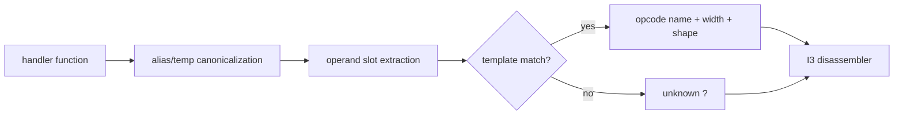

# Handler classification

Evidence label: source-inspection only.

## 1. Target

This boundary maps extracted inner VM handler functions to canonical operation templates. It first
normalizes temporary register/frame/constant aliases and turns `this.ad(...)` operand reads into
stable operand slots. A template is accepted only when the canonical handler shape matches it;
unknown shapes remain `?`.

The input is I1's handler map and the machine's runtime conventions. The output is an opcode table
that preserves handler name, canonical shape, operand count, and operand order for I3.

## 2. Algorithm

1. Clone each handler and canonicalize aliases for the machine object, frame pointer, constant
   base, and temporary variables for bounded rounds.
2. Fold single-use temporaries and replace operand-reader calls with stable `@n` slots.
3. Match ordered templates for jumps, conditional jumps, returns/throws, register moves and
   constants, property/global/cell operations, calls/new/closures, collections, exceptions,
   for-in, arithmetic/unary, debugger, and decrypt operations.
4. Record the first complete match and its operand shape. If no template matches, record `?` as a
   table entry; disassembly can still advance using the counted stream slots, while downstream
   unsupported behavior remains visible.

## 3. Implementation

| Ownership | Concrete behavior and state |
|---|---|
| **Owned algorithm** | `shapeOf` performs cloning, `this.ad` slot tagging, alias normalization, bounded temporary folding, and canonical source generation. The template table describes fixed and variable operation shapes. `classify` tries templates in order and preserves `?` for misses. |
| **Shared coordinator** | `buildOpcodeTable` maps each extracted handler to a table entry and supplies it to I3. `devirtualize` gathers unknown-handler warnings and decides whether a later candidate can still be accepted. |
| **Delegated helper** | `bind` substitutes operand slots during disassembly; I1 supplies handler functions and I3 owns cursor/width consumption. |

The classification invariants are complete-match and positional fidelity: a handler is not assigned
an operation from a partial prefix or a function name, and its operand slots retain the order that
the runtime handler reads. Unknown is an explicit representation, not a default opcode.

## 4. Decoder Upstream Effects

I1 is the sole producer of the handler map. This page produces I3's opcode/template table, which
determines instruction widths and variable-operand readers. A `?` entry remains a recognized table
entry with its counted stream slots, so I3 may advance through it; later lifting and validation
still expose that unsupported shape.

The pinned producer's canonical instruction set is useful comparison context for fixed operation
roles. Optional producer transformations can add specialized, macro, aliased, shuffled, or
handler-table forms; this corpus classifier does not infer those forms merely because the producer
has them.

## 5. Known Gaps

- The canonicalizer supports its bounded alias/temp patterns; nested/dynamic aliases, unexpected
  helper calls, or new handler prologues can become unknown.
- The first template match wins, so template order is part of the contract and must be source-checked
  when adding a new overlapping template.
- Unknown handlers may leave a partially reconstructed function or force V1 fallback; they are not
  safe to reinterpret by opcode position.
- There is no empirical transfer claim for optional producer runtime transforms.

## Source

- [devirt.js handler canonicalization and templates (e90be6c)](https://github.com/MichaelXF/claude-vs-js-confuser/blob/e90be6ca716e28f4bba91fe39615a665656bd802/VM-2/devirt.js#L164-L476)
- [devirt.js opcode table construction (e90be6c)](https://github.com/MichaelXF/claude-vs-js-confuser/blob/e90be6ca716e28f4bba91fe39615a665656bd802/VM-2/devirt.js#L482-L492)
- [Pinned producer operation definitions (20c5b96)](https://github.com/MichaelXF/js-confuser-vm/blob/20c5b96bf57337c568579352758d7685358650de/src/compiler.ts#L56-L159)

## Fixtures

No dedicated fixture isolates I2. The corpus handler table is sample-specific; exact handler
coverage is not claimed from source inspection.
