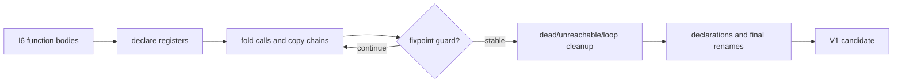

# Inner cleanup

Evidence label: source-inspection only.

## 1. Target

This boundary normalizes generated inner functions after control structuring. It targets generated
register declarations, method-call artifacts, short copy chains, one-use temporaries, pure dead
stores, unreachable statements, noncanonical loop labels, unused expression results, declaration
placement, and generated register names. It must preserve calls, constructors, side effects,
function boundaries, and the candidate's ability to be rejected by V1.

The input is I6 structured/fallback function bodies plus function metadata. The output is a cleaned
candidate source/AST; it is not the acceptance decision.

## 2. Algorithm

1. Declare registers and captured `cN`/`rN` names used by each body.
2. Fold exact receiver patterns such as `obj.method.call(obj, args)` into method calls.
3. Run copy propagation and one-use temporary inlining to a bounded fixpoint. Calls, `new`, names,
   updates, and other interference stop propagation.
4. Remove pure unreferenced stores, unreachable suffixes, unused expression results, and trailing
   `return undefined` where the source contract permits.
5. Normalize canonical while-loop forms and merge declarations. Rename remaining `rN` names to
   `vN` only at the final stage.

## 3. Implementation

| Ownership | Concrete behavior and state |
|---|---|
| **Owned algorithm** | `cleanup` defines the order and guards. `declareRegisters`, `foldMethodCalls`, `copyPropagate`, `inlineTemporaries`, `dropUnreachable`, `normaliseLoops`, `dropUnusedResults`, `mergeDeclarations`, and `dropDeadStores` implement the listed AST mutations. Purity/interference checks control removal and propagation. |
| **Shared coordinator** | `devirtualize` assembles functions, appends the main call, invokes cleanup, and returns candidate code/stats. V1 decides whether that code replaces the original machine. |
| **Delegated helper** | I6 supplies structured/fallback bodies; the parser/generator boundary supplies AST traversal. I7 does not reopen instruction classification or disassembly. |

The cleanup invariant is non-interference: only pure, unreferenced, or locally proven-safe values
are removed or propagated. Copy propagation is bounded per pass and the overall sequence has a
guard, so cleanup cannot become an unbounded optimizer.

## 4. Decoder Upstream Effects

I6 is the sole producer of the inner function body consumed here. I7 produces the candidate source
passed to V1. The outer cleanup page is a separate boundary: it cannot delete inner registers, and
this page cannot infer outer dispatcher semantics from generated names.

If a pass sees calls, constructors, updates, name escapes, or unknown purity, it retains the
statement. A retained temporary is preferable to a rewritten side effect; V1 can reject a less
readable candidate without corrupting the original VM.

## 5. Known Gaps

- Cleanup is limited to local syntax and does not prove whole-program equivalence.
- The fixed-point guards can leave copy chains, dead stores, labels, or declarations in output.
- Dynamic property effects, aliasing, getters/setters, host calls, and unusual declaration scopes
  block the corresponding simplification.
- No empirical transfer claim is made for generated bodies from another register VM.

## Source

- [devirt.js devirtualization assembly and cleanup order (e90be6c)](https://github.com/MichaelXF/claude-vs-js-confuser/blob/e90be6ca716e28f4bba91fe39615a665656bd802/VM-2/devirt.js#L1472-L1559)
- [devirt.js cleanup passes and purity guards (e90be6c)](https://github.com/MichaelXF/claude-vs-js-confuser/blob/e90be6ca716e28f4bba91fe39615a665656bd802/VM-2/devirt.js#L1561-L1874)

## Fixtures

No maintained fixture isolates this cleanup pass; it consumes sample-specific reconstructed inner
functions from upstream recovery.
