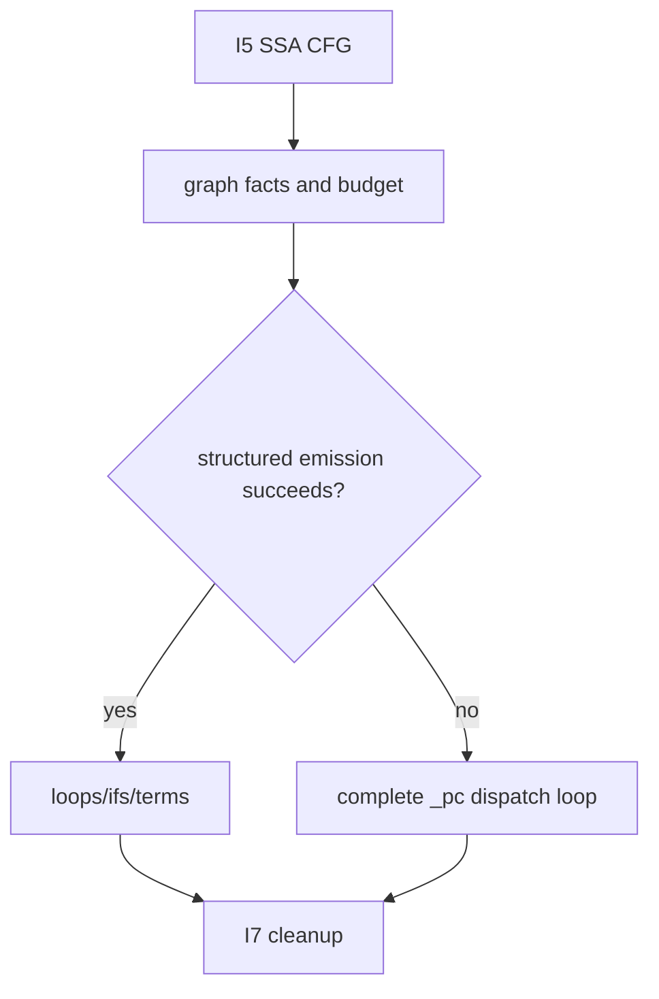

# Inner control structuring

Evidence label: source-inspection only.

## 1. Target

This boundary converts I5 SSA-lifted blocks into readable inner function control flow. It uses
dominators, postdominators, natural loops, and known edge terms to emit loops, branches,
`continue`, `break`, return, and throw. When that graph cannot be safely structured within its
budget, it emits a complete dispatch loop with `_pc` and a switch rather than partially rewriting
the function.

The input is an SSA-lifted CFG; the output is either structured statements or the explicit
dispatch-loop fallback.

## 2. Algorithm

1. Compute reverse postorder, predecessor maps, dominators, postdominators, and natural loops.
2. Set the structure budget to `max(400, blocks * 4)` and the sequence emission guard to 5,000
   steps.
3. Emit structured sequences. Loop headers become loops, back edges become `continue`, loop exits
   become `break`, and postdominator merges become branch joins.
4. Preserve return/throw/end terms and their values. Detect duplicate emission or ambiguous edges.
5. On the explicit structure-budget exhaustion, emit `var _pc = entry; _dispatch: while (true)
   switch (_pc) { ... }`. Each fallback edge writes the target `_pc` and continues; terminal terms
   return/throw/end explicitly. The source's step cap, duplicate-block accounting, and missing-edge
   cases are conservative limits but do not all trigger this fallback.

## 3. Implementation

| Ownership | Concrete behavior and state |
|---|---|
| **Owned algorithm** | `structure` computes region facts and chooses structured emission; its `emitSeq` and term logic preserve edge targets. `dispatchLoop` is the fallback representation used when the explicit budget aborts and enumerates the reachable blocks with explicit `_pc` transitions. |
| **Shared coordinator** | `devirtualize` invokes structuring after I5 and records warnings; V1 later decides whether either output can replace the original machine. |
| **Delegated helper** | RPO, predecessor, dominator, postdominator, and natural-loop calculations provide graph facts to the emission logic. I4/I5 provide terms and names; I7 handles only cleanup. |

The key invariant is total edge coverage for the explicit dispatch fallback: it maps every reachable
block in the lifted map to a switch case. Structured emission maps known edges where its region logic
can do so; a missing successor can instead stop emission, and duplicate blocks are counted rather
than automatically rejected. No unknown terminator is intentionally translated into a fall-through
return, but `end` is emitted as a null return in the fallback representation.

## 4. Decoder Upstream Effects

I5 is the sole producer of the SSA-lifted CFG consumed here. I6 produces function bodies for I7
cleanup and for the final inner candidate. Its fallback is intentionally still a reconstruction
contract, not an admission that a random `_pc` loop is equivalent without V1 validation.

The page must preserve function metadata and entry identity so the final `__main` and closure
functions remain connected. Cleanup may normalize the fallback only after the edge semantics are
explicit.

## 5. Known Gaps

- Irreducible, ambiguous, or unusually large graphs may be partially emitted; only explicit budget
  exhaustion is source-backed as a dispatch-fallback trigger.
- The finite budget and step cap bound analysis; the step cap can stop sequence emission without
  selecting the dispatch fallback, and neither bound proves minimality or universal CFG coverage.
- Unknown successor/term semantics remain conservative and can force V1 rejection.
- No empirical transfer claim is made for other inner VM control encodings.

## Source

- [devirt.js inner structure, loop/merge emission, and dispatch fallback (e90be6c)](https://github.com/MichaelXF/claude-vs-js-confuser/blob/e90be6ca716e28f4bba91fe39615a665656bd802/VM-2/devirt.js#L1153-L1435)
- [devirt.js graph support used by inner structure (e90be6c)](https://github.com/MichaelXF/claude-vs-js-confuser/blob/e90be6ca716e28f4bba91fe39615a665656bd802/VM-2/devirt.js#L1441-L1470)

## Fixtures

No dedicated fixture isolates I6. It consumes the sample-specific inner function graph emitted
by upstream recovery.
