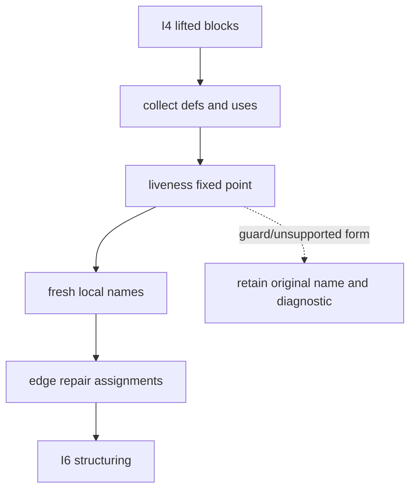

# Local SSA

Evidence label: source-inspection only.

## 1. Target

This boundary gives I4's lifted register-like values unambiguous local names. A definition is a
plain assignment to a machine register identifier; uses occur in statements, return/throw values,
and branch conditions. The input is a lifted block map and its edge fixes. The output is fresh
block-local names and explicit repair assignments for values that remain live across an outgoing
edge.

This is local SSA-like renaming, not a claim of full dominance-based SSA for arbitrary JavaScript.
Its discriminator is the supported register assignment/use syntax produced by I4.

## 2. Algorithm

1. Walk statements, terms, and edge conditions to collect definitions and uses for each block.
2. Run backward liveness to a fixed point, bounded by `blocks.size + 8` iterations.
3. Rename each definition to a fresh `rN_uid` name and rewrite uses to the reaching local version;
   function parameters and non-register names remain untouched.
4. For each outgoing edge, append assignments that repair values which are live-out and required by
   the successor's register view.
5. Preserve unsupported assignment forms or ambiguous uses for the later structural/fallback
   boundary rather than forcing a rename.

## 3. Implementation

| Ownership | Concrete behavior and state |
|---|---|
| **Owned algorithm** | `localSSA` collects per-block def/use sets, computes backward liveness, renames supported register references, and appends edge repairs. The `edgeFixes` representation carries successor-specific repairs. |
| **Shared coordinator** | `devirtualize` calls local SSA once per lifted function after I4 and before I6; a failure remains visible to the structurer and V1. |
| **Delegated helper** | `walkNodes`, `defOf`, `usesOf`, and register-name predicates define syntax queries. I4 owns expression semantics; I6 owns graph emission. |

The invariant is reaching-name consistency: a renamed use resolves to the local definition on its
path, and a live-out value has a repair on the edge where the successor expects it. Liveness may
lose precision at a join, but it must not invent a value or merge separate functions.

## 4. Decoder Upstream Effects

I4 is the sole producer of the lifted blocks and branch terms consumed here. I5 produces the names
and repairs consumed by I6's loop/branch emission and I7's cleanup. The page must not reopen raw
wordcode or use an outer state-array fact to rename an inner register.

When an AST form is outside the supported query domain, retaining a less-normalized body is safer
than forcing a rename. The liveness loop is bounded by its source guard but does not emit a separate
non-convergence diagnostic; any residual naming/repair problem remains visible to I6 and V1, which
can reject the candidate if it cannot be validated.

## 5. Known Gaps

- Complex destructuring, aliases not emitted by I4, dynamic register names, and unusual AST writes
  are not fully renamed.
- The liveness bound is deliberately finite and silent on non-convergence; it is not evidence that
  every CFG reaches a fixed point under arbitrary graph input.
- Edge repairs increase output and may be cleaned only when I7 proves them safe.
- No empirical evidence is claimed for arbitrary machine CFGs.

## Source

- [devirt.js local SSA and liveness (e90be6c)](https://github.com/MichaelXF/claude-vs-js-confuser/blob/e90be6ca716e28f4bba91fe39615a665656bd802/VM-2/devirt.js#L1010-L1147)

## Fixtures

No dedicated fixture isolates I5. The corpus's inner register names are sample-specific source
inputs; generated SSA output is not used as evidence.
