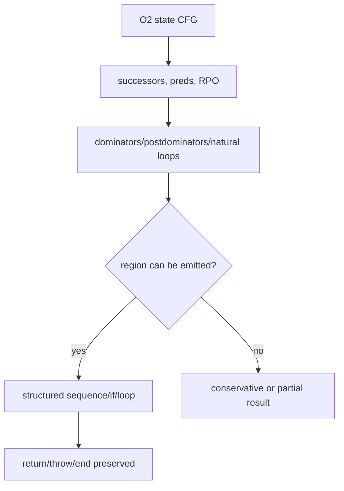

# Outer CFG structuring

Evidence label: source-inspection only.

## 1. Target

This boundary emits structured JavaScript from the O2 state-keyed CFG. Its input is already a
graph with terms and state successors, not raw switch text. Its output preserves return, throw,
end, branch, loop-back, and loop-exit semantics using ordinary statements, `while (true)`,
`break`, `continue`, and labels where needed.

The discriminator is graph structure: successor/predecessor relationships, dominators,
postdominators, and natural loops. It does not accept a graph merely because it has a single entry;
unmergeable or ambiguous regions remain conservative.

## 2. Algorithm

1. Build successor and predecessor maps and compute reverse postorder, dominators, postdominators,
   and natural loops.
2. Create a region context with the current loop header, follow, and exits.
3. Emit a sequence in reverse-postorder, using a 20,000-step guard. A loop header becomes a loop;
   a known loop back edge becomes `continue`; a loop exit becomes `break`.
4. For an `if` term, choose a postdominator merge and emit the two branches. For a direct term,
   follow the edge or route it to the active loop context.
5. Emit returns/throws/end terms directly. If no safe merge or loop route exists, do not fabricate
   a structured edge; the helper may stop the emitted sequence conservatively, leaving V1 to reject
   the resulting candidate rather than treating the partial body as validated.

## 3. Implementation

| Ownership | Concrete behavior and state |
|---|---|
| **Owned algorithm** | `structure` builds the graph facts and region context. `emitSeq` limits sequence emission. `emitTerm` selects branch merges and emits terms. `jumpTo` maps loop headers/exits to `continue`/`break`; `mergeFor` and `emitLoop` choose loop follow points and labeled loops. |
| **Shared coordinator** | O4 `specialise` and O2 `unflattenDispatcher` decide when a concrete CFG is ready and call `structure`; outer `run` emits the returned AST, while V1—not this helper—decides whether an incomplete result is rejected. |
| **Delegated helper** | Reverse-postorder, dominator, postdominator, and natural-loop routines are graph helpers at `termTargets`/the graph-helper span. They provide facts but do not choose source constructs. |

The central invariant is edge preservation: every emitted branch/loop construct is tied to a known
CFG edge, and an edge that cannot be mapped is not silently discarded. Cloned statements are
copies of O2's ordinary statements; structuring does not re-evaluate them.

## 4. Decoder Upstream Effects

O2 is the sole producer of the state CFG and term targets. O4 may call this page while specializing
a concrete trampoline. The resulting structured function feeds O5/O6 string sites and O7 cleanup;
the inner I1 extraction is attempted only after outer dispatch machinery has been removed or
otherwise made readable.

If a graph cannot be fully structured, this source does not claim a generic-function retry at this
boundary; missing targets/merges can leave a conservative or incomplete returned body. V1, not this
page, decides whether the resulting candidate is behaviorally acceptable and can retain the original
dispatcher.

## 5. Known Gaps

- Irreducible graphs, missing terms, and ambiguous merges are not proven to trigger a dedicated
  fallback here; they can stop or duplicate emission. Only the explicit sequence guard is a
  source-backed bounded failure path for this helper.
- The algorithm's loop model is based on natural loops and postdominator merges; unusual computed
  control or multiple interacting entries may remain generic.
- Labels may be emitted for region exits; cleanup can simplify them only after this boundary has
  preserved their targets.
- The source does not provide a transfer fixture for arbitrary state-CFG shapes.

## Source

- [vm.js outer structuring and term emission (e90be6c)](https://github.com/MichaelXF/claude-vs-js-confuser/blob/e90be6ca716e28f4bba91fe39615a665656bd802/VM-2/vm.js#L1302-L1511)
- [vm.js outer graph helpers (e90be6c)](https://github.com/MichaelXF/claude-vs-js-confuser/blob/e90be6ca716e28f4bba91fe39615a665656bd802/VM-2/vm.js#L2390-L2477)

## Fixtures

No dedicated fixture isolates O3. The corpus's state switch supplies the sample role; no exact
structured-output claim is made from NOTES or transient observations.
