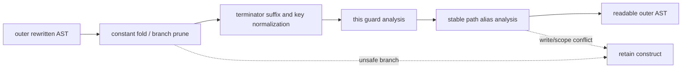

# Outer cleanup

Evidence label: source-inspection only.

## 1. Target

This boundary performs safe readability cleanup after outer specialization, CFG structuring, and
string recovery. It targets constant conditions, unreachable suffix statements, computed property
normalization, unique function-target guards, and repeated stable member paths. It does not claim
that the VM has been removed or that all residual behavior is decoded.

The input is a rewritten outer AST. The output is a cleaned AST only when each local safety test
passes; otherwise the original construct remains.

## 2. Algorithm

1. Fold safe constants and prune literal `if`/conditional branches only when the discarded branch
   is self-contained.
2. Drop statements after a terminating return/throw while preserving declarations whose bindings
   still matter.
3. Normalize computed string property/object keys when the key is valid and unambiguous.
4. Record assignments of paths to functions. Simplify a numeric guard plus target call only when
   there is one target and the function does not use relevant `this`.
5. In each function block, collect repeated deep member prefixes. Insert a temporary only when
   there is no use before the final write and no later write; replace uses and remove unreferenced
   aliases through bounded rounds.

## 3. Implementation

| Ownership | Concrete behavior and state |
|---|---|
| **Owned algorithm** | `postProcess` orders folding, pruning, terminator cleanup, and key normalization. `simplifyThisGuards` tracks path-to-function assignments and conflicts. `aliasScopePaths` computes per-function path counts, checks use/write ordering, inserts `var _s_* = path`, rewrites member objects, and removes unused aliases in up to four rounds. |
| **Shared coordinator** | `run` invokes cleanup after outer passes; `deobfuscateSource` generates the final candidate. The coordinator decides whether the cleaned AST is later presented to V1. |
| **Delegated helper** | O1's `ev` supplies constant folding and `branchIsSelfContained` supplies the pruning safety predicate. O7 consumes these judgments and does not broaden their evaluator domain. |

The cleanup invariants are local and conservative: aliases never cross a later write or function
scope; a dropped branch has no externally visible binding effect according to the self-contained
check; conflicting function targets and unsupported keys stay intact.

## 4. Decoder Upstream Effects

O2/O3/O4 and O5/O6 produce the AST this page consumes. Its output feeds I1 extraction by making the
inner container reachable/readable and feeds V1 as part of the candidate source. O7 must not delete
the original machine merely because residual AST looks cleaner; V1 owns that decision.

If an alias or fold is unsafe, leaving the original expression is the intended fallback. A later
source generator may re-spell nodes, so the implementation must reason over current AST paths and
bindings rather than old source positions.

## 5. Known Gaps

- Dynamic keys, alias paths with writes, scope escapes, non-self-contained branches, and ambiguous
  `this` targets are retained.
- Constant folding is limited to O1's evaluator domain and does not model arbitrary side effects.
- Cleanup guards are bounded and do not guarantee a globally minimal or prettiest output.
- This page has no empirical evidence and does not establish that a clean-looking AST is semantically
  equivalent.

## Source

- [vm.js this-guard and member-path cleanup (e90be6c)](https://github.com/MichaelXF/claude-vs-js-confuser/blob/e90be6ca716e28f4bba91fe39615a665656bd802/VM-2/vm.js#L1960-L2257)
- [vm.js outer pass coordinator and output generation (e90be6c)](https://github.com/MichaelXF/claude-vs-js-confuser/blob/e90be6ca716e28f4bba91fe39615a665656bd802/VM-2/vm.js#L747-L790)
- [vm.js final deobfuscation boundary (e90be6c)](https://github.com/MichaelXF/claude-vs-js-confuser/blob/e90be6ca716e28f4bba91fe39615a665656bd802/VM-2/vm.js#L2483-L2533)

## Fixtures

No dedicated fixture isolates O7. Its claims are structural and source-backed; NOTES output and
transient counts are not used as fixture evidence.
