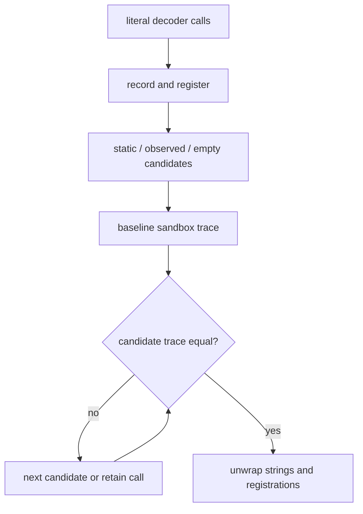

# Outer observed-string recovery

Evidence label: source-inspection only.

## 1. Target

This boundary resolves concealed-string calls after static candidate discovery. An eligible call
has literal arguments and a captured decoder binding; generated `fnN` calls, `this` calls, and
top-level calls are excluded. A replacement is accepted only when the decoder candidate is
conflict-free and the candidate execution has the same recorder trace as the baseline execution.

The input is the outer AST, O5 static candidates, and decoder bindings. The output is an
all-or-nothing AST in which selected recorder calls become string literals and registration
wrappers are removed. If any selected call cannot be justified, the original call remains.

## 2. Algorithm

1. Wrap eligible calls with `__vmjs_rec` and register decoder bindings through `__vmjs_fn`.
2. Build candidate maps in order: static decoder result when available, captured/observed result,
   then an empty candidate. Reject a decoder binding with conflicting values for the same call
   arguments.
3. Evaluate the transformed source in the browser-like sandbox. Record decoder observations and a
   trace of the relevant calls.
4. Clone the AST and evaluate each candidate. Select the first candidate with the same trace and
   compatible string results.
5. Replace recorders with strings, remove registration calls, and restore the surrounding AST only
   after the complete candidate passes. Leave all calls untouched on timeout, exception, conflict,
   native/unknown decoder source, non-string result, or trace mismatch.

## 3. Implementation

| Ownership | Concrete behavior and state |
|---|---|
| **Owned algorithm** | `inlineConcealedStrings` discovers eligible calls, creates recorder/function-registration nodes, builds full/observed/empty maps, checks conflicts, evaluates candidates, and unwraps the selected result. `evaluate` creates a trace result or `null`. |
| **Shared coordinator** | Candidate registration is adjacent to O5's static extraction and O7's post-processing. The run-level `run`/`postProcess` boundary decides when the complete outer AST is available for this pass. |
| **Delegated helper** | `makeSandbox` is a shared safety helper. O6 owns its local string-observation call; V1 owns its whole-program before/after comparison. O1 supplies binding/AST identity but does not own candidate selection. |

The state invariant is all-or-nothing: every wrapper introduced for the attempt is removed or the
candidate is discarded. The same decoder binding plus arguments cannot produce conflicting accepted
strings. A static decoder is a preference and cross-check, not permission to bypass observation.

## 4. Decoder Upstream Effects

O5 produces static decoder candidates and O1 supplies the live binding environment. O6 produces
literal replacements consumed by O7 cleanup. The page may run a bounded sandbox evaluation, but its
result is only a local candidate check; V1 must still validate the whole recovered program before
removing the original VM.

Its sandbox is intentionally browser-like and has no real filesystem, network, or DOM. This limits
the trace domain and must be carried forward as a known safety boundary. It is not permission to
execute arbitrary recovered code outside the prescribed evaluator/sandbox path.

## 5. Known Gaps

- Dynamic decoder arguments, calls hidden under unsupported AST contexts, native/unknown decoder
  functions, and conflicting call observations are retained.
- The trace oracle is bounded to the sandbox's hooks and environment. Equal traces do not prove
  equivalence for unobserved side effects.
- Evaluation timeouts and exceptions are declines, not reasons to relax the candidate grammar.
- The source establishes one VM-2 string shape and does not provide transfer coverage for other
  string concealing mechanisms.

## Source

- [vm.js string candidate discovery and selection (e90be6c)](https://github.com/MichaelXF/claude-vs-js-confuser/blob/e90be6ca716e28f4bba91fe39615a665656bd802/VM-2/vm.js#L1726-L1909)
- [vm.js local evaluation and recorder unwrapping (e90be6c)](https://github.com/MichaelXF/claude-vs-js-confuser/blob/e90be6ca716e28f4bba91fe39615a665656bd802/VM-2/vm.js#L1911-L1957)
- [vm.js browser-like sandbox (e90be6c)](https://github.com/MichaelXF/claude-vs-js-confuser/blob/e90be6ca716e28f4bba91fe39615a665656bd802/VM-2/vm.js#L2267-L2359)

## Fixtures

No dedicated fixture isolates O6. The pinned corpus string decoder and calls provide its sample-
specific source role; only V1 may cite the exact-example/pass-through harness cell.
