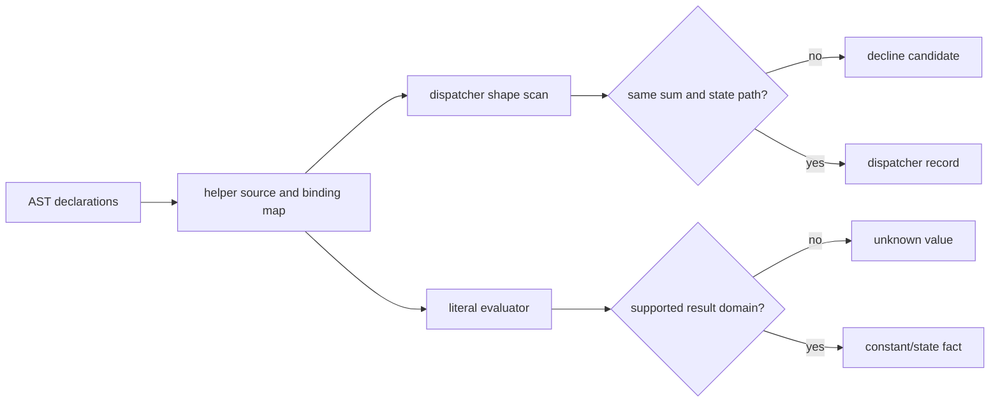

# Outer recognition and evaluation

Evidence label: source-inspection only.

## 1. Target

This boundary identifies the outer VM-2 dispatcher and the small value domain that can be
evaluated without running the program. A dispatcher is accepted only when a `while` test is a
binary `!==` or `!=` whose left side is a call to one identifier sum helper with one argument, the
body contains one switch, and the switch discriminant calls that same helper on the same dotted
state path. The helper call in the test and the discriminant must therefore be the same structural
operation, not merely two calls with the same spelling.

The input is the current AST and top-level helper declarations. The output is dispatcher records,
an evaluated literal/constant result when supported, and an environment used by later outer
passes. Recognition does not itself rewrite the VM.

## 2. Algorithm

1. Walk top-level function and variable declarations. Exclude declarations containing a dispatcher,
   generate their source, and evaluate only the helper namespace required by the decoder.
2. Traverse `while` nodes and identify the sum helper by counting dispatcher-shaped uses. For each
   accepted while/switch pair, record the helper name, dotted state path, exit test, and switch.
3. Discover local dispatcher functions inside function declarations or function-valued variables,
   then discover eligible root dispatcher functions at program scope.
4. Evaluate expressions recursively. Supported forms include literals, selected unary/binary
   operators, short-circuit logical operators, conditional/sequence expressions, arrays/spreads,
   known array members, and calls to identifier-bound helpers without spreads.
5. Return only numbers, strings, booleans, and supported arrays from helper evaluation. Null and
   undefined syntax can be visited, but helper results outside the accepted result domain do not
   become trusted values.

## 3. Implementation

| Ownership | Concrete behavior and state |
|---|---|
| **Owned algorithm** | `asDispatcher` checks the while test, one switch body, the switch discriminant, and the dotted state path. `findSumName` counts matching helper uses. `ev` implements the supported AST evaluator with short-circuiting and caught helper errors. `literalTruth` and the binding collectors support branch and scope decisions. |
| **Shared coordinator** | `buildHelpers` creates the generated helper source and evaluates it with `new Function`; `Deobfuscator` holds helpers, dispatcher records, emitted functions, tuples, arrays, blocked names, and shadowed names. `run` gates the whole outer pipeline on a sum helper and root dispatcher. |
| **Delegated helper** | `pathOf`/`rootOf` identify dotted paths and roots; literal/array readers expose simple values. These helpers do not widen the dispatcher grammar. |

The key invariants are that the state path is paired with the sum call, the helper environment is
not confused with program execution, and an unsupported evaluator result remains unknown. Helper
source evaluation is an explicit execution edge; it is not the same operation as the inert trace
sandbox used later.

## 4. Decoder Upstream Effects

This is the first VM-2 boundary, so it consumes only parsed source and declaration bindings. It
produces the dispatcher record consumed by trampoline specialization and state-CFG recovery. The
record supplies the exit test and switch needed to make a state array a CFG node. Static string
discovery also relies on the same AST/binding environment.

If recognition succeeds, later passes can reason about a concrete state path. If it declines, the
caller must retain the original AST and cannot infer a dispatcher from a name, a comment, or a
similar-looking switch. The downstream inner extraction page is not allowed to treat an
unrecognized outer constructor as a machine container.

## 5. Known Gaps

- The recognizer requires one identifier sum helper and one dotted state path; aliases, computed
  paths, multiple switch bodies, or a different exit comparison are not accepted by this contract.
- `buildHelpers` executes generated helper source and catches failures by returning an empty map;
  this is a safety and provenance boundary, not a general JavaScript evaluator.
- The evaluator does not model arbitrary objects, side effects, host APIs, or unknown calls. A
  result that is semantically constant but outside the implemented domain remains unresolved.
- The source describes one VM-2 corpus era. It does not establish transfer coverage for another
  producer or for renamed/reshaped dispatchers.

## Source

- [vm.js `asDispatcher`, `findSumName`, and evaluator helpers (e90be6c)](https://github.com/MichaelXF/claude-vs-js-confuser/blob/e90be6ca716e28f4bba91fe39615a665656bd802/VM-2/vm.js#L79-L538)
- [vm.js helper construction and dispatcher discovery (e90be6c)](https://github.com/MichaelXF/claude-vs-js-confuser/blob/e90be6ca716e28f4bba91fe39615a665656bd802/VM-2/vm.js#L636-L790)
- [Pinned producer compiler serialization context (20c5b96)](https://github.com/MichaelXF/js-confuser-vm/blob/20c5b96bf57337c568579352758d7685358650de/src/compiler.ts#L2848-L3274)

## Fixtures

No dedicated recognition/evaluation fixture exists. The pinned VM-2 sample supplies the source
shape, while final behavioral claims belong to the V1 validation boundary.
