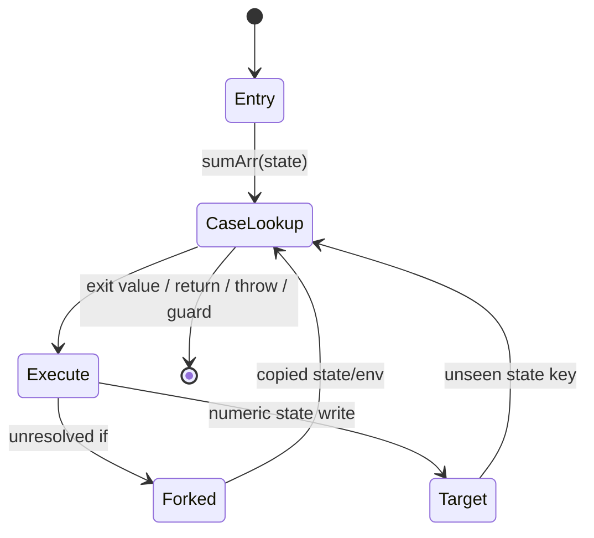

# Outer state-CFG recovery

Evidence label: source-inspection only.

## 1. Target

This boundary turns a recognized concrete outer dispatcher into a state-keyed control-flow graph.
The exit test must evaluate to a number. A CFG node is identified by the numeric key of its state
array, and a case is selected by evaluating the dispatcher sum helper on that array. Only computed
assignments to the current state path with numeric right-hand-side values are state transitions.

The input is an O1 dispatcher record and an O4 specialization environment. The output is a map of
state keys to statements and terms (`goto`, conditional, return, throw, or end), with learned array,
tuple, and trampoline bindings. Unrecognized effects remain ordinary statements.

## 2. Algorithm

1. Seed a queue with the concrete entry array. Deduplicate state keys with `keyOf` and reject a
   graph after 20,000 states.
2. Resolve a state to the first matching switch test, or to the default case, by `sumArr`. Empty
   case labels are included until the first non-empty case body; arbitrary JavaScript fallthrough
   is not modeled.
3. Execute case statements symbolically. Constant conditions select one branch; unresolved
   conditions fork copied state arrays while continuing through the current symbolic environment.
   Nested concrete dispatchers recurse; generic nested dispatchers remain deferred.
4. Learn tuple destructures, array bindings, and trampoline assignments from simple expressions.
5. Apply supported state writes, convert control statements to terms, and enqueue new target states.
6. Rewrite constants and resolvable trampoline calls, then allow the outer coordinator to repeat
   the pass when a newly learned definition changes a call.

## 3. Implementation

| Ownership | Concrete behavior and state |
|---|---|
| **Owned algorithm** | `unflattenDispatcher` checks the numeric exit value. `buildCFG` owns the worklist/state-key guard. `caseFor` handles sum selection and fallthrough. `execStatements` symbolically executes statements and creates terms. `applyStateWrites` recognizes numeric computed state updates. `learnBindings` and `tupleFor` learn representation bindings. |
| **Shared coordinator** | `pass` supplies the root call and environment, resets maps, and repeats outer work. `specialise` supplies concrete state/tuple bindings and invokes this boundary for each memoized function. |
| **Delegated helper** | `registerTrampolines` delegates factory recognition to O4. `rewrite` delegates literal folding to O1 and call rewriting to O4. `gotoTerm` formats exit-versus-state targets. |

The state-array invariant is path-sensitive: branch state arrays are copied before an unresolved
branch, so a state write cannot retroactively mutate the sibling array. The source shares the
symbolic environment object across those branch walks, so learned bindings are not an isolated
per-branch fact and must not be documented as such. Each state key is processed once per CFG
build, and every unsupported statement is preserved so the caller can decline rather than inventing
a transition.

## 4. Decoder Upstream Effects

O1 must bind the sum helper, exit test, switch, and state path. O4 provides the concrete entry
state and tuple. This page produces the exact node/term representation that O3's dominator,
postdominator, and loop analysis consumes. O4 can invoke O2 from specialization, so any newly
learned trampoline registry entry is part of the bounded outer fixed point.

O5/O6/O7 consume the structured/re-written AST after O3 and O4; they must not read the raw state
switch as if it were still the primary representation. If O2 declines, the original dispatcher
remains available to V1 fallback.

## 5. Known Gaps

- Exit tests that are not numeric, state writes with dynamic/indexed values, compound operations
  outside the supported set, and opaque helper side effects do not become CFG edges.
- A state graph over 20,000 keys stops conservatively. Nested generic dispatchers are deferred,
  not recursively executed.
- Switch selection is limited to the recognized case/default grammar and shared empty labels;
  general fallthrough, unusual control transfers, and branch-local environment isolation are not
  established by this source.
- Symbolic execution here is not JavaScript execution and does not establish runtime equivalence.

## Source

- [vm.js state unflattening and CFG worklist (e90be6c)](https://github.com/MichaelXF/claude-vs-js-confuser/blob/e90be6ca716e28f4bba91fe39615a665656bd802/VM-2/vm.js#L1003-L1081)
- [vm.js symbolic statement execution (e90be6c)](https://github.com/MichaelXF/claude-vs-js-confuser/blob/e90be6ca716e28f4bba91fe39615a665656bd802/VM-2/vm.js#L1089-L1210)
- [vm.js state writes and learned bindings (e90be6c)](https://github.com/MichaelXF/claude-vs-js-confuser/blob/e90be6ca716e28f4bba91fe39615a665656bd802/VM-2/vm.js#L1212-L1298)

## Fixtures

No dedicated fixture isolates O2. The sample state pool and sum helper illustrate the source
representation, while exact input/output claims remain confined to the pinned validation harness.
