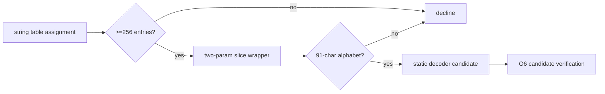

# Outer static-string recovery

Evidence label: source-inspection only.

## 1. Target

This boundary extracts a static decoder candidate from the outer AST. The accepted shape is an
assignment to a string table with at least 256 entries, a two-parameter one-return wrapper that
slices that table, and one inner function containing a 91-character alphabet string. The output is
a decoder-binding -> static candidate map. It is not yet an AST replacement or a proof that every
call site decodes to the same string.

## 2. Algorithm

1. Traverse assignments and identify a large string-table binding.
2. Find a two-parameter wrapper whose return is a slice of that table and which declares one inner
   function.
3. Confirm the inner function contains the expected alphabet literal and capture the binding
   identity, table, and decoder function.
4. Register the candidate for O6 keyed by the decoder binding. A later discovery for the same key
   overwrites the earlier value through `Map.set`; O6 performs its candidate/observed-call checks
   rather than receiving a retained conflict list from this page.

## 3. Implementation

| Ownership | Concrete behavior and state |
|---|---|
| **Owned algorithm** | `buildStaticDecoders` finds the table assignment, wrapper arity/body, inner function, and alphabet. It keys the result by the live decoder binding rather than by text. |
| **Shared coordinator** | O6 `inlineConcealedStrings` registers decoder bindings, performs candidate/observed-call checks, and decides whether a static result is accepted. O7 runs after replacements and may normalize remaining computed keys. |
| **Delegated helper** | Dotted-path and AST binding traversal provide location/identity; O1's evaluator is not used to synthesize arbitrary decoded strings. |

The candidate invariant is provenance: the table, wrapper, inner decoder, and decoder binding remain
one unit. Static extraction is only a candidate preference; O6 must compare a resulting trace and
reject conflicts before unwrapping any call.

## 4. Decoder Upstream Effects

The page consumes the O1-parsed outer AST and its binding environment. It produces the static
candidate representation consumed by O6's candidate order. O6 may prefer the static candidate but
also has observed and empty candidates; O5 must not remove the decoder or call sites itself.

The result can improve O6's determinism without changing the safety boundary: a malformed static
candidate causes O6 to retain the original calls and eventually permits V1 fallback.

## 5. Known Gaps

- The table threshold, two-parameter slice wrapper, inner function, and alphabet are exact shape
  gates; alternate encodings and renamed structural roles are not inferred.
- A static decoder candidate can disagree with an observed decoder or with another call site. It is
  not sufficient evidence by itself.
- No general string-table deobfuscation or arbitrary JavaScript execution is owned here.
- This page documents the VM-2 sample shape only and does not transfer to the pinned producer's
  optional string-concealing implementation without a separate shape audit.

## Source

- [vm.js static decoder discovery (e90be6c)](https://github.com/MichaelXF/claude-vs-js-confuser/blob/e90be6ca716e28f4bba91fe39615a665656bd802/VM-2/vm.js#L1668-L1724)
- [vm.js candidate registration boundary (e90be6c)](https://github.com/MichaelXF/claude-vs-js-confuser/blob/e90be6ca716e28f4bba91fe39615a665656bd802/VM-2/vm.js#L1726-L1800)

## Fixtures

No dedicated fixture isolates O5. The corpus string table and decoder supply sample-specific roles;
exact replacement evidence belongs to the bounded validation cell.
