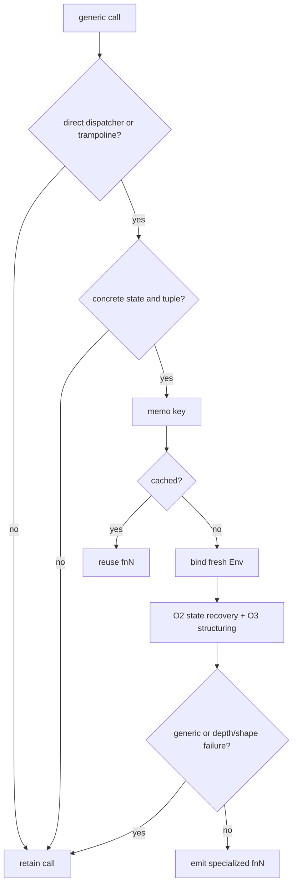

# Outer trampoline specialization

Evidence label: source-inspection only.

## 1. Target

This boundary replaces a resolvable generic outer call with a specialized function for one
concrete dispatcher state and argument tuple. A trampoline factory is accepted only when it is a
rest-parameter function whose body is exactly a return call to a path, whose final call argument is
that rest parameter, and whose preceding arguments are statically array-valued. The target must
probe as a generic dispatcher before specialization is committed.

The input is an O1 dispatcher record plus a call with a concrete first state array and optional
tuple. The output is a memoized emitted `fnN`, a trampoline registry entry, or the unchanged
generic call when the proof is incomplete.

## 2. Algorithm

1. Form a specialization key from dispatcher identity, lexical scope, state-array key, and tuple
   key. Return a previously emitted function for a repeated key.
2. Create a fresh environment and arrays/tuples. Block formal parameters and shadow names that
   would otherwise resolve to the caller's bindings. Bind the concrete state to the dispatcher
   state parameter and the tuple to the final tuple parameter.
3. Unflatten and structure the concrete dispatcher. Emit the specialized function unless the
   result is still generic; generic results are memoized as unresolved rather than guessed.
4. Recognize rest-argument trampoline factories and require the first pre-argument to be a
   concrete array. Probe the target with an unknown tuple so a factory is not mistaken for a
   direct result.
5. Resolve direct dispatcher calls and trampoline paths recursively. Stop at depth 12, and pass
   unresolved calls through to the later AST rewrite.

## 3. Implementation

| Ownership | Concrete behavior and state |
|---|---|
| **Owned algorithm** | `specialise` builds the memo key, fresh `Env`, state/tuple bindings, emitted function name, and generic marker. `asTrampolineFactory` checks the exact rest-return-call grammar. `resolveCall` handles direct/trampoline recursion and the depth cap. `trySpecialiseTrampoline` rewrites resolvable calls and arguments. |
| **Shared coordinator** | `pass` resets per-pass maps/counters, finds the final root call, creates the root environment, specializes it, rewrites other calls, and emits functions. `run` repeats passes up to eight times so discoveries can feed later calls. |
| **Delegated helper** | `callTarget`, `pathOf`, `keyOf`, and `Tuple` provide identity/value keys. O2 owns state execution; O3 owns CFG structuring invoked from `specialise`. |

The specialization invariant is all-or-nothing per key: a `fnN` is tied to one state/tuple
combination and a fresh scope. The registry is updated only from a shape-checked trampoline. A
shadowed path cannot be resolved by text alone.

## 4. Decoder Upstream Effects

O1 supplies the dispatcher identity, sum/exit information, and lexical helper environment. O4
produces the concrete call context consumed by O2 and O3. O2 returns case terms and O3 returns a
structured function body; O4 then exposes emitted `fnN` functions to the outer rewrite and to
later string/cleanup passes.

The O4/O2/O3 relationship is a bounded fixed point. O4 may discover a trampoline while O2 is
executing statements, and `specialise` immediately invokes state recovery/structuring for a
concrete candidate. No page may treat that recursion as an unbounded interpreter or move generic
calls across an unresolved scope boundary.

## 5. Known Gaps

- Non-rest trampolines, computed target paths, non-array pre-arguments, unknown tuple elements, and
  factory bodies with more than the exact return call are retained.
- Recursive trampoline chains stop at depth 12; the original generic call is safer than a partial
  function graph.
- Memoization is per decoder pass and scope; it does not prove equivalence of two state arrays with
  different keys or of two shadowed bindings with the same text.
- The source does not provide a transfer matrix for alternate trampoline naming or layout eras.

## Source

- [vm.js specialization and emission (e90be6c)](https://github.com/MichaelXF/claude-vs-js-confuser/blob/e90be6ca716e28f4bba91fe39615a665656bd802/VM-2/vm.js#L747-L920)
- [vm.js trampoline recognition and call resolution (e90be6c)](https://github.com/MichaelXF/claude-vs-js-confuser/blob/e90be6ca716e28f4bba91fe39615a665656bd802/VM-2/vm.js#L932-L999)
- [vm.js trampoline rewrite (e90be6c)](https://github.com/MichaelXF/claude-vs-js-confuser/blob/e90be6ca716e28f4bba91fe39615a665656bd802/VM-2/vm.js#L1601-L1645)

## Fixtures

No dedicated fixture isolates O4. The corpus's outlined functions and generic trampolines are
sample-specific roles documented by the pinned README; other producers may use different factory
grammars.
