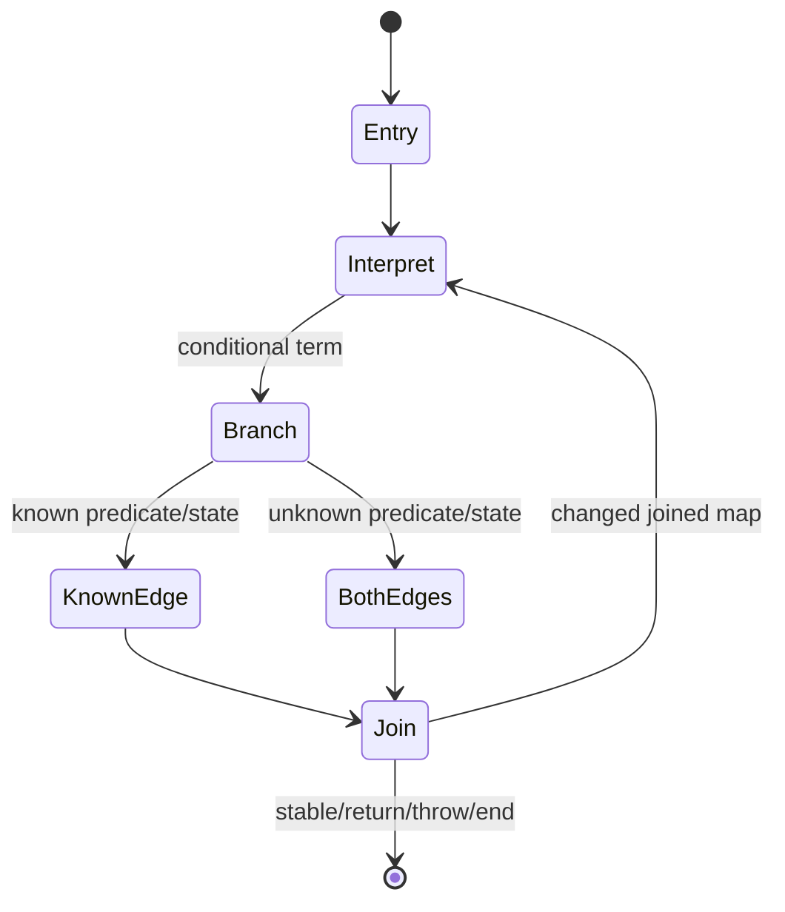

# State-aware lifting

Evidence label: source-inspection only.

## 1. Target

This boundary lifts I3 instructions into a block CFG while tracking values that influence control
state. A state register is a register used in a branch comparison (`===`, `!==`, `==`, or `!=`).
The output is a block map containing lifted statements/terms and a path-sensitive known-register
map for each incoming edge.

The discriminator is a disassembled instruction/CFG shape, not a runtime trace. Known values are
propagated only along the path that established them, and disagreements at joins become unknown.

## 2. Algorithm

1. Collect state registers from branch comparisons and seed the entry block with an empty known map.
2. Interpret instructions into assignments, literals, property operations, calls, new/closure
   expressions, comments for unsupported effects, and control terms.
3. Propagate known register values through unconditional edges and cloned maps through conditional
   edges. A known conditional chooses an edge; an unknown conditional retains both.
4. Join incoming maps: equal values survive, while disagreement or missing information becomes
   `UNKNOWN`. If a later path proves a value, update successor edge fixes and requeue the block.
5. For an unresolved `jmpreg`, emit the source's conservative `{k:"end"}` term rather than a
   symbolic target or diagnostic. Stop an analysis exceeding the 60,000-block guard conservatively.

## 3. Implementation

| Ownership | Concrete behavior and state |
|---|---|
| **Owned algorithm** | `stateRegisters` finds branch-sensitive registers. `joinValue` and `joinInto` implement conservative joins. `analyseFunction` owns the per-block queue, known maps, instruction interpretation, successor fixes, and block guard. `liftFunction` packages the analysis. |
| **Shared coordinator** | `devirtualize` runs lifting for each reachable function after I3 and before SSA/structuring; its warnings influence V1 acceptance. |
| **Delegated helper** | Literal/member/global reference formatting and closure metadata helpers create AST values. I3 owns instruction boundaries; I5 owns renaming; I6 owns control emission. |

The main invariant is monotonic uncertainty: joins may lose a known value but never choose one of
two disagreements. A known state value is valid only on its incoming path. Each block's terminator
is emitted after its effects, and a requeue occurs only when the incoming joined map changes.

## 4. Decoder Upstream Effects

I3 is the sole producer of instruction boundaries, operands, and raw targets. I4 produces lifted
blocks and edge state maps for I5 local SSA and I6 control structuring. I7 may clean the generated
body but must not reinterpret unknown comments as executable semantics.

If I4 cannot resolve a jump register, the source emits a conservative `end` term rather than a
symbolic target; an unsupported instruction shape remains a conservative lifting boundary for
I6/V1. No source page may treat the symbolic known-map as evidence that the inner runtime was
executed.

## 5. Known Gaps

- Unknown dynamic values and unsupported handler effects prevent complete lifting; an unknown jump
  register is ended conservatively rather than retaining a symbolic target, and excessive block
  counts hit the analysis guard.
- The known-value lattice is intentionally small; it is not a general JavaScript abstract
  interpreter and does not model arbitrary aliasing or side effects.
- Conditional joins can become `UNKNOWN` and preserve both branches even when a stronger analysis
  might prove one; conservative output is the intended result.
- This page has no empirical transfer claim for other register-machine producers.

## Source

- [devirt.js state-register collection and lift entry (e90be6c)](https://github.com/MichaelXF/claude-vs-js-confuser/blob/e90be6ca716e28f4bba91fe39615a665656bd802/VM-2/devirt.js#L678-L722)
- [devirt.js path-sensitive function analysis (e90be6c)](https://github.com/MichaelXF/claude-vs-js-confuser/blob/e90be6ca716e28f4bba91fe39615a665656bd802/VM-2/devirt.js#L724-L996)

## Fixtures

No maintained fixture isolates this pass. The corpus's register handlers and branch state are
sample-specific roles supplied by upstream recovery.
