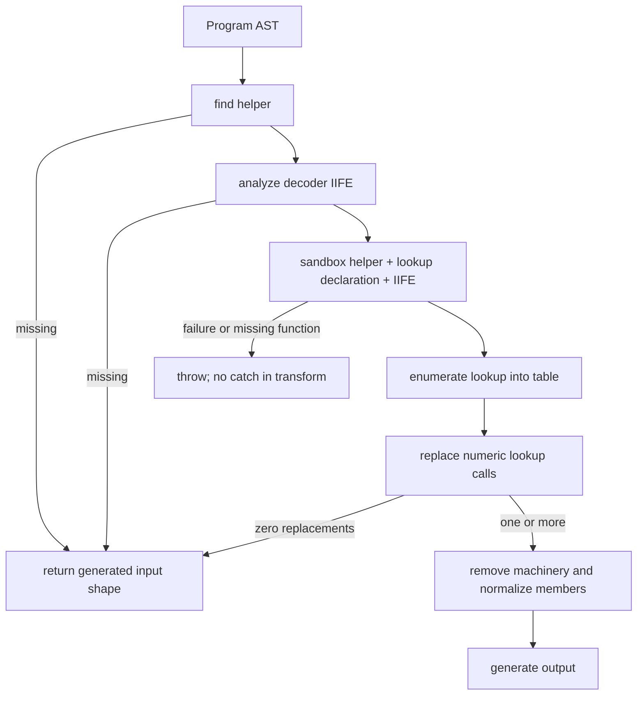

# StringCompression-GPT-5.5: LZ table recovery

Evidence label: `source-inspection only`.

This page owns the distinct transform used by the pinned `StringCompression-GPT-5.5` sample. It
documents the AST recognition, table recovery, literal rewrite, cleanup, and safety boundary of
that source. It does not claim a general LZ-string decoder, transfer qualification, or production
decoder behavior.

## 1. Target

The target is a parseable program with two coordinated top-level structures:

1. A variable declaration whose initializer is a call whose callee is a function or arrow
   expression containing an object property named `decompressFromUTF16`. The declared identifier is
   treated as the helper name by `findLzStringHelper`.
2. A top-level expression-statement IIFE whose body declares a string-valued compressed variable,
   calls `<helper>.decompressFromUTF16(...)`, splits the result on the string literal `"|"`, and
   assigns a one-parameter function that returns the resulting array at that parameter's numeric
   index.

The target discriminator is the complete structural chain, not the generated names: helper
discovery, compressed value, UTF-16 decompression call, pipe split, and one-parameter indexed
lookup. A program without the helper or a matching IIFE is the intended safe-decline neighbor.
The sample source shows the helper at its top level and the compressed-table IIFE at lines 307-316;
those files are provenance, not execution evidence.

## 2. Algorithm

The transform carries a small recovered-state record:

| State field | Meaning | Source owner |
| --- | --- | --- |
| `helperName` | Identifier bound textually to the LZ helper declaration | `findLzStringHelper` |
| `compressedVar` | IIFE variable initialized with a string literal | `analyzeDecoderIife` |
| `utf8Var` | IIFE variable initialized by `helperName.decompressFromUTF16(...)` | `analyzeDecoderIife` |
| `arrayVar` | IIFE variable initialized by `utf8Var.split("|")` | `analyzeDecoderIife` |
| `lookupName` | Identifier assigned a one-parameter indexed lookup function | `analyzeDecoderIife` |
| `table` | Host-side strings returned by `lookupName(0...)` | `decodeTable` |

The solution runs these phases in order:

1. Parse the input into a Babel AST and inspect only top-level program statements for the helper.
2. Inspect top-level expression statements for the decoder IIFE. The analysis accepts either a
   function expression or arrow function as the IIFE callee, but its body must be a block because
   declarations are collected from that block.
3. Generate source for the helper statement, the lookup declaration (or a synthetic `var` when
   no top-level declaration is found), and the decoder IIFE. Execute those fragments together in
   a restricted Node `vm` context. The resulting lookup function is called with indexes starting
   at zero until it returns `undefined`, or until the 10,000-entry safety bound is reached.
4. Traverse the complete AST and replace calls whose callee is an identifier with the discovered
   lookup name, whose argument list has exactly one numeric literal, and whose table entry is
   defined. The replacement is a string literal.
5. If no call was replaced, return the generated AST with metadata indicating no decode. If at
   least one call was replaced, remove the decoder IIFE, the lookup declaration/declarator, a
   matching UMD wrapper, and the helper declaration. Then normalize valid identifier-valued
   computed string member expressions.
6. Emit the AST with comments retained, non-compact formatting, and minimal escaping.

The non-linear control boundary is:

This is table recovery around the sample's existing decompressor, rather than a source-level
reimplementation of the LZ algorithm. The implementation reads the helper's behavior by
execution, and therefore its result depends on the extracted code being safe and complete in the
provided sandbox.

## 3. Implementation

The source ownership and phase anchors are:

| Ownership | Phase and concrete operation | Pinned anchor |
| --- | --- | --- |
| Delegated generic plumbing | Babel parser setup and AST generation | `StringCompression-GPT-5.5.js#parse` lines 11-17; generator lines 341-345 |
| Owned algorithm | Member/call name recognition and helper-property search | `memberName`/`callMemberName` lines 19-29; `hasObjectPropertyKey` lines 45-58 |
| Owned algorithm | Top-level LZ helper discovery | `findLzStringHelper` lines 60-80 |
| Owned algorithm | IIFE declarations, decompression call, split, and lookup-function recognition | `collectVarDeclarators`/`isLookupReturn` lines 82-112; `analyzeDecoderIife` lines 114-176 |
| Owned algorithm with execution edge | AST-to-source extraction, sandbox construction, 1,000 ms context run, lookup enumeration, 10,000-entry bound | `decodeTable` lines 178-218 |
| Owned rewrite | Numeric lookup-call replacement | `replaceLookupCalls` lines 220-236 |
| Owned cleanup | Computed-member normalization and top-level lookup removal | `simplifyComputedStringMembers` lines 238-248; `findLookupDeclaration` lines 250-260; `removeStatementOrDeclarator` lines 262-278 |
| Owned cleanup/coordinator | Heuristic UMD removal and orchestration of recognition, recovery, rewrite, cleanup, and metadata | `maybeRemoveUmd` lines 280-295; `transform` lines 297-347 |
| CLI wrapper | File I/O and command-line entry point; not part of the algorithm | `main`/module export/guard lines 350-364 |

`findLzStringHelper` requires a top-level variable declaration with an identifier and call
initializer, then searches the initializer function body for the property key
`decompressFromUTF16`. `analyzeDecoderIife` walks only variable declarations directly in the IIFE
body. It records the last string-literal initializer as `compressedVar`, then finds the UTF-16
call, the `split("|")` result, and the first assignment matching a one-parameter indexed lookup
function. This source-level ordering is the information dependency that makes table extraction
possible.

`decodeTable` uses Babel-generated fragments rather than the whole program. Its sandbox defines
`module`, `exports`, undefined `define`/`angular`, a no-op `console.log`, and selected built-ins.
It checks that the lookup is a function, pushes stringified results until `undefined`, and throws
on a 10,000-entry non-terminating table. `transform` does not catch any of these errors.

When cleanup is reached, `removeStatementOrDeclarator` deletes either a whole variable declaration
or only the matching declarator. `maybeRemoveUmd` removes an expression statement only when its
generated text contains the helper name and the strings `define`, `module`, and `angular`.
`simplifyComputedStringMembers` then changes any valid-identifier string member from computed to
non-computed form across the entire AST.

## 4. Upstream Effects

This sample is a standalone AST deobfuscator and has no earlier project-local decoder pass. The
generic parser supplies a Babel `Program` tree; the sample-specific transform requires the encoded
helper/IIFE relationship to already be present at the program body's top level. A preceding
normalization that moves those declarations, changes the IIFE into a different statement shape,
or changes the member/call forms can make the transform decline because its recognizers are tied to
those shapes.

The transform's own downstream cleanup changes all valid computed string members after a successful
replacement, not only calls related to the recovered table. The generated output therefore carries
both the algorithmic literal substitutions and a global presentation normalization. No separate
upstream state or decoder-owned binding refresh is implemented in this sample.

## 5. Known Gaps

- Recognition is top-level and name-based. It does not resolve Babel bindings, and
  `replaceLookupCalls` can match a same-spelled identifier in another scope. The helper and lookup
  recognizers likewise compare identifier names rather than binding identity.
- `findLzStringHelper` treats any matching property key inside a candidate initializer as enough;
  it does not prove that the function is the intended LZ implementation. `analyzeDecoderIife`
  similarly accepts the first matching IIFE and does not validate a complete compressor/decompressor
  contract beyond the selected shapes.
- Once one numeric lookup call is replaced, cleanup removes the decoder machinery even if another
  lookup call has a non-numeric argument or an out-of-range/undefined table entry. The unresolved
  call is then left without its lookup definition. This is the first unresolved generalization issue
  from the source pass.
- `decodeTable` executes generated fragments. A thrown helper/IIFE error, a non-function lookup, or
  a table that reaches the 10,000-entry bound propagates out of `transform`; there is no fail-closed
  catch or rollback. The 1,000 ms timeout applies to `vm.runInContext`, while the subsequent lookup
  enumeration is a host-side loop without a separate per-call timeout.
- UMD removal is text-heuristic and can remove a top-level expression statement based on generated
  text containing `define`, `module`, and `angular`, rather than on a fully resolved wrapper shape.
  Computed-member normalization is global and may rewrite unrelated valid string members.
- The supplied output and pass-through files are intended-check/provenance material only. No
  execution, transfer, or production evidence is claimed by this source-inspection page.

## Source

The algorithm source is the pinned
[`StringCompression-GPT-5.5.js`](https://github.com/MichaelXF/claude-vs-js-confuser/blob/e90be6ca716e28f4bba91fe39615a665656bd802/StringCompression-GPT-5.5/StringCompression-GPT-5.5.js)
file. The primary anchors are [helper recognition, lines 45-80](https://github.com/MichaelXF/claude-vs-js-confuser/blob/e90be6ca716e28f4bba91fe39615a665656bd802/StringCompression-GPT-5.5/StringCompression-GPT-5.5.js#L45-L80),
[decoder-IIFE analysis, lines 114-176](https://github.com/MichaelXF/claude-vs-js-confuser/blob/e90be6ca716e28f4bba91fe39615a665656bd802/StringCompression-GPT-5.5/StringCompression-GPT-5.5.js#L114-L176),
[table recovery, lines 178-218](https://github.com/MichaelXF/claude-vs-js-confuser/blob/e90be6ca716e28f4bba91fe39615a665656bd802/StringCompression-GPT-5.5/StringCompression-GPT-5.5.js#L178-L218),
[rewrites, lines 220-248](https://github.com/MichaelXF/claude-vs-js-confuser/blob/e90be6ca716e28f4bba91fe39615a665656bd802/StringCompression-GPT-5.5/StringCompression-GPT-5.5.js#L220-L248),
and [orchestration, lines 297-347](https://github.com/MichaelXF/claude-vs-js-confuser/blob/e90be6ca716e28f4bba91fe39615a665656bd802/StringCompression-GPT-5.5/StringCompression-GPT-5.5.js#L297-L347).
The encoded sample shape is in [`StringCompression.js`](https://github.com/MichaelXF/claude-vs-js-confuser/blob/e90be6ca716e28f4bba91fe39615a665656bd802/StringCompression-GPT-5.5/StringCompression.js#L1-L56)
and [lines 307-320](https://github.com/MichaelXF/claude-vs-js-confuser/blob/e90be6ca716e28f4bba91fe39615a665656bd802/StringCompression-GPT-5.5/StringCompression.js#L307-L320).

## Fixtures

| Pinned file | Intended claim or boundary | Evidence status |
| --- | --- | --- |
| `StringCompression.js` | The sample helper, compressed string, decoder IIFE, and lookup uses have the target shape | Source-fixture provenance and test intent |
| `StringCompression-GPT-5.5.output.js` | Expected transformed form after literal recovery and machinery removal | Generated-output provenance |
| `StringCompression-GPT-5.5.pass-through.input.js` | A regular program lacks the target helper/IIFE shape | Negative-control fixture |
| `StringCompression-GPT-5.5.pass-through.output.js` | Recorded output for the pass-through control | Generated-output provenance |
| `StringCompression-GPT-5.5.test-runner.js` | Intended metadata, output-shape, and behavior assertions | Test-intent provenance |

No fixture in this page establishes same-configuration transfer, runtime equivalence, or production
coverage.
