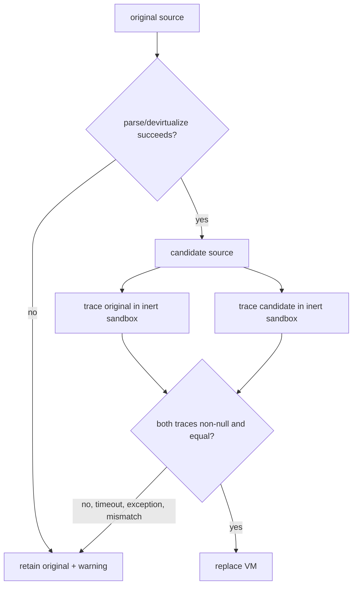

# Validation and fallback

Evidence label: empirical only for the bounded exact-example/pass-through cell already recorded in
the pinned harness; all algorithm and safety claims below are source-inspection only.

## 1. Target

This boundary decides whether a complete recovered candidate may replace the original VM. The
candidate must survive parsing/devirtualization and must have an equal before/after trace in the
prescribed browser-like sandbox. The input is original source, candidate output, diagnostics, and
the sandbox trace. The output is either recovered source or the unchanged original source with the
VM and diagnostics retained.

The discriminator is not "the output looks readable" or "the program runs." It is the complete
acceptance gate: source/devirtualization success, non-null baseline and candidate traces, and trace
equality under the bounded sandbox.

## 2. Algorithm

1. Parse with the configured error-recovery options. On parse failure, return the original source.
2. Run outer and inner devirtualization. Catch failures, attach a warning, and keep the original
   source rather than returning a partial rewrite.
3. If VM removal is requested, run `runTrace` on the original and candidate. The sandbox provides
   browser-like shims, frozen time/random values, and trace hooks while excluding real filesystem,
   network, and DOM access.
4. Accept only when both traces are available and equal. A timeout, exception, trace mismatch, or
   incomplete candidate retains the original VM. Unknown machine pieces and unrecognized handler
   shapes are warned during devirtualization, but the current source does not make every such
   warning a hard V1 rejection; trace/generation outcome still decides.
5. The pinned harness records the bounded exact-example/pass-through cell: it is the empirical
   evidence boundary for this page, not a general coverage matrix.

## 3. Implementation

| Ownership | Concrete behavior and state |
|---|---|
| **Owned algorithm** | `deobfuscateSource` parses, runs the decoder, catches failures, and generates candidate code. `removeVirtualMachine` applies the before/after trace gate. `runTrace` executes the prescribed source in the bounded sandbox and returns a trace or `null`. |
| **Shared coordinator** | All O1-O7 and I1-I7 gates feed V1; their warnings and incomplete results are acceptance inputs. V1 is the only boundary authorized to remove the original VM. |
| **Delegated helper** | `makeSandbox` supplies the browser-like environment and tracing hooks. O6 uses the same helper for local string observation, but only V1 owns the whole-program comparison decision. |

The fallback invariant is all-or-nothing: no failed candidate is partially installed. Trace equality
is a bounded acceptance signal, not a security proof or a universal semantic equivalence proof.
The original VM remains the recoverable artifact whenever a required input or safety condition is
missing; a warning alone is not necessarily that condition in the current implementation.

## 4. Decoder Upstream Effects

Every preceding page contributes to the candidate: O7 feeds a readable outer program, I1 extracts
the machine, I2/I3 define instructions, I4/I5 lift and name values, and I6/I7 generate/clean
functions. V1 consumes the full candidate and emits the final replacement-or-retain decision.

The pinned harness's exact-example/pass-through cell supports only the recorded behavior for that
sample and those assertions. It does not turn source inspection into transfer coverage, and it
does not make the sandbox a security boundary.

## 5. Known Gaps

- Trace equality observes only the prescribed sandbox and hooks; unobserved side effects or a
  trace-equivalent wrong value can remain.
- Timeouts, exceptions, parse errors, and trace/generation failures fall back to the original VM.
  Unknown opcode/handler warnings may still produce a candidate, so they are not themselves a
  universal fallback guarantee.
- The sandbox denies real external effects and freezes selected values, so results do not establish
  behavior in a production environment.
- The harness is a bounded exact-example/pass-through cell, not a full VM-2 variant or producer
  transfer matrix.

## Source

- [vm.js parse/devirtualization and output boundary (e90be6c)](https://github.com/MichaelXF/claude-vs-js-confuser/blob/e90be6ca716e28f4bba91fe39615a665656bd802/VM-2/vm.js#L2483-L2604)
- [vm.js sandbox and trace implementation (e90be6c)](https://github.com/MichaelXF/claude-vs-js-confuser/blob/e90be6ca716e28f4bba91fe39615a665656bd802/VM-2/vm.js#L2267-L2359)
- [Pinned exact-example/pass-through harness cell (e90be6c)](https://github.com/MichaelXF/claude-vs-js-confuser/blob/e90be6ca716e28f4bba91fe39615a665656bd802/VM-2/test.js#L269-L282)
- [Pinned harness validation cases (e90be6c)](https://github.com/MichaelXF/claude-vs-js-confuser/blob/e90be6ca716e28f4bba91fe39615a665656bd802/VM-2/test.js#L356-L509)

## Fixtures

The pinned VM-2 harness provides the exact-example/pass-through evidence role; it does not provide a
general VM-2 variant or producer-transfer matrix.
