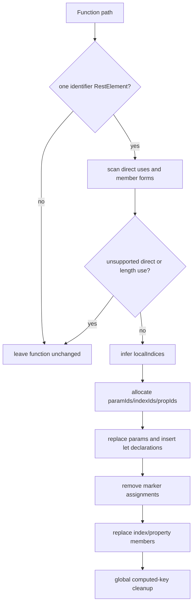

# VariableMasking: rest-parameter recovery

Evidence label: `source-inspection only`.

This page owns the distinct static AST transform used by the pinned `VariableMasking` sample. It
documents recovery of positional parameters and scratch locals from a masked rest-parameter
representation. It does not claim a general variable-masking reversal, transfer qualification, or
production decoder behavior.

## 1. Target

The primary target is a function with exactly one parameter, where that parameter is a `RestElement`
whose argument is an identifier such as `a`. `transformVariableMaskedFunction` scans the function
without descending into nested functions. It recognizes member expressions whose object is the
rest-name text and whose property is one of these forms:

| Member form | Recovered representation |
| --- | --- |
| `rest[non-negative integer]` | positional parameter/local identifier `rest<index>` |
| `rest["<canonical non-negative integer>"]` | same positional slot |
| `rest.length` or `rest["length"]` | only an allowed standalone assignment marker; non-marker uses decline |
| `rest["validIdentifier"]` | scratch local `rest_<property>` |

The safety discriminator is not merely “a rest parameter exists.” Before mutation, any referenced
rest identifier that is not the object of a member expression marks the function unsupported, and a
rest-length member that is not the left side of a standalone `=` expression statement also marks it
unsupported. The intended target therefore has a complete, supported member-access spelling for the
rest carrier. The exact implementation does not reject every unknown member spelling; that gap is
documented below rather than silently included in the accepted set.

## 2. Algorithm

For each eligible function, the transform maintains this state:

| State | Role |
| --- | --- |
| `indices` | All recognized numeric rest slots used in the function |
| `props` | All recognized valid identifier string properties |
| `unsupported` | Direct rest references or non-marker length uses found during the scan |
| `localIndices` | Numeric slots first reset to `undefined` before their first observed use at the function body's top-level statement level |
| `paramIds` | Fresh identifiers for every non-local slot from index `0` through the maximum non-local index |
| `indexIds` | Final identifier for each recognized numeric slot, from `paramIds` or a fresh local |
| `propIds` | Fresh local identifiers for each recognized property |

The ordered transformation is:

1. Require the exact one-rest-identifier parameter shape. Scan the function body, skipping nested
   functions. Collect numeric slots and properties; stop before mutation if the unsupported flag is
   set.
2. Scan direct body statements for assignments of the form `rest[index] = undefined`. A slot is
   considered local when this reset is the first occurrence of that index in the statement order;
   otherwise its index remains a positional parameter slot. Index uses inside nested functions are
   skipped.
3. Allocate collision-free identifiers. Non-local slots receive parameters for every index from
   zero through the largest non-local index, preserving rest-array positional numbering, including
   any holes. Local numeric slots and all recognized properties receive `let`-declared identifiers.
4. Replace the rest parameter with the positional parameter list. Insert one `let` declaration for
   the local numeric/property identifiers. Remove standalone `rest.length = ...` statements and
   reset assignments for local numeric slots or any property slot.
5. Rewrite recognized numeric and property member expressions to their mapped identifiers. A
   successfully processed function therefore leaves ordinary parameters and locals rather than a
   rest carrier.
6. After all function visits, normalize every computed string member and object-property key whose
   value is a valid identifier. Emit the resulting AST without comments, non-compact, with minimal
   escaping.

The internal state transition is non-linear at the pre-mutation safety gate:

This is a representation reconstruction, not runtime value evaluation: the source assumes the
masked rest slots and scratch properties already encode the function's parameter/local roles.

## 3. Implementation

The source ownership and phase anchors are:

| Ownership | Phase and concrete operation | Pinned anchor |
| --- | --- | --- |
| Delegated generic plumbing | Babel parser setup and final generator | `variableMasking.js#parse` lines 8-14; generator lines 288-304 |
| Owned target recognizer | Rest member classification for length, index, and property forms | `memberInfo` lines 16-48 |
| Owned safety recognizers | Standalone length assignment, assignment-member exception, and `= undefined` reset detection | `isWholeLengthAssignment`/`isLengthAssignmentMember` lines 50-73; `undefinedResetInfo`/`isUndefinedReset` lines 75-98 |
| Owned state discovery | Index-use collection and first-reset local-slot inference | `collectIndexUses` lines 100-114; `findLocalIndexSlots` lines 116-137 |
| Owned name allocation | Sanitization plus reserved/Babel-scope/global collision checks | `uniqueName` lines 139-153 |
| Owned safety and rewrite | Exact rest-parameter admission, unsupported scan, state maps, declaration insertion, marker removal, member replacement | `shouldIgnoreRestReference` lines 155-158; `transformVariableMaskedFunction` lines 160-267 |
| Owned global cleanup | Safe computed string member and object-key normalization | `cleanupComputedMembers` lines 269-286 |
| Shared coordinator | Parse, visit all functions, invoke the transform, cleanup, and generate | `deobfuscateSource` lines 288-304 |
| CLI/file wrapper | Read/write wrapper and command-line handling; not the AST algorithm | `deobfuscateFile`/exports/CLI lines 306-330 |

`memberInfo` is the central classifier. Its object test is identifier-name equality with the rest
name. It accepts non-negative integer numeric properties, canonical numeric strings, the literal
`length` property, and valid identifier-valued string properties. The first scan uses
`isReferencedIdentifier()` for the bare rest name and skips an identifier when it is the object of
a member expression. The scan skips nested functions, so each function owns only its direct rest
carrier uses.

`findLocalIndexSlots` is intentionally statement-oriented: it treats a first-seen
`rest[index] = undefined` statement as a local-slot marker and otherwise adds indexes found by
`collectIndexUses`. `uniqueName` checks the supplied reserved set plus Babel scope bindings and
globals. `transformVariableMaskedFunction` then maps local slots and properties to fresh `let`
identifiers, maps non-local slots to positional parameters, and applies the removals/replacements
in a second traversal.

The file-level coordinator visits every function in the parsed program and ignores the Boolean
result from each per-function transform. `cleanupComputedMembers` is a separate whole-AST pass and
also rewrites object-property keys, including outside transformed functions.

## 4. Upstream Effects

This sample is a standalone AST deobfuscator and has no earlier project-local decoder pass. The
parser supplies the Babel paths and scope object used by `uniqueName`; no runtime value or external
table is needed. The per-function scan skips nested functions, while the outer `deobfuscateSource`
traversal can process those nested functions separately if they themselves have one rest parameter.

The coordinator runs global computed-member cleanup after all function rewrites. Consequently,
earlier AST shape and traversal state determine which functions are visited, but the final cleanup
can change valid computed string members/object keys in untouched code as well. The transform also
assumes the rest-name/member arrangement is still visible when it scans; it does not consume an
external binding map or a preceding normalization IR.

## 5. Known Gaps

- The implementation's target matcher is name-based rather than binding-aware. It compares member
  objects and identifiers to the rest parameter's text, so shadowing or same-spelled bindings are
  not independently proven safe.
- Unknown member forms are a source-level blind spot. For example, a non-computed `rest.foo`, a
  dynamic `rest[key]`, a negative index, or a non-canonical numeric string is not classified by
  `memberInfo`. Its object identifier is ignored by `shouldIgnoreRestReference`, so the scan can
  rewrite other recognized members while leaving that rest reference behind instead of declining
  the whole function.
- Non-standalone `rest.length` reads/assignments are rejected, but standalone `rest.length = ...`
  is removed without examining the right-hand side. The source treats it as a marker/fake write;
  this is a sample-specific safety assumption.
- Local-slot inference only sees direct function-body statements and uses first-seen statement
  order. It does not model branches, loops, expression ordering, or nested-function captures, and
  it recognizes only an identifier named `undefined`, not equivalent expressions such as `void 0`.
- Positional parameter allocation fills every index through the maximum non-local index. That is
  required to preserve rest-array positions, but it can introduce parameters for unused holes and
  does not by itself prove a call site's arity.
- There is no rollback because the source performs its unsupported scan before mutation but does
  not expose a transaction around later AST operations. The implementation is static and does not
  execute the transformed program.
- `cleanupComputedMembers` is global and formatting-affecting: it normalizes valid computed string
  members and object keys even when no variable-masking function was transformed. The supplied
  regular-control output therefore cannot be treated as byte-identical decline evidence.
- The README, debug pattern, fixtures, generated output, and test are provenance/intended-check
  material only in this page. No behavioral, transfer, or production claim is made.

## Source

The pinned implementation is
[`variableMasking.js`](https://github.com/MichaelXF/claude-vs-js-confuser/blob/e90be6ca716e28f4bba91fe39615a665656bd802/VariableMasking/variableMasking.js).
The exact matcher and rewrite are in [lines 16-267](https://github.com/MichaelXF/claude-vs-js-confuser/blob/e90be6ca716e28f4bba91fe39615a665656bd802/VariableMasking/variableMasking.js#L16-L267),
global cleanup and coordination in [lines 269-304](https://github.com/MichaelXF/claude-vs-js-confuser/blob/e90be6ca716e28f4bba91fe39615a665656bd802/VariableMasking/variableMasking.js#L269-L304),
and file/CLI wrapping in [lines 306-330](https://github.com/MichaelXF/claude-vs-js-confuser/blob/e90be6ca716e28f4bba91fe39615a665656bd802/VariableMasking/variableMasking.js#L306-L330).
The pinned sample shape is represented by [`input.js`](https://github.com/MichaelXF/claude-vs-js-confuser/blob/e90be6ca716e28f4bba91fe39615a665656bd802/VariableMasking/input.js)
and its recorded transformed form by [`output.js`](https://github.com/MichaelXF/claude-vs-js-confuser/blob/e90be6ca716e28f4bba91fe39615a665656bd802/VariableMasking/output.js).

## Fixtures

| Pinned file | Intended claim or boundary | Evidence status |
| --- | --- | --- |
| `input.js` | Compact rest-parameter/member-access target shape | Source-fixture provenance and test intent |
| `original.js` | Readable source supplied as a comparison artifact | Provenance only; not used as implementation evidence |
| `output.js` | Recorded result after rest/member recovery and cleanup | Generated-output provenance |
| `regular.js` | Non-target function/program control | Negative-control fixture |
| `regular.output.js` | Recorded generated regular-control output | Generated-output provenance |
| `README.md` | Prompt, intended command, and stated sample scope | Prompt/provenance only |
| `debug-pattern.json` | Stated matched shape, rewrite summary, and safety claim | Intended-check note only; source implementation is authoritative |
| `test.js` | Intended AST, output-shape, pass-through, and behavior checks | Test-intent provenance |

No fixture establishes same-configuration transfer, runtime equivalence, or production coverage.
