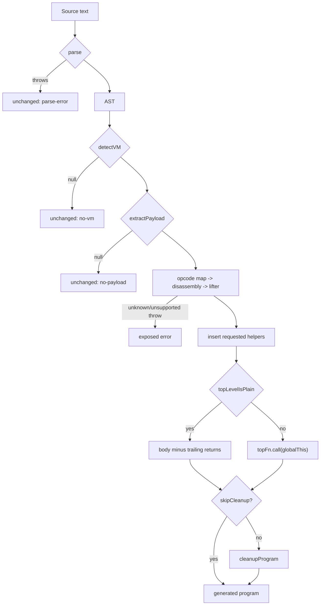

# Fallback and validation boundary

Status: source-inspection only. This page documents the frozen VM-3 driver's pass-through and
failure boundary at commit `e90be6ca716e28f4bba91fe39615a665656bd802`; it does not convert the
existing harness into a new qualification.

## 1. Target

Define the driver's caller-visible states: unchanged source for parse/no-VM/no-payload inputs,
generated source for a recognized and liftable payload, and exposed errors for recognized input
that reaches an unsupported opcode/control construct. The target also includes the top-level
emission choice and the `specialize`/`skipCleanup` options. Pass-through is a structural refusal,
not evidence that a related VM family is supported.

## 2. Algorithm

`deobfuscateSource(code, opts)` runs the following ordered state machine:

1. Parse with Babel using `sourceType: "unambiguous"` and `errorRecovery: true`. If parsing
   throws, return `{ code, changed: false, reason: "parse-error" }`.
2. Call page-1 detection. If no descriptor is returned, return the original source with
   `reason: "no-vm"`. If static payload extraction fails, return the original source with
   `reason: "no-payload"`.
3. For a recognized payload, build the page-2 opcode map, disassemble the page-3 word stream,
   and create/lift the page-4 top function. Errors from these calls are not caught here; unknown
   opcodes and explicit unsupported lifting conditions are exposed to the caller.
4. Insert exactly the helper definitions requested by the lifter, in sorted helper-name order.
   Inspect the entry function with `topLevelIsPlain`: scan only its own body, skip nested
   functions, reject any `ThisExpression`, and reject a return that is not a direct final body
   statement. The implementation does not require the final return to have no argument.
5. If the entry is plain, copy its body and remove trailing `ReturnStatement` nodes; otherwise
   emit `topFn.call(globalThis)` so entry `this` is the global object. Build a new Babel program.
6. Run page-5 `cleanupProgram` unless `skipCleanup` is true. Return generated code with
   `{changed: true, stats}`. `specialize: false` only selects page 4's direct graph; it does not
   suppress other unsupported errors.

The state transition is fail-closed: only a successful recognized/liftable path reaches generated
source. A failed specialization is not a driver failure; page 4 selects its direct graph. An
unknown opcode, indirect jump, exception setup, or excessive closure nesting is not converted to
an unchanged result by this driver.

## 3. Implementation

| Driver operation | Concrete source behavior | Boundary |
| --- | --- | --- |
| Parse | `parser.parse` with unambiguous module/script mode and error recovery | Parser throw is unchanged `parse-error`; parser success alone does not imply VM recognition. |
| Detect/extract | `detectVM(ast)` then `extractPayload(ast, vm)` | Null outputs are unchanged `no-vm`/`no-payload`. |
| Recognized pipeline | `buildOpcodeMap`, `disassemble`, `createLifter`, `liftFunction` | No catch around these calls; errors escape. |
| Helper insertion | Parse each source string from `HELPER_SOURCE` and prepend requested helpers | `_enumKeys`, `_defineGetter`, `_defineSetter` are inserted only when requested by page 4. |
| Plain top level | `topLevelIsPlain` rejects entry `this` and non-final direct returns | The final return may carry an argument; the driver discards trailing returns when flattening. |
| Non-plain top level | Emit an expression calling the lifted function with `globalThis` | Preserves entry receiver semantics. |
| Cleanup | Call `cleanupProgram(out)` unless `options.skipCleanup` | Skipping cleanup leaves the generated AST before whole-program cleanup. |
| Result | Generate source with comments disabled and minimal escapes; report function/instruction/pool/word stats | Stats describe this invocation and are not a durable measurement. |

The direct source details that make `topLevelIsPlain` safe are narrow: traversal never enters a
nested function, any entry-body `this` forces a call wrapper, and any return before the final
direct statement forces a call wrapper. On the plain path the implementation removes trailing
return statements without using their value because a script's top-level body has no consumer for
the entry function's return. On the wrapped path `.call(globalThis)` supplies the original global
receiver.

The file API reads a file, calls this source-level driver, writes only when an output path is
provided, and returns the result code. The CLI reports unchanged reasons or per-run stats; this
page documents those branches but does not invoke the CLI.

## 4. Upstream Effects

Pages [1](vm-3-structural-vm-detection.md) through [5](vm-3-reloop-cleanup-emission.md) own the
representations and errors consumed here. Page 1 determines whether detection/extraction can
start; pages 2 and 3 determine whether opcode decoding succeeds; page 4 determines whether
specialization or direct graph lifting is attempted; page 5 owns cleanup and generated helper
semantics.

The only driver fallback for page 4 is specialization failure to a direct graph. It does not
fallback from page-2 unknown forms, page-3 indirect control, page-4 exception setup or excessive
closure nesting. The options alter path selection but do not broaden the source-shape contract.

The validation boundary is documentary. `test.js` records intended checks for output shape,
decoded constants, syntax, pass-through, determinism, behavior, and error handling; retained
generated files and diagnostic records preserve sample provenance. The source-inspection evidence
boundary does not assert the checks as observed results.

## 5. Known Gaps

- A parser result with recoverable errors is accepted by the parser call; this page does not add a
  separate AST-error policy beyond the source implementation.
- Recognized-but-unsupported errors escape rather than returning the original source with a reason.
- `topLevelIsPlain` checks structural `this`/return placement, not semantic equivalence of moving
  the body to script scope.
- Successful `stats` are invocation metadata, not a qualification census.
- No behavioral, transfer, unseen-input, or production-coverage claim is made from the retained
  harness and generated outputs.

## Source

The driver state machine, helper insertion, top-level selection, and result object are in [`deobfuscateSource`](https://github.com/MichaelXF/claude-vs-js-confuser/blob/e90be6ca716e28f4bba91fe39615a665656bd802/VM-3/vm.js#L3340-L3392). The top-level scan is [`topLevelIsPlain`](https://github.com/MichaelXF/claude-vs-js-confuser/blob/e90be6ca716e28f4bba91fe39615a665656bd802/VM-3/vm.js#L3394-L3413). File/CLI wrappers are at [`deobfuscate` and the CLI block](https://github.com/MichaelXF/claude-vs-js-confuser/blob/e90be6ca716e28f4bba91fe39615a665656bd802/VM-3/vm.js#L3415-L3445). The explicit page-4 unsupported edges are in [`emit`](https://github.com/MichaelXF/claude-vs-js-confuser/blob/e90be6ca716e28f4bba91fe39615a665656bd802/VM-3/vm.js#L2156-L2162), and the page-3 unknown-opcode error is in [`decodeAt`](https://github.com/MichaelXF/claude-vs-js-confuser/blob/e90be6ca716e28f4bba91fe39615a665656bd802/VM-3/vm.js#L1035-L1042).

## Fixtures

| Fixture | Claim it could pin | Evidence role |
| --- | --- | --- |
| `VM-3/regular.js` | Ordinary no-VM unchanged path | Negative-control fixture |
| `VM-3/test.js` | Intended shape, constants, syntax, behavior, determinism, pass-through, and error checks | Test-intent evidence |
| `VM-3/output.js` | Existing generated output | Generated-output provenance |
| `VM-3/debug/compare.js`, `VM-3/debug/compare-plain.txt` | Comparison tooling and record | Diagnostic provenance |
| `VM-3/NOTES.md` | Fallback and validation context | Documentation provenance |
