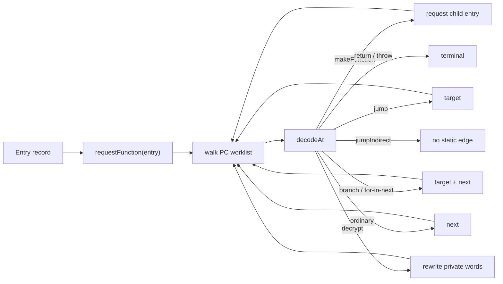

# Payload disassembly and function-edge discovery

Status: source-inspection only. This page reconstructs the frozen VM-3 disassembler at commit
`e90be6ca716e28f4bba91fe39615a665656bd802`; it does not claim execution, malformed-stream
coverage, or transfer to another payload format.

## 1. Target

Decode the static words from [structural detection](vm-3-structural-vm-detection.md) through the
semantic map from [handler canonicalization](vm-3-handler-canonicalization.md), discover reachable
function entries and ordinary CFG edges, and produce the instruction model consumed by
[state-specialized lifting](vm-3-state-specialized-lifting.md).

The target discriminator is an entry PC plus a numeric opcode with a page-2 spec. Each function
has one instruction map keyed by PC; each instruction has one size and next-PC boundary. A nested
function is discovered only from a decoded `makeFunction` instruction, not from scanning arbitrary
word values as possible code.

## 2. Algorithm

`disassemble(payload, opmap)` maintains `words`, `functions`, `decrypted`, and `pending` state:

1. Copy `payload.words` into a private `Uint32Array`. Register the top function from
   `entry.v`, `entry.p`, and `entry.e`, with `hasRest: false`, and queue it. `requestFunction`
   deduplicates all later entries by PC and assigns child IDs.
2. Pop a function and walk from its entry PC with a worklist. Skip seen PCs and PCs beyond the
   private word array. Read `words[pc]`, look up its page-2 spec, and throw `unknown opcode ... at
   pc ...` if no spec exists.
3. Consume `spec.fixed` raw words. For each role, `get(position)` selects `raw[slot.read]` for
   a stream slot or `slot.value` for a baked slot. Thus specialized handlers can have fewer
   stream words than their canonical `$` positions.
4. Decode the fixed instruction family and its tail. Arrays consume `count` element-register
   words; objects consume `count` key/value pairs. Calls, methods, and constructors consume a
   count-selected argument tail. A count equal to the spec's spread hint consumes one array
   register and marks `spread`; any other count consumes that many register words.
5. For a closure, consume destination, entry, parameter count, register count, rest flag, and
   capture count from the fixed roles, then `count` pairs `(own, index)`. Queue or reuse the
   child record keyed by entry PC and attach captures to the instruction.
6. For a decrypt instruction, use the instruction's destination/source range/key. The tag
   `dest:from:to:key` makes the operation idempotent. Start with `key ^ dest`, update by the
   32-bit Weyl increment for each source position, and write the XOR result into the private
   destination range.
7. Set `size = p - pc` and `next = pc + size`, store the instruction, and push its static
   successors. Direct jumps target one PC; branches and for-in-next target plus fallthrough;
   return/throw terminate; indirect jumps have no successor; other instructions fall through.

## 3. Implementation

Every decoded instruction has `{pc, op, kind, spec, size, next}` plus family-specific fields:

| Family | Decoded fields and representation |
| --- | --- |
| Binary/unary/move/load | Register roles, operator/value, or destination/source fields from page-2 slots. |
| Constants/globals | Destination/source plus pool index/key; page 4 later calls the static pool decoder. |
| Members/accessors | Object/key/value/function register roles. |
| Direct/conditional/indirect control | Target, condition/negation, or register for an indirect target. |
| Return/throw/debugger/handler setup | Source or setup fields; no implicit semantic lowering occurs here. |
| Cells and for-in | Cell/iterator roles, exit target, and destination. |
| Array/object literals | Count plus element list or key/value pair list consumed from `words`. |
| Calls/methods/constructors | Callee/receiver/destination, `spread`, and register argument list. |
| Closures | `captures` with `{own, idx}` plus `fn` child record `{entry, params, regs, hasRest, id, insts}`. |
| Decrypt | Range/key fields; private word mutation, no runtime call. |

Function discovery and control-flow state are separate from instruction decoding:

The `walk` loop stores an instruction before enqueuing successors, so repeated PC arrivals do
not decode the same instruction twice. A function entry discovered from multiple closure sites
shares its record and instruction map. The `words` returned to later stages are the private,
possibly decrypted copy; `payload.words` remains untouched.

The variable-width contracts are exact:

| Instruction | Header consumed after opcode | Additional words |
| --- | --- | --- |
| Array | destination, count | `count` element registers |
| Object | destination, pair count | `2 * count` key/value registers |
| Call | destination, callee, argc/hint | one array register for spread, else `argc` registers |
| Method call | destination, receiver, callee, argc/hint | same spread/fixed rule |
| Construct | destination, callee, argc/hint | same spread/fixed rule |
| Make closure | destination, entry, params, regs, capture count, rest | `2 * capture count` ownership/index words |

No bytecode evaluator is invoked. The only computation over payload values is integer indexing,
counted tail slicing, and the static decrypt transform.

## 4. Upstream Effects

Page 1 supplies `words`, `pool`, and `entry`. Page 2 supplies fixed stream widths, stream-versus-
baked role positions, semantic kinds, and spread hints. Page 4 assumes that `inst.size` advances
past all fixed and dynamic operands, that closure captures are ordered, and that successors are
the ordinary direct CFG edges.

The disassembler deliberately leaves `jumpIndirect` unresolved: its target is a runtime register
value and there is no constant environment at this stage. Page 4 therefore treats it as an
unsupported lifting edge, not as a fallthrough or guessed target. Exception setup records are
decoded but are also not converted into a CFG or JavaScript try statement here.

Material exits and limits are:

| Condition | Disassembler behavior | Downstream consequence |
| --- | --- | --- |
| Missing opcode spec | Throw an error with opcode and PC | Page 6 exposes the recognized-input failure. |
| PC at/above word length during walk | Skip that work item | No instruction is added for that path. |
| Dynamic count/tail beyond words | Source performs indexed reads without a separate range check | Malformed records can contain `undefined`; no validation claim is made. |
| Repeated decrypt tag | Do not apply the range twice | Private word state remains stable across repeated static encounters. |
| `jumpIndirect` | Record register and return no successor | Direct graph/lifter cannot silently assume an edge. |
| Return/throw | Return an empty successor list | Function graph terminates at the instruction. |

## 5. Known Gaps

- Dynamic counts, capture pairs, branch targets, and instruction tails are not independently
  range-checked before records are built.
- Unknown opcodes throw; there is no generic raw-word instruction fallback.
- Indirect jumps are represented without successors and are rejected by the current lifter.
- Try/catch/finally records are decoded, but this stage does not supply complete exception CFG
  semantics or lowering.
- The walk is source-backed for this VM-3 shape only; malformed-stream handling and unseen payload
  formats are not qualified.

## Source

The disassembly entry, private word/function state, and worklist are [`disassemble`](https://github.com/MichaelXF/claude-vs-js-confuser/blob/e90be6ca716e28f4bba91fe39615a665656bd802/VM-3/vm.js#L992-L1033). Fixed/dynamic instruction decoding, closure discovery, and private decrypt are [`decodeAt`](https://github.com/MichaelXF/claude-vs-js-confuser/blob/e90be6ca716e28f4bba91fe39615a665656bd802/VM-3/vm.js#L1035-L1173). Successor policy is [`successorsOf`](https://github.com/MichaelXF/claude-vs-js-confuser/blob/e90be6ca716e28f4bba91fe39615a665656bd802/VM-3/vm.js#L1175-L1187). The driver call is at [`deobfuscateSource`](https://github.com/MichaelXF/claude-vs-js-confuser/blob/e90be6ca716e28f4bba91fe39615a665656bd802/VM-3/vm.js#L3358-L3359).

## Fixtures

| Fixture | Claim it could pin | Evidence role |
| --- | --- | --- |
| `VM-3/input.js` | Static payload, pool, entry bootstrap, and closure/function-word shapes | Source fixture |
| `VM-3/NOTES.md` | Word/function observations and variable-width notes | Documentation provenance |
| `VM-3/debug/extract.js` | Extraction-to-payload inspection boundary | Debug-tool provenance |
| `VM-3/debug/disasm.js` | Disassembly inspection logic | Debug-tool provenance |
| `VM-3/debug/disasm.txt`, `VM-3/debug/bytecode.json`, `VM-3/debug/pool.json` | Instruction, word, and pool views | Diagnostic artifacts |
