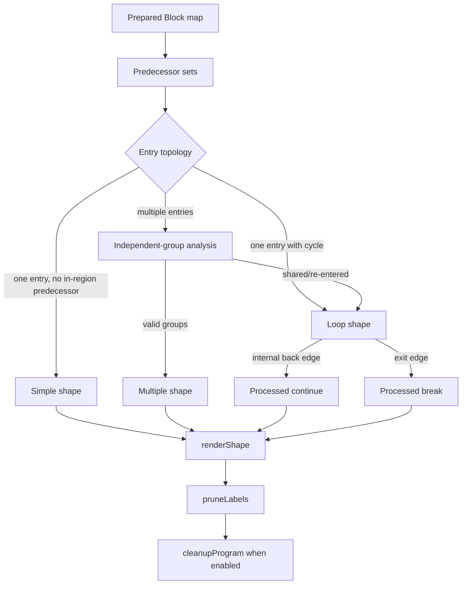

# Reloop, cleanup, and emission

Status: source-inspection only. This page reconstructs graph structuring and AST cleanup in the
frozen VM-3 implementation at commit `e90be6ca716e28f4bba91fe39615a665656bd802`; it does not
claim equivalence on arbitrary CFGs or generated programs.

## 1. Target

Convert page 4's lifted block graph into ordinary JavaScript statements, retaining every
non-fallthrough edge, then remove VM-shaped scaffolding and simplify the whole output AST only
when the source's local gates permit it. The structurer distinguishes `simple`, `loop`, and
`multiple` regions by predecessor topology. Cleanup and method spelling are separate from graph
recovery: a graph can remain labelled or dispatch-based when no safe local collapse applies.

## 2. Algorithm

### Bridge from lifted blocks

Before Relooper, `liftInner` invokes the block-preparation helpers:

1. `mergeLinearBlocks` repeatedly splices an unconditional, sole-predecessor successor into its
   predecessor, except for the entry or a self-loop.
2. `ssaRenameBlock` gives recyclable register definitions fresh names inside each block unless
   the register is captured by a nested function. Branch-edge code is renamed using the current
   block mapping.
3. `computeLiveness` computes backward `use`, `def`, and `liveOut` sets over statement reads,
   branch conditions, edge code, and successor blocks; captured registers are always live.
4. `combineExpressions` folds a simple register definition into one later use only when no
   intervening impure or dependent definition must be crossed. Pending definitions are flushed
   when a read/write dependency would otherwise reorder evaluation. `peephole` applies the local
   expression rewrites before branch conditions are finalized.

### Relooper decomposition

`reloop` computes predecessor sets once, then recursively processes remaining blocks:

1. With one entry, choose `simple` when it has no predecessor inside the current region;
   otherwise grow a `loop` by walking in-region predecessors from the entries.
2. With multiple entries, `findIndependentGroups` propagates ownership from each entry. Shared
   blocks and blocks re-entered from another group are marked unowned. Remaining independent
   groups become `multiple` handlers; if none are valid, process the entries as a loop region.
3. A loop removes its interior from the remaining set, records exits as `nextEntries`, converts
   edges back to an entry into `continue`, converts interior-to-exterior edges into `break`, and
   recursively processes its interior.
4. A multiple shape removes each group, records group exits, recursively processes each group,
   and leaves ungrouped entries for the following shape.

`renderShape` names loop/multiple shapes, renders simple statements, and emits edges as an
if/else chain. A loop is a labelled `while (true)`. A multiple shape is a labelled
`do { if (_lbl === entry) ... } while (false)`. A processed edge emits `_lbl = target` plus
labelled `break` or `continue`; an unstructured non-fallthrough edge emits `_lbl = target` and
lets the enclosing dispatch logic consume it.

`pruneLabels` first records labels used by break/continue and whether `_lbl` is read. It removes
unused labels, unwraps an unused labelled `do/while(false)`, and removes `_lbl` assignments when
the variable is never read. Its `usesLabelVar` result controls the page-4 prologue declaration.

### Whole-AST cleanup

When the driver does not set `skipCleanup`, `cleanupProgram` runs exactly this sequence:

1. `collapseDispatch`
2. `simplifyMBA`
3. `dropDeadRegisters`
4. `collapseDispatch`
5. `simplifyMBA`
6. `dropDeadRegisters`
7. `dropUnusedDispatchVar`
8. `tidyStatements`
9. `dropDeadRegisters`
10. `renameRegisters`

`collapseDispatch` recognizes adjacent trees only when one statement assigns distinct numeric
values to `_lbl` across an if/else tree and the next statement is an exact `_lbl === number`
if-chain with the same complete value set and no trailing unlabelled path. It replaces the pair
with the branch bodies and repeats for at most twelve rounds.

`simplifyMBA` recursively visits arithmetic nodes with no more than three variables and at least
three nodes. It evaluates candidate expressions over a first window of mixed-type values and then
the remainder of the source-defined numeric/float samples. `sameValue` preserves `NaN` equality
and distinguishes signed zero. A candidate must agree on every sample and be strictly smaller;
otherwise the source expression remains.

`dropDeadRegisters` counts globally unique generated register reads, removes dead pure assignments
and declarations, and turns a dead impure assignment into its right-hand expression. `tidyStatements`
flattens nested blocks, reduces double negation, moves a non-empty alternate out of an empty
consequent, removes empty alternates and pure empty tests, and removes a terminal continue that
targets its containing loop. `renameRegisters` protects reserved words, globals, labels, and
non-computed property keys while assigning alphabetical names per nested function.

## 3. Implementation

The ownership of each bridge/shape state is:

| Representation or operation | Owner | Contract |
| --- | --- | --- |
| `Block` | Renderer | `id`, ordered `stmts`, ordinary `branches`, and processed edge actions. |
| `mergeLinearBlocks` | Pre-render bridge | Only unconditional sole-predecessor splice; preserves branch-bearing boundaries. |
| `ssaRenameBlock` | Pre-render bridge | Fresh block-local definitions; captured registers remain shared. |
| `computeLiveness` | Pre-render bridge | Backward block liveness for expression combination and dead-store decisions. |
| `combineExpressions` | Pre-render bridge | One-use folding with purity/independence and pending-definition flushes. |
| `reloop` | Graph structurer | Predecessor-driven Simple/Loop/Multiple shape tree. |
| `renderShape` | Graph structurer | Babel statement emission, labels, `_lbl`, break/continue, and if/else edges. |
| `pruneLabels` | Graph structurer | Removes unused labels and dispatch assignments, returns declaration need. |
| `simplifyMBA` | Cleanup | Bounded arithmetic candidate screen with strict-size reduction. |
| `collapseDispatch` | Cleanup | Exact adjacent dispatch-tree collapse. |
| `dropDeadRegisters` | Cleanup | Read-count-based pure dead-store removal with impure-effect preservation. |
| `dropUnusedDispatchVar` | Cleanup | Removes `_lbl` only when no enclosing Program/function reads it. |
| `tidyStatements` | Cleanup | Local structural/readability rewrites. |
| `renameRegisters` | Cleanup | Scope-aware generated-register naming. |

The helper source boundary is also explicit. Page 4 requests helpers by adding names to
`usedHelpers`; the driver inserts their source before the selected top-level body. `_enumKeys`
collects own property names through the prototype chain, de-duplicates them, and keeps enumerable
descriptors. `_defineGetter` and `_defineSetter` define configurable/enumerable accessors while
preserving an existing opposite accessor. These definitions are generated source; their runtime behavior is not established here.

The `Reflect.apply` peephole rewrite is guarded: `Reflect.apply(o.m, o, [args])` becomes a direct
method call only when the callee object and simple receiver are the same reference and the array
has no spread element. A non-array argument list becomes one spread element. An undefined receiver
can also be removed when the argument list is a plain array. Otherwise `Reflect.apply` remains,
avoiding a second property read that could invoke a getter.

The graph renderer intentionally emits conservative scaffolding first. `pruneLabels` and
`collapseDispatch` are responsible for proving that a label or dispatch value has no remaining
consumer; cleanup does not infer missing CFG edges or repair an unsupported semantic instruction.

## 4. Upstream Effects

[State-specialized lifting](vm-3-state-specialized-lifting.md) supplies block statements,
conditional branch expressions, ordinary successor edges, edge assignments, and captured register
names. Its specialization may already eliminate dispatcher conditions, but page 5 must still
retain any edge semantics left in the graph. [Fallback and validation](vm-3-fallback-validation.md)
decides whether cleanup runs and how the final function is placed at top level.

The bridge owns no new VM semantics: source register reads/writes, impure calls/member effects,
closure captures, and branch conditions remain the inputs from page 4. Structuring operates on
those facts. Cleanup's bounded MBA test and purity predicate are safety gates for readability,
not proofs of all-value JavaScript equivalence.

Material decisions are:

| Situation | Result |
| --- | --- |
| Unambiguous linear predecessor | Merge before structuring. |
| Cyclic in-region predecessor | Loop shape with explicit continue/break edges. |
| Independent entry groups | Multiple shape and dispatch variable. |
| Shared or cross-reentered group | Do not force a multiple shape; use loop processing. |
| Non-fallthrough edge not processed as break/continue | Keep `_lbl` assignment for dispatch. |
| Unused labels/dispatch after rendering | Remove only after read scans. |
| Unsafe expression combination or MBA candidate | Retain the longer source expression/statements. |
| Dead pure register store | Remove; dead impure RHS remains as an expression statement. |

## 5. Known Gaps

- The Relooper implementation is source-backed for the decoded graph; coverage of unseen graph
  populations is not established.
- Purity is a conservative AST predicate; expressions with getters, calls, or other effects are
  intentionally less foldable, and retained VM-like scaffolding is not a failure.
- MBA simplification is a finite sample screen, even though it includes mixed types, floats,
  awkward values, `NaN`, and signed zero; it is not a formal JavaScript equivalence proof.
- Dispatch collapse requires an exact adjacent shape; a semantically reducible but differently
  organized tree remains uncollapsed.
- Cleanup cannot lower `pushCatch`, `pushFinally`, `jumpIndirect`, or unknown page-4 kinds.
- The page does not establish behavioral equivalence, transfer, or production coverage.

## Source

Block shape decomposition is [`Block` and `reloop`](https://github.com/MichaelXF/claude-vs-js-confuser/blob/e90be6ca716e28f4bba91fe39615a665656bd802/VM-3/vm.js#L1202-L1367). Rendering and edge dispatch are [`renderShape`](https://github.com/MichaelXF/claude-vs-js-confuser/blob/e90be6ca716e28f4bba91fe39615a665656bd802/VM-3/vm.js#L1369-L1477), and label pruning is [`pruneLabels`](https://github.com/MichaelXF/claude-vs-js-confuser/blob/e90be6ca716e28f4bba91fe39615a665656bd802/VM-3/vm.js#L1479-L1515). Dataflow/bridge helpers are at [`collectRegRefs` through `combineExpressions`](https://github.com/MichaelXF/claude-vs-js-confuser/blob/e90be6ca716e28f4bba91fe39615a665656bd802/VM-3/vm.js#L1523-L1843), with peepholes at [`peephole`](https://github.com/MichaelXF/claude-vs-js-confuser/blob/e90be6ca716e28f4bba91fe39615a665656bd802/VM-3/vm.js#L2183-L2253). Cleanup helpers are [`dropDeadRegisters` through `renameRegisters`](https://github.com/MichaelXF/claude-vs-js-confuser/blob/e90be6ca716e28f4bba91fe39615a665656bd802/VM-3/vm.js#L2761-L2928), arithmetic simplification is [`simplifyMBA`](https://github.com/MichaelXF/claude-vs-js-confuser/blob/e90be6ca716e28f4bba91fe39615a665656bd802/VM-3/vm.js#L2938-L3118), dispatch collapse is [`collapseDispatch`](https://github.com/MichaelXF/claude-vs-js-confuser/blob/e90be6ca716e28f4bba91fe39615a665656bd802/VM-3/vm.js#L3120-L3205), and cleanup order is [`cleanupProgram`](https://github.com/MichaelXF/claude-vs-js-confuser/blob/e90be6ca716e28f4bba91fe39615a665656bd802/VM-3/vm.js#L3288-L3299). Helper definitions are at [`HELPER_SOURCE`](https://github.com/MichaelXF/claude-vs-js-confuser/blob/e90be6ca716e28f4bba91fe39615a665656bd802/VM-3/vm.js#L3306-L3338).

## Fixtures

| Fixture | Claim it could pin | Evidence role |
| --- | --- | --- |
| `VM-3/output.js` | Existing generated plain-JavaScript endpoint | Generated-output provenance |
| `VM-3/debug/plain-output.js` | Diagnostic plain-output view | Diagnostic artifact |
| `VM-3/debug/compare-plain.txt` | Structured-output comparison | Diagnostic artifact |
| `VM-3/debug/stages.js` | Stage-boundary inspection | Debug-tool provenance |
| `VM-3/debug/combinecheck.js`, `VM-3/debug/foldcheck.js` | Expression-combination and fold checks | Debug-tool provenance |
| `VM-3/NOTES.md` | Reloop, expression, MBA, and cleanup rationale | Documentation provenance |
