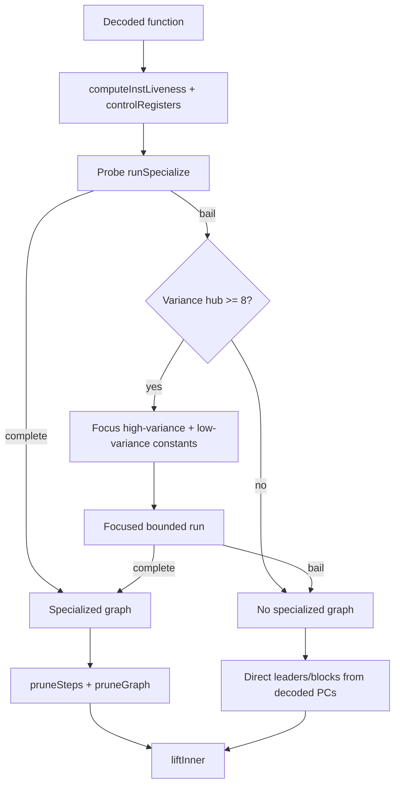

# State-specialized lifting

Status: source-inspection only. This page reconstructs specialization and semantic AST lifting in
the frozen VM-3 implementation at commit `e90be6ca716e28f4bba91fe39615a665656bd802`; it does not
qualify the heuristic or claim semantic preservation on an unseen payload.

## 1. Target

Recover JavaScript AST from the decoded instruction model while reducing control-flow flattening
through bounded constant propagation. The target is a function expression containing register
assignments, ordinary JavaScript operations, and a block graph that page 5 can structure. The
specialized graph and the direct decoded graph are separate algorithms: specialization is selected
only when its bounded run completes; failure falls back to direct block construction, not to a
guessed indirect/exception dispatcher.

## 2. Algorithm

### Control-state specialization

`createLifter` creates a pool decoder, helper-use set, specialization option, and closure-depth
counter. For each function, `specializeFunction`:

1. Computes decoded-graph instruction liveness. `controlRegisters` starts with every branch
   condition and walks backward through producers only when the producer is a pure binary, unary,
   move, immediate, constant, or undefined instruction.
2. Runs `runSpecialize` as a probe with `PROBE_BLOCKS = 12000`. A block key is its PC plus sorted
   `(register, type, value)` bindings. The environment is restricted to control registers not in
   the permanently widened set. Per-PC state counts and value variance are recorded.
3. If the probe completes, its graph is used. If it bails, the PC with greatest state count is
   chosen as a variance hub. A focus set is accepted only when the largest observed variance is
   at least eight; it includes registers whose count is at least one quarter of the maximum or at
   most two values. A second run uses `MAX_BLOCKS = 40000`.
4. At a PC, constant conditions are folded to one successor. Unknown conditions become a branch
   step with snapshots and two edges. Direct jumps are followed. Return/throw terminates, and
   for-in-next creates an exit edge plus a fallthrough edge marked for its key assignment.
   Decrypt and handler-pop instructions advance without emitted steps.
5. Pure primitive results update the environment. Writes with unknown/non-primitive results remove
   the known value. Environment entries not live after the instruction are pruned before crossing
   an edge. A repeated PC or block step count over `MAX_STEPS_PER_BLOCK = 20000` closes the block;
   a block budget hit bails the run.
6. `pruneSteps` walks each block backward, drops dead pure instructions, and retains impure
   effects even when their destination is dead. `pruneGraph` repeats liveness over specialized
   edges for up to 200 iterations, excludes reads supplied by `constIn`, and preserves registers
   captured by child functions.

### Graph selection and AST lifting

If no specialized graph is returned, `buildGraph` creates leaders at the function entry and all
direct/conditional/iteration targets and fallthrough boundaries. It gathers sequential decoded
instructions until a terminator, missing next instruction, or leader. `liftInner` then:

1. Names registers `v<function-id>_<register>` and identifies parent registers captured by any
   child closure. Captured registers are excluded from recyclable SSA renaming.
2. Emits each graph step into a `Block`, carrying a per-block constant map and branch metadata.
   A branch emits a condition marker that is removed after expression preparation and copied into
   the conditional edge. A for-in fallthrough edge carries the next-key assignment.
3. Delegates linear block merging, SSA/dataflow preparation, expression combination, and local
   peepholes to page 5. It then delegates Relooper structuring and label pruning to page 5.
4. Builds the function prologue: ordinary parameters, a rest parameter when flagged, a register
   for `arguments` when the VM function has one, used non-parameter registers, and SSA temporaries.
   The argument-array register is initialized with the source's `[].slice.call(arguments)` form.

## 3. Implementation

The semantic emitter maps each decoded kind as follows:

| Decoded kind | AST construction and state effect |
| --- | --- |
| `binop` | Assign a binary expression. Marked int32 `*` becomes `Math.imul`; marked int32 `+`/`-` wrap both inputs and result with `|0`; native bitwise forms remain ordinary operators. |
| `unop`, `move`, `loadImm`, `loadConst`, `loadUndef`, `loadThis` | Assign the corresponding unary/value expression and update the block constant map when the value is known. |
| `loadGlobal`, `typeofGlobal`, `storeGlobal` | Emit identifier read, `typeof` read, or identifier assignment using the statically decoded pool name. |
| `getMember`, `setMember`, `deleteMember` | Emit member access/mutation/deletion. Dot notation is used only for a known valid identifier key; otherwise access stays computed. Reads/writes are marked so impure member behavior is not dead-store erased. |
| `defineGetter`, `defineSetter` | Request `_defineGetter` or `_defineSetter` and emit a helper call with object, key, and function values. |
| `arrayLit` | Emit an array from element-register values. |
| `objectLit` | Emit a literal only when every key is a known string other than `__proto__`; otherwise assign `{}` then emit ordered computed property assignments. |
| `call`, `construct` | Emit ordinary call or `new`; spread uses a spread element from the one array register. |
| `methodCall` | Emit `Reflect.apply(callee, receiver, args)`; spread passes the source array directly. Page 5 may reduce this to a method call only when the receiver/property reference is provably shared. |
| `makeFunction` | Lift the child recursively. Own captures name parent registers; inherited captures index `capNames`. A depth above 64 throws `closure nesting too deep`. |
| `loadCell`, `storeCell` | Emit reads/writes of the corresponding shared capture name. |
| `return`, `throw`, `debugger` | Emit ordinary JavaScript return, throw, or debugger statements. |
| `forInInit`, `forInNext` | Request `_enumKeys`; initialize `{keys: _enumKeys(object), i: 0}` and test `i >= keys.length`, with the fallthrough edge assigning the next key and incrementing `i`. |
| `decrypt`, `popHandler`, `jump` | Emit no statement; their control/data work was handled earlier or by graph edges. |
| `pushCatch`, `pushFinally`, `jumpIndirect`, unknown | Throw an explicit unsupported/cannot-lift error. |

The emission state has two layers. `constIn` is the specialization snapshot supplied for source
register operands; `blk.consts` is the local result map built while emitting. The `assign` helper
emits an impure expression even for a dead destination, while `setConst` can omit a dead pure
assignment. Closure captures are always retained because a nested function may read or write the
shared variable after the defining block completes.

`buildGraph` chooses the graph, but it does not erase source information about the alternative.
The direct graph preserves decoded instruction PCs and edge boundaries. It still fails for an
indirect jump because page 3 intentionally supplies no successor and `emit` explicitly rejects
the instruction.

## 4. Upstream Effects

[Payload disassembly](vm-3-payload-disassembly.md) supplies typed instructions, fixed operands,
function entries, capture descriptors, and ordinary successors. [Handler interpretation](vm-3-handler-canonicalization.md)
indirectly supplies semantic kinds and constant/pool roles. Page 5 assumes each emitted block has
statements, conditional branches, edge code, and any helper-use requests; it does not redo
specialization or semantic opcode interpretation.

The specialization environment is deliberately narrower than all register state. `controlRegisters`
keeps only branch-influencing pure slices; liveness removes values that do not cross a boundary;
adaptive widening drops the most variant retained register when a PC keeps producing states. This
prevents loop-varying values from unrolling indefinitely while preserving constants useful for
folding other expressions.

Failure boundaries are explicit:

| Condition | Result |
| --- | --- |
| Probe completes | Use its specialized graph. |
| Probe bails but no hub reaches variance threshold | Return no specialized graph; use direct graph. |
| Focused run exceeds block budget | Return no specialized graph; use direct graph. |
| Repeated PC or step bound | Close a specialized block with an edge to the current state. |
| Unsupported exception setup | Throw from the emitter; no JavaScript try/catch is guessed. |
| Indirect jump | Throw from the emitter; no target is invented. |
| Closure depth above 64 | Throw; no unbounded recursive output is emitted. |

No runtime helper, closure, input program, or generated AST is executed by this static algorithm.

## 5. Known Gaps

- Specialization thresholds and adaptive widening are source heuristics, not empirically qualified
  bounds or proofs that every flattened dispatcher will collapse.
- The direct graph is longer but is not a universal fallback: indirect jumps, exception setup,
  unknown kinds, and excessive closure nesting remain exposed failures.
- Exception records are decoded upstream but `pushCatch`/`pushFinally` are not lowered.
- Closure capture naming assumes page-3 capture indices and page-4 nested function records are
  coherent; malformed capture metadata is not separately validated here.
- The page does not establish semantic equivalence, transfer, unseen-graph coverage, or production
  support.

## Source

Lifter state and graph selection are in [`createLifter`](https://github.com/MichaelXF/claude-vs-js-confuser/blob/e90be6ca716e28f4bba91fe39615a665656bd802/VM-3/vm.js#L1867-L2001). Instruction-to-AST emission is [`emit`](https://github.com/MichaelXF/claude-vs-js-confuser/blob/e90be6ca716e28f4bba91fe39615a665656bd802/VM-3/vm.js#L2003-L2164), with call/member helpers at [`callArgs` and `member`](https://github.com/MichaelXF/claude-vs-js-confuser/blob/e90be6ca716e28f4bba91fe39615a665656bd802/VM-3/vm.js#L2166-L2179). Decoded-graph liveness is at [`computeInstLiveness`](https://github.com/MichaelXF/claude-vs-js-confuser/blob/e90be6ca716e28f4bba91fe39615a665656bd802/VM-3/vm.js#L2268-L2375). Control slicing, bounded runs, widening, step pruning, and specialized-graph liveness are at [`controlRegisters` through `pruneGraph`](https://github.com/MichaelXF/claude-vs-js-confuser/blob/e90be6ca716e28f4bba91fe39615a665656bd802/VM-3/vm.js#L2434-L2755).

## Fixtures

| Fixture | Claim it could pin | Evidence role |
| --- | --- | --- |
| `VM-3/input.js` | Decoded function/register/capture and flattened-dispatch source shape | Source fixture |
| `VM-3/NOTES.md` | Specialization/lifting rationale and listed bounds | Documentation provenance |
| `VM-3/debug/stages.js` | Stage-boundary inspection | Debug-tool provenance |
| `VM-3/debug/trace.js`, `VM-3/debug/trace-pcs.json` | Runtime trace context | Trace artifacts |
| `VM-3/debug/ssacheck.js`, `VM-3/debug/combinecheck.js`, `VM-3/debug/foldcheck.js` | SSA, expression, and fold checks | Debug-tool provenance |
| `VM-3/debug/plain-output.js` | Generated plain-output view | Generated-output provenance |
