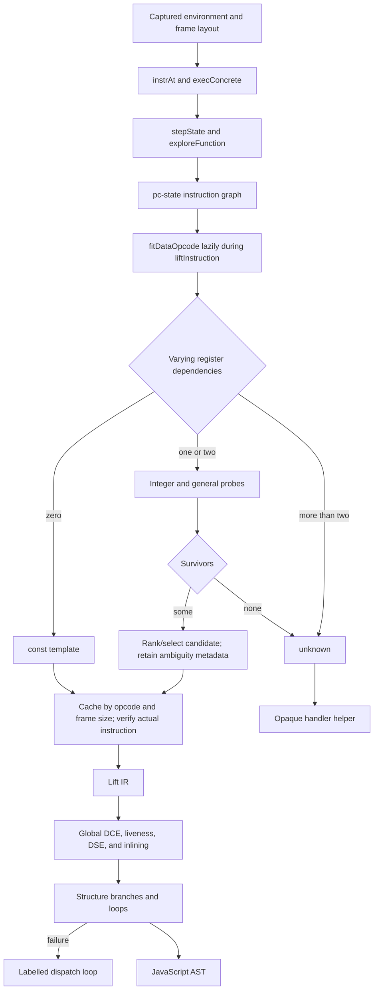

# VM-5 live handler capture, probing, and frame-aware fit recovery

Evidence label: `source-inspection only`. This transform page reconstructs the pinned
VM-5 implementation; it does not implement, execute, or validate a decoder.

## 1. Target

Recover a bounded JavaScript candidate from VM-5's randomized register VM by capturing the
sample-shaped bootstrap, observing handler behavior, fitting arithmetic candidates, and recovering
enough state-sensitive control flow for AST emission. The concrete input shape is a top-level call
whose constructor-shaped arguments contain a word array, handler prototype, function template, and
base64 code/pool data. `VM-5/input.js` is the retained embedded sample; `VM-5/output.js` is an
existing lifted artifact with explicit temporaries, a guarded function, browser effects, and a
loop.

This transform owns the VM-5-specific live/proxy observation, frame/function-layout oracle, ranked
frame-size-aware numerical fit, state-sensitive control recovery, and the downstream lifting and
fallback decisions that consume those facts. Generic parsing/generation is substrate; this page
does not claim that running the implementation's capture probes is safe for arbitrary input.

## 2. Algorithm

The source defines one connected solution-level algorithm:

1. **Recognize and capture the bootstrap — VM-5-owned boundary with an execution caveat.**
   `findBootstrap` scans top-level calls for a constructor-shaped first argument containing an array
   and a constructor-shaped third argument. `captureVM` rewrites the bootstrap callee to
   `__capture`, generates source, and runs it in a `node:vm` context, capturing the VM state,
   runner, and function template before the operation. The entry point also parses the source and
   requires at least eight handler assignments; a missing bootstrap or fewer assignments returns the
   original source, and a null `buildEnv` result is also passed through. Capture, discovery, and
   frame-layout errors are not caught by the entry point and can escape. This is implementation
   behavior recorded from source; no runtime result is asserted.

2. **Discover fields and observe handlers — VM-5-owned algorithm.** `discoverFields` inspects the
   captured prototype and identifies the numeric handlers, operand reader, pool, and globals.
   `makeMock`/`runHandler` provide proxy-backed code, stack, globals, and frame sentinels that record
   consumed operands, register reads/writes, jumps, and errors. `probeRoles` compares marker probes
   to identify destination and register/immediate positions. `classifyOne` combines these effects
   with handler source text to classify returns, jumps, exceptions, globals, `this`, closures,
   calls/new, member operations, aggregates, for-in, and residual expression handlers.

3. **Recover slot and function metadata — VM-5-owned algorithm.** `discoverSlots` probes the this,
   template, and try slots. `discoverFunctionMeta` tests variable-length closure operands, and
   `tryMeta` validates metadata/rest behavior through a generated closure. These probes produce
   slot positions, closure/template keys, and function metadata needed by later instruction and
   frame interpretation.

4. **Use a real-interpreter frame-layout oracle — VM-5-owned algorithm.** `discoverFrameLayout`
   constructs synthetic register programs, runs them through the genuine interpreter at multiple
   local counts, and searches candidate frame-size/header slots. The source fallback is
   `{sizeSlot:5, header:13, verified:false}`. The resulting layout is explicit fit state: it
   controls which frame-size value is supplied to handlers and how register slots are addressed.
   Synthetic programs and genuine interpreter calls provide implementation probes, not behavior
   results for this source-inspection contract.

5. **Recover decoded operations and bounded state — VM-5-owned control recovery.** `instrAt` uses
   handler execution to consume variable-width operands and `execConcrete` records concrete writes
   and unknown reads. `evalPure` executes only whitelisted globals/functions under a step budget;
   failed or impure evaluation returns `FAIL`, so a dispatcher key remains unknown. `stepState`
   carries register values, evaluates known calls/members/expressions, seeds fresh symbolic boolean
   tables for unresolved boolean expressions, and forks conditional or symbolic computed jumps.
   `exploreFunction` keys nodes by `(pc,state)`, widens after the per-PC state budget while keeping
   the backward `controlSlice`, and enforces a hard node limit. `explosionRegisters` identifies
   changing non-control data registers, and `analyzeFunction` retries once with those registers
   abstracted only when unresolved jumps and caps do not worsen. This phase produces the instruction
   records and bounded graph that the lifting phase consumes.

6. **Fit residual arithmetic as ranked candidates during lifting — VM-5-owned algorithm.** `fitDataOpcodeInner`
   first identifies the destination, register, and non-destination immediate slots. It varies every
   register over several baselines and every immediate over perturbations, so a dependency is
   recorded only when the handler output changes across those controls. Its candidate contract is:

   | Observed dependencies | Candidate construction and result |
   | --- | --- |
   | No varying registers | Evaluate the handler as a `const` template. |
   | One varying register, no varying immediates | Try `move`/`id` and every unary operator against the register. |
   | One varying register plus an immediate | For each dependent immediate, try raw and signed-int32 constants on both sides of every binary operator; unary/move candidates are suppressed. |
   | Two varying registers | Try every binary operator in both operand orders. |
   | More than two varying registers | Return explicit `unknown`. |

   A candidate operand is either `{reg: slot}` or `{imm: slot, int: boolean}`. Integer probe
   survivors are refined with general values when any refinement survives; if all general-value
   refinements fail, the integer survivors are retained. Handler errors are non-information during
   candidate checks, while a missing write rejects a candidate. Survivors are ordered by `RANK`
   (`move` is ranked as `id`; an unlisted form has rank 99); the first is selected and alternatives
   are carried as `ambiguous` metadata rather than treated as equivalent. If aliased register
   operands make the direct fit unknown, `fitDataOpcode` retries once with canonical synthetic
   register numbers. Ambiguity does not select the opaque path: the first-ranked candidate is used
   and the alternatives are metadata only. These choices are implemented by
   `fitDataOpcode`/`fitDataOpcodeInner` and the
   candidate table at [`958-1098`](https://github.com/MichaelXF/claude-vs-js-confuser/blob/e90be6ca716e28f4bba91fe39615a665656bd802/VM-5/vm.js#L958-L1098).

   `fittedOp` caches a template under `opcode@currentFrameSize`, then `verifyFit` replays a fixed
   integer probe set against the actual instruction's operands. Verification is a boolean gate, not
   a field in the fit record: a constant fit is accepted when it produces a value, non-constant
   fits skip `ERR` and `NONE` probe results, and a run with no informative probe can therefore pass.
   If the gate fails, the code refits once and stores the replacement without verifying that
   replacement again. The cache handoff is consequently a candidate plus an independent verification
   attempt, never a durable `verified` status ([`2142-2190`](https://github.com/MichaelXF/claude-vs-js-confuser/blob/e90be6ca716e28f4bba91fe39615a665656bd802/VM-5/vm.js#L2142-L2190)).

7. **Lift, clean, structure, and preserve unsupported behavior — VM-5-owned downstream emission.**
   `liftInstruction` converts instruction records into VM-5 IR. The downstream decisions are:

   | Phase | Source-backed decision |
   | --- | --- |
   | Whole-function DCE | Seed effects, impure assignments, captured-register assignments, and branch-test registers, then take backward closure over all statement reads and definitions; delete the remaining assignments ([`globalDeadCode`, `2723-2776`](https://github.com/MichaelXF/claude-vs-js-confuser/blob/e90be6ca716e28f4bba91fe39615a665656bd802/VM-5/vm.js#L2723-L2776)). |
   | Liveness/DSE | Compute block live-in/live-out sets; for up to six rounds drop dead pure assignments, retain dead impure calls as effect statements, remove pure effects, and stop at a fixed point ([`computeLiveness`/`deadStoreElimination`, `2779-2835`](https://github.com/MichaelXF/claude-vs-js-confuser/blob/e90be6ca716e28f4bba91fe39615a665656bd802/VM-5/vm.js#L2779-L2835)). |
   | Temporary inlining | For up to eight rounds skip captured or live-out definitions; inline a non-duplicable value only when it has one use (and keep an impure value adjacent to that use), while duplicable literals/globals/registers may serve multiple uses. Block movement across a redefinition of a register read by the expression or any intervening non-pure statement for a non-duplicable value; a duplicable global read is also stopped by an intervening `setglobal` effect, then the temporary is substituted and removed ([`inlineTemporaries`, `2838-2899`](https://github.com/MichaelXF/claude-vs-js-confuser/blob/e90be6ca716e28f4bba91fe39615a665656bd802/VM-5/vm.js#L2838-L2899)). |
   | Structuring | Compute dominators and loops; for a branch choose the first RPO block reachable from both successors and dominated by the branch, and for a loop follow the first discovered exit while using nested labels for non-local breaks/continues. A repeated or already-emitted block throws `RESTRUCTURE` ([`structureFunction`, `2396-2523`](https://github.com/MichaelXF/claude-vs-js-confuser/blob/e90be6ca716e28f4bba91fe39615a665656bd802/VM-5/vm.js#L2396-L2523)). |
   | Fallback and opaque preservation | A trap is emitted for an unresolved computed jump; a `RESTRUCTURE` failure uses a labeled program-counter dispatch loop; an unknown fit becomes an opaque helper carrying the original handler, operands, frame size, and destination ([`3063-3090`](https://github.com/MichaelXF/claude-vs-js-confuser/blob/e90be6ca716e28f4bba91fe39615a665656bd802/VM-5/vm.js#L3063-L3090), [`3139-3168`](https://github.com/MichaelXF/claude-vs-js-confuser/blob/e90be6ca716e28f4bba91fe39615a665656bd802/VM-5/vm.js#L3139-L3168)). |

   `push_try` and `pop_try` are retained as IR markers by `liftInstruction`, but the generic emitter
   returns `null` for both, so `structureFunction` does not reconstruct exception regions. Exception
   semantics are an explicit unsupported boundary, alongside the trap and dispatch-loop fallbacks.
   The generic Babel AST constructors and source generator are substrate; these VM-5 fallback and
   cleanup choices are owned by this transform.

The representation changes are:

`source AST -> bootstrap/captured VM environment -> proxy effects and layout metadata -> decoded
instruction/state graph -> lazy frame-size-aware fit candidates during lifting -> IR/basic blocks ->
global DCE/liveness/DSE/inlining -> structured JavaScript AST or explicit fallback`

The handoff invariant is the captured environment, frame layout, and candidate/cache record plus the
result of the current `verifyFit` attempt. Later code must use the recorded frame layout and must not
mistake a cached or refitted candidate for a permanently verified semantic identity; output text
cannot serve as a second oracle.

## 3. Implementation

| Stage | Source anchor | Produced/consumed shape | Ownership |
| --- | --- | --- | --- |
| Bootstrap recognition | [`findBootstrap`, `39-54`](https://github.com/MichaelXF/claude-vs-js-confuser/blob/e90be6ca716e28f4bba91fe39615a665656bd802/VM-5/vm.js#L39-L54) | AST -> selected top-level bootstrap/capture site | VM-5-owned |
| Live capture | [`captureVM`, `90-110`](https://github.com/MichaelXF/claude-vs-js-confuser/blob/e90be6ca716e28f4bba91fe39615a665656bd802/VM-5/vm.js#L90-L110) | Rewritten source -> captured state/runner/template | VM-5-owned; implementation execution boundary |
| Field/proxy observation | [`discoverFields`, `116-136`](https://github.com/MichaelXF/claude-vs-js-confuser/blob/e90be6ca716e28f4bba91fe39615a665656bd802/VM-5/vm.js#L116-L136); [`makeMock`/`runHandler`, `146-234`](https://github.com/MichaelXF/claude-vs-js-confuser/blob/e90be6ca716e28f4bba91fe39615a665656bd802/VM-5/vm.js#L146-L234) | Captured prototype + handler -> operand/effect observations | VM-5-owned |
| Role classification | [`probeRoles`, `247-263`](https://github.com/MichaelXF/claude-vs-js-confuser/blob/e90be6ca716e28f4bba91fe39615a665656bd802/VM-5/vm.js#L247-L263); [`classifyOne`, `273-419`](https://github.com/MichaelXF/claude-vs-js-confuser/blob/e90be6ca716e28f4bba91fe39615a665656bd802/VM-5/vm.js#L273-L419) | Probe logs + source text -> handler class/roles | VM-5-owned |
| Slot/function/frame oracle | [`discoverSlots`, `517-551`](https://github.com/MichaelXF/claude-vs-js-confuser/blob/e90be6ca716e28f4bba91fe39615a665656bd802/VM-5/vm.js#L517-L551); [`discoverFunctionMeta`, `563-682`](https://github.com/MichaelXF/claude-vs-js-confuser/blob/e90be6ca716e28f4bba91fe39615a665656bd802/VM-5/vm.js#L563-L682); [`discoverFrameLayout`, `684-781`](https://github.com/MichaelXF/claude-vs-js-confuser/blob/e90be6ca716e28f4bba91fe39615a665656bd802/VM-5/vm.js#L684-L781) | Probes/synthetic programs -> slots, metadata, `{sizeSlot,header,verified}` | VM-5-owned; implementation execution boundary |
| Concrete/static/state analysis | [`instrAt`/`execConcrete`, `1170-1203`](https://github.com/MichaelXF/claude-vs-js-confuser/blob/e90be6ca716e28f4bba91fe39615a665656bd802/VM-5/vm.js#L1170-L1203); [`evalPure`, `1233-1307`](https://github.com/MichaelXF/claude-vs-js-confuser/blob/e90be6ca716e28f4bba91fe39615a665656bd802/VM-5/vm.js#L1233-L1307); [`stepState`/`exploreFunction`, `1580-1850`](https://github.com/MichaelXF/claude-vs-js-confuser/blob/e90be6ca716e28f4bba91fe39615a665656bd802/VM-5/vm.js#L1580-L1850) | Handler/code -> instruction records and bounded `(pc,state)` nodes | VM-5-owned control recovery |
| Numeric fitting during lifting | [`fitDataOpcode`/`fitDataOpcodeInner`, `958-1090`](https://github.com/MichaelXF/claude-vs-js-confuser/blob/e90be6ca716e28f4bba91fe39615a665656bd802/VM-5/vm.js#L958-L1090) | Effects + probes -> ranked candidate, ambiguity metadata, or unknown, invoked lazily by `liftInstruction` | VM-5-owned |
| Fit cache verification | [`fittedOp`/`verifyFit`, `2142-2206`](https://github.com/MichaelXF/claude-vs-js-confuser/blob/e90be6ca716e28f4bba91fe39615a665656bd802/VM-5/vm.js#L2142-L2206) | Candidate cache -> frame/actual-instruction check and optional one-shot refit | VM-5-owned |
| Lift/structure/cleanup | [`liftInstruction`, `2208-2310`](https://github.com/MichaelXF/claude-vs-js-confuser/blob/e90be6ca716e28f4bba91fe39615a665656bd802/VM-5/vm.js#L2208-L2310); [`structureFunction`, `2396-2523`](https://github.com/MichaelXF/claude-vs-js-confuser/blob/e90be6ca716e28f4bba91fe39615a665656bd802/VM-5/vm.js#L2396-L2523); [`globalDeadCode`/`inlineTemp`, `2723-2899`](https://github.com/MichaelXF/claude-vs-js-confuser/blob/e90be6ca716e28f4bba91fe39615a665656bd802/VM-5/vm.js#L2723-L2899) | IR/graph -> AST with cleanup | VM-5-owned downstream emission; Babel helpers are substrate |
| Fallback/driver | [`emitDispatchLoop`, `3063-3090`](https://github.com/MichaelXF/claude-vs-js-confuser/blob/e90be6ca716e28f4bba91fe39615a665656bd802/VM-5/vm.js#L3063-L3090); [`buildOpaqueHelper`, `3139-3168`](https://github.com/MichaelXF/claude-vs-js-confuser/blob/e90be6ca716e28f4bba91fe39615a665656bd802/VM-5/vm.js#L3139-L3168); [`deobfuscate`, `3231-3258`](https://github.com/MichaelXF/claude-vs-js-confuser/blob/e90be6ca716e28f4bba91fe39615a665656bd802/VM-5/vm.js#L3231-L3258) | Unresolved graph/handler/source -> dispatch loop, opaque helper, or original source | VM-5-owned fallback forms; driver admission/order is coordinator |

The source's frame convention is not imported from another sample: the default discovered layout
uses a 13-slot header and `frameSize - 13` as the local/register-size value, with the source's
fallback layout marking verification false. That value is fed into numeric fitting and cache
verification, so it is part of VM-5's fit state rather than merely output metadata.

## 4. Upstream Effects

The fitter and state engine require a captured environment, handler reader, slot metadata, and
frame layout. A fit candidate cannot be interpreted without its frame-size key and actual operand
positions. `instrAt`/`execConcrete` consume those facts to produce variable-width instruction
records; symbolic state analysis consumes the records and feeds basic-block construction and
lifting; cleanup may simplify only the resulting IR/AST.

The sample's retained artifacts give concrete provenance for the input/output shape. The input
contains a numeric handler table, a base64 word stream, frame/runtime constructors, and browser
payload. The output preserves an explicit temporary/register style and an ordinary loop. README
and NOTES describe capture/fitting/recovery context, but neither they nor the output qualify the
implementation's runtime or equivalence.

## 5. Known Gaps

- Bootstrap matching is structural and top-level; it is not a general data-flow proof and may miss
  or misassociate near-neighbor layouts.
- `captureVM`, generated closure probes, and real-interpreter frame-layout probes execute source
  or VM operations inside the implementation. Their host safety, timeout behavior, and behavior on
  adversarial inputs are unqualified.
- Proxy observations and source-text classification cover a bounded set of handler shapes; native
  side effects, unusual multi-write handlers, and unsupported effects can remain opaque or unknown.
- Numeric fitting uses a fixed candidate table and bounded integer/general probes. An ambiguity
  list or unknown is not an equivalence proof; throwing probes provide no semantic information.
- Fit caching is keyed by opcode and frame size, then checked against actual instructions. The
  boolean check can skip all non-informative probes, and a failed check triggers one unverified refit;
  neither result is an equivalence proof beyond the tested operator family and values.
- Symbolic booleans are capped at three variables; state/node exploration, control-slice widening,
  and explosion-register retries are bounded. A computed jump that remains unresolved reaches the
  source trap rather than being guessed.
- Structuring can fall back to a labeled dispatch loop, and unknown handlers can be preserved by an
  opaque helper. Neither fallback reconstructs the unknown semantics as ordinary source.
- Exception-region markers are dropped by the emitter (`push_try`/`pop_try`), so the structured
  output does not preserve VM-5 exception semantics.
- The entry point's fewer-than-eight-handler-assignment gate and a null `buildEnv` result are
  passthrough boundaries, not evidence that a near-neighbor was decoded; capture, discovery, and
  frame-layout errors can escape because the entry point has no catch around those calls
  ([`buildEnv`, `788-843`](https://github.com/MichaelXF/claude-vs-js-confuser/blob/e90be6ca716e28f4bba91fe39615a665656bd802/VM-5/vm.js#L788-L843), [`deobfuscate`, `3231-3258`](https://github.com/MichaelXF/claude-vs-js-confuser/blob/e90be6ca716e28f4bba91fe39615a665656bd802/VM-5/vm.js#L3231-L3258)).
- The source's CLI declares `verbose` truthy by default ([`3267-3278`](https://github.com/MichaelXF/claude-vs-js-confuser/blob/e90be6ca716e28f4bba91fe39615a665656bd802/VM-5/vm.js#L3267-L3278)), an implementation oddity;
  this page does not infer behavior from CLI use.
- The page does not establish behavioral equivalence, host safety, transfer, or production
  coverage.

## Source

The algorithm authority is the pinned [`VM-5/vm.js`](https://github.com/MichaelXF/claude-vs-js-confuser/blob/e90be6ca716e28f4bba91fe39615a665656bd802/VM-5/vm.js).
The related sample root is [VM-5](../plugins/vm-5.md). VM-4, VM-3, and VM-1 are references for
comparison only and are not algorithmic dependencies of this page.

## Fixtures

| Artifact | Claim retained here | Evidence status |
| --- | --- | --- |
| `VM-5/input.js` | Concrete handler table, operand reader, frame/runtime constructors, word stream, and payload shape | Source/fixture evidence only. |
| `VM-5/output.js` | Existing lifted representation with temporaries, browser effects, and loop | Generated-output provenance only. |
| `VM-5/README.md` | Described capture/probing/fitting/state-recovery pipeline and frame notes | Documentation provenance only. |
| `VM-5/NOTES.md` | Stated implementation notes and observations | Documentation provenance only. |
