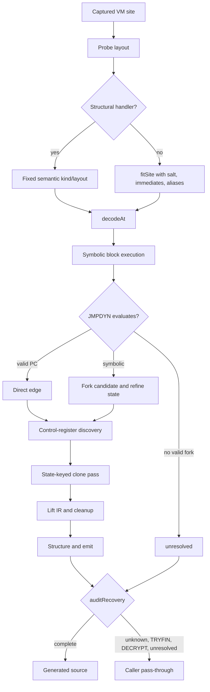

# VM-6 site-salted handler fitting and hash-dispatch recovery

Evidence label: `source-inspection only`.

This page documents the pinned VM-6 sample at
[`e90be6ca716e28f4bba91fe39615a665656bd802`](https://github.com/MichaelXF/claude-vs-js-confuser/tree/e90be6ca716e28f4bba91fe39615a665656bd802/VM-6).
It is a reconstruction contract for the source-defined algorithm. It is not a decoder
implementation, execution result, transfer qualification, runtime-equivalence result, or
production-support claim.

## 1. Target

The target is the JavaScript-embedded register VM whose final top-level expression has the
source-defined capture shape:

```text
CallExpression(Identifier, [NewExpression(3 args), any, any, NewExpression(ObjectExpression)])
```

`findBootstrap` recognizes that shape by scanning top-level expression statements from the end;
it does not prove the callee name or data-flow association beyond the shape. `loadVM` captures the
machine, globals/`this`/arguments, root template, handler prototype, and helper functions after
replacing the bootstrap callee. The input is accepted for deeper processing only when those
captured values expose the expected machine and helper relationships.

The output target is generated JavaScript with the embedded VM machinery removed and the recovered
operations represented as source-oriented expressions/statements, nested functions, control
structures, accessors, and effects. Non-VM input or a failed conversion follows `run`'s normalized
pass-through path. The central discriminator is **site-specific semantic fit**: randomized numeric
handlers are not assigned meanings from their opcode numbers; their layout and operation are
inferred using the concrete function salt, immediate words, and register aliasing at the site.

## 2. Algorithm

1. **Capture the site.** Parse as script, retry as module on a parse error, locate the final
   bootstrap-shaped call, replace only its callee with `__cap`, and evaluate setup in the bounded
   Node VM sandbox. Discover the machine constructor/prototype, template constructor, next-word
   reader, constant reader, and interpreter helper from captured context values.
2. **Observe handler layout.** For every numeric prototype handler, construct a 96-word sentinel
   bytecode buffer and a proxied synthetic frame. Try numeric, object, string, function, array,
   and constructor fills so type-sensitive handlers do not appear write-free merely because an
   unsuitable fill threw. Record consumed word count, register-operand positions, destination
   position, and all-failed errors.
3. **Classify and fit semantics.** Apply source-shape classification first for structural handlers
   such as calls, constructors, functions, control transfers, exceptions, globals, cells,
   accessors, arrays, and objects. For remaining handlers, use the observed layout to fit each
   concrete instruction. Typed probes match ordinary unary/binary/member/`in`/`instanceof`
   operators; numeric probes include the instruction's own immediate words, equal-operand tuples,
   and perturbations that derive an essential-operand mask. The fit is cached by opcode, function
   salt, immediate/alias pattern, and destination layout.
4. **Decode the payload.** Read the captured `Uint32Array` and decode from PC zero. Fixed-layout
   records and variable-width arrays, objects, calls/spreads, methods, constructors, functions,
   and `DATA` records become PC-keyed instruction records with `len` and `next`. Function records
   carry parameter/register counts, rest state, salt, and closure-cell descriptors.
5. **Recover the flattened CFG.** Symbolically execute each function with register values that may
   be constants, unknown live values, function values, operation trees, or call trees. Fitted data
   handlers are called when their essential inputs are concrete; no-cell VM functions may be
   called to evaluate dispatcher expressions. A dynamic jump is a direct edge if it evaluates to a
   valid PC. Otherwise, candidate expression nodes are forked over `false/true` or `0/1`; the
   preferred fork is the one that produces valid targets and makes the selected dispatcher
   registers concrete on both edges. Outgoing states are refined by the fork choice.
6. **Clone by dispatcher state.** A first exploration pass records live registers on which dynamic
   dispatch depends. A second pass keys blocks by those control-state values, cloning each PC up to
   the configured cap so the hash-dispatch chain folds to direct edges. If a jump remains
   unresolved, the representation records an unresolved term for the audit rather than guessing.
   State expression size, clone count, and exploration rounds are bounded.
7. **Lift and simplify.** Map fitted operations to register IR; map globals, members, calls,
   constructors, arrays, objects, `for-in`, cells, accessors, and nested `MAKEFUNC` records to
   source constructs. Snapshot dynamic branch conditions before a register is reused. Split try
   markers, prune unreachable blocks, eliminate pure/dead and flattening-only assignments, merge
   blocks, propagate safe copies, fold constants, rebuild method calls, and structure the graph
   with dominators, natural loops, post-dominators, labels, `if`, `while`, and `try/catch`.
8. **Audit and emit.** Refuse unresolved dynamic jumps, unknown/error data fits, `TRYFIN`, and
   `DECRYPT`. For an accepted graph, generate Babel AST/source, prepend only requested helpers,
   remove VM epilogues, and perform final readability tidy-ups. On any conversion exception,
   `run` returns normalized original source unless `VM_DEBUG` requests the exception to escape.

The internal non-linear control is:



## 3. Implementation

| Phase and ownership | Concrete implementation and representation | Source anchor |
| --- | --- | --- |
| Bootstrap admission — **owned algorithm** | `findBootstrap` scans the top-level body backwards and accepts a four-argument call with a three-argument first `NewExpression` and one-argument object-expression `NewExpression`. It returns `null` for no match. | [`findBootstrap`](https://github.com/MichaelXF/claude-vs-js-confuser/blob/e90be6ca716e28f4bba91fe39615a665656bd802/VM-6/vm.js#L36-L52) |
| Runtime capture — **owned algorithm** | `loadVM` reads/parses source, retries module parsing, replaces the bootstrap callee, generates setup code, evaluates it in a `node:vm` context with standard constructors and a 10-second timeout, and returns captured machine/site values. Regex discovery identifies `W`, `V`, and `Z`; a second scan supplies a fallback `Z` matcher. Missing capture returns `null`; missing `V`/`Z` is not converted to a fake semantic model. | [`loadVM`](https://github.com/MichaelXF/claude-vs-js-confuser/blob/e90be6ca716e28f4bba91fe39615a665656bd802/VM-6/vm.js#L54-L105) |
| Synthetic frame/layout probe — **owned algorithm** | `makeEnv` fills frame slots, installs a Proxy that records register reads/writes, and constructs the machine. `probeLayout` uses distinct sentinel operands and six value fills, catches each handler error, records consumed words from the frame PC, and returns read/write positions or an all-failed error. | [`makeEnv` / `probeLayout`](https://github.com/MichaelXF/claude-vs-js-confuser/blob/e90be6ca716e28f4bba91fe39615a665656bd802/VM-6/vm.js#L112-L177) |
| Structural handler classification — **owned algorithm** | `structuralKind` recognizes source shapes in a fixed precedence order: debugger/decrypt/function/call/return/throw/try, for-in, accessors/member/delete/global/cell, object/array, and jump forms. `FIXED_LAYOUT` defines operand names for recognized kinds. | [`structuralKind` / `FIXED_LAYOUT`](https://github.com/MichaelXF/claude-vs-js-confuser/blob/e90be6ca716e28f4bba91fe39615a665656bd802/VM-6/vm.js#L402-L461) |
| Handler table construction — **shared coordinator** | `buildOpTable` enumerates own numeric prototype properties, gets source text, classifies structural handlers, probes layout, heuristically identifies decoder-based constant loads, and labels the remainder `DATA`. It does not claim an opcode number is a semantic identity. | [`buildOpTable`](https://github.com/MichaelXF/claude-vs-js-confuser/blob/e90be6ca716e28f4bba91fe39615a665656bd802/VM-6/vm.js#L463-L485) |
| Site-aware fitting — **owned algorithm** | `inputGroups` collapses aliased read words. `makeEvaluator` rewrites read words to synthetic register IDs and destination to a write sentinel, then calls the real handler with `C`. `fitSite` first tests typed JS operators; numeric fitting builds immediate/equal-operand cases, perturbs each input to derive `essential`, then returns constant/unary/binary/two-stage/three-input forms or `ERR`/`UNKNOWN`. The `A.fit` cache key combines opcode, function salt `C`, read alias groups, destination, and non-read words. | [`inputGroups` / `makeEvaluator` / `fitSite`](https://github.com/MichaelXF/claude-vs-js-confuser/blob/e90be6ca716e28f4bba91fe39615a665656bd802/VM-6/vm.js#L216-L395); [`makeAnalyzer` fit cache](https://github.com/MichaelXF/claude-vs-js-confuser/blob/e90be6ca716e28f4bba91fe39615a665656bd802/VM-6/vm.js#L530-L575) |
| Instruction decoding — **owned algorithm** | `decodeAt` maps an opcode to fixed or variable-width fields, including spread calls, methods, `MAKEFUNC` closure descriptors, and generic `DATA` operands. It returns `null` for an unknown opcode-table entry and records `len`/`next`; it does not perform a broad malformed-tail validation. | [`decodeAt`](https://github.com/MichaelXF/claude-vs-js-confuser/blob/e90be6ca716e28f4bba91fe39615a665656bd802/VM-6/vm.js#L491-L528) |
| Analysis helpers — **delegated within this page** | `readConst` calls the captured constant reader in a synthetic environment; `essentialMask` turns a fit into live input positions; `execData` invokes a handler and retrieves the destination write; `callVMFunction` invokes a no-cell VM function with a reconstructed template and full machine payload. A closure-bearing call throws rather than being approximated. | [`makeAnalyzer`](https://github.com/MichaelXF/claude-vs-js-confuser/blob/e90be6ca716e28f4bba91fe39615a665656bd802/VM-6/vm.js#L530-L591) |
| Symbolic value evaluation — **owned algorithm** | `evaluate` handles constants, unknowns, function values, fitted operations, and calls. `forkCandidates` walks only essential operation arguments and prioritizes in-block boolean-producing nodes. `resolveDyn` tries a direct valid PC, then false/true or 0/1 forks, scores control-register concreteness, and returns `goto`, `branch`, or `unresolved`. | [`evaluate` / `forkCandidates` / `resolveDyn`](https://github.com/MichaelXF/claude-vs-js-confuser/blob/e90be6ca716e28f4bba91fe39615a665656bd802/VM-6/vm.js#L621-L730) |
| Control-state discovery and CFG — **owned algorithm** | `volatileRegs` finds registers captured by new closure cells and follows direct/static handler targets. `exploreFunction` worklists block states, records instruction statements, propagates symbolic registers, creates branch/for-in/try edges, refines branch states, and records dynamic slices. `exploreOne` runs an imprecise pass, derives live dispatcher-dependent registers, and reruns with state-keyed cloning; `exploreAll` queues nested functions from `MAKEFUNC`. | [`volatileRegs` / `exploreFunction` / `exploreOne` / `exploreAll`](https://github.com/MichaelXF/claude-vs-js-confuser/blob/e90be6ca716e28f4bba91fe39615a665656bd802/VM-6/vm.js#L732-L1009) |
| State bounds — **owned safety boundary** | `MAXNODES` limits symbolic value size; expressions over the bound become unknown, clone keys cap at 400 instances per PC and then use a wildcard, and exploration throws after 200,000 rounds. An unresolved dynamic jump survives to the audit. | [`MAXNODES` / `refineState` / clone cap / round bound](https://github.com/MichaelXF/claude-vs-js-confuser/blob/e90be6ca716e28f4bba91fe39615a665656bd802/VM-6/vm.js#L597-L605); [`refineState` / `exploreFunction`](https://github.com/MichaelXF/claude-vs-js-confuser/blob/e90be6ca716e28f4bba91fe39615a665656bd802/VM-6/vm.js#L678-L687); [`keyOf` / worklist](https://github.com/MichaelXF/claude-vs-js-confuser/blob/e90be6ca716e28f4bba91fe39615a665656bd802/VM-6/vm.js#L784-L825) |
| IR lifting — **owned algorithm** | `liftFunction` maps fitted records to `E` expressions and statement IR, preserves source-level globals/member/call/new/accessor semantics, resolves cells through parent contexts, recursively lifts nested functions, and snapshots dynamic branch conditions into temporaries. Dispatcher slices and control-register assignments are marked `flattening`. `TRYFIN` and `DECRYPT` are lowered to no-op IR but remain audit refusals. | [`E` / `liftFunction`](https://github.com/MichaelXF/claude-vs-js-confuser/blob/e90be6ca716e28f4bba91fe39615a665656bd802/VM-6/vm.js#L1015-L1188) |
| Cleanup — **owned algorithm** | `splitTryBlocks` converts try/catch markers to block terms; `pruneUnreachable` removes disconnected blocks. `deadCodeElim` computes live-in sets and preserves impure effects, `removeFlatteningChains` removes assignments used only by the dispatcher, `mergeBlocks` redirects empty gotos/splices single predecessor-successor pairs, and `simplifyBlock` performs bounded copy propagation, constant folding, and method-call rebuilding. | [`splitTryBlocks` through `mergeBlocks`](https://github.com/MichaelXF/claude-vs-js-confuser/blob/e90be6ca716e28f4bba91fe39615a665656bd802/VM-6/vm.js#L1190-L1353); [`simplifyBlock`](https://github.com/MichaelXF/claude-vs-js-confuser/blob/e90be6ca716e28f4bba91fe39615a665656bd802/VM-6/vm.js#L1581-L1735) |
| CFG structuring — **owned algorithm** | `structureFunction` computes reverse post-order, dominators, natural loops, and on-demand branch joins/post-dominators. It emits `while (true)` plus breaks/continues, `if/else`, and `try/catch`; irreducible re-entry detected by the path set throws. | [`structureFunction`](https://github.com/MichaelXF/claude-vs-js-confuser/blob/e90be6ca716e28f4bba91fe39615a665656bd802/VM-6/vm.js#L1355-L1579) |
| Babel emission — **owned algorithm** | `makeEmitter` lowers IR to Babel nodes, sanitizes global/member names, emits closures/accessors/calls/constructors, installs `for-in` and unknown-op helpers only when requested, and emits an IIFE for a root containing top-level return. `prettify` removes VM epilogues, simplifies loops/ifs, merges declarations, folds arithmetic spelling, and renames generated register names. | [`HELPERS`](https://github.com/MichaelXF/claude-vs-js-confuser/blob/e90be6ca716e28f4bba91fe39615a665656bd802/VM-6/vm.js#L1853-L1873) and [`makeEmitter`](https://github.com/MichaelXF/claude-vs-js-confuser/blob/e90be6ca716e28f4bba91fe39615a665656bd802/VM-6/vm.js#L1763-L1847); [`deobfuscate` emission](https://github.com/MichaelXF/claude-vs-js-confuser/blob/e90be6ca716e28f4bba91fe39615a665656bd802/VM-6/vm.js#L1900-L2047); [`prettify`](https://github.com/MichaelXF/claude-vs-js-confuser/blob/e90be6ca716e28f4bba91fe39615a665656bd802/VM-6/vm.js#L2053-L2196) |
| Recovery audit — **owned safety boundary** | `auditRecovery` counts unresolved terms, `UNKNOWN`/`ERR` fits, `TRYFIN`, and `DECRYPT`; any count becomes a conversion error before lifting/emission. `deobfuscate` returns `null` only for no VM, otherwise lets errors reach `run`. | [`auditRecovery` / `deobfuscate`](https://github.com/MichaelXF/claude-vs-js-confuser/blob/e90be6ca716e28f4bba91fe39615a665656bd802/VM-6/vm.js#L1875-L1906) |
| Caller fallback — **owned boundary** | `run` rethrows under `VM_DEBUG`; otherwise reports the error, returns normalized original source for no-VM or failed conversion, and writes it when an output path is supplied. | [`run`](https://github.com/MichaelXF/claude-vs-js-confuser/blob/e90be6ca716e28f4bba91fe39615a665656bd802/VM-6/vm.js#L2198-L2215) |

The helpers and emitter are cited separately because the helper definitions begin at lines 1853–1873
while `makeEmitter` occupies lines 1763–1847.

## 4. Upstream Effects

There is no earlier decoder pass in this sample-owned, standalone plugin. `deobfuscate` receives
raw source text, parses it, and owns the full capture-to-emission chain. Consequently, no sibling
VM-1/VM-3 transform is an upstream prerequisite and no prior decoder pass is allowed to rewrite the
bootstrap or handler spelling before `findBootstrap`/`structuralKind` sees it.

Within this page, the meaningful producer/consumer edges are internal: `loadVM` produces the
captured site; `probeLayout` and `structuralKind` produce handler schemas; `fitSite` produces
semantic records and essential masks; `decodeAt` consumes those records; symbolic exploration
consumes the fitted analyzer; `liftFunction` consumes the CFG; cleanup and structuring consume the
lifted IR; and audit gates emission. These are composition dependencies, not cross-plugin upstream
effects. The VM-1 and VM-3 pages are related references only; their fixed-opcode or canonical
handler algorithms must not be substituted here.

## 5. Known Gaps

- `TRYFIN` is recognized and represented as a no-op during lifting, but `auditRecovery` refuses
  every such region; only the source's `try/catch` path is eligible for the documented output.
- `DECRYPT`/self-decrypting bytecode is recognized but refused by the audit. The implementation
  does not claim to emulate or safely reconstruct self-modifying bytecode.
- A dynamic jump with no valid direct evaluation or accepted fork remains `unresolved` and causes
  conversion refusal. Irreducible graph re-entry can throw during structuring.
- The `fitSite` model is bounded to its typed operators and its constant/unary/binary/two-stage/
  three-input candidates. More complex semantics, fits whose output varies beyond the probe
  evidence, and fitting errors are not generalized.
- `callVMFunction` refuses closure-bearing functions while evaluating symbolic calls. A dispatcher
  or constant expression requiring such a call can remain symbolic and fail the dynamic-jump audit.
- Symbolic values are bounded by `MAXNODES = 400`, state cloning by 400 instances per PC, and CFG
  exploration by 200,000 rounds. Clone wildcarding is an intentional loss of precision, not proof
  of complete recovery.
- `decodeAt` checks for a known opcode record but does not independently prove every variable-width
  tail is in bounds. Malformed payloads therefore remain a source-defined error/fallback boundary,
  not a validated acceptance class.
- Bootstrap admission is shape-based and does not data-flow-prove that all four call arguments are
  one coherent VM. Decoys or alternate layouts outside the captured relationship are not covered.
- `loadVM` evaluates top-level setup in a Node VM context and uses regex discovery for helper
  functions. The sandbox is not qualified as a security boundary.
- The generated `for-in` and `unknownOp` helpers are source emission choices only. No helper,
  generated output, runtime behavior, hidden state, names, comments, or formatting is qualified
  by this source-only page.

## Source

| Source area | Pinned source and ownership |
| --- | --- |
| VM-6 corpus boundary | [`VM-6 tree`](https://github.com/MichaelXF/claude-vs-js-confuser/tree/e90be6ca716e28f4bba91fe39615a665656bd802/VM-6) — sample-owned documentary scope |
| Admission/capture | [`vm.js#L36-L105`](https://github.com/MichaelXF/claude-vs-js-confuser/blob/e90be6ca716e28f4bba91fe39615a665656bd802/VM-6/vm.js#L36-L105) — `findBootstrap`, `loadVM` |
| Layout/classification | [`vm.js#L112-L177`](https://github.com/MichaelXF/claude-vs-js-confuser/blob/e90be6ca716e28f4bba91fe39615a665656bd802/VM-6/vm.js#L112-L177), [`vm.js#L402-L485`](https://github.com/MichaelXF/claude-vs-js-confuser/blob/e90be6ca716e28f4bba91fe39615a665656bd802/VM-6/vm.js#L402-L485) — synthetic probe and handler table |
| Fitting/analyzer | [`vm.js#L216-L395`](https://github.com/MichaelXF/claude-vs-js-confuser/blob/e90be6ca716e28f4bba91fe39615a665656bd802/VM-6/vm.js#L216-L395), [`vm.js#L530-L591`](https://github.com/MichaelXF/claude-vs-js-confuser/blob/e90be6ca716e28f4bba91fe39615a665656bd802/VM-6/vm.js#L530-L591) — site fit, cache, essentiality, handler/VM evaluation |
| Decode/CFG | [`vm.js#L491-L528`](https://github.com/MichaelXF/claude-vs-js-confuser/blob/e90be6ca716e28f4bba91fe39615a665656bd802/VM-6/vm.js#L491-L528), [`vm.js#L597-L1009`](https://github.com/MichaelXF/claude-vs-js-confuser/blob/e90be6ca716e28f4bba91fe39615a665656bd802/VM-6/vm.js#L597-L1009) — records, symbolic state, dynamic forks, clone exploration |
| Lift/cleanup/structure | [`vm.js#L1015-L1188`](https://github.com/MichaelXF/claude-vs-js-confuser/blob/e90be6ca716e28f4bba91fe39615a665656bd802/VM-6/vm.js#L1015-L1188), [`vm.js#L1190-L1735`](https://github.com/MichaelXF/claude-vs-js-confuser/blob/e90be6ca716e28f4bba91fe39615a665656bd802/VM-6/vm.js#L1190-L1735) — IR, DCE, flattening cleanup, graph structuring |
| Emission/audit/fallback | [`vm.js#L1763-L1847`](https://github.com/MichaelXF/claude-vs-js-confuser/blob/e90be6ca716e28f4bba91fe39615a665656bd802/VM-6/vm.js#L1763-L1847), [`vm.js#L1875-L2047`](https://github.com/MichaelXF/claude-vs-js-confuser/blob/e90be6ca716e28f4bba91fe39615a665656bd802/VM-6/vm.js#L1875-L2047), [`vm.js#L2053-L2215`](https://github.com/MichaelXF/claude-vs-js-confuser/blob/e90be6ca716e28f4bba91fe39615a665656bd802/VM-6/vm.js#L2053-L2215) — Babel emission, audit, driver behavior |

## Fixtures

The retained artifacts are mapped to the bounded claims they can support.

| Corpus artifact | Claim pinned | Status |
| --- | --- | --- |
| `VM-6/input.js` | Concrete bootstrap, handler-table, payload, constant-pool, and template shapes | Pinned fixture/source evidence only; no transfer claim |
| `VM-6/output.js` | Existing generated source shape | Generated-output provenance only |
| `VM-6/regular.js` | Ordinary source should take the non-VM path | Negative-control fixture |
| `VM-6/README.md` | Documented API options and CLI invocation | Documentation/provenance only |
| `VM-6/NOTES.md` | Architecture/limitations context and intended checks | Documentation/provenance only; not the sole algorithm record |
| `VM-6/test-features.js` | Intended synthetic payload coverage for structural operations | Test-intent evidence; no feature qualification is claimed |
| `VM-6/test.js` | Intended parse/string/residue/behavior/pass-through checks | Test-intent evidence; no behavioral result is claimed |
