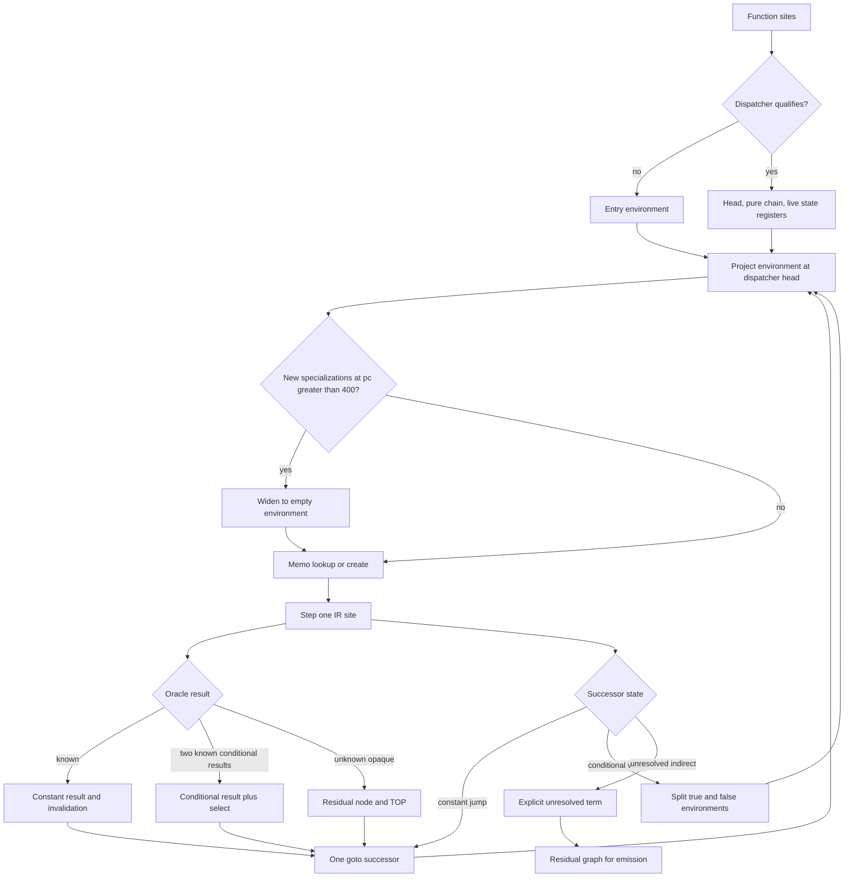

# VM-8 oracle classification and partial evaluation

Evidence label: `source-inspection only`. The description is pinned to corpus commit
`e90be6ca716e28f4bba91fe39615a665656bd802`; it makes no execution, behavioral, transfer, or
production claim.

## 1. Target

Recover source-oriented JavaScript from the pinned VM-8 sample by extracting its runtime
descriptor, classifying payload sites from one-step behavior, recovering functions and control/data
flow, specializing resolvable dispatcher state, and emitting residual or structured source. Preserve
the source-defined passthrough on failed admission/loading and retain warning/error forms for
recognized but unresolved operations.

## 2. Algorithm

VM-8 first recognizes a structural bootstrap and extracts the runtime, bytecode, pool, prototype,
metadata, and constructor arguments. It probes the interpreter one instruction at a time. The
disassembler sweeps a mutable bytecode copy, allowing source-defined mutations such as decryption,
and records variable-width sites. Classification is per site: structural effects are identified,
then typed and numeric candidates are fitted using exact probe outcomes, low-nibble residue order,
and a stable-result oracle.

The recovered sites become function/closure CFGs. `findDispatcher` counts incoming successor edges,
selects the single greatest-indegree head (the first encountered head wins a tie), requires that
head to have at least three incoming edges, and does not try a second head if the selected chain
later fails. Its chain admits the explicit `PURE` set
`const`, `mov`, `bin`, `binimm`, `un`, `opaque`, `jmp`, `jf`, `jt`, and `nop`; an unconditional `jmp`
ends the walk, while conditional edges and fall-through continue it. The chain must contain at
least five sites. A numeric-program-counter scan records registers read before their first write in
the sorted chain, and admission requires one through four such live-in registers. These details
separate a dispatcher near-neighbor from a safe decline ([`lib-peval.js:16,34-70`](https://github.com/MichaelXF/claude-vs-js-confuser/blob/e90be6ca716e28f4bba91fe39615a665656bd802/VM-8/lib-peval.js#L16-L70)).

The partial evaluator carries a small abstract environment: `TOP`, concrete values represented as
`{k:'c',v}`, and conditional values represented as
`{k:'dom',cond:{reg,neg},t,f}`; an absent register is treated as `TOP`. At a dispatcher head it
projects the environment to the live-in state registers. Its memo key sorts register ids and skips
`TOP`; strings are tagged with `s`, every non-null object with `o`, and the conditional branch values
are encoded with their condition register and negation. A node is widened to an empty environment
before lookup when the per-PC counter exceeds 400. That counter increments only when a new
specialization is memoized; memo hits increment predecessor counts but do not count as visits, so the
source does not mean “reached more than 400 times.”

Each node copies its environment before stepping. If a memoized node has no site at its program
counter, the source emits a null-return node. At a dispatcher head the first conditional state
value in `disp.state` is split into true and false constant specializations. Constant jumps are
folded; unknown `jf`/`jt` branches create both target and fall-through successors with the same
unrefined environment; a known `jreg` follows its target only when that target is present in the
function site map. A missing target remains an unresolved term. Foldable operations call the per-site
oracle with known inputs; a known result keeps the ordinary IR statement except for an `opaque` site,
which becomes a constant, and when the first conditional input
produces two known results the result becomes a conditional value plus a `select` IR statement.
Unresolved opaque operations remain residual and write `TOP`. Boolean comparisons and `!` seed fresh
conditional values. Every write invalidates other conditional values whose condition register was
overwritten, rather than invalidating the value that was written. A `trypush` with no catch PC is
unresolved; otherwise the handler environment sets the exception register to `TOP` and an optional
flag register to its constant, while `trypop` advances normally. `forinnext` writes `TOP` to its
destination and invalidates dependent conditionals. These transitions preserve unresolved control as
residual graph state ([`lib-peval.js:73-260`](https://github.com/MichaelXF/claude-vs-js-confuser/blob/e90be6ca716e28f4bba91fe39615a665656bd802/VM-8/lib-peval.js#L73-L260)).

Emitter passes compute liveness, introduce register-version temporaries, remove dead pure
definitions, and structure loops/conditionals/try regions. Temporary renaming only changes a
non-pinned register when it has a later definition or is not live-out; live-out excludes reads by
the block's own terminator while pinned registers remain live. Dead pure statements do not add
dependencies during the backward walk. Structuring uses same-depth try-end matching, the last RPO
outside-loop exit when several exits exist, and the first dominated common reachable join for a
branch. A single global duplicate counter emits an explicit `unstructured control flow` throw after
more than 500 re-emissions. Codegen maps the residual IR to AST and polish applies source-level
cleanup.

The solution-level transition is:

`source AST -> bootstrap/runtime descriptor -> one-step probe evidence -> mutable site IR and classes -> function/closure CFG -> oracle-driven residual/partially evaluated graph -> liveness/structured AST -> optional polish`.

The distinctive boundary is site classification plus oracle-driven environment specialization. It
is not VM-7's global handler model and liveness-keyed abstract-state propagation.

## 3. Implementation

### Bootstrap extraction and runtime descriptor

[`VM-8/lib-extract.js:17-52`](https://github.com/MichaelXF/claude-vs-js-confuser/blob/e90be6ca716e28f4bba91fe39615a665656bd802/VM-8/lib-extract.js#L17-L52) reverse-scans top-level statements for the concrete bootstrap shape:
an identifier call, constructor arguments, an object argument, an array argument, and multiple
identifiers. It optionally records a variable initialized from `VM.prototype`; [`lib-extract.js:54-101`](https://github.com/MichaelXF/claude-vs-js-confuser/blob/e90be6ca716e28f4bba91fe39615a665656bd802/VM-8/lib-extract.js#L54-L101) falls back to the direct prototype member when that alias is absent, then replaces the bootstrap with an export
statement for `VM`, `Fn`, interpreter, prototype, bytecode, pool, metadata, and constructor args,
then generates and runs the setup in a `node:vm` sandbox. [`VM-8/vm.js:33-78`](https://github.com/MichaelXF/claude-vs-js-confuser/blob/e90be6ca716e28f4bba91fe39615a665656bd802/VM-8/vm.js#L33-L78) gates the path,
returns source passthrough when no descriptor is obtained, and otherwise orders prepare, analyze,
partial evaluation, codegen, and optional polish.

### One-step probes and mutable disassembly

[`VM-8/lib-probe.js:9-83`](https://github.com/MichaelXF/claude-vs-js-confuser/blob/e90be6ca716e28f4bba91fe39615a665656bd802/VM-8/lib-probe.js#L9-L83) defines tracer/iterator/global proxies. [`lib-probe.js:87-195`](https://github.com/MichaelXF/claude-vs-js-confuser/blob/e90be6ca716e28f4bba91fe39615a665656bd802/VM-8/lib-probe.js#L87-L195) constructs a VM with
proxied stack/registers, wraps each handler, invokes `M.interp` with a synthetic function/frame,
and stops after the first instruction (or records a throw/unwind). [`lib-probe.js:197-200`](https://github.com/MichaelXF/claude-vs-js-confuser/blob/e90be6ca716e28f4bba91fe39615a665656bd802/VM-8/lib-probe.js#L197-L200) prepares numeric
opcode keys.

[`VM-8/lib-disasm.js:14-45`](https://github.com/MichaelXF/claude-vs-js-confuser/blob/e90be6ca716e28f4bba91fe39615a665656bd802/VM-8/lib-disasm.js#L14-L45) copies the bytecode into a mutable `Uint32Array`, supplies tracer
registers, calls the one-step probe with `mutate:true`, records the program counter/opcode/
operands/next PC, and assigns the mutated copy back to `M.bytecode`. [`lib-disasm.js:50-81`](https://github.com/MichaelXF/claude-vs-js-confuser/blob/e90be6ca716e28f4bba91fe39615a665656bd802/VM-8/lib-disasm.js#L50-L81) separately inspects
closure frame headers while temporarily replacing handlers. These are source-defined runtime
observation operations. Their presence in source does not establish a runtime result.

### Per-site classification and oracle fitting

[`VM-8/lib-disasm.js:94-118`](https://github.com/MichaelXF/claude-vs-js-confuser/blob/e90be6ca716e28f4bba91fe39615a665656bd802/VM-8/lib-disasm.js#L94-L118) recognizes return/throw and [`lib-disasm.js:119-194`](https://github.com/MichaelXF/claude-vs-js-confuser/blob/e90be6ca716e28f4bba91fe39615a665656bd802/VM-8/lib-disasm.js#L119-L194) classifies try bookkeeping,
upvalues, branches, jumps, and for-in behavior. [`lib-disasm.js:195-243`](https://github.com/MichaelXF/claude-vs-js-confuser/blob/e90be6ca716e28f4bba91fe39615a665656bd802/VM-8/lib-disasm.js#L195-L243) handles globals, calls, construction,
deletion, property definitions/sets, and object effects; [`lib-disasm.js:244-279`](https://github.com/MichaelXF/claude-vs-js-confuser/blob/e90be6ca716e28f4bba91fe39615a665656bd802/VM-8/lib-disasm.js#L244-L279) handles arrays, properties,
receiver/closure/move effects. Numeric and opaque cases are classified at [`lib-disasm.js:280-309`](https://github.com/MichaelXF/claude-vs-js-confuser/blob/e90be6ca716e28f4bba91fe39615a665656bd802/VM-8/lib-disasm.js#L280-L309).

[`VM-8/lib-classify.js:54-85`](https://github.com/MichaelXF/claude-vs-js-confuser/blob/e90be6ca716e28f4bba91fe39615a665656bd802/VM-8/lib-classify.js#L54-L85) creates unary, binary, immediate, wrapping, and integer-multiply
candidate families. [`lib-classify.js:87-107`](https://github.com/MichaelXF/claude-vs-js-confuser/blob/e90be6ca716e28f4bba91fe39615a665656bd802/VM-8/lib-classify.js#L87-L107) uses residue hints only to order the search; [`lib-classify.js:110-139`](https://github.com/MichaelXF/claude-vs-js-confuser/blob/e90be6ca716e28f4bba91fe39615a665656bd802/VM-8/lib-classify.js#L110-L139) defines
typed domains and exact outcome comparison. [`lib-classify.js:141-197`](https://github.com/MichaelXF/claude-vs-js-confuser/blob/e90be6ca716e28f4bba91fe39615a665656bd802/VM-8/lib-classify.js#L141-L197) fits typed operations, including throws;
[`lib-classify.js:199-270`](https://github.com/MichaelXF/claude-vs-js-confuser/blob/e90be6ca716e28f4bba91fe39615a665656bd802/VM-8/lib-classify.js#L199-L270) searches numeric residues, immediate constants, live-register combinations, and exact
trial outcomes. [`lib-classify.js:272-290`](https://github.com/MichaelXF/claude-vs-js-confuser/blob/e90be6ca716e28f4bba91fe39615a665656bd802/VM-8/lib-classify.js#L272-L290) executes repeated rounds and accepts a constant only when the observed
destination is stable. This per-site evidence is the input to partial evaluation, not a global
opcode-name table.

### Function graph and partial evaluation

[`VM-8/lib-analyze.js:8-60`](https://github.com/MichaelXF/claude-vs-js-confuser/blob/e90be6ca716e28f4bba91fe39615a665656bd802/VM-8/lib-analyze.js#L8-L60) sweeps function sites, creates the main function from metadata, queues
closures, follows successors, and follows constant sites for indirect jump registers;
[`lib-analyze.js:63-74`](https://github.com/MichaelXF/claude-vs-js-confuser/blob/e90be6ca716e28f4bba91fe39615a665656bd802/VM-8/lib-analyze.js#L63-L74) defines successor behavior for returns, throws, jumps, branches, try regions, and
fall-through. The worklist throws `jump into the middle of an instruction` if it reaches a PC
absent from the sweep index; ordinary successor edges and constant `jreg` candidates are
index-gated.

[`VM-8/lib-peval.js:16,34-70`](https://github.com/MichaelXF/claude-vs-js-confuser/blob/e90be6ca716e28f4bba91fe39615a665656bd802/VM-8/lib-peval.js#L16-L70) finds the one greatest-indegree dispatcher head, walks the explicit
pure set until an unconditional jump, and computes live-in registers by numeric-PC read-before-write
scanning. It requires at least five chain sites and one through four live-ins. [`lib-peval.js:73-260`](https://github.com/MichaelXF/claude-vs-js-confuser/blob/e90be6ca716e28f4bba91fe39615a665656bd802/VM-8/lib-peval.js#L73-L260) starts with
an empty environment, projects only the retained state registers at the head, memoizes a stable
`pc#environment` key, widens before lookup after more than 400 newly memoized specializations at one
PC, splits conditional dispatcher state, folds constant jumps, calls the oracle for foldable
operations, invalidates dependent conditional values after writes, and emits residual
clones/selects/opaque nodes when values are not known. The residual graph, rather than a claimed
fully evaluated program, is the contract for unresolved effects.

### Emission, structuring, codegen, and polish

[`VM-8/lib-emit.js:8-112`](https://github.com/MichaelXF/claude-vs-js-confuser/blob/e90be6ca716e28f4bba91fe39615a665656bd802/VM-8/lib-emit.js#L8-L112) defines register uses, successors, predecessor rebuilding, and use
remapping. [`lib-emit.js:114-188`](https://github.com/MichaelXF/claude-vs-js-confuser/blob/e90be6ca716e28f4bba91fe39615a665656bd802/VM-8/lib-emit.js#L114-L188) introduces block-local SSA-like versions: a non-pinned definition becomes a
fresh temporary when it has a later definition or is not live-out, while a block's own terminator
does not make a value live-out. [`lib-emit.js:191-248`](https://github.com/MichaelXF/claude-vs-js-confuser/blob/e90be6ca716e28f4bba91fe39615a665656bd802/VM-8/lib-emit.js#L191-L248) walks statements backwards, drops dead pure definitions,
and preserves side-effect statements; [`lib-emit.js:250-315`](https://github.com/MichaelXF/claude-vs-js-confuser/blob/e90be6ca716e28f4bba91fe39615a665656bd802/VM-8/lib-emit.js#L250-L315) computes graph dominators/loops; [`lib-emit.js:318-491`](https://github.com/MichaelXF/claude-vs-js-confuser/blob/e90be6ca716e28f4bba91fe39615a665656bd802/VM-8/lib-emit.js#L318-L491) matches try-end markers at the same nesting
depth, picks a loop follow (the last RPO exit when there are several), finds the first dominated
common reachable branch join, and uses a single global duplicate counter to throw an explicit
`unstructured control flow` after more than 500 re-emissions. It emits returns, throws, gotos, try/catch, iteration, conditionals,
loops, and explicit unresolved-control results.

[`VM-8/lib-codegen.js:72-180`](https://github.com/MichaelXF/claude-vs-js-confuser/blob/e90be6ca716e28f4bba91fe39615a665656bd802/VM-8/lib-codegen.js#L72-L180) names functions/upvalues, builds declarations/parameters, and maps
IR values; [`lib-codegen.js:181-267`](https://github.com/MichaelXF/claude-vs-js-confuser/blob/e90be6ca716e28f4bba91fe39615a665656bd802/VM-8/lib-codegen.js#L181-L267) maps constants, movement, arithmetic, properties, calls, arrays/objects,
closures, for-in, try regions, opaque warnings, and unknown warnings to AST. [`vm.js:33-78`](https://github.com/MichaelXF/claude-vs-js-confuser/blob/e90be6ca716e28f4bba91fe39615a665656bd802/VM-8/vm.js#L33-L78) then
wraps functions, adds the for-in helper, optionally calls polish, unwraps a no-return wrapper, and
generates source. [`VM-8/lib-polish.js:102-450`](https://github.com/MichaelXF/claude-vs-js-confuser/blob/e90be6ca716e28f4bba91fe39615a665656bd802/VM-8/lib-polish.js#L102-L450) orders temporary inlining, literal propagation,
peepholes, dead-store removal, temporary renaming, and cleanup. The pinned file has a raw NUL at
byte offset 9417 in line 197 inside `writtenIn`; that source-integrity gap is not normalized here.

### Source ownership

| Source span | Ownership | Material decision or representation |
| --- | --- | --- |
| [`VM-8/vm.js:33-78`](https://github.com/MichaelXF/claude-vs-js-confuser/blob/e90be6ca716e28f4bba91fe39615a665656bd802/VM-8/vm.js#L33-L78) | Shared coordinator | Admission, phase order, optional polish, wrapper removal, and passthrough result. |
| [`VM-8/lib-extract.js:17-101`](https://github.com/MichaelXF/claude-vs-js-confuser/blob/e90be6ca716e28f4bba91fe39615a665656bd802/VM-8/lib-extract.js#L17-L101) | Shared coordinator | Structural bootstrap recognition and sandboxed runtime descriptor export. |
| [`VM-8/lib-probe.js:87-200`](https://github.com/MichaelXF/claude-vs-js-confuser/blob/e90be6ca716e28f4bba91fe39615a665656bd802/VM-8/lib-probe.js#L87-L200) | VM-8 transform | One-step synthetic-frame observation record, including writes, fall-through, and throws. |
| [`VM-8/lib-disasm.js:14-310`](https://github.com/MichaelXF/claude-vs-js-confuser/blob/e90be6ca716e28f4bba91fe39615a665656bd802/VM-8/lib-disasm.js#L14-L310) | VM-8 transform | Mutable bytecode sweep and per-site structural/semantic IR classification. |
| [`VM-8/lib-classify.js:54-290`](https://github.com/MichaelXF/claude-vs-js-confuser/blob/e90be6ca716e28f4bba91fe39615a665656bd802/VM-8/lib-classify.js#L54-L290) | VM-8 transform | Typed/numeric candidate families, residue ordering, exact outcomes, and stable oracle results. |
| [`VM-8/lib-analyze.js:8-74`](https://github.com/MichaelXF/claude-vs-js-confuser/blob/e90be6ca716e28f4bba91fe39615a665656bd802/VM-8/lib-analyze.js#L8-L74) | VM-8 transform | Function/closure discovery, reachable site maps, and successor edges. |
| [`VM-8/lib-peval.js:34-263`](https://github.com/MichaelXF/claude-vs-js-confuser/blob/e90be6ca716e28f4bba91fe39615a665656bd802/VM-8/lib-peval.js#L34-L263) | VM-8 transform | Dispatcher admission, abstract environments, memoized specialization, widening, and residual terms. |
| [`VM-8/lib-emit.js:8-493`](https://github.com/MichaelXF/claude-vs-js-confuser/blob/e90be6ca716e28f4bba91fe39615a665656bd802/VM-8/lib-emit.js#L8-L493) | VM-8 transform | IR use/liveness cleanup, graph structuring, and explicit unresolved-control results. |
| [`VM-8/lib-codegen.js:72-270`](https://github.com/MichaelXF/claude-vs-js-confuser/blob/e90be6ca716e28f4bba91fe39615a665656bd802/VM-8/lib-codegen.js#L72-L270) | VM-8 transform | Function naming, register lowering, warnings, and IR-to-AST emission. |
| [`VM-8/lib-polish.js:102-450`](https://github.com/MichaelXF/claude-vs-js-confuser/blob/e90be6ca716e28f4bba91fe39615a665656bd802/VM-8/lib-polish.js#L102-L450) | VM-8 transform; driver-gated | Optional source cleanup; the pinned `writtenIn` marker remains source-integrity-limited. |

The transform page owns the algorithmic phases and their representations above. Babel AST
construction/generation and the Node VM facility are execution substrate; they are not separate
VM-8 transforms or evidence of runtime qualification.

The downstream ownership contract is summarized here so the source spans do not read as a flat
inventory:

| Owned phase | Decision and preserved boundary |
| --- | --- |
| Temporary renaming and liveness | Rename only non-pinned definitions with a later definition or no live-out use; keep pinned registers and terminator inputs required inside the block ([`lib-emit.js:114-188`](https://github.com/MichaelXF/claude-vs-js-confuser/blob/e90be6ca716e28f4bba91fe39615a665656bd802/VM-8/lib-emit.js#L114-L188)). |
| Dead pure-definition removal | Walk backward from successors, terminators, and side effects; remove a dead pure definition without adding its inputs to the dependency set, while retaining side-effect statements ([`lib-emit.js:191-248`](https://github.com/MichaelXF/claude-vs-js-confuser/blob/e90be6ca716e28f4bba91fe39615a665656bd802/VM-8/lib-emit.js#L191-L248)). |
| Structured control emission | Match a same-depth `tryend`; choose the last RPO outside-loop exit when several exist; choose the first dominated join reachable from both branch arms; a single global duplicate counter emits an explicit unstructured-control throw after more than 500 re-emissions ([`lib-emit.js:318-491`](https://github.com/MichaelXF/claude-vs-js-confuser/blob/e90be6ca716e28f4bba91fe39615a665656bd802/VM-8/lib-emit.js#L318-L491)). |

### Safety and decline boundary

| Condition | Source-defined result | Anchor |
| --- | --- | --- |
| No admissible bootstrap or runtime-load error | Original source, `passthrough: true`, empty warnings | [`VM-8/vm.js:33-78`](https://github.com/MichaelXF/claude-vs-js-confuser/blob/e90be6ca716e28f4bba91fe39615a665656bd802/VM-8/vm.js#L33-L78) |
| Recognized opaque/unknown IR | Opaque IR becomes a warning-bearing `undefined` assignment; unknown IR becomes an empty statement | [`VM-8/lib-codegen.js:181-267`](https://github.com/MichaelXF/claude-vs-js-confuser/blob/e90be6ca716e28f4bba91fe39615a665656bd802/VM-8/lib-codegen.js#L181-L267) |
| Unresolved computed jump | Generated explicit throw statement | [`VM-8/lib-emit.js:365-368`](https://github.com/MichaelXF/claude-vs-js-confuser/blob/e90be6ca716e28f4bba91fe39615a665656bd802/VM-8/lib-emit.js#L365-L368) |
| Excessive duplicated/unstructured graph | Generated explicit `unstructured control flow` throw | [`VM-8/lib-emit.js:349-352`](https://github.com/MichaelXF/claude-vs-js-confuser/blob/e90be6ca716e28f4bba91fe39615a665656bd802/VM-8/lib-emit.js#L349-L352) |
| Malformed source/analysis exception | May escape the relevant source path | [`VM-8/lib-extract.js:13-15`](https://github.com/MichaelXF/claude-vs-js-confuser/blob/e90be6ca716e28f4bba91fe39615a665656bd802/VM-8/lib-extract.js#L13-L15), [`VM-8/lib-analyze.js:8-60`](https://github.com/MichaelXF/claude-vs-js-confuser/blob/e90be6ca716e28f4bba91fe39615a665656bd802/VM-8/lib-analyze.js#L8-L60) |

The implementation's descriptor extraction and probes execute generated setup/interpreter paths in
a sandbox. Source inspection does not establish VM behavior, test results, or sandbox safety.

## 4. Upstream Effects

Within the pinned decoder, `lib-extract` and the driver produce the shapes consumed by the
transform:

| Produced spelling/shape | Producer | VM-8 use |
| --- | --- | --- |
| Top-level bootstrap call and optional prototype alias | [`lib-extract.js:17-52`](https://github.com/MichaelXF/claude-vs-js-confuser/blob/e90be6ca716e28f4bba91fe39615a665656bd802/VM-8/lib-extract.js#L17-L52) | Extracts the runtime descriptor; loading falls back to `VM.prototype` when no alias is found |
| Exported runtime object with bytecode/pool/meta/ctor args | [`lib-extract.js:54-101`](https://github.com/MichaelXF/claude-vs-js-confuser/blob/e90be6ca716e28f4bba91fe39615a665656bd802/VM-8/lib-extract.js#L54-L101) | Seeds prepare, probes, and analysis |
| One-step probe record with fall-through and writes | [`lib-probe.js:87-200`](https://github.com/MichaelXF/claude-vs-js-confuser/blob/e90be6ca716e28f4bba91fe39615a665656bd802/VM-8/lib-probe.js#L87-L200) | Disassembler/classifier evidence |
| Mutable site records `{pc, op, operands, next}` | [`lib-disasm.js:14-45`](https://github.com/MichaelXF/claude-vs-js-confuser/blob/e90be6ca716e28f4bba91fe39615a665656bd802/VM-8/lib-disasm.js#L14-L45) | Per-site classification and CFG construction |
| Classified IR and successor edges | [`lib-disasm.js:94-310`](https://github.com/MichaelXF/claude-vs-js-confuser/blob/e90be6ca716e28f4bba91fe39615a665656bd802/VM-8/lib-disasm.js#L94-L310), [`lib-analyze.js:63-74`](https://github.com/MichaelXF/claude-vs-js-confuser/blob/e90be6ca716e28f4bba91fe39615a665656bd802/VM-8/lib-analyze.js#L63-L74) | Partial evaluation and emission |
| Residual nodes/terms | [`lib-peval.js:73-260`](https://github.com/MichaelXF/claude-vs-js-confuser/blob/e90be6ca716e28f4bba91fe39615a665656bd802/VM-8/lib-peval.js#L73-L260) | Liveness, structuring, and codegen |

No separate earlier decoder pass or cross-sample source reuse is established by the pinned files.
The VM-8 root owns the dependency and its distinction between passthrough and recognized residual
output; generic Babel/runtime facilities are substrate only.

## 5. Known Gaps

- **Sample-shape scope:** the extractor requires a particular bootstrap relationship and does not
  establish a general VM recognizer ([`lib-extract.js:17-52`](https://github.com/MichaelXF/claude-vs-js-confuser/blob/e90be6ca716e28f4bba91fe39615a665656bd802/VM-8/lib-extract.js#L17-L52)).
- **Per-site heuristic fitting:** residue ordering, finite candidate families, bounded trials, and
  stable-result checks are source-defined heuristics; unresolved operations remain residual
  ([`lib-classify.js:87-290`](https://github.com/MichaelXF/claude-vs-js-confuser/blob/e90be6ca716e28f4bba91fe39615a665656bd802/VM-8/lib-classify.js#L87-L290)).
- **Partial-evaluation bounds:** dispatcher discovery requires a qualifying chain and visits are
  bounded; the source can return residual/opaque nodes rather than a fully specialized function
  ([`lib-peval.js:34-260`](https://github.com/MichaelXF/claude-vs-js-confuser/blob/e90be6ca716e28f4bba91fe39615a665656bd802/VM-8/lib-peval.js#L34-L260)).
- **Computed/unstructured control:** the analyzer throws if its worklist reaches a PC absent from
  the sweep index (ordinary successor edges and constant `jreg` candidates are index-gated); a
  `jreg` that remains unresolved reaches the emitter's explicit generated throw, and failed
  structuring emits `unstructured control flow` rather than silently recovering source
  ([`lib-analyze.js:8-60`](https://github.com/MichaelXF/claude-vs-js-confuser/blob/e90be6ca716e28f4bba91fe39615a665656bd802/VM-8/lib-analyze.js#L8-L60), [`lib-emit.js:349-368`](https://github.com/MichaelXF/claude-vs-js-confuser/blob/e90be6ca716e28f4bba91fe39615a665656bd802/VM-8/lib-emit.js#L349-L368)).
- **Cleanup source integrity:** the single raw NUL at byte offset 9417, line 197, in
  [`lib-polish.js:102-450`](https://github.com/MichaelXF/claude-vs-js-confuser/blob/e90be6ca716e28f4bba91fe39615a665656bd802/VM-8/lib-polish.js#L102-L450) leaves the exact `writtenIn` marker semantics unresolved.

## Source

Pinned directory: [`decoder/claude-vs-js-confuser/VM-8/`](https://github.com/MichaelXF/claude-vs-js-confuser/tree/e90be6ca716e28f4bba91fe39615a665656bd802/VM-8), commit
`e90be6ca716e28f4bba91fe39615a665656bd802`. Wiring:
[`VM-8/vm.js:20-78`](https://github.com/MichaelXF/claude-vs-js-confuser/blob/e90be6ca716e28f4bba91fe39615a665656bd802/VM-8/vm.js#L20-L78). Primary algorithm
anchors: [`VM-8/lib-extract.js:17-101`](https://github.com/MichaelXF/claude-vs-js-confuser/blob/e90be6ca716e28f4bba91fe39615a665656bd802/VM-8/lib-extract.js#L17-L101), [`VM-8/lib-probe.js:87-200`](https://github.com/MichaelXF/claude-vs-js-confuser/blob/e90be6ca716e28f4bba91fe39615a665656bd802/VM-8/lib-probe.js#L87-L200), [`VM-8/lib-disasm.js:14-310`](https://github.com/MichaelXF/claude-vs-js-confuser/blob/e90be6ca716e28f4bba91fe39615a665656bd802/VM-8/lib-disasm.js#L14-L310),
[`VM-8/lib-classify.js:54-290`](https://github.com/MichaelXF/claude-vs-js-confuser/blob/e90be6ca716e28f4bba91fe39615a665656bd802/VM-8/lib-classify.js#L54-L290), [`VM-8/lib-analyze.js:8-74`](https://github.com/MichaelXF/claude-vs-js-confuser/blob/e90be6ca716e28f4bba91fe39615a665656bd802/VM-8/lib-analyze.js#L8-L74), [`VM-8/lib-peval.js:34-260`](https://github.com/MichaelXF/claude-vs-js-confuser/blob/e90be6ca716e28f4bba91fe39615a665656bd802/VM-8/lib-peval.js#L34-L260),
[`VM-8/lib-emit.js:8-493`](https://github.com/MichaelXF/claude-vs-js-confuser/blob/e90be6ca716e28f4bba91fe39615a665656bd802/VM-8/lib-emit.js#L8-L493), [`VM-8/lib-codegen.js:72-270`](https://github.com/MichaelXF/claude-vs-js-confuser/blob/e90be6ca716e28f4bba91fe39615a665656bd802/VM-8/lib-codegen.js#L72-L270), and [`VM-8/lib-polish.js:102-450`](https://github.com/MichaelXF/claude-vs-js-confuser/blob/e90be6ca716e28f4bba91fe39615a665656bd802/VM-8/lib-polish.js#L102-L450).

## Fixtures

No maintained sample input/output fixture is available. `VM-8/test.js` records intended checks; no
validation result is claimed.
