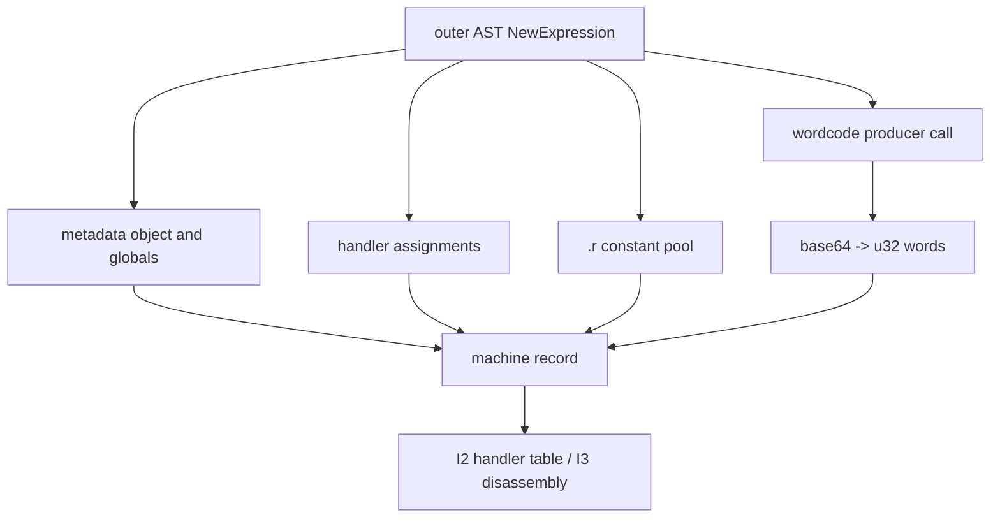

# VM-container extraction

Evidence label: source-inspection only.

## 1. Target

This boundary extracts the inner register-machine representation from a readable outer AST. A
candidate is a `NewExpression` with at least five arguments, including a long string-producing
call that decodes wordcode; globals/path metadata; an object with numeric `I`, `z`, and `F` fields
(and optional `p`); numeric computed handler assignments; and a `.r` pool whose entries are
supported literal values.

The output is a machine record containing wordcode, constant pool, entry metadata, handlers, and
globals. It is structural data for I2/I3, not a request to instantiate or run the VM.

## 2. Algorithm

1. Traverse `NewExpression` candidates and inspect their arguments for the machine roles.
2. Decode the long string-producing wordcode call as base64 bytes in four-byte little-endian
   groups into u32 words.
3. Extract the globals/path argument and object fields for entry, frame, and slot metadata.
4. Collect numeric computed assignments to the machine handler path and the array assigned to the
   path ending in `.r`.
5. Return the discovered record. The coordinator applies the required-piece sufficiency gate;
   malformed, short, or missing pieces are left for later disassembly/validation rather than being
   padded or silently defaulted.

## 3. Implementation

| Ownership | Concrete behavior and state |
|---|---|
| **Owned algorithm** | `extractMachine` traverses constructor candidates, finds code/globals/entry/handlers/pool roles, and returns the machine record. `decodeWords` performs base64-to-u32 little-endian conversion. |
| **Shared coordinator** | `devirtualize` applies the sufficiency gate requiring code, pool, entry, and at least eight handlers before continuing to I2/I3. V1 catches extraction/devirtualization failure and retains the original. |
| **Delegated helper** | `pathOf` identifies dotted assignment paths. I3 owns the pool/key constant reader; this page owns only the extracted pool representation. |

The representation invariants are byte alignment and type preservation: every complete group of four
bytes becomes one u32 word; handler keys remain numeric; pool values are not decoded by guessing.
`decodeWords` truncates a byte string to complete words, while the coordinator's sufficiency gate
decides whether a discovered record is usable; extraction itself does not validate semantic code
length or padding.

## 4. Decoder Upstream Effects

Outer cleanup and the preceding outer passes produce the readable AST consumed here. The machine
record is the sole producer for I2's handler classification and I3's wordcode disassembly. I4-I7
must consume those derived representations rather than re-parsing the constructor ad hoc.

Extraction is intentionally before any inner interpretation. A record with an invalid pool,
truncated wordcode, or too few handlers must be rejected by the coordinator so V1 can preserve the
outer VM.

## 5. Known Gaps

- The constructor argument positions and `.r`/numeric-handler conventions are exact VM-2 shape
  gates; alternate container layouts are not inferred.
- Base64 decoding truncates only at complete four-byte words. Malformed or too-short decoded data
  can survive this extraction step and is exposed to later disassembly/validation; it is not padded.
- Extraction does not validate that every handler is reachable, that every pool key is valid, or
  that the machine's runtime side effects are safe; later pages and V1 own those gates.
- The pinned producer's serializer is comparison context only and does not prove it emits this
  separate corpus container.

## Source

- [devirt.js machine extraction and word decoding (e90be6c)](https://github.com/MichaelXF/claude-vs-js-confuser/blob/e90be6ca716e28f4bba91fe39615a665656bd802/VM-2/devirt.js#L40-L134)
- [devirt.js machine sufficiency gate (e90be6c)](https://github.com/MichaelXF/claude-vs-js-confuser/blob/e90be6ca716e28f4bba91fe39615a665656bd802/VM-2/devirt.js#L1472-L1485)
- [Pinned producer wordcode serialization (20c5b96)](https://github.com/MichaelXF/js-confuser-vm/blob/20c5b96bf57337c568579352758d7685358650de/src/compiler.ts#L2848-L3274)

## Fixtures

No dedicated extraction fixture exists. The pinned corpus machine supplies the sample-specific
container shape; its constructor values are not generalized to other containers.
