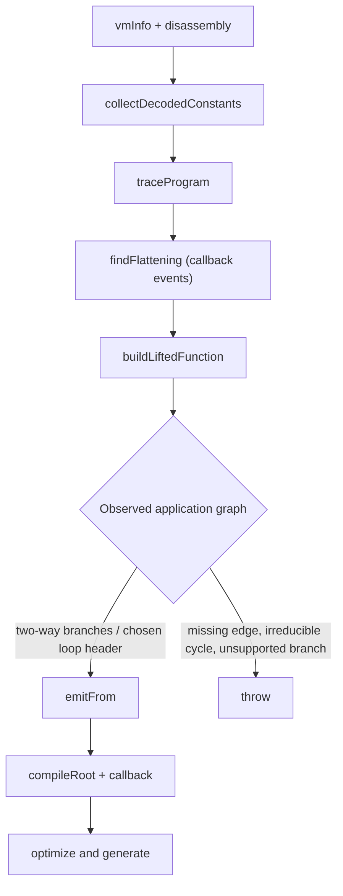

# VM-GPT-1 trace-guided recovery

Status: source-inspection only. This page reconstructs the distinctive recovery path in the frozen
`VM-GPT-1` implementation at commit
[`e90be6ca716e28f4bba91fe39615a665656bd802`](https://github.com/MichaelXF/claude-vs-js-confuser/tree/e90be6ca716e28f4bba91fe39615a665656bd802).
It does not claim that the sample, decoder, generated source, Node `vm` context, or test harness was
executed. Static register-VM extraction and ordinary opcode lowering are prerequisites here; this
page documents the GPT-specific variation: sandboxed value recovery plus an observed execution
trace that supplies application edges and branch samples to the lifter.

## 1. Target

Recover a source-level Babel AST from a recognized `VM-GPT-1` register VM by combining static
instruction semantics with values and transitions observed while the input runs in a restricted
Node `vm` context. The output has a root program and a lifted callback function with register
assignments, ordinary JavaScript operations, structured conditionals/loops, and recovered closure
calls. The output is then normalized and cleaned so VM scaffolding is not selected as the result.

The target discriminator has two levels:

| Level | Required shape | Consequence |
| --- | --- | --- |
| Recognition | `findVm` finds the constructor/prototype alias, long payload, at least twenty numeric handler assignments, and five-argument bootstrap with machine/pool/metadata shape | The root enters this transform; a missing descriptor follows the root's formatted non-VM branch. |
| Trace-guided recovery | The trace installs a browser callback and records numeric-handler events; `findFlattening` needs a per-entry PC with more than three distinct observed next values, and `buildLiftedFunction` needs matching function metadata and edge samples | The observed dispatcher/application boundary can be separated and lifted. Missing dynamic facts are exposed errors, not an invented static edge or a safe recognized-input decline. |

The output representation is:

```text
source -> parsed AST -> vmInfo + static instructions + decodedConstants
       -> trace events -> flattening edge samples -> application blocks
       -> lifted Babel Program -> optimized generated source
```

The page does not treat a source name, a fixed Base64 variable, or an example-specific string
template as the discriminator. `findVm` uses structural clues, while the distinct page uses the
trace's observed PC/entry relationships.

## 2. Algorithm

The non-linear dynamic portion is:



### 2.1 Establish static facts and harvest keyed constants

`lift` starts by parsing the source, finding the VM descriptor, disassembling its little-endian
words, collecting decoded constants, and locating the decoder function name
([`lift` initialization](https://github.com/MichaelXF/claude-vs-js-confuser/blob/e90be6ca716e28f4bba91fe39615a665656bd802/VM-GPT-1/lifter.js#L9-L15)).
The static disassembly is an input contract rather than this page's new algorithm: it supplies
`{pc, next, opcode, operands}`, a reader-function name, and handler information. It identifies
fixed and variable operand widths from handler AST shape and preserves randomized numeric opcodes
as keys ([`disassemble`](https://github.com/MichaelXF/claude-vs-js-confuser/blob/e90be6ca716e28f4bba91fe39615a665656bd802/VM-GPT-1/vm-core.js#L124-L200)).

`collectDecodedConstants` then performs a separate source observation pass:

1. Reparse the source and replace the bootstrap expression statement, identified by its original
   `start`, with an assignment to a callable `globalThis.__runVmBootstrap` wrapper.
2. Create a Node `vm` context containing `Buffer`, a silent console, module/exports placeholders,
   a plain `window`, universal proxies for document/animation/alert, and `globalThis` bound to the
   sandbox. Run the generated source, find the decoder by following identifier callees from numeric
   handlers, invoke the isolated bootstrap, and invoke each function installed on `window`.
3. Replace the decoder in the sandbox with a recorder. It supplies omitted index/key arguments by
   reading the machine, calls the original decoder, and records a returned value only when the
   corresponding pool entry is a string.
4. Probe every statically disassembled instruction whose handler calls the decoder. Each probe
   creates a synthetic machine with the word stream, constants, universal global, register array,
   frame metadata, and the instruction PC, then invokes the numeric handler. Probe exceptions are
   caught, so a string not observed by any successful path becomes `undefined` in the returned
   decoded-constant array.

The exact sandbox setup, decoder identification, recorder, bootstrap/window calls, and bounded
probes are owned by [`collectDecodedConstants`](https://github.com/MichaelXF/claude-vs-js-confuser/blob/e90be6ca716e28f4bba91fe39615a665656bd802/VM-GPT-1/vm-core.js#L218-L294)
and [`findDecodeFunction`](https://github.com/MichaelXF/claude-vs-js-confuser/blob/e90be6ca716e28f4bba91fe39615a665656bd802/VM-GPT-1/vm-core.js#L296-L324). This is not a claim that pool decoding is independently possible: the source explicitly invokes the decoder with instruction-specific keys and retains only observed values.

### 2.2 Trace the bootstrap and callback in a second sandbox

`traceProgram` reparses and wraps the same bootstrap expression, then builds a second context with
the same broad host-value shape. It captures `console.log` arguments in `traceEffects`, supplies a
universal proxy for selected browser globals, and optionally replaces `Math` and `Date` only when
the direct lifter caller passes `deterministic: true`
([`traceProgram` setup](https://github.com/MichaelXF/claude-vs-js-confuser/blob/e90be6ca716e28f4bba91fe39615a665656bd802/VM-GPT-1/lifter.js#L33-L68)).

Before running the bootstrap, it wraps two classes of VM operation:

- The bytecode reader records `{pc, value}` in the most recent handler event.
- Every numeric prototype handler records an event before invoking the original handler, then
  records the post-handler frame and next entry. For return/jump handlers it snapshots the complete
  virtual register range before execution. For a `makeFunction` event it associates the child's
  function metadata with the current parent entry. Finally it lowers the event and samples the
  values written to numeric destination registers; errors in this diagnostic lowering are caught
  and leave `destValues` absent.

Each event has the following source-owned fields:

| Field | Meaning and invariant |
| --- | --- |
| `opcode` | Numeric prototype property actually invoked. |
| `pc` | Handler-start PC, computed from the frame PC before the handler advances it. |
| `frame` / `entry` | Current frame base and metadata function entry; the entry groups a trace into one virtual function. |
| `reads` | Ordered bytecode-reader observations attributed to this handler event. |
| `beforeRegisters` | Full register snapshot only for handlers classified as return or jump. |
| `nextFrame` / `next` / `nextEntry` | Post-handler frame, PC, and function entry; `next` is the observed successor, not a guessed edge. |
| `destValues` | Best-effort post-handler values for destinations found by lowering; it is diagnostic state and is not the branch-sample source. |

The sandbox runs the bootstrap, locates the first function-valued property on `window`, and invokes
that callback exactly twice. The returned `rootEvents`, flattened callback events, per-invocation
event slices, and window key are the dynamic input to the rest of the transform
([`traceProgram` execution](https://github.com/MichaelXF/claude-vs-js-confuser/blob/e90be6ca716e28f4bba91fe39615a665656bd802/VM-GPT-1/lifter.js#L70-L140)).

### 2.3 Infer flattened transfers from observed events

`findFlattening` groups callback events by `entry`. For each virtual function it records, per PC,
the set of observed `next` PCs and its invocation frequency. The first PC whose target set has more
than three members is selected as the dynamic dispatch PC. The handler source is searched for a
numeric state-register offset; that offset is saved in `stateRegisterByEntry`, but the current
implementation does not use the saved map to choose edges.

The same dispatch frequency identifies local dispatcher stubs: every PC at or before the dispatch
PC with the same frequency is placed in `stubPcs`. A transition from such a stub into another
entry adds that entry to `helperEntries`. For each later dispatch event, the algorithm walks
backward over local stubs to the nearest predecessor event, then records an edge from that
predecessor PC to the dispatch event's observed `next` PC and attaches the predecessor's
`beforeRegisters` snapshot as a sample. It returns `helperEntries`, `stubPcs`, `edgesByEntry`, and
the unused state-register map
([`findFlattening`](https://github.com/MichaelXF/claude-vs-js-confuser/blob/e90be6ca716e28f4bba91fe39615a665656bd802/VM-GPT-1/lifter.js#L423-L469)).

The trace also marks PCs that call a helper entry. Those call sites are omitted from the lifted
application body so helper dispatch machinery is not emitted as application logic
([`helperCallPcs`](https://github.com/MichaelXF/claude-vs-js-confuser/blob/e90be6ca716e28f4bba91fe39615a665656bd802/VM-GPT-1/lifter.js#L472-L475)).

### 2.4 Build application blocks and reconnect callback transitions

`buildLiftedFunction` uses the statically recovered `functionMetadata` and the observed edge map:

1. The block-start set contains the function entry and every observed edge target. The function's
   physical region ends at the next nested-function entry or the end of the word stream.
2. Instructions between consecutive starts become a block, except for `stubPcs`. Ordinary semantic
   instructions are lowered into register assignments; jump records are represented by edges,
   return records become terminals, non-helper `makeFunction` records recursively build child
   functions, and helper call PCs are skipped. A block without an observed edge falls through to
   the next block unless it terminates.
3. The block with the highest incoming count, excluding the function entry, is treated as the
   dispatcher header. The first later block containing an application-level kind is the application
   boundary. Blocks before that boundary are removed, while the entry block remains. This is the
   source's explicit separation between dispatch scaffolding and application blocks.
4. The two callback event slices are scanned again, but only events for the current function entry
   and application starts are considered. Consecutive application starts become direct edges, and
   the last available `beforeRegisters` snapshot is retained as `branchSamples` for the source
   block. These traced transitions replace the broad flattened edge set for application blocks.

The block record is `{start, statements, terminal, successors, endPc, kinds}` with optional
`branchSamples`. The exact block filtering, application transition scan, and mutation of successors
are in [`buildLiftedFunction` block construction](https://github.com/MichaelXF/claude-vs-js-confuser/blob/e90be6ca716e28f4bba91fe39615a665656bd802/VM-GPT-1/lifter.js#L493-L575).

### 2.5 Structure observed branches and loops

The remaining application graph is traversed recursively. A block is a loop candidate when one of
its successors can reach the block again; the loop header is the unique candidate chosen by highest
incoming count. `outcome` classifies a path as `continue`, `return`, `branch`, `cycle`, or `missing`.
`emitFrom` then applies these rules:

- a loop-header revisit becomes `continue` inside the emitted `while`;
- a terminal block emits its accumulated statements and return;
- one successor follows directly;
- exactly two successors require a branch register whose samples are all Boolean-like (`true`,
  `false`, `0`, or `1`) and whose truthiness separates the two targets;
- a recent assignment of the form `register = register + numeric` is preferred when selecting the
  branch register, otherwise all registers are tried in index order;
- if one branch outcome is `continue` or `return` and the other is not, an `if` is emitted for the
  terminal branch and the continuation is emitted afterward; otherwise an `if`/`else` is emitted;
- more than two successors, missing blocks, or an irreducible cycle throws.

`branchCondition` and the graph walk are the source of truth for this reconstruction
([`branchCondition`](https://github.com/MichaelXF/claude-vs-js-confuser/blob/e90be6ca716e28f4bba91fe39615a665656bd802/VM-GPT-1/lifter.js#L478-L491),
[`emitFrom`](https://github.com/MichaelXF/claude-vs-js-confuser/blob/e90be6ca716e28f4bba91fe39615a665656bd802/VM-GPT-1/lifter.js#L577-L642)).

### 2.6 Assemble the lifted program

The callback function receives ordinary parameters, a `let registers_<entry> = []` array, a
`this_<entry>` expression that maps nullish `this` to `globalThis`, parameter-to-register stores,
and an `arguments` store when the VM register count exceeds arity. The root program receives its own
register array and `globalThis` receiver, then lowers root events while replacing the callback's
`makeFunction` record with the compiled callback
([`compileCallback` and `compileRoot`](https://github.com/MichaelXF/claude-vs-js-confuser/blob/e90be6ca716e28f4bba91fe39615a665656bd802/VM-GPT-1/lifter.js#L657-L677)).

`compileRoot` assembles the root register array and the callback function returned by the graph
walk. It passes that AST to the implementation's existing register cleanup, syntax normalization,
and code-generation substrate. Those generic post-lift rewrites are part of the root's output
composition, not a second GPT-specific transform, so their per-pass algorithm is intentionally not
duplicated here. The source boundary is [`compileCallback` and `compileRoot`](https://github.com/MichaelXF/claude-vs-js-confuser/blob/e90be6ca716e28f4bba91fe39615a665656bd802/VM-GPT-1/lifter.js#L657-L677),
followed by the delegated [`optimize`](https://github.com/MichaelXF/claude-vs-js-confuser/blob/e90be6ca716e28f4bba91fe39615a665656bd802/VM-GPT-1/lifter.js#L1272-L1298)
and final generation. Cleanup is not semantic validation; this implementation does not run its generated source.

## 3. Implementation

### Representations and invariants

| Representation | Producer | Required invariant and consumer |
| --- | --- | --- |
| `vmInfo` | `findVm` | Contains the bootstrap, machine constructor, handler map, static constants, and metadata accepted by the structural gate. |
| `disassembly` | `disassemble` | Every instruction has a PC, next PC, numeric opcode, and operand slice; `instructionByPc` and `handlerInfo` are stable lookup maps for tracing/lowering. |
| `decodedConstants` | `collectDecodedConstants` | Non-string pool values remain static; string values are recorded only when the sandbox recorder observes a decoder result, otherwise lowering receives `undefined`. |
| `semantics` | `classify` | Numeric opcode -> generated compact handler code, semantic kind, and optional operand permutation. Classification is by handler shape, not by the randomized number. |
| `functionMetadata` | `makeFunction` instruction scan | Entry -> destination/arity/register/capture/rest/pair metadata; `parentEntry` is filled only when a traced function-creation event identifies it. |
| Trace event | `traceProgram` | One event represents one actual numeric handler call and carries pre/post frame/PC state; `next` is observed and `beforeRegisters` is present only for return/jump instrumentation. |
| `flattening` | `findFlattening` | Stores helper entries, local stub PCs, observed edge samples, and a state-register map that is currently recorded but not consumed. |
| Application block | `buildLiftedFunction` | Contains lowered statements, at most one terminal, observed successors, and branch samples when direct callback transitions supplied them. |
| Lifted output AST | `compileRoot` + `optimize` | Contains source-level AST nodes only; optimizer passes consume computed numeric register slots and then materialize/normalize them. |

The static semantic classifier and `lower` helper are delegated prerequisites. The distinct page only
requires their interface: an event's PC/opcode resolves to an ordered list of Babel statements,
while `makeFunction`, jump, and return kinds remain available to block construction. The source
spans are retained in the source map as delegated helper coverage, not claimed as a separate GPT
algorithm: [`classify/lower`](https://github.com/MichaelXF/claude-vs-js-confuser/blob/e90be6ca716e28f4bba91fe39615a665656bd802/VM-GPT-1/lifter.js#L142-L421)
and [`functionMetadata`](https://github.com/MichaelXF/claude-vs-js-confuser/blob/e90be6ca716e28f4bba91fe39615a665656bd802/VM-GPT-1/lifter.js#L224-L231).

## 4. Upstream Effects

The earlier static stages establish facts this page cannot recompute from the trace alone:

- `parse` and `findVm` provide the original bootstrap `start` offset, machine constructor, pool,
  metadata, and handler functions. If the bootstrap is not isolated by that offset, both sandbox
  passes fail rather than guessing a call site.
- `decodeBytecode`, `findReadFunction`, `classifyHandler`, `operandCount`, and `disassemble` provide
  word alignment, reader identity, variable operand boundaries, handler code, and instruction PCs.
  Trace events are mapped back to these exact PCs; they are not parsed as a second bytecode format.
- `collectDecodedConstants` produces the values consumed by `decode(index, key)` and global/member
  lowering. An unobserved keyed string is not recovered by independently decoding the pool.
- The trace is the producer of `parentEntry`, `beforeRegisters`, `next`, and application transition
  samples. `findFlattening` and `buildLiftedFunction` must therefore run after both sandbox phases.
- Cleanup assumes the lifter still has computed `registers_N[index]` members, `let` declarations,
  `Reflect.set` calls, and recognizable `first_iteration_N` identifiers at the relevant stages.
  Reordering cleanup is not part of this contract; `optimize` owns the sequence.

Material failure and safety edges are:

| Condition | Actual source behavior | Boundary |
| --- | --- | --- |
| Long payload is not word-aligned | `decodeBytecode` throws | No guessed word stream. |
| Numeric opcode has no classified handler or a bad dynamic count | `disassemble` throws | Static substrate does not fall back to raw words. |
| Bootstrap cannot be isolated, decoder cannot be found, or the sandbox times out | `collectDecodedConstants` throws | No recognized-input output is selected. |
| Individual string probe handler throws | The probe's local `catch` suppresses that probe | Only that observation is missing; the corresponding string may become `undefined`. |
| Handler diagnostic lowering throws in the trace `finally` block | The local `catch` suppresses `destValues` collection | Event transition fields still come from the original handler; later block logic may still fail. |
| No window callback is installed | `traceProgram` throws | The sample-role assumption is required for dynamic recovery. |
| No per-entry dynamic PC has more than three targets | `findFlattening` returns no usable edge map; function construction subsequently throws | It is not treated as a complete static CFG. |
| Capture has no traced parent/valid capture pair | `capturedRegister` throws | No speculative closure binding. |
| Missing block, irreducible cycle, three-plus-way branch, or no Boolean branch register | `buildLiftedFunction`/`emitFrom` throws | The graph is not structurally forced into a wrong shape. |
| Unknown semantic kind | `lower` throws | No unknown handler is silently emitted. |
| Any recovery error reaches `deobfuscate` | Output write is not reached | There is no broad caller-level fallback after recognition. |

`collectDecodedConstants` and `traceProgram` execute sample-derived source in Node `vm` contexts.
The contexts expose selected host values and universal browser proxies and impose 10-second source/
bootstrap limits and 15- or 20-second callback limits, but the implementation does not establish a
hardened security boundary. It also does not use `traceEffects` as a semantic oracle in the lift
decision. These source-defined execution boundaries do not establish a hardened security boundary.

## 5. Known Gaps

- The dynamic CFG is trace-guided, not exhaustive. It observes bootstrap and two callback
  invocations, so branches never taken in those calls do not become observed application edges.
- `stateRegisterByEntry` is recorded during flattening but is not consumed by edge selection; the
  actual branch register is inferred later from Boolean-like `beforeRegisters` samples.
- Helper/stub identification uses the first PC with more than three distinct observed successors,
  frequency equality, and PC ordering. Alternate dispatch layouts can decline indirectly or throw.
- Function metadata and closure captures depend on a traced `makeFunction` event assigning
  `parentEntry`; malformed or unobserved capture relationships are not generalized.
- The emitter only accepts the graph shapes handled by `emitFrom`: two-way branches, one selected
  natural loop header, and no irreducible cycle. Unknown semantics, missing blocks, and unsupported
  control are exposed failures.
- Constant recovery is observation-dependent. String pool entries that no successful decoder call
  reaches are emitted as `undefined` in the static value table, with no claim of complete pool
  recovery.
- The source-only page does not establish semantic equivalence, unseen transfer, randomized-build
  coverage, host safety, or production support. README/test assertions and existing output are
  provenance; this page does not assert their results.

## Source

The structural prerequisite spans are [`vm-core.js#parse/findVm`](https://github.com/MichaelXF/claude-vs-js-confuser/blob/e90be6ca716e28f4bba91fe39615a665656bd802/VM-GPT-1/vm-core.js#L12-L121),
[`vm-core.js#decodeBytecode through disassemble`](https://github.com/MichaelXF/claude-vs-js-confuser/blob/e90be6ca716e28f4bba91fe39615a665656bd802/VM-GPT-1/vm-core.js#L124-L200),
and [`vm-core.js#collectDecodedConstants/findDecodeFunction`](https://github.com/MichaelXF/claude-vs-js-confuser/blob/e90be6ca716e28f4bba91fe39615a665656bd802/VM-GPT-1/vm-core.js#L218-L324). The distinct implementation is [`lifter.js#lift`](https://github.com/MichaelXF/claude-vs-js-confuser/blob/e90be6ca716e28f4bba91fe39615a665656bd802/VM-GPT-1/lifter.js#L9-L15),
[`traceProgram`](https://github.com/MichaelXF/claude-vs-js-confuser/blob/e90be6ca716e28f4bba91fe39615a665656bd802/VM-GPT-1/lifter.js#L33-L140),
[`classify/lower`](https://github.com/MichaelXF/claude-vs-js-confuser/blob/e90be6ca716e28f4bba91fe39615a665656bd802/VM-GPT-1/lifter.js#L142-L421),
[`findFlattening`](https://github.com/MichaelXF/claude-vs-js-confuser/blob/e90be6ca716e28f4bba91fe39615a665656bd802/VM-GPT-1/lifter.js#L423-L475),
[`branchCondition/buildLiftedFunction`](https://github.com/MichaelXF/claude-vs-js-confuser/blob/e90be6ca716e28f4bba91fe39615a665656bd802/VM-GPT-1/lifter.js#L478-L656),
[`compileRoot`](https://github.com/MichaelXF/claude-vs-js-confuser/blob/e90be6ca716e28f4bba91fe39615a665656bd802/VM-GPT-1/lifter.js#L657-L677),
and [`optimize`](https://github.com/MichaelXF/claude-vs-js-confuser/blob/e90be6ca716e28f4bba91fe39615a665656bd802/VM-GPT-1/lifter.js#L1272-L1312). The package root owning the caller-facing composition is [VM-GPT-1 plugin](../plugins/vm-gpt-1.md).

## Fixtures

| Fixture | Claim it could pin | Evidence role |
| --- | --- | --- |
| `VM-GPT-1/input.js` | Static VM relationships, randomized handler shapes, keyed constants, and the traced browser callback | Source fixture |
| `VM-GPT-1/output.js` | Existing source-level lift, closure/register naming, loop shape, and removal of VM scaffolding | Generated-output provenance |
| `VM-GPT-1/regular.js` | Root non-VM parse/generate branch | Negative-control fixture |
| `VM-GPT-1/README.md` | Requested devirtualization and intended test shape | Documentation provenance |
| `VM-GPT-1/NOTES.md` | Sample-specific frame, trace, constant, and cleanup observations | Supporting documentation provenance |
| `VM-GPT-1/test.js` | Intended residue absence, output shape, pass-through, and callback checks | Test-intent evidence |
