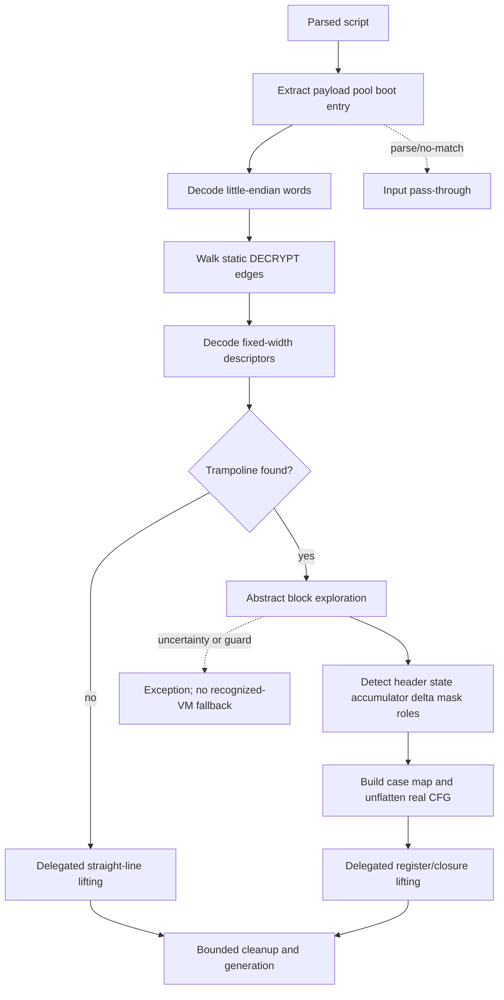

# VM-Kimi-1 static decrypt and hashed-state dispatch

Evidence label: source-inspection only. This page is the reconstruction contract for the
Kimi-specific middle of the frozen `VM-Kimi-1` implementation at commit
[`e90be6ca716e28f4bba91fe39615a665656bd802`](https://github.com/MichaelXF/claude-vs-js-confuser/tree/e90be6ca716e28f4bba91fe39615a665656bd802).
It documents the fixed numeric word grammar, static bytecode rewrite, arithmetic dispatcher
resolution, and flattened-graph recovery. It does not document a generic VM decoder, execute the
sample, or establish behavioral equivalence, transfer, or production support.

## 1. Target

Recognize the Kimi-1 VM representation far enough to turn its statically decryptable word stream
into a source-level control-flow graph. The transform's useful output is a real per-function graph
whose nodes are payload blocks rather than the header, accumulator chain, argument-loading stubs,
or trampoline. The downstream lifter consumes that graph to produce a Babel AST.

The accepted shape is a parsed script containing all of the following source-visible ingredients:

1. An identifier call with one string literal whose value is longer than 512 characters and
   contains only base64 characters. `extractFromAst` retains the longest matching value.
2. An uncomputed member call whose object is a `NewExpression` with at least three arguments, a
   third `ArrayExpression`, and more than ten pool elements. The pool is taken from that third
   argument.
3. Optional boot metadata: a one-argument `NewExpression` with an object property whose key is
   `p` and whose statically evaluated value is numeric. If no such metadata is found, the source
   supplies `{ j: 0, b: 6, p: 0 }`.
4. For a flattened function, a scan from its entry reaches a direct `JUMP` to a region containing a
   `CALL_NULL`. The scan records a result property read and stops at `JUMP_REG` when those forms are
   present, and it finds a target function from a matching `MAKE_FUNC` descriptor when available;
   `findTrampoline` itself requires only the `CALL_NULL` and defaults the property selector to `0`.
   The call operands identify the two registers passed to the arithmetic dispatcher.
5. The explored blocks expose a header comparison against a numeric constant, a state-versus-
   accumulator comparison chain, state updates by `ADD` or `SUB`, and MBA-style select registers.

These are syntactic and heuristic predicates. A long base64 string, a large array, or a switch by
itself is not this target. A near-neighbor with a different numeric opcode map, handler-derived
opcode meanings, a dispatcher outside the emulated instruction subset, runtime-only decryption,
or an indirect control edge that cannot be resolved must not be claimed as covered.

## 2. Algorithm

The solution-level order is forced by the representation boundary: decryption changes words before
`decodeAt` gives them names and sizes, and the resulting descriptors are the only input from which
the trampoline and flattened graph are recovered.

1. Parse and extract the candidate. The driver calls `extractFromAst`, which records the payload,
   pool, and boot metadata without running any candidate code. Parsing failure or no payload/pool
   match returns the input source unchanged.
2. Decode and rewrite words. `decodeWords` packs complete groups of four base64-decoded bytes into
   little-endian unsigned words. `applyStaticDecrypts` copies that array, walks statically known
   edges from the boot entry, and applies each distinct `DECRYPT` range in place on the copy.
3. Interpret the rewritten stream. `makeCtx` exposes fixed numeric `OPS`, operation-specific
   widths, keyed constant decoding, and `decodeAt`. `decodeAll` then creates a PC-keyed descriptor
   map by linear walking from PC zero. A `MAKE_FUNC` scan supplies child function metadata.
4. Classify each function. `findTrampoline` scans from each entry to the first direct `JUMP` and
   requires a `CALL_NULL` in the target region. It records the first property read and stops at
   `JUMP_REG` when present, then attempts to find the dispatcher entry from a matching
   `MAKE_FUNC`; the property selector defaults to `0` when no load is found. A function without a
   returned trampoline uses the downstream straight-line lifter; a function with one enters the
   Kimi-specific path, where later dispatcher failure remains exposed.
5. Explore flattened blocks. `explore` abstractly interprets register values until a terminator.
   Constants are concrete, unknowns are symbolic, and operations over unresolved values become
   expression trees. At a jump to the trampoline, `finishDispatch` forwards concrete dispatcher
   arguments to `runDispatcher`; a concrete or one-condition symbolic second argument yields one
   or two target PCs. A worklist merges repeated environments and revisits changed states.
6. Detect the flow roles. `detectFlow` chooses the highest-indegree block as header, finds the
   state register from its strict comparison with a numeric constant, finds the accumulator from a
   chain comparison, finds the state-delta register from `ADD`/`SUB`, and identifies only the mask
   and select registers belonging to the MBA dispatch update.
7. Unflatten the graph. `unflatten` identifies the header's special state arm, accumulates chain
   updates into a state-to-payload case map, follows pure argument-loading stubs to the trampoline,
   resolves the entry state, and worklists the real blocks. Pure state-update arms become resolved
   graph edges; non-pure conditional arms remain conditional edges. Header, chain, and stub blocks
   are excluded from `realNodes`.
8. Lift and emit. The caller sends the real graph through `liftFunction`, or uses
   `liftStraightLine` for a non-trampoline function. Kimi machinery is filtered by the detected
   roles before register/closure AST construction. `cleanup` applies bounded copy propagation and
   method-call restoration, and Babel generation returns the final source.

## 3. Implementation

### Fixed word and constant representation

The input to this page is the `{ payload, pool, bootMeta }` record produced by the driver. The
fixed numeric layout is source-defined by `OPS` and `varCount`; it is not inferred from handler
functions. The spread marker is `3247410626`, and the distinctive static rewrite opcode is
`DECRYPT = 44681`; `JUMP_REG = 2939` is a terminator for the static decrypt walk and a dynamic edge
for later exploration.

| Operation family | Descriptor/layout decision |
| --- | --- |
| Fixed load, move, arithmetic, comparison, unary, member, global, control, and try operations | `decodeAt` reads the numeric opcode, uses the fixed operand count, and retains the raw operand words. |
| `MAKE_FUNC` | Six header words plus two words per closure pair; its entry, register/argument metadata, variadic flag, and capture pairs are retained. |
| `CALL` | Four header words plus either one spread-register word or the literal argument count. |
| `CALL_NULL` and `NEW` | Three header words plus either one spread-register word or the literal argument count. |
| `MAKE_OBJECT` | Destination and pair count followed by two words per key/value pair. |
| `MAKE_ARRAY` | Destination and element count followed by one register word per element. |
| `DECRYPT` | Four operands: destination, source start, source end, and seed. |

`decodeConst(idx, key)` returns the pool entry when `key` is falsy. A numeric entry is XORed with
the key. A string entry is base64-decoded into little-endian 16-bit units; for each unit the
rolling value is updated as `c = (c + 2654435769) | 0`, then the unit is XORed with
`c ^ (c >>> 13)` and masked to 16 bits. This constant decoder is needed both to read control
constants and to construct lifted values, but it does not execute a pool expression.

### Static decrypt walk

`applyStaticDecrypts(words, entry)` makes `K = words.slice()`, creates a temporary context over
`K`, and starts with `worklist = [entry]`, an empty `visited` set, and an empty `applied` set. The
inner walk stops when an address was visited, is out of range, has no decodable fixed opcode, or
reaches `RETURN`, `THROW`, or `JUMP_REG`. Its source-visible edge policy is:

| Decoded operation | Static walk action |
| --- | --- |
| `JUMP` | Replace the current address with its target. |
| `JUMP_IF_TRUE` or `JUMP_IF_FALSE` | Push the target and continue at the fall-through address. |
| `MAKE_FUNC` | Push the child entry and continue after the descriptor. |
| `TRY` or `TRY2` | Push every decoded target and continue after the descriptor. |
| `DECRYPT` | Apply the range once per comma-joined `(dst, src, end, seed)` tuple, then continue. |
| Any other operation | Continue by the descriptor size. |
| `RETURN`, `THROW`, `JUMP_REG` | End this path without a successor. |

For a decrypt tuple `[a, b, c, e0]`, the source initializes `e = (e0 ^ a) | 0`; for every
`f` from `b` through `c - 1`, it updates `e = (e + 2654435769) | 0` and writes
`K[a + (f - b)] = (K[f] ^ e ^ (e >>> 13)) >>> 0`. The source does not validate that ranges are
aligned, non-overlapping, in bounds, or semantically separate from the current instruction stream.
After the walk, `decodeAll` linearly advances from zero over the rewritten words and stores
`{ ip, opcode, name, operands, size }` in a `Map`; its first undecodable word ends the map.

### Dispatcher emulation and abstract exploration

`runDispatcher` is a bounded forward evaluator, not a hash inverse. It initializes 16 registers
with `r0 = A`, `r1 = B`, and `r2 = [A, B]`, then permits the following source subset: loads,
moves, fixed binary/unary operations, a global marker, property reads, calls to a recognized
`Math.imul` marker, and array/object construction. A `RETURN` yields the requested register. Any
other operation, undecodable address, or path exceeding 500 iterations throws.

`explore` starts a register array of size `cfg.nreg` (or 160), initializes the argument slots as
symbolic values, and worklists the function entry. Its block evaluator uses `C(value)` for concrete
values, `X(name)` for unknown values, and `E(operator, args...)` for expressions. Constant-only
operations fold through `applyOp`; otherwise the expression is retained. At a direct jump to the
trampoline, `finishDispatch` requires the first dispatcher argument to be concrete. It accepts the
second argument when concrete, or when its expression contains exactly one comparison or unknown
variable; `evalTree` substitutes true and false and forwards both values through
`runDispatcher`. More complex expressions throw rather than guessing targets.

Repeated visits to one PC are merged register-by-register: equal concrete or symbolic values are
kept, and disagreement becomes the shared `XMERGE` unknown. A changed merged environment is
requeued. The outer exploration worklist has a 20,000-iteration guard. Conditional jumps add both
arms; ordinary jumps add their target; dispatch results add one or two dispatcher targets; returns
and throws end a path.

### Flow-role detection and unflattening

`detectFlow` first counts incoming edges from explored block results and selects the block with the
largest count as `headerIp`. It records constants loaded in that header and selects `stateReg`
from a `STRICT_EQ` or `STRICT_NE` comparing a register with a numeric constant. It then scans a
dispatch conditional for the other register in a state comparison as `accReg`, scans all blocks
for `stateReg = stateReg +/- delta` as `deltaReg`, and derives `maskRegs` only from select
temporaries that are added/subtracted into a dispatcher argument. The operand of the select's
`AND`/`MUL` and its same-block `NOT`/`POS`/`NEG` chain are machinery; other negation intermediates
remain ordinary registers even when they have the same opcode family.

`stateUpdate` represents the selected register as `{ regPlus: 0 }`, replaces it with constants or
prior values as instructions are scanned, and recognizes only a constant assignment or a
constant delta. `unflatten` then:

1. Reads the header comparison's special state value and identifies which header arm enters a
   state/accumulator chain.
2. Walks chain blocks while they retain the strict state-versus-accumulator comparison, updating
   the accumulator from `stateUpdate` and recording `{ value, payloadIp, chainIp }` cases.
3. Follows a block as a stub only when every instruction is a recognized argument-register load,
   literal/constant load, move, or jump to the trampoline. The final `caseMap` maps each accumulated
   state value to the payload block reached after stub removal.
4. Computes the concrete entry state from constant/move instructions in the function entry block.
   The header, chain, and stubs form `machinery`; adding one of them as a real node throws.
5. Worklists the resolved entry payload. For a conditional real node, each arm is either a pure
   state-update arm, which advances by its delta and resolves through `caseMap`, or a real arm,
   which remains a conditional edge. For an unconditional node, its state update resolves the next
   case. The result is `realNodes`, with each node retaining its entry state, source block, and
   successor records.

### Downstream handoff and ownership

The Kimi-specific machinery filter is the only Kimi decision in the downstream lifter. In
`isMachineryIns`, the lifter removes jumps to the trampoline, `JUMP_REG`, writes to dispatcher
argument or mask registers, state-register updates, delta constants, and creation of the detected
dispatcher function. `liftBlock` then lowers remaining instruction descriptors, while
`liftStraightLine` handles functions for which `findTrampoline` returned no result. Closure mapping
uses the source's truthy capture flag to select either a current-frame register or an enclosing
closure cell. These routines are delegated representation helpers, not a second Kimi boundary.

`cleanup` recursively reaches a maximum 200-pass fixpoint, removes or inlines eligible temporary
assignments, restores the narrow `F.call(O, ...)` spelling when `F` is `O.property`, and prunes
unused declarations. It does not validate the resulting program. The driver memoizes function
entries before recursively decompiling children, generates a `Program`, and returns generated
source; its CLI additionally performs file I/O and logs the output size.

## 4. Upstream Effects

This pass consumes the source shapes and intermediate values established earlier in the same
driver. The dependencies are explicit:

| Upstream producer or source spelling | Input consumed here | Why the edge is required |
| --- | --- | --- |
| `parser.parse` and `extractFromAst` | payload, pool, numeric boot entry | The static decrypt walk needs the word source and its start; absence of payload/pool is the only no-match branch. |
| `decodeWords` | little-endian `Uint32Array` | `DECRYPT` and `decodeAt` operate on word offsets, not bytes or AST nodes. |
| `OPS`, `varCount`, `decodeConst`, `decodeAt` | fixed operation names, sizes, operands, constants | Every later edge, state update, and dispatcher argument depends on the operation-specific descriptor width. |
| `decodeAll` and `MAKE_FUNC` scan | PC map and function metadata | `findTrampoline` needs child entries, and `explore` needs a decoder at every visited PC. |
| `findTrampoline` | dispatcher argument registers, result property, dispatcher entry | `finishDispatch` cannot resolve a computed edge without the call arguments and callable entry. |
| `explore` | block results and merged abstract environments | `detectFlow` reads incoming edges and dispatch condition shapes from these results. |
| `detectFlow` | header/state/accumulator/delta/mask roles | `unflatten` and `liftFunction` need the same roles to turn state updates into graph edges and remove machinery. |
| `unflatten` | `realNodes`, case map, machinery sets | The downstream lifter must consume payload blocks without reintroducing the flattened dispatcher. |

The relevant source spellings remain finite and explicit:

| Spelling or variant | Role in this page | Distinction |
| --- | --- | --- |
| `CALL_NULL` in the trampoline | Dispatcher invocation | Its fixed operands supply the two registers later passed as `A` and `B`. |
| `LOAD_CONST` and `LOAD_LITERAL` | Concrete constants | Both feed header, state, delta, and dispatcher reasoning; only the former uses the pool decoder. |
| `JUMP_IF_TRUE` and `JUMP_IF_FALSE` | Abstract branch arms | Both are explored and both target states are retained. |
| `TRY` and `TRY2` | Static decrypt reachability | Both expose all decoded operands as walk targets. |
| `STRICT_EQ` and `STRICT_NE` | Header/chain recognition | Either comparison can establish the state role or chain condition. |
| `ADD` and `SUB` | State/accumulator updates | Both contribute signed deltas; the source does not infer other update forms. |
| `AND` and `MUL` | MBA select detection | Either can hold the selected difference before it is added to a dispatcher argument. |
| `JUMP_REG` | Dynamic control | It ends the decrypt walk and becomes a dispatch result in exploration; it is not statically followed as a raw register target. |

The conceptual relationship to the package's other register-VM pages is deliberately limited:
[VM-1 fixed-opcode disassembly](vm-1-fixed-opcode-disassembly.md) is related material for a fixed
word grammar, while [VM-3 handler canonicalization](vm-3-handler-canonicalization.md) is related
material for a handler-derived grammar. Kimi's fixed numeric table, static rewrite order, and
forward arithmetic dispatcher remain owned here.

## 5. Known Gaps

- The recognizer is not data-flow based. It selects payload and pool candidates by local AST
  predicates, accepts metadata defaults, and does not prove that all selected components belong to
  one VM.
- `decodeWords` and `decodeAt` do not validate byte alignment, operand bounds, count bounds,
  descriptor consistency, or decrypt range validity. `decodeAll` stops at an undecodable word and
  returns the partial map to later code.
- The numeric `OPS` map is fixed. There is no handler analysis, randomized-opcode inference, alias
  support, macro-opcode support, or alternate spread marker in this boundary.
- Static decrypt follows only the direct, conditional, function, and TRY edges listed above. It
  does not execute the VM, follow `JUMP_REG`, verify decrypt ordering against runtime state, or
  reject overlapping/self-targeting ranges.
- `runDispatcher` models only its narrow arithmetic/`Math.imul` subset, allocates 16 registers, and
  stops at 500 steps. It may throw for a valid but unmodeled dispatcher operation. It forward-
  evaluates candidates; it does not prove or invert an arbitrary hash.
- Abstract register reads use `regs[i] || X('r' + i)`; undefined slots become symbolic while the
  wrapped `C(false)` and `C(0)` values remain concrete. Expression substitution accepts only one
  comparison or unknown variable, and merge loses relationships by collapsing disagreement to
  `XMERGE`.
- Flow discovery is heuristic: highest indegree selects the header, the first matching roles win,
  duplicate accumulated case values overwrite in `caseMap`, and the unflattening worklist does not
  establish a general CFG proof. A pure arm with a constant state assignment is advanced using its
  delta field, matching the source's implementation rather than adding a missing validation.
- Missing role values, unresolved states, missing blocks, machinery destinations, unsupported
  lifted instructions, or generation failures can throw after recognition. There is no recognized-
  VM catch that restores the original input.
- The downstream lifter and cleanup may emit `window` accesses, calls, constructors, closures, and
  helper code, but this page does not execute or safety-qualify them. `README.md`, `NOTES.md`,
  `output.js`, `regular.js`, and `test.js` provide output, negative-control, and test-intent provenance.

## Source

All links are pinned to the frozen corpus commit above. The driver-level selection belongs to the
[VM-Kimi-1 plugin root](../plugins/vm-kimi-1.md); this page owns the distinctive source spans.

| Source area | Pinned source | Ownership classification and claim |
| --- | --- | --- |
| Candidate extraction | [`vm.js#L70-L122`](https://github.com/MichaelXF/claude-vs-js-confuser/blob/e90be6ca716e28f4bba91fe39615a665656bd802/VM-Kimi-1/vm.js#L70-L122) | Shared coordinator; the root owns selection/pass-through, and this page records the input contract it consumes. |
| Word grammar and constants | [`vm.js#L128-L205`](https://github.com/MichaelXF/claude-vs-js-confuser/blob/e90be6ca716e28f4bba91fe39615a665656bd802/VM-Kimi-1/vm.js#L128-L205) | Owned algorithm; fixed numeric operation widths, keyed constants, and descriptor schema. |
| Static decrypt and linear decode | [`vm.js#L208-L265`](https://github.com/MichaelXF/claude-vs-js-confuser/blob/e90be6ca716e28f4bba91fe39615a665656bd802/VM-Kimi-1/vm.js#L208-L265) | Owned algorithm; path worklist, decrypt formula, tuple guard, terminators, and descriptor handoff. |
| Abstract values and dispatcher | [`vm.js#L272-L381`](https://github.com/MichaelXF/claude-vs-js-confuser/blob/e90be6ca716e28f4bba91fe39615a665656bd802/VM-Kimi-1/vm.js#L272-L381) | Owned algorithm; concrete/symbolic representation and bounded forward dispatcher emulation. |
| Block exploration | [`vm.js#L387-L502`](https://github.com/MichaelXF/claude-vs-js-confuser/blob/e90be6ca716e28f4bba91fe39615a665656bd802/VM-Kimi-1/vm.js#L387-L502) | Owned algorithm; abstract block transfer, condition substitution, environment merge, and guard. |
| Trampoline and flow roles | [`vm.js#L508-L634`](https://github.com/MichaelXF/claude-vs-js-confuser/blob/e90be6ca716e28f4bba91fe39615a665656bd802/VM-Kimi-1/vm.js#L508-L634) | Owned algorithm; trampoline relation and state/accumulator/delta/mask detection. |
| Case recovery and unflattening | [`vm.js#L640-L825`](https://github.com/MichaelXF/claude-vs-js-confuser/blob/e90be6ca716e28f4bba91fe39615a665656bd802/VM-Kimi-1/vm.js#L640-L825) | Owned algorithm; partial sums, stub removal, machinery set, and real graph worklist. |
| AST construction and Kimi filter | [`vm.js#L831-L1199`](https://github.com/MichaelXF/claude-vs-js-confuser/blob/e90be6ca716e28f4bba91fe39615a665656bd802/VM-Kimi-1/vm.js#L831-L1199) | Delegated helper; only the Kimi machinery-filtering and graph-handoff edge is claimed here. |
| Cleanup | [`vm.js#L1202-L1417`](https://github.com/MichaelXF/claude-vs-js-confuser/blob/e90be6ca716e28f4bba91fe39615a665656bd802/VM-Kimi-1/vm.js#L1202-L1417) | Delegated representation helper; bounded cleanup is recorded as downstream, not a distinct Kimi transform. |
| Driver composition | [`vm.js#L1423-L1508`](https://github.com/MichaelXF/claude-vs-js-confuser/blob/e90be6ca716e28f4bba91fe39615a665656bd802/VM-Kimi-1/vm.js#L1423-L1508) | Shared coordinator owned by the root; this page relies on its per-function routing and source generation. |

## Fixtures

The retained files below map to the claims they could pin; reported runs remain provenance, not
reproduced evidence.

| Corpus artifact | Claim it could pin | Evidence status |
| --- | --- | --- |
| `VM-Kimi-1/input.js` | Fixed numeric handler table, `DECRYPT` word, pool, boot metadata, trampoline, and flattened dispatcher input | Source fixture. |
| `VM-Kimi-1/README.md` | Sample identity, options, and documented CLI/test contract | Documentation provenance. |
| `VM-Kimi-1/NOTES.md` | Author-reported register VM, constant cipher, opcode families, and dispatcher hypothesis | Documentation evidence only; source is the authority for this page. |
| `VM-Kimi-1/output.js` | Retained source-level shape after the downstream lifter and cleanup | Generated-output provenance only. |
| `VM-Kimi-1/regular.js` | Non-VM input for the driver's no-match branch | Negative-control fixture. |
| `VM-Kimi-1/test.js` | Intended output-string, pass-through, parse, and runtime checks | Test-intent evidence; no result is claimed. |
