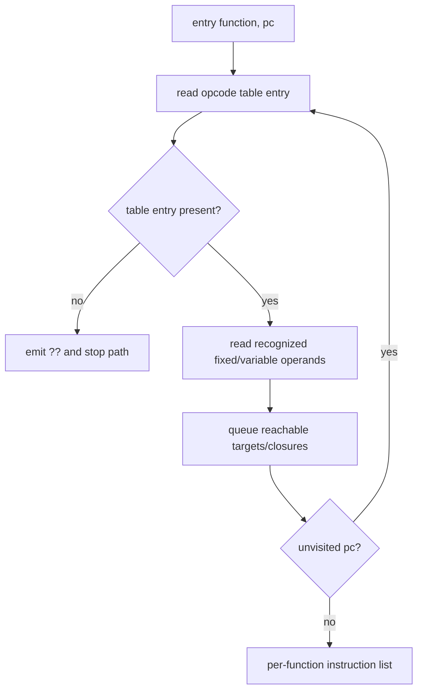

# Wordcode disassembly

Evidence label: source-inspection only.

## 1. Target

This boundary converts extracted u32 wordcode into reachable per-function instructions. It uses
I2's canonical handler templates for fixed widths and for variable-width CALL, CALL_METHOD, NEW,
MAKE_CLOSURE, BUILD_ARRAY, BUILD_OBJECT, and spread forms. The input also includes I1's pool,
entry, handlers, and globals; the output has instruction operands, control targets, decoded
constants, and discovered closure function entries.

## 2. Algorithm

1. Copy the machine words and initialize a worklist at the entry function/program counter.
2. Visit each `(function, pc)` once, read a handler opcode, and consume the table entry's
   source-defined fixed or variable width.
3. Resolve pool values with the value/key reader, decode globals and variable operands, and emit
   explicit metadata for closures and exception targets.
4. Queue direct jumps, conditional targets, handler targets, closure PCs, and other reachable
   control points. Keep per-function visited PCs so a loop does not re-disassemble indefinitely.
5. Apply the recognized decrypt operation to the working word array when encountered. An opcode
   absent from the handler table emits `??` and ends that function path rather than guessing a
   width. A handler whose shape classified as `?` remains a warned table entry and is not itself a
   hard stop in the current source.

## 3. Implementation

| Ownership | Concrete behavior and state |
|---|---|
| **Owned algorithm** | `makeConstantReader` resolves pool index/key pairs. Variable operand readers bind spread markers, call/new/closure metadata, and collection counts. `disassemble` owns the copied word array, worklists, visited sets, target queuing, and absent-entry termination. |
| **Shared coordinator** | `devirtualize` requires the machine sufficiency gate, builds I2's table, invokes disassembly, and collects warnings before I4. |
| **Delegated helper** | I2 supplies template names/widths/operand-read order; I1 supplies code/pool/entry/handler data. Runtime semantics provide comparison context and are outside this static disassembly stage. |

For a recognized table entry, each emitted instruction begins at the visited opcode position and
advances according to the entry's fixed or variable read behavior. The source does not perform a
general cursor, width, or truncation validity check: out-of-range recognized reads can produce
`undefined` operands. A closure target or control target is queued only from a recognized operand.
The copied word array means decrypting a recognized region cannot mutate the source artifact.
Unknown handler shapes are a separate warning path and remain recognized table entries.

## 4. Decoder Upstream Effects

I1 must produce aligned words and a pool; I2 must classify every handler needed on a reachable path.
I3 is the sole producer of per-function instruction boundaries and control targets. I4 relies on
those boundaries for state-aware interpretation, and I5/I6 rely on the resulting CFG rather than
re-reading raw words.

The corpus uses a sample-specific spread marker. The pinned producer baseline uses a different
sentinel in its CALL representation, so this page keeps the marker shape/data as corpus evidence
and does not transfer its numeric value to another encoder.

## 5. Known Gaps

- An opcode with no table entry emits `??` and ends that path. Recognized entries have no explicit
  cursor/width/truncation validation, so malformed counts or out-of-range reads can yield partial or
  undefined operands rather than a uniformly detected fallback. A `?` handler-table entry is
  warned by the coordinator but currently advances through the disassembler's counted-width path;
  this is an explicit source limitation, not a hidden guarantee.
- Decryption is recognized only for the classified operation; arbitrary self-modifying regions are
  not inferred.
- Reachability is from known machine edges; an unreferenced handler is not proof of a missing
  function, and a numeric handler key is not proof of reachability.
- This source contract has no empirical claim for optional producer opcode transforms.

## Source

- [devirt.js constant reader, variable operands, and disassembly (e90be6c)](https://github.com/MichaelXF/claude-vs-js-confuser/blob/e90be6ca716e28f4bba91fe39615a665656bd802/VM-2/devirt.js#L137-L153)
- [devirt.js variable forms and worklist disassembler (e90be6c)](https://github.com/MichaelXF/claude-vs-js-confuser/blob/e90be6ca716e28f4bba91fe39615a665656bd802/VM-2/devirt.js#L498-L642)
- [Pinned producer labels/constants/wordcode serialization (20c5b96)](https://github.com/MichaelXF/js-confuser-vm/blob/20c5b96bf57337c568579352758d7685358650de/src/compiler.ts#L2848-L3274)

## Fixtures

No maintained fixture isolates this pass. The pinned corpus wordcode and handler table are
sample-specific inputs supplied by upstream extraction.
