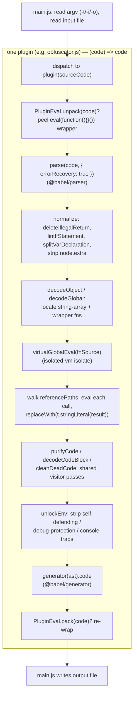

# decode-js — Deobfuscator Reference

Reference for the deobfuscator vendored at `decoder/decode-js` (submodule, upstream
echo094/decode-js). **Every source permalink in this package targets
[`6c974fb`](https://github.com/echo094/decode-js/commit/6c974fb5720518fac9c6b3d4cf558ba90ef9f8e7)**,
the commit that merged the jsconfuser decode target to `main`, which is also what this
repository's submodule pin names — the two are kept in step deliberately, so a permalink and
a `git submodule update` always show the same tree. This is a
**decoder**: it takes obfuscated JavaScript and reverses it back toward readable source,
one obfuscator family at a time.

When a pass needs more detail than this reference provides, the [test suite](tests.md)
(`decoder/decode-js/test/`) pins down exact before/after behavior with concrete
`*.js` → `*.fix.js` fixture pairs, and each plugin's own source header comments cite the
upstream obfuscator versions and issue numbers the pass was written against.

## Babel + isolated-vm Foundation

decode-js is built on [Babel](https://babeljs.io/) for AST work and
[isolated-vm](https://github.com/laverdet/isolated-vm) for safe evaluation — it has no
custom parser or IR of its own. Every pass is a Babel-visitor-shaped object (or a
factory returning one) applied with `traverse`:

- **`@babel/parser`** (`parse`) parses obfuscated source into a standard Babel AST.
  Almost every entry point passes `{ errorRecovery: true }` because obfuscated input is
  often not cleanly parseable.
- **`@babel/traverse`** (`traverse`) walks the AST and applies each pass's visitor.
  `NodePath`, `Scope`, and `Binding` — used throughout for reference tracking and
  dead-code removal — are Babel's own abstractions. Passes lean heavily on
  `scope.getBinding(name)`, `binding.referencePaths`, and `scope.crawl()` to rewire and
  prune the tree after edits.
- **`@babel/types`** (imported as `t` everywhere) constructs and type-checks nodes:
  `t.stringLiteral(...)`, `t.isCallExpression(...)`, etc.
- **`@babel/generator`** (`generator`) prints the AST back to source text — both for the
  final output and, crucially, to serialize AST fragments back into **strings** that get
  fed to the sandbox (see below).

All four `@babel/*` packages are pinned `^8.0.0` runtime `dependencies`; `isolated-vm`
is pinned `^7.0.0`. Node **26.x** is required (`engines` in `package.json`, per README) —
the exact version tracks `isolated-vm`'s native-build compatibility table.

**Import style:** Babel 8 ships native ESM, so `import generator from '@babel/generator'`
and `import traverse from '@babel/traverse'` resolve to the callable function directly.
Don't use the older CJS-interop shim (`import _generate from '@babel/generator'; const
generator = _generate.default`) — under Babel 8 that leaves `generator`/`traverse`
`undefined`, failing at call time (`TypeError: ... is not a function`) rather than at
import time, so a copy-pasted file using the old shim can look fine until actually
invoked. `c8a97a6` (`refactor(decode-js): use direct ESM default imports for Babel 8`)
converted the whole codebase to the direct-import form; if a file using the old shim
turns up, that's a sign it was added or last touched before that migration and is worth
double-checking, not a pattern to extend.

### Sandbox-assisted partial evaluation (the core decode technique)

The signature move shared by the heavier plugins (`obfuscator`, `sojson`, `sojsonv7`)
is not pure AST rewriting — it is **running the obfuscator's own helper code inside a
sandbox and substituting the results back into the AST**:

```js
const isolate = new ivm.Isolate()
const globalContext = isolate.createContextSync()
function virtualGlobalEval(jsStr) {
  return globalContext.evalSync(String(jsStr))
}
```

The pattern: locate the obfuscator's string-array + decoder-wrapper functions, serialize
them with `generator(...).code`, `virtualGlobalEval` them into the isolate to define the
real decoder, then walk every call site (`binding.referencePaths`), re-evaluate each call
string in the isolate, and `replaceWith(t.stringLiteral(result))`. Chained/nested decoder
functions are handled by a depth-first walk (`dfs` in `obfuscator.js`) that accumulates
parent definitions before evaluating a child. `isolated-vm` is what makes this safe —
the untrusted decoder logic runs with no access to the host. The lighter plugins
(`jjencode`, `common`) use the host `eval`/pure-AST work instead of the isolate; see each
plugin doc for which.

**When to reach for the isolate, and when not to.** Sandbox it whenever decoding a value
means *running* an algorithm rather than matching a fixed AST shape — a parameterized encode
function, a hash, a checksum, anything whose implementation the obfuscator gets to choose.
Re-implementing such an algorithm in the decoder only ever covers the version you read, and
refusing to decode it is worse. Don't reach for it otherwise: a pass whose inputs are already
literal AST nodes (`duplicate-literal.js` is the clean example) needs no evaluation at all,
and the isolate would only add a failure mode.

## Skill Layout

This package is built incrementally (per
[Studying a new encoder/decoder pair](../encoder-decoder-method.md#studying-a-new-encoderdecoder-pair)).
The root file below is complete; supporting files are added one plugin/visitor
at a time as each is studied against source.

```
skills/decode-js/
├── decode-js.md      this file — Babel+isolated-vm foundation, source layout, the
│                     plugin roster, and the shared execution flow: the core decode
│                     workflow and algorithm
├── babel.md          Babel's Scope/Binding/NodePath semantics that several passes
│                     depend on — parent-scope lookup, the three definition spellings,
│                     name-is-not-identity, duplicate referencePaths, dead positions
├── plugins/          one file per dispatch target (obfuscator family) — the pass
│                     pipeline it runs and the AST patterns it matches/reverses;
│   └── <type>.md     common, obfuscator, sojson, sojsonv7, jjencode, awsc, jsconfuser,
│                     plus eval (shared pack/unpack helper). See the roster below
├── visitors/         one file per reusable src/visitor/*.js pass — see the
│   ├── <name>.md     Reusable Visitor Passes index below
│   └── jsconfuser/   one file per src/visitor/jsconfuser/*.js pass (plugin-specific,
│       └── <name>.md not reusable across obfuscator families) — added incrementally
│                     alongside decode-nexus's per-transform worklist
├── tests.md          summary of test/ — Vitest config, harness, and fixture layout
└── probes.md         how to build a throwaway probe against this decoder — the two
                      datasets and their regeneration recipe, plumbing skeletons, the
                      fail-closed-matcher instrument, and the ways a probe lies
```

## Source Layout (`decoder/decode-js/src/`)

```
src/
├── main.js                   CLI entry — parses -t/-i/-o argv, dispatches to one plugin
├── plugin/                   one file per obfuscator family; each exports (code)=>code
│   ├── common.js             default "common" — light local deobfuscation
│   ├── obfuscator.js         javascript-obfuscator (obfuscator.io) — the largest plugin
│   ├── sojson.js             sojson (jsjiami) — older versions
│   ├── sojsonv7.js           jsjiami.com.v7
│   ├── jjencode.js           jjencode (utf-8.jp) — string-extraction + eval, not AST
│   ├── awsc.js               fireyejs / bx-ua (225 algorithm)
│   └── eval.js               pack/unpack helper for eval-wrapped payloads (not a -t type)
└── visitor/                  reusable Babel visitor passes shared across plugins
    ├── calculate-constant-exp.js     constant folding
    ├── calculate-rstring.js          resolve r-string / .repeat-style constructions
    ├── delete-extra.js               strip node .extra (raw literal formatting)
    ├── delete-illegal-return.js      remove top-level IllegalReturn
    ├── delete-nested-blocks.js       flatten redundant nested BlockStatements
    ├── delete-unreachable-code.js    drop code after return/throw/break/continue
    ├── delete-unused-var.js          prune unreferenced bindings
    ├── lint-if-statement.js          normalize if bodies to BlockStatements
    ├── merge-object.js               re-merge split object definitions
    ├── parse-control-flow-storage.js decode control-flow "storage" object dispatch
    ├── prune-if-branch.js            fold if() on constant tests
    ├── remove-control-flow-ob.js     unflatten switch-based control flow
    ├── split-assignment.js           split compound/sequence assignments
    ├── split-sequence.js             split SequenceExpressions into statements
    ├── split-variable-declaration.js split multi-declarator `var a,b,c`
    └── split-variable-declarator.js  split a single declarator's chained init
└── utility/                  small shared helpers, imported by visitors and plugins alike
    ├── binding-def.js        resolve a binding to what it actually *defines*
    ├── check-func.js         `checkPattern` — subsequence "fingerprint" matching
    ├── logger.js             gated per-pass progress logging (off by default)
    └── safe-func.js          reference-count-gated deletion, literal/name reads, replace
```

`src/utility/` holds the four helpers every plugin family may draw on. `safe-func.js` is
the one to reach for by default: `safeDeleteNode` is the reference-count-gated deletion
idiom used for every "remove this helper once nothing calls it" cleanup, and it removes a
declarator plus its separate write as readily as a declaration. `binding-def.js` answers
the complementary question — given a binding, what does it actually *define*? — for the
three spellings a definition arrives in (a declaration, a `var X;` + `X = …` split, and a
name hoisted onto a parameter list), which a matcher reading `binding.path` alone sees only
the first of. `check-func.js`'s `checkPattern` does subsequence "fingerprint" matching.

**`logger.js` carries the split between the two things a pass reports, and the split is the
point.** `debugLog` is *progress* — which function a pass resolved as the string-compression
helper, which name Pack unwrapped — and it is off unless `-v`/`--verbose` or
`DECODE_JS_DEBUG=1` (the env var is what lets a probe importing a plugin directly turn it on
without a code change). It is kept rather than deleted because a fail-closed pass leaves no
other record that it ran at all. **`console.warn` is deliberately *not* routed through it:**
abnormal states stay unconditional on stderr, because they report caught-exception failures
that no bail-point breadcrumb can observe, and at least one instrument tallies them as its
entire signal. Gating those by default would delete the only visibility into that failure
class — so a new log line has to be classified before it is written, not afterwards.

No `docs/` folder ships in the pinned submodule, so there are no upstream docs to
cross-reference here.

## Dispatch & Plugin Roster (`src/main.js`)

`main.js` parses argv via Node's `util.parseArgs` — `-t`/`--type` (default `common`),
`-i`/`--input` (default `input.js`), `-o`/`--output` (default `output.js`),
`-v`/`--verbose` (default off, enables `utility/logger.js`'s per-pass progress trace). An
unrecognized `type` now errors out (`process.exitCode = 1`) instead of silently falling
back to `common`; missing input files and write failures are also caught and reported
rather than throwing or failing silently. It then reads the input file, calls the one
matching plugin as `plugin(sourceCode)`, and writes the returned string. There is **no
shared pipeline order** like an encoder's `order.ts`; each plugin *is* its own pipeline,
hand-tuned to one obfuscator family.

| `-t` type            | plugin | target obfuscator |
|----------------------|--------|-------------------|
| `common` *(default)* | [common](plugins/common.md) | high-frequency local obfuscation (no specific vendor) |
| `obfuscator`         | [obfuscator](plugins/obfuscator.md) | javascript-obfuscator / obfuscator.io |
| `sojson`             | [sojson](plugins/sojson.md) | sojson (jsjiami), older |
| `sojsonv7`           | [sojsonv7](plugins/sojsonv7.md) | jsjiami.com.v7 |
| `jjencode`           | [jjencode](plugins/jjencode.md) | jjencode (utf-8.jp) |
| `awsc`               | [awsc](plugins/awsc.md) | fireyejs / bx-ua (225) — not listed in README |
| `jsconfuser`         | [jsconfuser](plugins/jsconfuser.md) | [js-confuser](../js-confuser/js-confuser.md) — flat sequence of shape-based passes, not the sandbox-assisted technique below; built incrementally, see the plugin doc for per-visitor status |

[eval](plugins/eval.md) (`plugin/eval.js`) is not a dispatch target: it exports
`unpack`/`pack` used by `obfuscator`, `sojson`, and `sojsonv7` to peel an
`eval(function(){...}())` wrapper before decoding and re-wrap it afterward.

## Reusable Visitor Passes (`src/visitor/`)

The passes plugins compose. Each has its own doc under `visitors/`; the table notes which
plugins import it (verified against source at this pin).

**Normalization / cleanup**

| pass | does | used by |
|------|------|---------|
| [delete-illegal-return](visitors/delete-illegal-return.md) | drop `return` at Program scope | obfuscator, sojsonv7 |
| [lint-if-statement](visitors/lint-if-statement.md) | wrap `if` branches in blocks | obfuscator |
| [delete-nested-blocks](visitors/delete-nested-blocks.md) | flatten redundant nested blocks | common |
| [delete-unreachable-code](visitors/delete-unreachable-code.md) | drop code after an unconditional return | common |
| [delete-unused-var](visitors/delete-unused-var.md) | prune unreferenced literal/empty declarators | sojson, obfuscator, sojsonv7 |
| [delete-extra](visitors/delete-extra.md) | strip `node.extra` (canonicalize literals) | jsconfuser |

**Literal folding**

| pass | does | used by |
|------|------|---------|
| [calculate-constant-exp](visitors/calculate-constant-exp.md) | fold binary/unary/logical-short-circuit literal expressions | common, sojson, obfuscator, sojsonv7, jsconfuser |
| [calculate-rstring](visitors/calculate-rstring.md) | fold `"…".split("").reverse().join("")` | common |
| [prune-if-branch](visitors/prune-if-branch.md) | fold `if`/`?:` on a constant test | obfuscator, sojson, sojsonv7, jsconfuser |

**Statement splitting**

| pass | does | used by |
|------|------|---------|
| [split-assignment](visitors/split-assignment.md) | hoist assignment out of an expression position | obfuscator |
| [split-sequence](visitors/split-sequence.md) | split `a, b, c` into statements | sojson, obfuscator, sojsonv7 |
| [split-variable-declaration](visitors/split-variable-declaration.md) | split `var a, b, c` | obfuscator |
| [split-variable-declarator](visitors/split-variable-declarator.md) | split `var a = (b, c)` | *(test-only — not wired in)* |

**Control-flow / object reversal**

| pass | does | used by |
|------|------|---------|
| [merge-object](visitors/merge-object.md) | fold `obj.k = v` sequence back into a literal | obfuscator |
| [parse-control-flow-storage](visitors/parse-control-flow-storage.md) | inline controlFlowStorage wrapper calls | obfuscator, sojson, sojsonv7 |
| [remove-control-flow-ob](visitors/remove-control-flow-ob.md) | unflatten `while(true){switch(order[i++])}` | sojson, sojsonv7, obfuscator |

## Matching Encoder-Emitted Structure: Never by Name

Applies to every plugin's matchers, not just one obfuscator family: **identify
encoder-emitted structure by AST shape (call/body pattern, position, argument arity) or
by capturing a binding/path at the moment a pass first resolves it, never by a literal
variable/function name or name suffix.** Most obfuscators ship a renaming pass late in
their pipeline (js-confuser's `RenameVariables`/`identifierGenerator: randomized`;
similar passes elsewhere) that reassigns *every* identifier — including the obfuscator's
own internal runtime-helper names, not just user-authored ones — to a random string, with
zero effect on functionality; that's the whole point of the transform. A matcher that
keys off a fixed name or suffix (`.endsWith('_some_suffix')`, `name === 'foo'`) only
works in combos that happen to omit that pass, and fails **silently closed** the moment
it's added: no error, no signature to grep for, because the unmodified fallback is always
runtime-correct. An entire mechanism can go completely undecoded this way while every
correctness check still passes.

Found the hard way in jsconfuser's CFF decoder (2026-07-25, since fixed): the now-deleted
`findProgramConstants` (`control-flow-graph.js`) located the CFF runtime's Program-level
helpers by literal name suffix (`_cff_sequence`, `_cff_slice`, etc.); js-confuser's
`RenameVariables` runs after `ControlFlowFlattening` in encode order and renames them away,
so the lookup silently returned nothing and the *entire* CFF decode for that Program failed
closed — not just the one interpreter targeted. The fix is the general shape of the remedy
too: resolve each helper from its own use site via `scope.getBinding()`, which renaming
cannot invalidate because it necessarily preserves binding structure. See
[jsconfuser/control-flow.md](visitors/jsconfuser/control-flow.md#plugin-wiring)
for the full writeup. Treat this as a standing design constraint, not a one-off bug: a
matcher that has only ever been exercised against a combo without a renaming pass has not
actually been proven robust against real obfuscator output, for any plugin in this repo.

## Execution Flow

Every plugin follows the same skeleton — parse once, run an ordered series of
`traverse` passes (some plugins additionally drive the `isolated-vm` isolate for
global/string decoding), then generate. `plugin/obfuscator.js` is the fullest example:



Lighter plugins collapse this: `common.js` is just four `traverse` passes and a
generate; `jjencode.js` skips Babel entirely, extracting the payload string and
`eval`-ing it. Each plugin's exact pass order, fingerprints, and version-specific
branches belong in its own `plugins/<type>.md` (built incrementally).

**Decode cost is volume, not a loop — don't go looking for one.** Timed across a whole corpus of
real `high`-preset output, decode time tracked input size almost linearly with no throws and no
outlier; a sample once recorded as non-terminating clears in seconds. What looked like a hang was
input size plus a sequential runner. The two constructs that would otherwise be the suspects are
both bounded: `visitor/jsconfuser/control-flow-graph.js`'s `for (;;)` terminates on its `failed`
set, and `visitor/jsconfuser/variable-masking.js`'s `while (changed)` re-parses the function on
each invalidation — the latter is the first place to instrument if a real hang ever does appear.

## Working on this codebase

**Progress logging is gated, warnings are not.** Per-pass tracing — which function turned out
to be the string-compression helper, which name Pack unwrapped — runs through
`utility/logger.js` and is **off** unless `-v`/`--verbose` or `DECODE_JS_DEBUG=1`. It is kept
rather than deleted because a fail-closed pass leaves no other record that it ran at all. The
`console.warn` calls are deliberately *not* routed through that gate: they report
caught-exception failures that no bail-point breadcrumb can observe, and at least one instrument
tallies them as its entire signal, so silencing them by default would remove the only visibility
into that failure class.

**New per-transform visitor files are kebab-case, matching the transform's skill-doc slug**, one
file per transform. Reuse across plugins is the exception and is decided case by case.

**Never run the unscoped `npm run lint`** (`eslint --fix src`) — prettier-version drift makes it
reformat trailing commas across unrelated files, burying the real change. Use scoped
`npx eslint [--fix] <files>` and confirm with `git diff --stat`. **Several files carry
pre-existing lint errors**, so a scoped run exits non-zero even on a clean change: lint the file
*before* your edit and diff the two reports rather than trusting the exit code, check the
reported lines are actually yours, and don't `--fix` unrelated findings as a side effect —
`--fix` repairs them silently, so diff afterwards and revert those hunks if it did. (Don't
record which files those are: the list has been wrong twice, and the before/after diff answers
it in seconds. CI does not run eslint.)

**Cross-check new or touched code against prior Claude-co-authored fixes**
(`git log --all --grep='Co-Authored-By: Claude' -i`). The signal is the *fix pattern* those
commits establish, not a lint step — e.g. `insertPath.scope.crawl()` →
`.getProgramParent().crawl()`, and ESM default-import style for Babel 8
(`_traverse.default || _traverse`).

## Commit Scope Convention

Per the hub's Commit Conventions (see root [SKILL.md](../../SKILL.md)), commits touching
this submodule use a scope more specific than the bare `decode-js` name whenever the
change is localized to one unit:

- One `src/plugin/*` file: `plugin/<plugin>` — e.g. `plugin/obfuscator`,
  `plugin/sojsonv7` (names match the `-t` roster above).
- One `src/visitor/*` file: `visitor/<visitor>` — e.g. `visitor/split-assignment`
  (names match the Reusable Visitor Passes tables above).
- Bare `decode-js` is reserved for genuinely package-wide changes: `main.js`/CLI,
  manually-edited tooling/dependency files (`package.json`, `README.md`, lint/CI
  config), or anything spanning multiple plugins/visitors.
- `build`-type commits from automated dependency bumps (e.g. Dependabot) keep their
  own generated scope (`deps`, `deps-dev`) rather than being remapped to `decode-js`.
