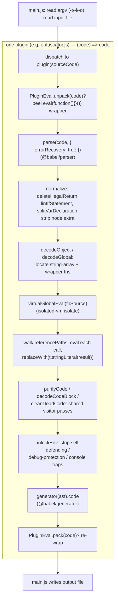

# decode-js — Deobfuscator Reference

Reference for the deobfuscator vendored at `decoder/decode-js` (submodule, pinned
`25b8aa3` "build(deps): bump the babel group", upstream echo094/decode-js). This is a
**decoder**: it takes obfuscated JavaScript and reverses it back toward readable source,
one obfuscator family at a time.

When a pass needs more detail than this reference provides, the [test suite](tests.md)
(`decoder/decode-js/test/`) pins down exact before/after behavior with concrete
`*.js` → `*.fix.js` fixture pairs, and each plugin's own source header comments cite the
upstream obfuscator versions and issue numbers the pass was written against.

## Babel + isolated-vm Foundation

decode-js is built on [Babel](https://babeljs.io/) for AST work and
[isolated-vm](https://github.com/laverdet/isolated-vm) for safe evaluation — it has no
custom parser or IR of its own. Every pass is a Babel-visitor-shaped object (or a
factory returning one) applied with `traverse`:

- **`@babel/parser`** (`parse`) parses obfuscated source into a standard Babel AST.
  Almost every entry point passes `{ errorRecovery: true }` because obfuscated input is
  often not cleanly parseable.
- **`@babel/traverse`** (`traverse`) walks the AST and applies each pass's visitor.
  `NodePath`, `Scope`, and `Binding` — used throughout for reference tracking and
  dead-code removal — are Babel's own abstractions. Passes lean heavily on
  `scope.getBinding(name)`, `binding.referencePaths`, and `scope.crawl()` to rewire and
  prune the tree after edits.
- **`@babel/types`** (imported as `t` everywhere) constructs and type-checks nodes:
  `t.stringLiteral(...)`, `t.isCallExpression(...)`, etc.
- **`@babel/generator`** (`generator`) prints the AST back to source text — both for the
  final output and, crucially, to serialize AST fragments back into **strings** that get
  fed to the sandbox (see below).

All four `@babel/*` packages are pinned `^8.0.0` runtime `dependencies`; `isolated-vm`
is pinned `^7.0.0`. Node **>= 22** is required (per README), largely because of
`isolated-vm`'s native-build requirements.

### Sandbox-assisted partial evaluation (the core decode technique)

The signature move shared by the heavier plugins (`obfuscator`, `sojson`, `sojsonv7`)
is not pure AST rewriting — it is **running the obfuscator's own helper code inside a
sandbox and substituting the results back into the AST**:

```js
const isolate = new ivm.Isolate()
const globalContext = isolate.createContextSync()
function virtualGlobalEval(jsStr) {
  return globalContext.evalSync(String(jsStr))
}
```

The pattern: locate the obfuscator's string-array + decoder-wrapper functions, serialize
them with `generator(...).code`, `virtualGlobalEval` them into the isolate to define the
real decoder, then walk every call site (`binding.referencePaths`), re-evaluate each call
string in the isolate, and `replaceWith(t.stringLiteral(result))`. Chained/nested decoder
functions are handled by a depth-first walk (`dfs` in `obfuscator.js`) that accumulates
parent definitions before evaluating a child. `isolated-vm` is what makes this safe —
the untrusted decoder logic runs with no access to the host. The lighter plugins
(`jjencode`, `common`) use the host `eval`/pure-AST work instead of the isolate; see each
plugin doc for which.

## Skill Layout

This package is built incrementally (per the hub's "Studying a New Encoder/Decoder"
process). The root file below is complete; supporting files are added one plugin/visitor
at a time as each is studied against source.

```
skills/decode-js/
├── decode-js.md      this file — Babel+isolated-vm foundation, source layout, the
│                     plugin roster, and the shared execution flow: the core decode
│                     workflow and algorithm
├── plugins/          one file per dispatch target (obfuscator family) — the pass
│                     pipeline it runs and the AST patterns it matches/reverses;
│   └── <type>.md     common, obfuscator, sojson, sojsonv7, jjencode, awsc, plus
│                     eval (shared pack/unpack helper). See the roster below
├── visitors/         one file per reusable src/visitor/*.js pass — see the
│   └── <name>.md     Reusable Visitor Passes index below
└── tests.md          summary of test/ — Vitest config, harness, and fixture layout
```

## Source Layout (`decoder/decode-js/src/`)

```
src/
├── main.js                   CLI entry — parses -t/-i/-o argv, dispatches to one plugin
├── plugin/                   one file per obfuscator family; each exports (code)=>code
│   ├── common.js             default "common" — light local deobfuscation
│   ├── obfuscator.js         javascript-obfuscator (obfuscator.io) — the largest plugin
│   ├── sojson.js             sojson (jsjiami) — older versions
│   ├── sojsonv7.js           jsjiami.com.v7
│   ├── jjencode.js           jjencode (utf-8.jp) — string-extraction + eval, not AST
│   ├── awsc.js               fireyejs / bx-ua (225 algorithm)
│   └── eval.js               pack/unpack helper for eval-wrapped payloads (not a -t type)
└── visitor/                  reusable Babel visitor passes shared across plugins
    ├── calculate-constant-exp.js     constant folding
    ├── calculate-rstring.js          resolve r-string / .repeat-style constructions
    ├── delete-extra.js               strip node .extra (raw literal formatting)
    ├── delete-illegal-return.js      remove top-level IllegalReturn
    ├── delete-nested-blocks.js       flatten redundant nested BlockStatements
    ├── delete-unreachable-code.js    drop code after return/throw/break/continue
    ├── delete-unused-var.js          prune unreferenced bindings
    ├── lint-if-statement.js          normalize if bodies to BlockStatements
    ├── merge-object.js               re-merge split object definitions
    ├── parse-control-flow-storage.js decode control-flow "storage" object dispatch
    ├── prune-if-branch.js            fold if() on constant tests
    ├── remove-control-flow-ob.js     unflatten switch-based control flow
    ├── split-assignment.js           split compound/sequence assignments
    ├── split-sequence.js             split SequenceExpressions into statements
    ├── split-variable-declaration.js split multi-declarator `var a,b,c`
    └── split-variable-declarator.js  split a single declarator's chained init
```

There is no `src/utility/` folder at this pin — plugins that need helpers like
`checkPattern` (subsequence "fingerprint" matching) define them inline (e.g. in
`obfuscator.js`). No `docs/` folder ships in the pinned submodule either, so there are
no upstream docs to cross-reference here.

## Dispatch & Plugin Roster (`src/main.js`)

`main.js` reads three argv flags — `-t <type>` (default `common`), `-i <input>`
(default `input.js`), `-o <output>` (default `output.js`) — reads the input file, calls
the one matching plugin as `plugin(sourceCode)`, and writes the returned string. There
is **no shared pipeline order** like an encoder's `order.ts`; each plugin *is* its own
pipeline, hand-tuned to one obfuscator family.

| `-t` type            | plugin | target obfuscator |
|----------------------|--------|-------------------|
| `common` *(default)* | [common](plugins/common.md) | high-frequency local obfuscation (no specific vendor) |
| `obfuscator`         | [obfuscator](plugins/obfuscator.md) | javascript-obfuscator / obfuscator.io |
| `sojson`             | [sojson](plugins/sojson.md) | sojson (jsjiami), older |
| `sojsonv7`           | [sojsonv7](plugins/sojsonv7.md) | jsjiami.com.v7 |
| `jjencode`           | [jjencode](plugins/jjencode.md) | jjencode (utf-8.jp) |
| `awsc`               | [awsc](plugins/awsc.md) | fireyejs / bx-ua (225) — not listed in README |

[eval](plugins/eval.md) (`plugin/eval.js`) is not a dispatch target: it exports
`unpack`/`pack` used by `obfuscator`, `sojson`, and `sojsonv7` to peel an
`eval(function(){...}())` wrapper before decoding and re-wrap it afterward.

## Reusable Visitor Passes (`src/visitor/`)

The passes plugins compose. Each has its own doc under `visitors/`; the table notes which
plugins import it (verified against source at this pin).

**Normalization / cleanup**

| pass | does | used by |
|------|------|---------|
| [delete-illegal-return](visitors/delete-illegal-return.md) | drop `return` at Program scope | obfuscator, sojsonv7 |
| [lint-if-statement](visitors/lint-if-statement.md) | wrap `if` branches in blocks | obfuscator |
| [delete-nested-blocks](visitors/delete-nested-blocks.md) | flatten redundant nested blocks | common |
| [delete-unreachable-code](visitors/delete-unreachable-code.md) | drop code after an unconditional return | common |
| [delete-unused-var](visitors/delete-unused-var.md) | prune unreferenced literal/empty declarators | sojson, obfuscator, sojsonv7 |
| [delete-extra](visitors/delete-extra.md) | strip `node.extra` (canonicalize literals) | *(orphan — not wired in)* |

**Literal folding**

| pass | does | used by |
|------|------|---------|
| [calculate-constant-exp](visitors/calculate-constant-exp.md) | fold binary/unary literal expressions | common, sojson, obfuscator, sojsonv7 |
| [calculate-rstring](visitors/calculate-rstring.md) | fold `"…".split("").reverse().join("")` | common |
| [prune-if-branch](visitors/prune-if-branch.md) | fold `if`/`?:` on a constant test | obfuscator, sojson, sojsonv7 |

**Statement splitting**

| pass | does | used by |
|------|------|---------|
| [split-assignment](visitors/split-assignment.md) | hoist assignment out of an expression position | obfuscator |
| [split-sequence](visitors/split-sequence.md) | split `a, b, c` into statements | sojson, obfuscator, sojsonv7 |
| [split-variable-declaration](visitors/split-variable-declaration.md) | split `var a, b, c` | obfuscator |
| [split-variable-declarator](visitors/split-variable-declarator.md) | split `var a = (b, c)` | *(test-only — not wired in)* |

**Control-flow / object reversal**

| pass | does | used by |
|------|------|---------|
| [merge-object](visitors/merge-object.md) | fold `obj.k = v` sequence back into a literal | obfuscator |
| [parse-control-flow-storage](visitors/parse-control-flow-storage.md) | inline controlFlowStorage wrapper calls | obfuscator, sojson, sojsonv7 |
| [remove-control-flow-ob](visitors/remove-control-flow-ob.md) | unflatten `while(true){switch(order[i++])}` | sojson, sojsonv7, obfuscator |

## Execution Flow

Every plugin follows the same skeleton — parse once, run an ordered series of
`traverse` passes (some plugins additionally drive the `isolated-vm` isolate for
global/string decoding), then generate. `plugin/obfuscator.js` is the fullest example:



Lighter plugins collapse this: `common.js` is just four `traverse` passes and a
generate; `jjencode.js` skips Babel entirely, extracting the payload string and
`eval`-ing it. Each plugin's exact pass order, fingerprints, and version-specific
branches belong in its own `plugins/<type>.md` (built incrementally).
