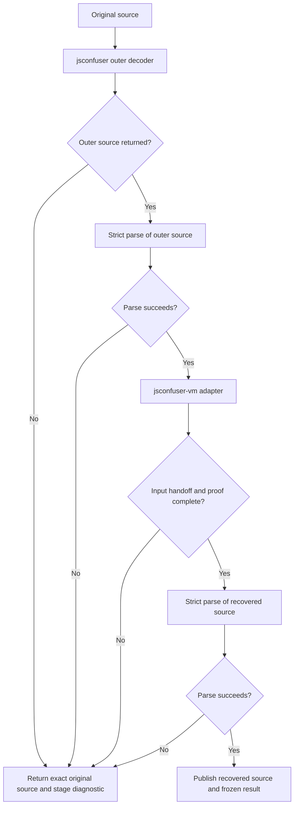

# jsconfuser-vm-sequential.js

## 1. Target

The `jsconfuser-vm-sequential` target composes this decoder's
[jsconfuser](jsconfuser.md) outer pass with its [numeric VM adapter](jsconfuser-vm.md).
It publishes recovered JavaScript only when both decoder boundaries and both fresh parses
succeed. A failed stage publishes the exact original input bytes, a stage-specific diagnostic,
and no result; intermediate stages remain in the frozen record for inspection.

This target supports an outer-then-VM attempt, not a claim that every layered
JS-Confuser/JS-Confuser-VM sample is qualified. Its output contract is
`jsconfuser-vm-sequential.v1`.

## 2. Algorithm

The coordinator treats each decoder as an independent source boundary. It never passes a
partially mutated AST between them. The outer result is parsed strictly before it becomes VM
input; the VM result must contain the complete adapter and standalone proof fields before its
emitted source is parsed strictly for publication.

The four stage names are `outer`, `outer-parse`, `vm`, and `recovered-parse`.
The CLI exposes the coordinator as `-t jsconfuser-vm-sequential` and writes the same
output-plus-JSON-sidecar pair as the direct VM target.

## 3. Implementation

`createJsconfuserVmSequentialCoordinator` accepts optional outer decoder, VM decoder and
parser dependencies for focused controls; `decodeJsconfuserVmSequential` invokes it with
the production defaults. It requires a string input and creates a stage record with pending
entries before calling the outer decoder.

| Gate | Required shape | Failure location |
|---|---|---|
| Outer decode | A source string; null, exceptions, timeout/error records and nonstring values decline. | `outer` |
| Outer parse | Fresh parse with error recovery disabled. | `outer-parse` |
| VM handoff | `jsconfuser-vm-adapter.v1` success whose `input` equals the exact outer source and whose `output` equals `result.output`. | `vm` |
| VM proof | `jsconfuser-vm-standalone.v1`, `parseOnly: true`, no target or VM execution, emitted JavaScript, and true predecessor/no-runtime/fresh-emission proof fields. | `vm` |
| Recovered parse | Fresh strict parse of the VM output. | `recovered-parse` |

The public record carries `schemaVersion`, `ok`, `status`, `input`, `output`,
`result`, `diagnostic`, `failedStage`, and the four `stages`. Declines keep the
original source in `output` and `result: null`; success uses the VM output and result.
The wrapper deep-freezes either record. Stage diagnostics distinguish refusal, exceptions,
timeouts, incomplete VM results, input mismatch and parse failures.

## 4. Upstream Effects

| Earlier decoder output | Coordinator treatment |
|---|---|
| [jsconfuser](jsconfuser.md) source string | Parse it afresh before VM recognition; any failure rolls back to original bytes. |
| [jsconfuser-vm](jsconfuser-vm.md) adapter record | Check its input matches the outer text and its standalone result is complete; do not infer success from non-null output alone. |
| VM-emitted JavaScript | Parse again before publication; a rejected output remains only in the stage record. |

The coordinator adds no new VM recognizer or shared visitor. Its stage order makes the two
existing decoder contracts explicit at their source handoff.

## 5. Known Gaps

An outer result can parse successfully yet lack a supported numeric VM container; the VM
stage then declines and the original source is returned. The coordinator does not extend the
VM adapter's encoded, hardened, mixed/repeated-encoder or host-semantics boundaries. It does
not execute the target or turn a bounded fixture check into a general equivalence claim.

## Source

- [jsconfuser-vm-sequential.js](../../../decoder/decode-js/src/plugin/jsconfuser-vm-sequential.js) — coordinator, stage gates, atomic rollback and result shape.
- [main.js](../../../decoder/decode-js/src/main.js) — CLI registration and result sidecar for the sequential target.
- [jsconfuser.js](../../../decoder/decode-js/src/plugin/jsconfuser.js) and [jsconfuser-vm.js](../../../decoder/decode-js/src/plugin/jsconfuser-vm.js) — independent decoder boundaries consumed in sections 2-4.

## Fixtures

| Committed test or fixture | Claim pinned |
|---|---|
| [sequential.test.js](../../../decoder/decode-js/test/vm/jsconfuser-vm/integration/sequential.test.js) | Stage order, complete VM-result gate, frozen records, exact-input rollback, failure codes and CLI reachability. |
| [Positive capture outer input](../../../decoder/decode-js/test/vm/jsconfuser-vm/fixtures/sequential/positive-capture-outer.js) | A parsed outer handoff can still decline at the VM-container boundary without publishing an intermediate. |
| [f-literals-order VM input](../../../decoder/decode-js/test/vm/jsconfuser-vm/fixtures/corpus/raw/f-literals-order/encoded.js) | A direct visible numeric container can pass the coordinator's VM and recovered-parse gates. |
