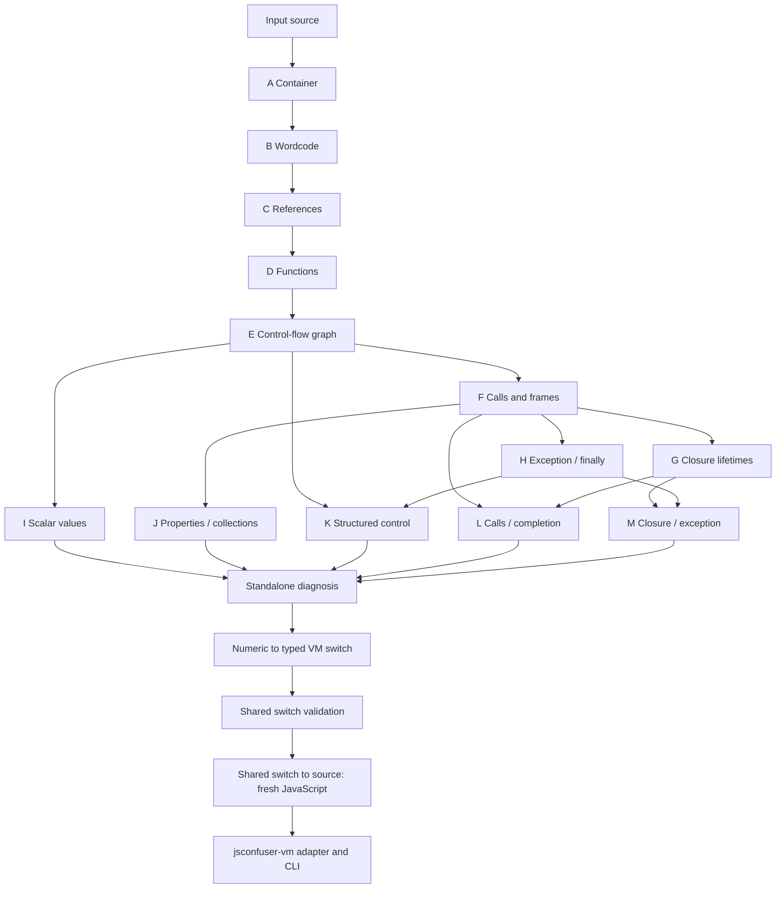

# jsconfuser-vm.js

Target-local decoder for the pinned, numeric, unhardened `js-confuser-vm` output. It is an
additive `decode-js` target: it does not alter the existing `jsconfuser` plugin or any legacy
plugin's string-or-null contract.

## 1. Target

Recover a complete supported VM container into fresh source-oriented JavaScript through the real
`decode-js` caller. The output is reviewable decompilation, not original-source reconstruction:
generic names and necessary register/capture scaffolding may remain. The target accepts the
Phase-1 baseline only; incomplete, malformed, encoded, randomized, or hardened containers
decline atomically and remain byte-for-byte unchanged.

## 2. Algorithm

The adapter is a result-aware boundary around the target-local standalone decoder:

1. Pass the input source to `diagnoseStandalone` exactly once.
2. On success, return the standalone emitted source and its immutable recovery result.
3. On decline, return the original source and the immutable diagnostic; do not expose partial
   analysis or emission.
4. The CLI writes the selected output and one JSON sidecar from that same record. It never runs
   the input or the recovered program as part of extraction, analysis, or emission.

The standalone decoder resolves its predecessor analyses before emission; item 3 maps their
exact inputs.

## 3. Implementation

### Decoder stage dependency map

The diagram is a reading map for the canonical numeric path. Arrows show the main data
handoffs; the A-M rows below list **every direct input** used by the diagnosis orchestrator.
Packet letters are decoder stage labels, not packets in the encoded program. All A-M stages
analyze source without executing the target or emitting the final program.

The graph highlights the point of each branch: I and J classify values and properties; K
proves which control form can be rendered; L records calls and completion routes; M records
closure and exception routes. Diagnosis requires complete coverage and a live K plan before
the switch adapter and N decoder render JavaScript. A decline at any stage stops that public path and the adapter
returns the exact input. Despite their `emit*` function names, K-M produce analysis records;
only the shared switch-to-source backend renders the final JavaScript.
The [VM switch boundary](../vm-switch-boundary.md) is now the handoff between the numeric
A-M diagnosis and source emission. An independent VM-2 benchmark has no admitted adapter to
that boundary; its [future transform contract](../transforms/jsconfuser-vm/exact-inner-recovery.md)
is a design reference, not an active decoder path.

| Stage and transform doc | Direct inputs | Record or decision passed forward |
|---|---|---|
| A [Container](../transforms/jsconfuser-vm/extract-container.md) | source | complete visible container |
| B [Wordcode](../transforms/jsconfuser-vm/read-wordcode.md) | A | ordered numeric instructions |
| C [References](../transforms/jsconfuser-vm/validate-references.md) | A, B | constants, operands, frames and labels |
| D [Functions](../transforms/jsconfuser-vm/partition-functions.md) | A, B, C | instruction and function ownership |
| E [Control-flow graph](../transforms/jsconfuser-vm/build-cfg.md) | B, C, D | control blocks and routes |
| F [Calls and frames](../transforms/jsconfuser-vm/build-call-frames.md) | B, C, D, E | call and frame state |
| G [Closure lifetimes](../transforms/jsconfuser-vm/closure-lifetimes.md) | B, C, D, E, F | capture and lifetime state |
| H [Exception/finally](../transforms/jsconfuser-vm/exception-finally.md) | B, C, D, E, F | handler and finalizer state |
| I [Scalar values](../transforms/jsconfuser-vm/scalar-values.md) | B, C, D, E | scalar operation records |
| J [Properties/collections](../transforms/jsconfuser-vm/property-collections.md) | B, C, D, E, F | property and collection records |
| K [Structured control](../transforms/jsconfuser-vm/structured-control.md) | B, E, H | per-function structured or proved state-machine plan |
| L [Calls/completion](../transforms/jsconfuser-vm/call-completion.md) | B, C, D, E, F, G | call grammar and completion routes |
| M [Closure/exception](../transforms/jsconfuser-vm/closure-exception.md) | B, C, D, E, F, G, H | closure, exception and route coverage |
| [Standalone diagnosis](../transforms/jsconfuser-vm/standalone-diagnosis.md) | A-M | resolved model or named decline before emission |
| [VM switch boundary](../vm-switch-boundary.md) | resolved diagnosis model | typed code/storage/cases, shared validation and source emission |
| [Standalone decode](../transforms/jsconfuser-vm/standalone-decode.md) | validated switch output | numeric residue gate, public source or atomic decline |

The adapter does not reimplement these shapes or diagnose the source a second time.

`decodeJsconfuserVm(source)` returns a frozen `jsconfuser-vm-adapter.v1` record:

| field | success | decline |
|---|---|---|
| `ok` / `status` | `true` / `success` | `false` / `declined` |
| `input` | exact input source | exact input source |
| `output` | fresh emitted JavaScript | exact input source |
| `result` | standalone result | `null` |
| `diagnostic` | `null` | standalone diagnostic |

The adapter delegates the single call to `diagnoseStandalone`. Its result and diagnostic are
already frozen by the standalone boundary, and the adapter freezes the enclosing record as well.
The CLI registers the adapter under `-t jsconfuser-vm`, reads UTF-8 input, and writes the record's
`output`. The default result path is `<output>.result.json`; `--result` selects an explicit path.
An explicit result path whose resolved path aliases the output path is rejected before either file
is written.
The target-specific branch reports unknown target, read, decode, output-write, result-write, and
invalid-result-option failures without changing legacy branches. A successful or declined target
record is still a successful CLI operation once both named files are written.

## 4. Upstream Effects

The adapter consumes one immutable diagnosis shape from the standalone decoder. The affected
caller behavior is therefore a boundary contract, not another AST pass:

| upstream shape | producer | adapter treatment |
|---|---|---|
| emitted source plus complete recovery result | [standalone decode](../transforms/jsconfuser-vm/standalone-decode.md) | expose both in one success record |
| diagnostic with no result | [standalone diagnosis](../transforms/jsconfuser-vm/standalone-diagnosis.md) or the [standalone decoder](../transforms/jsconfuser-vm/standalone-decode.md) | preserve it and the exact input in one decline record |
| legacy plugin string or `null` | existing `decode-js` plugin branches | leave untouched; no result sidecar is added |

No shared visitor or generic caller is an upstream dependency of this target. The additive registry
and target-specific CLI branch are the only integration shapes, so a failure in this boundary must
not be repaired by widening an existing plugin contract.

## 5. Known Gaps

- Only the pinned Phase-1 numeric, unhardened baseline is supported. Encoded bytecode,
  randomized or concealed maps/slots, `PATCH` streams, and other optional hardening remain
  fail-closed.
- Source replacement, generic shared-decoder changes, earlier releases, repeated or mixed
  encoders, and universal runtime equivalence are outside this target's contract.
- Behavioral checks are bounded regression oracles around static recovery; the adapter does not
  claim production-wide semantic equivalence.
- Readability is gated by the tracked arithmetic, closure/loop, and scale benchmark owned by
  [the standalone decoder contract](../transforms/jsconfuser-vm/standalone-decode.md#readability-gate).
  Passing that gate means the current emission is smaller and less scaffold-heavy than its
  recorded baseline; it does not promise recovered original identifiers or universal source
  reconstruction.

## Source

- [`../../../decoder/decode-js/src/plugin/jsconfuser-vm.js`](../../../decoder/decode-js/src/plugin/jsconfuser-vm.js) — the single-call frozen adapter.
- [`../../../decoder/decode-js/src/main.js`](../../../decoder/decode-js/src/main.js) — the additive registry and target-specific CLI/result-sidecar branch.
- [`../transforms/jsconfuser-vm/standalone-decode.md`](../transforms/jsconfuser-vm/standalone-decode.md) — the standalone producer consumed by the adapter.
- [`../transforms/jsconfuser-vm/standalone-diagnosis.md`](../transforms/jsconfuser-vm/standalone-diagnosis.md) — its separate pre-emission admission boundary.

## Fixtures

| test or evidence input | claim pinned |
|---|---|
| [`../../../decoder/decode-js/test/vm/jsconfuser-vm/integration/plugin.test.js`](../../../decoder/decode-js/test/vm/jsconfuser-vm/integration/plugin.test.js) | one diagnosis call, frozen success/decline records, exact-input declines, stable diagnostics, and debug independence |
| [`../../../decoder/decode-js/test/vm/jsconfuser-vm/integration/cli.test.js`](../../../decoder/decode-js/test/vm/jsconfuser-vm/integration/cli.test.js) | registered subprocess reachability, direct standalone result agreement, named output/result paths, target errors, and unchanged legacy behavior |
| [`../../../decoder/decode-js/test/vm/jsconfuser-vm/integration/integration.test.js`](../../../decoder/decode-js/test/vm/jsconfuser-vm/integration/integration.test.js) | structured branch output agrees across the registered CLI, direct diagnosis, and the fixture oracle |
| [`../../../decoder/decode-js/test/vm/jsconfuser-vm/integration/readability.test.js`](../../../decoder/decode-js/test/vm/jsconfuser-vm/integration/readability.test.js) | source-oriented output reduction, preserved bounded behavior, fresh parsing, and required scaffolding |
